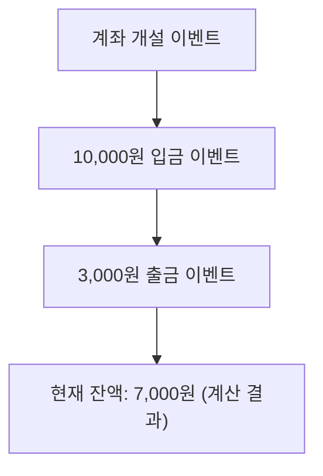
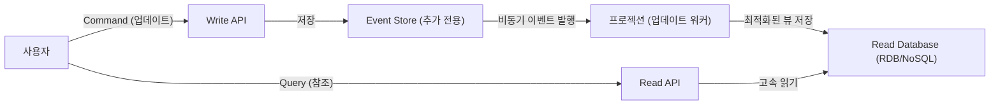

현대의 복잡한 소프트웨어 개발에 있어 데이터와 상태를 어떻게 관리할 것인가는 아키텍처의 근간을 이루는 주제입니다. 많은 시스템은 예전부터 'CRUD (Create, Read, Update, Delete)'에 기반한 데이터 모델링을 채택해 왔습니다. 하지만 비즈니스 요구사항이 고도화됨에 따라 CRUD의 한계가 부각되는 경우가 늘어나고 있습니다.

이 글에서는 현재의 상태(State)를 덮어쓰기하여 저장하는 것이 아니라, '시스템 내에서 발생한 사실(Event)'을 불변의 이력으로 계속 기록하는 '이벤트 소싱(Event Sourcing)'과 이에 필수 불가결한 'CQRS (명령과 조회의 책임 분리)'에 대해, 그 개념부터 장점, 나아가 최종 일관성(Eventual Consistency)의 과제까지 깊이 있게 파헤쳐 보겠습니다.

## 1. CRUD 아키텍처의 한계: 덮어쓰기로 인한 '과거의 상실'

일반적인 CRUD 아키텍처에서는 데이터베이스의 테이블이 '현재의 최신 상태'를 유지합니다. 예를 들어, 이커머스 사이트의 사용자 정보를 업데이트할 때 주소가 변경되면 데이터베이스의 '주소' 칼럼은 새로운 값으로 `UPDATE` 됩니다.

이 접근 방식은 직관적이며 구현도 쉽습니다. 하지만 거기에는 치명적인 단점이 존재합니다. 바로 '과거의 데이터가 손실된다'는 것입니다.

CRUD에 의한 상태 덮어쓰기는 다음과 같은 정보를 시스템에서 완전히 지워버립니다.
* **어떤 의도로 변경이 이루어졌는가?** (단순한 오타 수정인가, 아니면 정말로 이사를 한 것인가)
* **언제, 어떤 변천 과정을 거쳐 현재 상태에 이르렀는가?**
* **특정 과거 시점에서는 데이터가 어떤 상태였는가?**

감사(Audit) 요건이 엄격한 시스템이나 기계 학습을 위한 과거 데이터 분석, 복잡한 비즈니스 규칙을 추적해야 하는 도메인에서 이러한 '과거의 상실'은 큰 장벽이 됩니다. 이력 테이블(History Table)을 별도로 두는 워크어라운드(Workaround)도 존재하지만, 이는 본질적인 해결책이 아니며 복잡한 트리거(Trigger)나 중복된 로직을 발생시키는 원인이 됩니다.

## 2. 이벤트 소싱: 회계 시스템에서 배우는 '추가 전용(Append-only)' 접근법

CRUD의 한계를 극복하기 위해 채택되는 것이 '이벤트 소싱'입니다. 이 패턴의 근본적인 아이디어는 '현재 상태를 저장하는 것이 아니라, 상태를 변경하는 원인이 된 "도메인 이벤트"의 시퀀스를 추가(Append-only) 방식으로만 저장한다'는 것입니다.

가장 고전적이고 이해하기 쉬운 예는 '회계 원장(Ledger)'입니다.
은행 계좌 시스템을 상상해 보세요. 계좌의 '현재 잔액'이라는 단 하나의 숫자만 저장해 두고, 입출금 때마다 그것을 덮어쓰며 업데이트하는 은행은 없습니다. 대신 '10,000원 입금', '3,000원 출금', '수수료 200원 인출'이라는 **트랜잭션(이벤트)의 이력**을 모두 기록합니다. 현재 잔액은 이러한 이벤트를 처음부터 순서대로 집계(Replay)함으로써 도출됩니다.

### 이벤트 소싱의 주요 장점

1. **완벽한 감사 로그(Audit Log) 확보**
   모든 변경 사항이 이벤트로서 영속화(Persisted)되므로 완벽한 감사 추적(Audit Trail)을 자연스럽게 얻을 수 있습니다. '누가, 언제, 무엇을 했는가'가 비가역적인 형태로 남습니다.

2. **임의의 시점으로 복원 (Time-Travel Debugging)**
   이벤트 시퀀스를 특정 타임스탬프까지 리플레이함으로써, 시스템을 과거 임의의 시점 상태로 정확하게 복원할 수 있습니다. 이는 버그 조사나 과거 시점에서의 비즈니스 규칙 검증에 강력한 무기가 됩니다.

3. **의도(Intention)의 보존**
   단순히 'A가 B로 변경되었다'가 아니라, '장바구니에 상품을 추가했다', '결제를 완료했다'와 같이 비즈니스 상의 명확한 의도를 가진 사실이 저장됩니다.

4. **추가 전용 기록을 통한 높은 성능**
   UPDATE나 DELETE를 수행하지 않고 항상 INSERT(추가)만 수행하기 때문에, 데이터베이스의 락(Lock) 경합이 감소하여 매우 높은 쓰기 처리량(Throughput)을 실현할 수 있습니다.

## 3. CQRS의 필연성: 왜 분리가 필요한가?

이벤트 소싱은 쓰기(상태 변경 및 기록)에 있어서는 매우 뛰어나지만, '읽기(쿼리)'에 있어서는 심각한 문제를 야기합니다.

"현재 사용자의 주소를 알려주세요"라는 단순한 쿼리에 대해, 이벤트 소싱에서는 매번 '사용자 등록 이벤트'부터 시작하여 '주소 변경 이벤트'를 모두 가져와 메모리 상에 적용(리플레이)하여 현재 상태를 구축해야 합니다. 이벤트가 수백만 건에 달할 경우 이는 현실적인 성능이 아닙니다.

여기서 등장하는 것이 **CQRS (Command Query Responsibility Segregation: 명령과 조회의 책임 분리)** 입니다.
CQRS는 시스템의 '정보를 업데이트하는 모델(Command)'과 '정보를 읽어오는 모델(Query)'을 완전히 분리하는 아키텍처 패턴입니다.

이벤트 소싱을 채택할 경우 CQRS는 거의 **필수**가 됩니다.
* **Write Model (Command 측)**: 이벤트 저장소(Event Store). 도메인의 비즈니스 규칙을 적용하고, 검증된 이벤트를 추가·저장하는 것에만 특화됩니다.
* **Read Model (Query 측)**: 프로젝션(Projection). 이벤트 저장소에서 흘러나오는 이벤트를 구독(Subscribe)하여, UI나 API가 요구하는 형식에 최적화된 뷰(View, 현재 상태)를 구축하고 업데이트합니다.

이렇게 분리함으로써, 읽기 측은 복잡한 JOIN이나 계산을 할 필요 없이 사전에 구축된 뷰에서 데이터를 반환하기만 하면 되므로 매우 빠른 응답(Response)을 실현할 수 있습니다.

## 4. 비동기 프로젝션과 최종 일관성의 과제 (Eventual Consistency)

CQRS와 이벤트 소싱을 결합한 아키텍처(ES/CQRS)는 강력하지만 '은탄환(Silver Bullet)'은 아닙니다. 가장 큰 과제는 시스템이 직면하게 되는 **최종 일관성(Eventual Consistency)**입니다.

Command 측에서 이벤트가 저장소에 기록된 후, 비동기적으로 Read 측의 데이터베이스(프로젝션)가 업데이트될 때까지는 타임래그(보통 수 밀리초에서 수 초)가 발생합니다.
사용자가 '업데이트 버튼'을 누르고 화면이 새로고침되는 순간, Read 측 DB가 아직 업데이트되지 않아 오래된 데이터가 표시되어 버리는 'Stale Read' 문제입니다.

### 과제에 대한 대응 접근법

이 최종 일관성에 대해서는 기술적 및 UX(사용자 경험)적인 접근이 필요합니다.

1. **낙관적 UI(Optimistic UI) 도입 (UX의 개선)**
   클라이언트(프론트엔드) 측에서 서버가 반환하는 결과를 기다리지 않고, 성공했다고 가정하여 즉시 UI를 업데이트합니다.

2. **폴링(Polling)이나 WebSocket을 통한 업데이트 알림**
   프로젝션이 완료되어 Read 모델이 업데이트된 것을 WebSocket 등을 통해 클라이언트에 푸시 알림으로 보낸 후 화면을 새로고침하게 합니다.

3. **버전 확인 (리비전 번호)**
   클라이언트가 최근에 수행한 Command의 버전 번호를 유지하고, Read API를 호출할 때 "최소한 버전 X 이후의 데이터를 반환해 달라"고 요청합니다. 백엔드는 해당 버전에 도달할 때까지 대기하거나 폴링을 유도합니다.

## 5. 요약

이벤트 소싱과 CQRS는 CRUD 아키텍처의 한계를 돌파하고, 확장성(Scalability), 완벽한 이력의 유지, 그리고 복잡한 비즈니스 요구사항에 대응하기 위한 강력한 패러다임입니다.

상태를 '점'이 아닌 '선(이벤트의 궤적)'으로 파악함으로써, 데이터는 단순한 기록에서 '비즈니스의 진실'을 말해주는 원천으로 승화됩니다. 그 대가로 시스템 전체의 복잡성 증가와 최종 일관성이라는 분산 시스템 특유의 과제에 직면해야 합니다.

이 아키텍처가 모든 프로젝트에 적합한 것은 아닙니다. 하지만 금융, 이커머스의 주문 관리, 물류 트래킹 등 과거의 사실이 절대적인 가치를 지니는 도메인에서는 이보다 더 강력한 무기가 없을 것입니다. 시스템의 요건과 도메인의 복잡성을 정확히 파악하여 적절한 곳에 이 패턴을 적용하는 것이 아키텍트로서의 실력을 보여주는 부분입니다.
