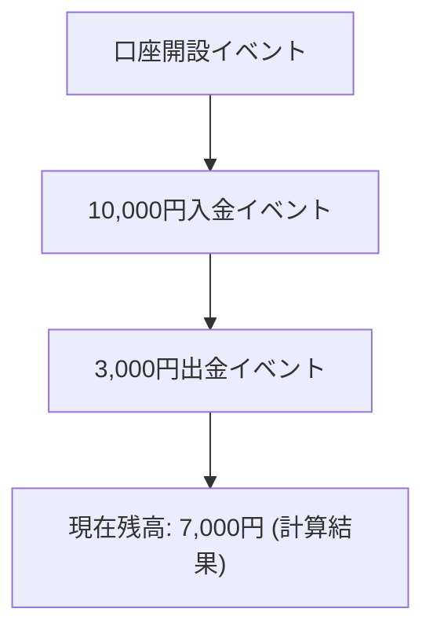
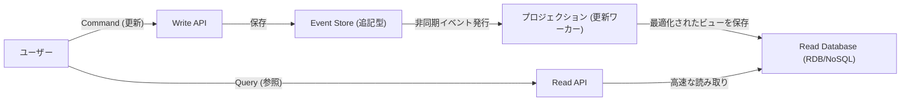

現代の複雑なソフトウェア開発において、データと状態をどのように管理するかはアーキテクチャの根幹をなすテーマです。多くのシステムは従来から「CRUD（Create, Read, Update, Delete）」に基づいたデータモデリングを採用してきました。しかし、ビジネスの要求が高度化するにつれ、CRUDの限界が浮き彫りになるケースが増えています。

本記事では、現在の状態（State）を上書き保存するのではなく、「システム内で起こった事実（Event）」を不変の履歴として記録し続ける「イベントソーシング（Event Sourcing）」と、それに不可欠となる「CQRS（コマンドクエリ責務分離）」について、その概念から利点、さらには結果整合性の課題までを深く掘り下げます。

## 1. CRUDアーキテクチャの限界：上書きによる「過去の喪失」

一般的なCRUDアーキテクチャでは、データベースのテーブルは「現在の最新状態」を保持します。例えば、ECサイトのユーザー情報を更新する際、住所が変わればデータベースの「住所」カラムは新しい値に `UPDATE` されます。

このアプローチは直感的であり、実装も容易です。しかし、そこには致命的な欠点が存在します。「過去のデータが失われる」ということです。

CRUDによる状態の上書きは、以下の情報をシステムから完全に消し去ってしまいます。
* **どのような意図で変更が行われたのか？**（単なるタイポ修正か、本当に引っ越したのか）
* **いつ、どのような変遷を経て現在の状態に至ったのか？**
* **特定の過去の時点では、データはどのような状態だったのか？**

監査（オーディット）要件が厳しいシステムや、機械学習のための過去データの分析、複雑なビジネスルールを追跡する必要があるドメインにおいて、この「過去の喪失」は大きな障壁となります。履歴テーブル（History Table）を別途設けるワークアラウンドも存在しますが、それは本質的な解決ではなく、複雑なトリガーや冗長なロジックを生み出す原因となります。

## 2. イベントソーシング：会計システムに学ぶ「追記型」のアプローチ

CRUDの限界を克服するために採用されるのが「イベントソーシング」です。このパターンの根本的なアイデアは、「現在の状態を保存するのではなく、状態を変更する原因となった『ドメインイベント』のシーケンスを追記のみ（Append-only）で保存する」というものです。

最も古典的で分かりやすい例は「会計の元帳（Ledger）」です。
銀行口座のシステムを想像してください。口座の「現在の残高」という一つの数字だけを保存して、入出金のたびにそれを上書き更新する銀行はありません。代わりに、「10,000円の入金」「3,000円の出金」「手数料200円の引き落とし」という**トランザクション（イベント）の履歴**をすべて記録します。現在の残高は、これらのイベントを最初から順番に集計（リプレイ）することで導き出されます。

### イベントソーシングの主な利点

1. **完全な監査ログ（Audit Log）の確保**
   すべての変更がイベントとして永続化されるため、完全な監査トレイルが自然に得られます。「誰が、いつ、何をしたか」が不可逆な形で残ります。

2. **任意の時点への復元（Time-Travel Debugging）**
   イベントのシーケンスを特定のタイムスタンプまでリプレイすることで、システムを過去の任意の時点の状態に正確に復元できます。これはバグ調査や、過去時点でのビジネスルールの検証において強力な武器となります。

3. **インテンション（意図）の保存**
   単に「AがBに変わった」ではなく、「カートに商品を追加した」「チェックアウトを完了した」というビジネス上の明確な意図を持った事実が保存されます。

4. **追記のみの書き込みによる高いパフォーマンス**
   UPDATEやDELETEを行わず、常にINSERT（追記）のみを行うため、データベースのロック競合が減少し、非常に高い書き込みスループットを実現できます。

## 3. CQRSの必然性：なぜ分離が必要なのか？

イベントソーシングは書き込み（状態の変更と記録）において極めて優秀ですが、「読み取り（クエリ）」において深刻な問題を引き起こします。

「現在のユーザーの住所を教えてください」という単純なクエリに対して、イベントソーシングでは毎回「ユーザー登録イベント」から始まり「住所変更イベント」をすべて取得し、メモリ上で適用（リプレイ）して現在の状態を構築しなければなりません。イベントが数百万件に及ぶ場合、これは現実的なパフォーマンスではありません。

ここで登場するのが **CQRS（Command Query Responsibility Segregation：コマンドクエリ責務分離）** です。
CQRSは、システムの「情報を更新するモデル（Command）」と「情報を読み取るモデル（Query）」を完全に分離するアーキテクチャパターンです。

イベントソーシングを採用する場合、CQRSはほぼ**必須**となります。
* **Write Model（Command側）**: イベントストア。ドメインのビジネスルールを適用し、検証済みのイベントを追記・保存することだけに特化します。
* **Read Model（Query側）**: プロジェクション。イベントストアから流れてくるイベントを購読し、UIやAPIが要求する形式に最適化されたビュー（現在の状態）を構築・更新します。

このように分離することで、読み取り側は複雑なJOINや計算をすることなく、事前に構築されたビューからデータを返すだけで済むため、極めて高速なレスポンスを実現できます。

## 4. 非同期プロジェクションと結果整合性の課題（Eventual Consistency）

CQRSとイベントソーシングを組み合わせたアーキテクチャ（ES/CQRS）は強力ですが、「銀の弾丸」ではありません。最大の課題は、システムが直面する**結果整合性（Eventual Consistency）**です。

Command側でイベントがストアに保存されてから、非同期でRead側のデータベース（プロジェクション）が更新されるまでには、タイムラグ（通常は数ミリ秒〜数秒）が発生します。
ユーザーが「更新ボタン」を押して画面が再読み込みされた瞬間、Read側のDBがまだ更新されておらず、古いデータが表示されてしまう「Stale Read」の問題です。

### 課題への対処アプローチ

この結果整合性に対しては、技術的およびUX（ユーザー体験）的なアプローチが必要です。

1. **オプティミスティックUIの採用（UXの工夫）**
   クライアント（フロントエンド）側で、サーバーから返される結果を待つのではなく、成功すると仮定して即座にUIを更新します。

2. **ポーリングやWebSocketによる更新通知**
   プロジェクションが完了し、Readモデルが更新されたことをWebSocket等でクライアントにプッシュ通知してから、画面をリフレッシュさせます。

3. **バージョン確認（リビジョン番号）**
   クライアントが直近で行ったCommandのバージョン番号を保持し、Read APIを叩く際に「少なくともバージョンX以降のデータを返してほしい」と要求します。バックエンドはそのバージョンに達するまで待機するか、ポーリングを促します。

## 5. まとめ

イベントソーシングとCQRSは、CRUDアーキテクチャの限界を突破し、スケーラビリティ、完全な履歴の保持、および複雑なビジネス要件に応えるための強力なパラダイムです。

状態を「点」ではなく「線（イベントの軌跡）」として捉えることで、データは単なる記録から「ビジネスの真実」を語る源泉へと昇華します。その代償として、システム全体の複雑性の増大と、結果整合性という分散システム特有の課題と向き合う必要があります。

このアーキテクチャはすべてのプロジェクトに適しているわけではありません。しかし、金融、ECの注文管理、物流トラッキングなど、過去の事実が絶対的な価値を持つドメインにおいては、これ以上ない強力な武器となるでしょう。システムの要件とドメインの複雑さを正確に見極め、適切な箇所にこのパターンを適用することが、アーキテクトとしての腕の見せ所です。
