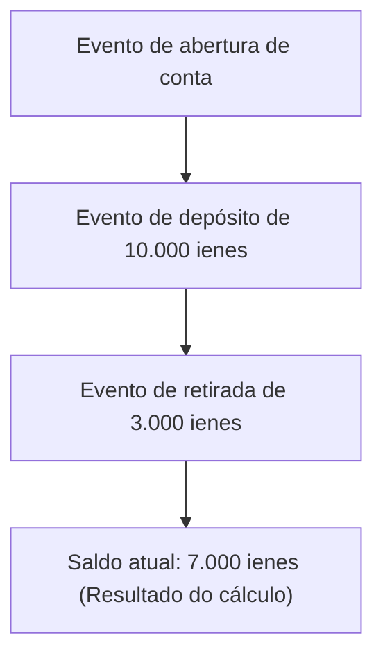
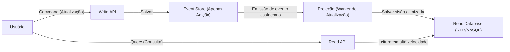

No desenvolvimento de software complexo de hoje, como gerenciar dados e estado é um tema fundamental da arquitetura. Muitos sistemas tradicionalmente adotam a modelagem de dados baseada em "CRUD (Create, Read, Update, Delete)". No entanto, à medida que os requisitos de negócios se tornam mais sofisticados, as limitações do CRUD estão se tornando cada vez mais aparentes.

Neste artigo, em vez de sobrescrever o estado atual (State), nos aprofundaremos no "Event Sourcing", que continua registrando os "fatos ocorridos no sistema (Event)" como um histórico imutável, e no "CQRS (Separação de Responsabilidades de Comando e Consulta)" indispensável para isso, desde seus conceitos e vantagens até os desafios da consistência eventual.

## 1. As Limitações da Arquitetura CRUD: "Perda do Passado" por Sobrescrita

Em uma arquitetura CRUD comum, as tabelas do banco de dados mantêm o "estado atual mais recente". Por exemplo, ao atualizar as informações do usuário em um site de e-commerce, se o endereço mudar, a coluna "endereço" do banco de dados sofrerá um `UPDATE` para o novo valor.

Esta abordagem é intuitiva e fácil de implementar. No entanto, existe uma falha fatal. "Os dados do passado são perdidos."

A sobrescrita de estado pelo CRUD apaga completamente as seguintes informações do sistema:
* **Com qual intenção a mudança foi feita?** (Foi apenas a correção de um erro de digitação ou realmente houve uma mudança de endereço?)
* **Quando e através de quais transições o estado atual foi alcançado?**
* **Em um determinado momento do passado, qual era o estado dos dados?**

Em sistemas com rigorosos requisitos de auditoria, análise de dados passados para aprendizado de máquina ou domínios que exigem o rastreamento de regras de negócios complexas, essa "perda do passado" é uma grande barreira. Existem soluções alternativas, como criar tabelas de histórico (History Table) separadas, mas isso não é uma solução essencial e é a causa do surgimento de gatilhos complexos e lógica redundante.

## 2. Event Sourcing: A Abordagem de "Apenas Adição" Aprendida com Sistemas Contábeis

Para superar as limitações do CRUD, adota-se o "Event Sourcing". A ideia fundamental desse padrão não é "salvar o estado atual, mas salvar a sequência de 'eventos de domínio' que causaram a mudança de estado apenas por adição (Append-only)".

O exemplo mais clássico e fácil de entender é o "Livro Razão (Ledger)" da contabilidade.
Imagine um sistema de conta bancária. Nenhum banco salva apenas um único número para o "saldo atual" da conta e o sobrescreve a cada depósito e retirada. Em vez disso, ele registra todo o **histórico de transações (eventos)**, como "Depósito de 10.000 ienes", "Retirada de 3.000 ienes" e "Débito de taxa de 200 ienes". O saldo atual é derivado da soma (repetição) desses eventos desde o início.

### Principais Vantagens do Event Sourcing

1. **Garantia de um Log de Auditoria Completo (Audit Log)**
   Como todas as mudanças são persistidas como eventos, uma trilha de auditoria completa é naturalmente obtida. "Quem, quando, fez o quê" permanece de forma irreversível.

2. **Restauração a um Ponto Arbitrário no Tempo (Time-Travel Debugging)**
   Ao repetir a sequência de eventos até um carimbo de data/hora específico, você pode restaurar com precisão o sistema para seu estado em qualquer ponto passado. Esta é uma arma poderosa para investigar bugs e validar regras de negócios em pontos passados.

3. **Preservação da Intenção (Intention)**
   Em vez de simplesmente "A mudou para B", um fato com uma intenção comercial clara, como "Adicionado um item ao carrinho" ou "Checkout concluído", é salvo.

4. **Alta Performance por Gravação Apenas por Adição**
   Como ele sempre realiza apenas `INSERT` (adição) e não realiza `UPDATE` ou `DELETE`, a contenção de bloqueios no banco de dados é reduzida, e um rendimento de gravação extremamente alto pode ser alcançado.

## 3. A Necessidade do CQRS: Por que a Separação é Necessária?

Embora o Event Sourcing seja excelente na gravação (mudança e registro de estado), ele causa problemas sérios na "leitura (consulta)".

Para uma consulta simples como "Por favor, me diga o endereço atual do usuário", o Event Sourcing deve adquirir cada "evento de alteração de endereço" começando do "evento de registro de usuário", aplicá-los (repeti-los) na memória e construir o estado atual todas as vezes. Se houver milhões de eventos, isso não oferece uma performance realista.

Aqui entra o **CQRS (Command Query Responsibility Segregation: Separação de Responsabilidades de Comando e Consulta)**.
O CQRS é um padrão arquitetural que separa completamente o "modelo de atualização de informações (Command)" e o "modelo de leitura de informações (Query)" de um sistema.

Ao adotar o Event Sourcing, o CQRS é quase **obrigatório**.
* **Write Model (Lado Command)**: Loja de eventos (Event Store). Ele se especializa apenas em aplicar as regras de negócios do domínio e adicionar/salvar eventos validados.
* **Read Model (Lado Query)**: Projeção (Projection). Ele assina os eventos que fluem da loja de eventos e constrói/atualiza uma visualização otimizada (estado atual) exigida pela UI ou API.

Ao separar dessa maneira, o lado da leitura pode alcançar respostas extremamente rápidas porque só precisa retornar dados de uma visualização previamente construída sem fazer JOINs ou cálculos complexos.

## 4. Projeção Assíncrona e o Desafio da Consistência Eventual (Eventual Consistency)

Uma arquitetura que combina CQRS e Event Sourcing (ES/CQRS) é poderosa, mas não é uma "bala de prata". O maior desafio é a **consistência eventual (Eventual Consistency)** que o sistema enfrenta.

Há um atraso de tempo (geralmente alguns milissegundos a segundos) desde o momento em que o evento é salvo no armazenamento no lado do Command até que o banco de dados (projeção) no lado Read seja atualizado de forma assíncrona.
Este é o problema "Stale Read" (leitura obsoleta), em que os dados antigos são exibidos se o banco de dados do lado Read ainda não foi atualizado no momento em que o usuário pressiona o "botão de atualização" e a tela recarrega.

### Abordagens para Lidar com o Desafio

Abordagens técnicas e de UX (Experiência do Usuário) são necessárias para esta consistência eventual.

1. **Adoção de UI Otimista (Inovação de UX)**
   Do lado do cliente (frontend), não espere o resultado retornar do servidor, mas assuma que terá sucesso e atualize a UI imediatamente.

2. **Notificação de Atualização por Polling ou WebSocket**
   Após a conclusão da projeção e a atualização do modelo Read, o cliente é notificado por Push via WebSocket, etc., e, em seguida, a tela é atualizada.

3. **Verificação de Versão (Número de Revisão)**
   O cliente mantém o número da versão do Command que executou mais recentemente e, ao acessar a Read API, solicita: "Por favor, retorne os dados pelo menos da versão X em diante". O backend espera até atingir essa versão ou solicita o polling.

## 5. Resumo

O Event Sourcing e o CQRS são paradigmas poderosos para superar as limitações das arquiteturas CRUD e atender à escalabilidade, manutenção completa de histórico e requisitos de negócios complexos.

Ao capturar o estado não como "pontos", mas como "linhas (trajetória de eventos)", os dados são elevados de um mero registro a uma fonte que conta a "verdade do negócio". O preço é um aumento na complexidade de todo o sistema e a necessidade de enfrentar os desafios específicos dos sistemas distribuídos: a consistência eventual.

Esta arquitetura não é adequada para todos os projetos. No entanto, em domínios onde os fatos do passado têm um valor absoluto, como em finanças, gestão de pedidos de e-commerce e rastreamento de logística, será a arma mais poderosa possível. O lugar onde você pode demonstrar sua habilidade como arquiteto é avaliar com precisão os requisitos do sistema e a complexidade do domínio e aplicar esse padrão nos lugares apropriados.
