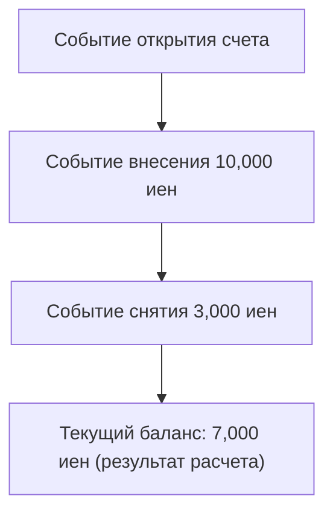
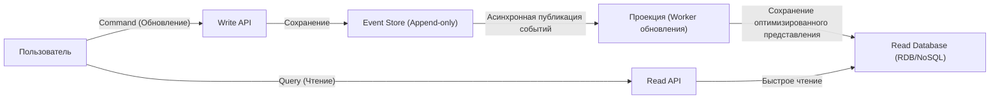

В современной сложной разработке программного обеспечения управление данными и состоянием является фундаментальной темой архитектуры. Традиционно во многих системах применяется моделирование данных на основе «CRUD (Create, Read, Update, Delete)». Однако по мере усложнения бизнес-требований все чаще выявляются ограничения CRUD.

В этой статье мы подробно рассмотрим «Event Sourcing» (Порождение событий) — подход, при котором вместо перезаписи текущего состояния (State) в виде неизменяемой истории сохраняются «произошедшие в системе факты (Event)», а также неразрывно связанный с ним паттерн «CQRS» (Разделение ответственности на команды и запросы). Мы разберем их концепции, преимущества и даже проблемы согласованности в конечном счете (Eventual Consistency).

## 1. Ограничения архитектуры CRUD: «Потеря прошлого» из-за перезаписи

В типичной архитектуре CRUD таблицы базы данных хранят «текущее, самое последнее состояние». Например, при обновлении информации о пользователе на сайте электронной коммерции в случае смены адреса столбец «Адрес» в базе данных обновляется (`UPDATE`) новым значением.

Этот подход интуитивно понятен и легко реализуется. Однако у него есть фатальный недостаток: «потеря данных о прошлом».

Перезапись состояния в CRUD полностью стирает из системы следующую информацию:
* **Какова была цель изменения?** (Это было просто исправление опечатки или пользователь действительно переехал?)
* **Когда и через какие изменения состояние пришло к текущему виду?**
* **В каком состоянии находились данные в определенный момент времени в прошлом?**

В системах со строгими требованиями к аудиту (Audit), при анализе исторических данных для машинного обучения или в доменах, где необходимо отслеживать сложные бизнес-правила, эта «потеря прошлого» становится серьезным препятствием. Существуют обходные пути, такие как создание отдельных таблиц истории (History Table), но это не решает проблему кардинально и часто приводит к появлению сложных триггеров и избыточной логики.

## 2. Event Sourcing: Подход «только добавление» (Append-only) на примере бухгалтерских систем

Для преодоления ограничений CRUD применяется паттерн «Event Sourcing». Фундаментальная идея этого паттерна заключается в следующем: «Вместо сохранения текущего состояния сохраняйте последовательность 'доменных событий', которые стали причиной изменения состояния, используя только добавление (Append-only)».

Самый классический и понятный пример — бухгалтерская «Главная книга» (Ledger).
Представьте систему банковских счетов. Ни один банк не хранит только одну цифру «текущего баланса» на счету, перезаписывая её при каждом пополнении или снятии средств. Вместо этого записывается вся **история транзакций (событий)**: «Внесение 10 000 иен», «Снятие 3 000 иен», «Списание комиссии 200 иен». Текущий баланс рассчитывается путем агрегации (воспроизведения) этих событий по порядку с самого начала.

### Основные преимущества Event Sourcing

1. **Обеспечение полного журнала аудита (Audit Log)**
   Поскольку все изменения сохраняются как события, вы естественным образом получаете полный аудиторский след. Необратимо фиксируется: «Кто, когда и что сделал».

2. **Восстановление до любого момента времени (Time-Travel Debugging)**
   Воспроизводя последовательность событий до определенной временной метки (timestamp), можно точно восстановить состояние системы на любой момент в прошлом. Это мощный инструмент для расследования ошибок (багов) и проверки бизнес-правил в прошлые периоды.

3. **Сохранение намерений (Intention)**
   Сохраняется не просто факт «А изменилось на Б», а факт с четким бизнес-намерением: «Товар добавлен в корзину» или «Оформление заказа завершено».

4. **Высокая производительность благодаря операциям «только добавление»**
   Поскольку операции UPDATE и DELETE не выполняются, а происходит только вставка (INSERT), конкуренция за блокировки (locks) в базе данных уменьшается, что позволяет достичь очень высокой пропускной способности при записи.

## 3. Необходимость CQRS: Зачем нужно разделение?

Event Sourcing превосходен при записи (изменение состояния и фиксация), но вызывает серьезные проблемы при «чтении (запросах)».

Для простого запроса «Сообщите текущий адрес пользователя» в Event Sourcing необходимо каждый раз извлекать все события, начиная с «События регистрации пользователя» и заканчивая «Событиями изменения адреса», а затем применять (воспроизводить) их в памяти для восстановления текущего состояния. Если событий миллионы, такая производительность становится неприемлемой.

Здесь на сцену выходит **CQRS (Command Query Responsibility Segregation — Разделение ответственности на команды и запросы)**.
CQRS — это архитектурный паттерн, который полностью разделяет «модель обновления информации (Command)» и «модель чтения информации (Query)» в системе.

При использовании Event Sourcing применение CQRS является почти **обязательным**.
* **Модель записи (Write Model / сторона Command)**: Event Store (Хранилище событий). Специализируется исключительно на применении доменных бизнес-правил и добавлении (сохранении) проверенных событий.
* **Модель чтения (Read Model / сторона Query)**: Проекция (Projection). Подписывается на поток событий из Event Store и формирует/обновляет представление (текущее состояние), оптимизированное для формата, который требуется UI или API.

Благодаря такому разделению стороне чтения не нужно выполнять сложные операции JOIN или вычисления; достаточно вернуть данные из предварительно сформированного представления (view), что обеспечивает невероятно быстрый отклик.

## 4. Асинхронные проекции и проблема согласованности в конечном счете (Eventual Consistency)

Архитектура, объединяющая CQRS и Event Sourcing (ES/CQRS), очень мощная, но это не «серебряная пуля». Самая большая проблема, с которой сталкивается система, — это **согласованность в конечном счете (Eventual Consistency)**.

Возникает задержка (обычно от нескольких миллисекунд до нескольких секунд) между моментом сохранения события в хранилище на стороне Command и асинхронным обновлением базы данных (проекции) на стороне Read.
Это приводит к проблеме «устаревшего чтения» (Stale Read): когда пользователь нажимает «Сохранить» и страница мгновенно перезагружается, база данных на стороне Read может еще не обновиться, и пользователю отобразятся старые данные.

### Подходы к решению проблемы

Для решения проблемы согласованности в конечном счете требуются технические подходы, а также улучшение пользовательского опыта (UX).

1. **Использование Optimistic UI (оптимистичные интерфейсы)**
   На стороне клиента (frontend), не дожидаясь ответа от сервера, предполагается, что операция прошла успешно, и пользовательский интерфейс обновляется мгновенно.

2. **Уведомления об обновлении через Polling или WebSocket**
   После завершения проекции и обновления модели Read клиент получает push-уведомление (например, через WebSocket) об обновлении данных, после чего экран обновляется.

3. **Проверка версии (номер ревизии)**
   Клиент сохраняет номер версии последней выполненной команды (Command) и при вызове Read API запрашивает: «Верните данные как минимум начиная с версии X». Бэкенд либо ждет достижения этой версии, либо предлагает клиенту использовать поллинг (polling).

## 5. Заключение

Event Sourcing и CQRS — это мощные парадигмы, которые позволяют преодолеть ограничения архитектуры CRUD и обеспечить масштабируемость, сохранение полной истории и соответствие сложным бизнес-требованиям.

Рассматривая состояние не как «точку», а как «линию (траекторию событий)», данные превращаются из простых записей в источник, рассказывающий «истинную историю бизнеса». Платой за это является увеличение сложности всей системы и необходимость решать специфические проблемы распределенных систем, такие как согласованность в конечном счете.

Эта архитектура подходит не для каждого проекта. Однако в таких доменах, как финансы, управление заказами в электронной коммерции или отслеживание логистики, где прошлые факты имеют абсолютную ценность, она станет непревзойденно мощным оружием. Задача архитектора — точно оценить требования системы и сложность предметной области, чтобы применить этот паттерн там, где он действительно необходим.
