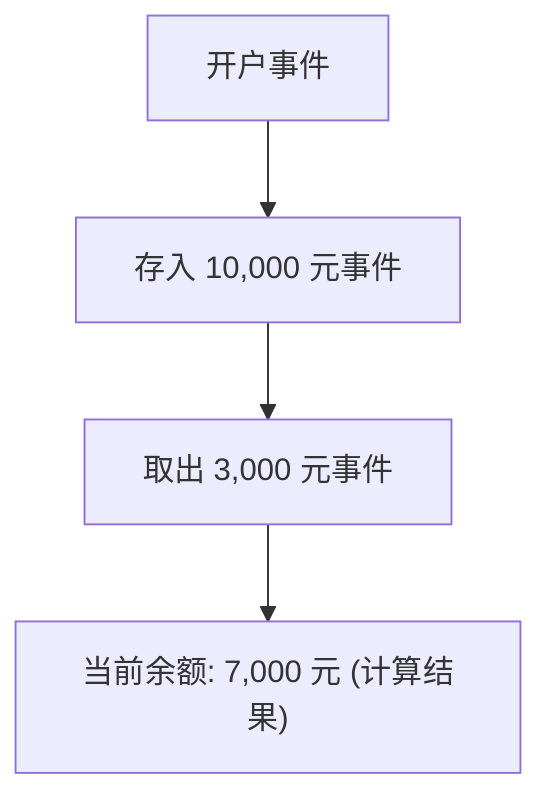
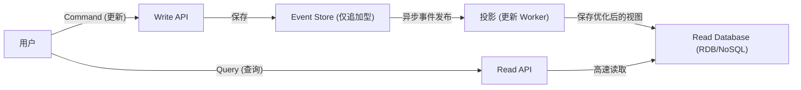

在现代复杂的软件开发中，如何管理数据和状态是架构的核心主题。许多系统传统上采用了基于“CRUD（Create, Read, Update, Delete）”的数据建模。然而，随着业务需求的不断提高，CRUD 的局限性在越来越多的场景中凸显出来。

本文将深入探讨“事件溯源（Event Sourcing）”及其不可或缺的“CQRS（命令查询职责分离）”。事件溯源不再覆盖保存当前状态（State），而是将“系统中发生的事实（Event）”作为不可变的记录持续保存。我们将从概念、优势，一直深入到最终一致性带来的挑战。

## 1. CRUD 架构的局限性：由于覆盖更新导致的“过去的丢失”

在一般的 CRUD 架构中，数据库表保存的是“当前的最新状态”。例如，在更新电商网站的用户信息时，如果地址发生变化，数据库的“地址”字段将被 `UPDATE` 为新值。

这种方法非常直观，实现起来也很容易。但是，它存在一个致命的缺点：也就是“过去的数据会丢失”。

通过 CRUD 覆盖状态，会从系统中彻底抹去以下信息：
* **出于什么意图进行了修改？**（仅仅是修正错别字，还是真的搬家了？）
* **是在何时、经过怎样的演变才达到当前状态的？**
* **在过去某个特定的时间点，数据是处于什么状态的？**

在审计（Audit）要求严格的系统、用于机器学习的历史数据分析，或者需要追踪复杂业务规则的领域，这种“过去的丢失”是一个巨大的障碍。虽然存在通过额外设置历史表（History Table）的变通方案，但这并非本质的解决办法，反而会导致复杂的触发器和冗余的逻辑。

## 2. 事件溯源：向会计系统学习的“追加型”方法

为了克服 CRUD 的局限性，“事件溯源”应运而生。这种模式的根本思想是：“不保存当前状态，而是以仅追加（Append-only）的方式，保存导致状态发生改变的一系列『领域事件』”。

最经典且易懂的例子就是“会计账本（Ledger）”。
想象一下银行账户系统。没有哪家银行会只保存账户的“当前余额”这一个数字，并在每次存取款时覆盖更新它。相反，它们会记录“存入 10,000 元”、“取出 3,000 元”、“扣除 200 元手续费”等所有**交易（事件）的记录**。当前余额是通过从头开始按顺序汇总（重放）这些事件计算得出的。

### 事件溯源的主要优势

1. **确保完整的审计日志（Audit Log）**
   由于所有的变更都作为事件被持久化，自然就获得了完整的审计追踪。“谁在何时做了什么”会以不可逆的形式保留下来。

2. **恢复到任意时间点（Time-Travel Debugging）**
   通过将事件序列重放到特定的时间戳，可以将系统精确地恢复到过去任意时间点的状态。这是在排查 Bug 或验证过去某个时间点的业务规则时的强大武器。

3. **保存意图（Intention）**
   保存的不仅是“A 变成了 B”，而是诸如“将商品添加到了购物车”、“完成了结账”等具有明确业务意图的事实。

4. **仅追加写入带来的高性能**
   由于不执行 UPDATE 或 DELETE，始终只进行 INSERT（追加），因此数据库的锁竞争减少，能够实现极高的写入吞吐量。

## 3. CQRS 的必然性：为什么需要分离？

事件溯源在写入（状态变更与记录）方面极其优秀，但在“读取（查询）”方面却引发了严重的问题。

对于“请告诉我当前用户的地址”这样一个简单的查询，在事件溯源中，每次都必须从“用户注册事件”开始，获取所有的“地址变更事件”，在内存中应用（重放）这些事件以构建出当前状态。如果事件多达数百万条，这在性能上是不现实的。

这就轮到 **CQRS（Command Query Responsibility Segregation：命令查询职责分离）** 登场了。
CQRS 是一种将系统的“更新信息的模型（Command）”与“读取信息的模型（Query）”完全分离的架构模式。

当采用事件溯源时，CQRS 几乎是**必不可少**的。
* **Write Model（Command 端）**: 事件存储（Event Store）。专门负责应用领域的业务规则，仅追加和保存已验证的事件。
* **Read Model（Query 端）**: 投影（Projection）。订阅从事件存储流出的事件，构建并更新专门针对 UI 或 API 请求格式优化过的视图（当前状态）。

通过这样分离，读取端无需进行复杂的 JOIN 或计算，只需从预先构建好的视图中返回数据即可，从而能够实现极快的响应速度。

## 4. 异步投影与最终一致性的挑战（Eventual Consistency）

结合了 CQRS 和事件溯源的架构（ES/CQRS）虽然强大，但并非“银弹”。最大的挑战是系统所面临的**最终一致性（Eventual Consistency）**问题。

从 Command 端将事件保存到存储中，到 Read 端的数据库（投影）被异步更新完成，这之间会存在时间差（通常是几毫秒到几秒）。
用户按下“更新按钮”并刷新页面的瞬间，如果 Read 端的 DB 尚未更新，就会显示旧数据，这就是“旧数据读取（Stale Read）”问题。

### 应对挑战的方法

针对这种最终一致性，需要从技术和 UX（用户体验）两个层面来采取方法。

1. **采用乐观 UI（UX 优化）**
   在客户端（前端），不等待服务器返回结果，而是假设操作会成功并立即更新 UI。

2. **通过轮询或 WebSocket 进行更新通知**
   当投影完成、Read 模型更新后，通过 WebSocket 等向客户端推送通知，然后再刷新画面。

3. **版本确认（修订号）**
   客户端保留最近一次执行 Command 的版本号，在调用 Read API 时，要求“请至少返回版本 X 之后的数据”。后端会等待达到该版本，或者提示客户端进行轮询。

## 5. 总结

事件溯源和 CQRS 突破了 CRUD 架构的局限性，是满足可扩展性、完整保留历史记录以及复杂业务需求的一种强大范式。

通过将状态视为“线（事件的轨迹）”而不是“点”，数据从单纯的记录升华为讲述“业务真相”的源泉。作为代价，我们需要面对整个系统复杂度的增加，以及最终一致性这一分布式系统特有的挑战。

这种架构并不适用于所有的项目。然而，在金融、电商订单管理、物流追踪等过去的事实具有绝对价值的领域，它将是无比强大的武器。准确评估系统需求和领域的复杂程度，并在合适的地方应用这种模式，正是展示架构师实力的绝佳机会。
