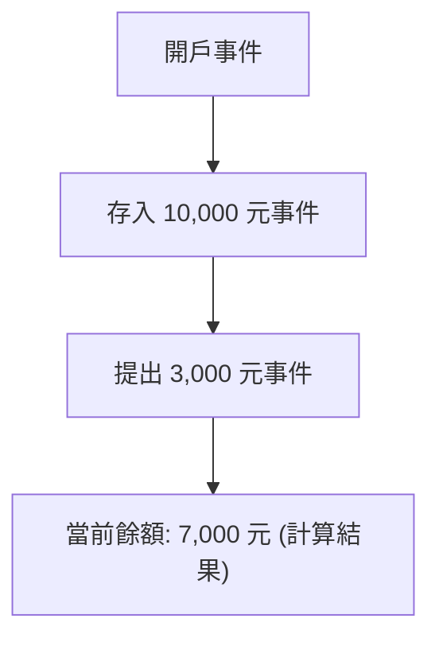
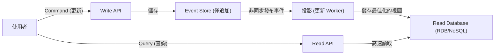

在現代複雜的軟體開發中，如何管理數據與狀態是架構最核心的課題。許多系統過去一直採用基於「CRUD (建立、讀取、更新、刪除)」的數據建模。然而，隨著業務需求日益複雜，CRUD 的侷限性越來越凸顯。

本文將深入探討不以覆蓋方式儲存當前狀態 (State)，而是將「系統內發生的事實 (Event)」作為不可變的歷史記錄持續保存的「事件溯源 (Event Sourcing)」，以及與其密不可分的「CQRS (命令查詢職責分離)」，涵蓋其概念、優勢以及最終一致性 (Eventual Consistency) 帶來的挑戰。

## 1. CRUD 架構的侷限性：覆蓋導致的「歷史遺失」

在一般的 CRUD 架構中，資料庫的資料表保存的是「當前最新狀態」。例如，更新電商網站的使用者資訊時，如果地址發生變更，資料庫的「地址」欄位就會透過 `UPDATE` 被更新為新值。

這種方法很直觀，實作也容易。但其中存在著致命的缺點：也就是「過去的數據會遺失」。

使用 CRUD 覆蓋狀態，會將以下資訊從系統中徹底抹除：
* **變更的意圖是什麼？**（僅僅是修正錯字，還是真的搬家了？）
* **是在何時、經歷了怎樣的變化才達到當前的狀態？**
* **在過去特定的時間點，資料是處於什麼狀態？**

對於審計 (Audit) 要求嚴格的系統、用於機器學習的歷史資料分析，或者需要追蹤複雜業務規則的領域 (Domain) 來說，這種「歷史遺失」是一大障礙。雖然存在另外建立歷史資料表 (History Table) 的權宜之計，但這並非治本之道，反而會導致複雜的觸發器 (Trigger) 或冗餘的邏輯。

## 2. 事件溯源：向會計系統學習的「僅追加」方法

為了克服 CRUD 的侷限性，我們採用「事件溯源」。這種模式的根本思想是：「不儲存當前狀態，而是將導致狀態改變的『領域事件 (Domain Event)』序列以僅追加 (Append-only) 的方式儲存」。

最經典且易懂的例子就是「會計的分類帳 (Ledger)」。
想像一下銀行帳戶系統。沒有任何銀行會只保存帳戶的「當前餘額」這一個數字，並在每次存提款時去覆蓋更新它。取而代之的是，他們會記錄「存入 10,000 元」、「提出 3,000 元」、「扣除手續費 200 元」等所有**交易（事件）的歷史紀錄**。當前餘額是透過從頭依序加總 (重播) 這些事件來計算得出的。

### 事件溯源的主要優勢

1. **確保完整的審計日誌 (Audit Log)**
   由於所有的變更都作為事件被持久化，系統自然能獲得完整的審計軌跡。「誰、在何時、做了什麼」都會以不可逆的形式保留下來。

2. **復原至任意時間點 (Time-Travel Debugging)**
   透過將事件序列重播 (Replay) 到特定的時間戳記，可以將系統精確地復原到過去任意時間點的狀態。這在排查錯誤或驗證過去時間點的業務規則時，是非常強大的武器。

3. **保存意圖 (Intention)**
   保存的不僅僅是「A 變成了 B」，而是包含了明確業務意圖的事實，例如「將商品加入購物車」、「完成結帳」等。

4. **僅追加寫入帶來的高效能**
   由於不進行 UPDATE 或 DELETE，而是始終只執行 INSERT (追加)，資料庫的鎖定競爭減少，能實現極高的寫入吞吐量 (Throughput)。

## 3. CQRS 的必然性：為什麼需要分離？

雖然事件溯源在寫入（狀態變更與記錄）方面表現極為優異，但它在「讀取（查詢）」上卻會引發嚴重的問題。

面對「請告訴我當前使用者的地址」這樣簡單的查詢，事件溯源每次都必須從「使用者註冊事件」開始，提取所有的「地址變更事件」，並在記憶體中套用（重播）來建構當前狀態。當事件多達數百萬筆時，這在效能上是不切實際的。

這時登場的就是 **CQRS（Command Query Responsibility Segregation：命令查詢職責分離）**。
CQRS 是一種將系統的「更新資訊模型 (Command)」與「讀取資訊模型 (Query)」完全分離的架構模式。

在採用事件溯源時，CQRS 幾乎是**必須**的。
* **Write Model (Command 端)**：事件儲存 (Event Store)。專門負責套用領域業務規則，並以追加方式儲存已驗證的事件。
* **Read Model (Query 端)**：投影 (Projection)。訂閱從事件儲存流出的事件，並建構與更新專為 UI 或 API 需求最佳化的視圖 (當前狀態)。

透過這樣的分離，讀取端不需進行複雜的 JOIN 或計算，只需從預先建構好的視圖回傳資料，從而實現極快的反應速度。

## 4. 非同步投影與最終一致性的挑戰 (Eventual Consistency)

結合了 CQRS 與事件溯源的架構 (ES/CQRS) 雖然強大，但並非「銀彈」。其面臨的最大挑戰是系統必須處理的**最終一致性 (Eventual Consistency)**。

從 Command 端的事件存入 Store，到非同步更新 Read 端的資料庫 (投影) 之間，會產生時間差 (Time Lag，通常為數毫秒到數秒不等)。
當使用者按下「更新按鈕」畫面重新載入的瞬間，若 Read 端的 DB 尚未更新，就會顯示舊的資料，這就是「Stale Read (讀取到過時資料)」的問題。

### 應對挑戰的方法

面對最終一致性，需要從技術及 UX（使用者體驗）層面雙管齊下：

1. **採用樂觀 UI (Optimistic UI - UX 層面的巧思)**
   在客戶端 (前端)，不等待伺服器回傳結果，而是假設操作會成功並立即更新 UI。

2. **透過輪詢 (Polling) 或 WebSocket 進行更新通知**
   當投影完成且 Read 模型更新後，透過 WebSocket 等方式將通知推播給客戶端，接著再刷新畫面。

3. **版本確認 (修訂版本號)**
   讓客戶端保留最近一次執行 Command 的版本號，在發送 Read API 請求時，要求「請至少回傳版本 X 之後的資料」。後端將會等待直到資料達到該版本，或者提示客戶端進行輪詢。

## 5. 總結

事件溯源與 CQRS 突破了 CRUD 架構的侷限，是為了滿足高擴展性、保存完整歷史紀錄以及複雜業務需求而生的強大典範 (Paradigm)。

將狀態從「點」轉變為「線 (事件的軌跡)」，資料便從單純的紀錄昇華為訴說「業務真相」的源泉。其代價則是系統整體複雜度的提升，並且必須去面對分散式系統特有的「最終一致性」挑戰。

這種架構並不適用於所有專案。然而，在金融、電商訂單管理、物流追蹤等將歷史事實視為絕對價值的領域中，它將是無與倫比的強大武器。準確評估系統需求與領域的複雜度，並將此模式應用在合適的地方，正是展現架構師功力的時刻。
