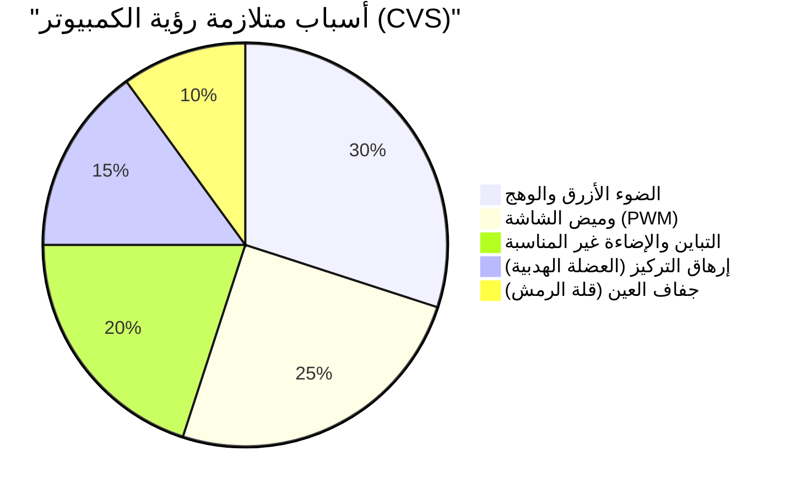
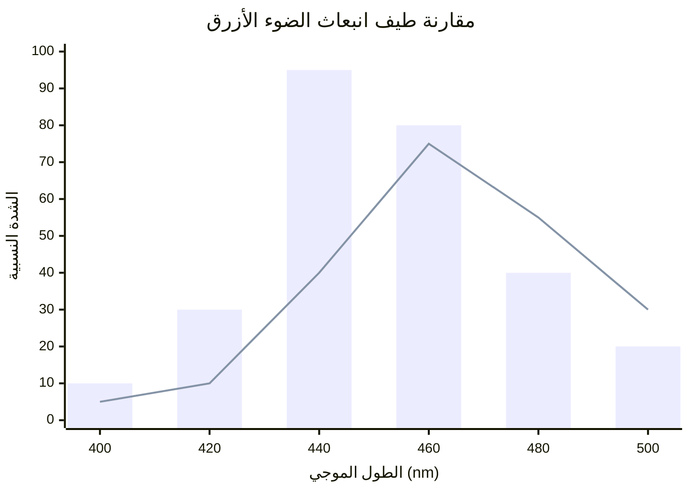
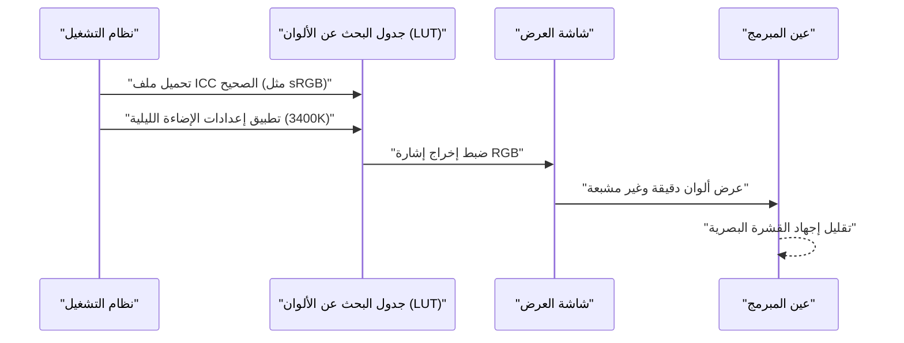
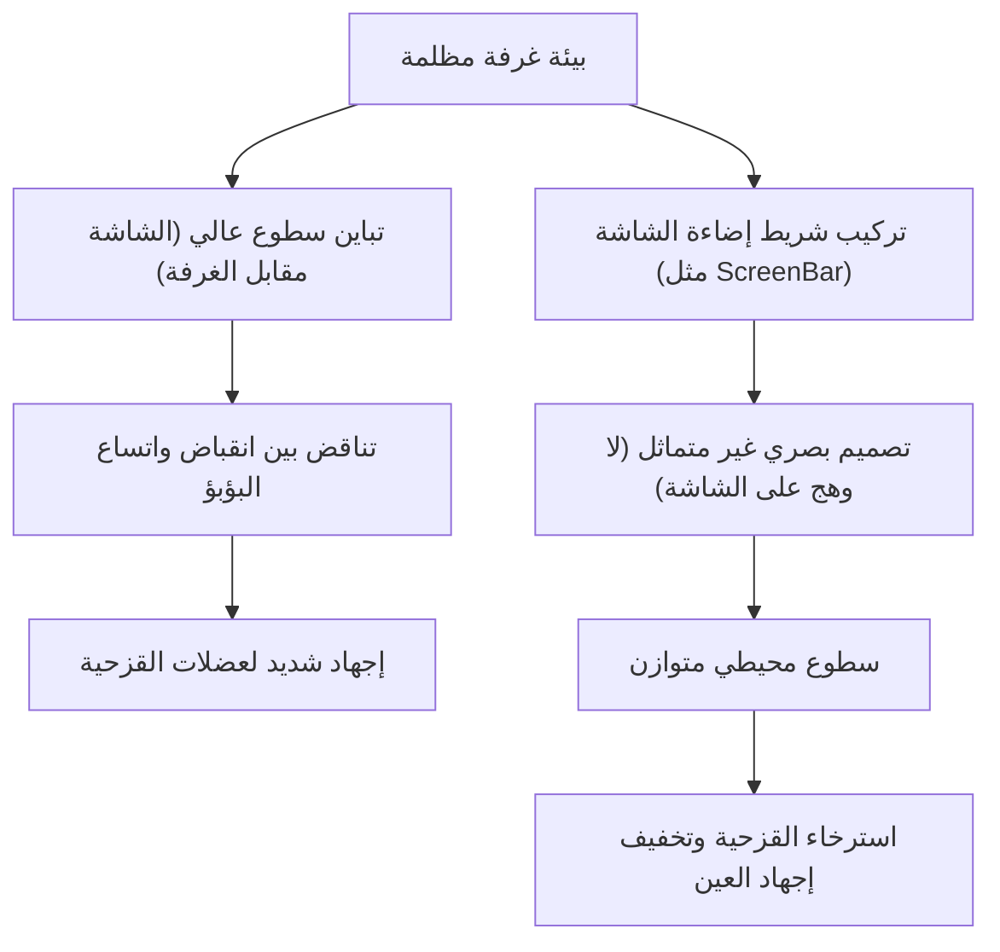

بالنسبة للمبرمجين ومهندسي البرمجيات، تعتبر "العيون" من أهم أدوات العمل التي تتعرض للإرهاق الشديد. في حياة يومية تتطلب التحديق في شاشات المحررات (Editors) والطرفيات (Terminals) والمتصفحات لمدة 8 إلى 10 ساعات، وأحياناً أكثر، يواجه تقريباً كل مهندس ما يسمى بـ "إجهاد العين" (متلازمة رؤية الكمبيوتر: CVS).

عادةً ما تقتصر النصائح لمواجهة إجهاد العين على إرشادات سطحية مثل "استخدام قطرات العين"، "أخذ فترات راحة مناسبة"، أو "ارتداء نظارات حجب الضوء الأزرق". ومع ذلك، كمهندسين، يجب علينا تحديد السبب الجذري (Root Cause) للمشكلة وتحسين طبقة النظام (بيئة العمل).

في هذا المقال، سنقوم بتحليل آليات إجهاد العين لدى المبرمجين بشكل شامل من منظور الفيزياء (البصريات)، الكيمياء الحيوية، بيئة العمل (الإرجونوميكس)، وهندسة أجهزة العرض. وسنتعمق في الإعدادات المثالية للشاشة والأدوات اللازمة لتخفيف ذلك الإجهاد، مدعومين بالمعادلات الرياضية والرسوم التوضيحية.

---

# الفصل الأول: تحليل آليات إجهاد العين (CVS) من خلال الفيزياء والكيمياء الحيوية

متلازمة رؤية الكمبيوتر (CVS) لا تنتج عن عامل واحد فقط. كما هو موضح في المخطط الدائري أدناه، تتداخل عناصر مختلفة ومعقدة لتؤدي إلى إرهاق العين، والألم، وجفاف العين، والشعور بالإرهاق العام.



هنا سنشرح بشكل خاص "الخصائص الفيزيائية للضوء" و"وظيفة ضبط التركيز في مقلة العين"، واللذين لهما التأثير الأكبر.

## 1.1 الخصائص الفيزيائية للضوء الأزرق وطاقة الفوتون

يقع الضوء الأزرق المنبعث من الشاشات تقريباً في نطاق الطول الموجي $400 \text{ nm} \sim 490 \text{ nm}$. يمكن تفسير سبب إرهاقه للعين من خلال "علاقة بلانك-آينشتاين"، وهي أساس في ميكانيكا الكم.

يتم التعبير عن طاقة الضوء $E$ بالمعادلة التالية:

$$ E = h\nu = \frac{hc}{\lambda} $$

حيث يحمل كل متغير المعاني التالية:
- $E$ : طاقة الفوتون الواحد (جول)
- $h$ : ثابت بلانك ($6.626 \times 10^{-34} \text{ J}\cdot\text{s}$)
- $c$ : سرعة الضوء في الفراغ ($3.0 \times 10^8 \text{ m/s}$)
- $\lambda$ : الطول الموجي للضوء (متر)
- $\nu$ : تردد الضوء (هرتز)

الحقيقة المهمة التي توضحها هذه المعادلة هي **"أن طاقة الضوء $E$ تتناسب عكسياً مع الطول الموجي $\lambda$"**. أي أن الضوء الأزرق، الذي يمتلك أقصر طول موجي بين الأشعة المرئية، يتمتع بطاقة عالية جداً. هذا الفوتون ذو الطاقة العالية يصعب امتصاصه أو تشتيته بواسطة القرنية أو عدسة العين، ويصل إلى عمق الشبكية، مما يسبب إجهاداً تأكسدياً قوياً للخلايا المستقبلة للضوء.

## 1.2 الانحراف اللوني (Chromatic Aberration) وانزياح البؤرة

من وجهة نظر بصرية، يؤدي اختلاف الطول الموجي للضوء إلى اختلاف في "معامل الانكسار". يعتمد معامل الانكسار $n$ للوسط (مثل عدسة العين) على الطول الموجي $\lambda$، ويتم تقريبه باستخدام معادلة كوشي للتشتت:

$$ n(\lambda) = B + \frac{C}{\lambda^2} $$

($B, C$ ثوابت خاصة بالوسط)

كما يتضح من هذه المعادلة، كلما كان الطول الموجي $\lambda$ أقصر (كما في الضوء الأزرق)، كان معامل الانكسار $n$ أكبر. لذلك، حتى لو كان الضوء الأحمر يتركز بشكل مثالي على الشبكية، فإن الضوء الأزرق ينكسر بشكل أكبر ويتجمع في بؤرة **أمام الشبكية**.
عندما يدرك الدماغ "التشوش الناتج عن الضوء الأزرق (الانحراف اللوني)"، فإنه يرسل باستمرار إشارات إلى العضلة الهدبية لمحاولة إعادة ضبط التركيز. هذا هو العامل الرئيسي وراء إرهاق عضلات العين بشكل لا شعوري.

## 1.3 العضلة الهدبية (عضلة التركيز) ومعادلة العدسة

عندما نركز على النصوص الدقيقة على الشاشة، تقوم العين بضبط سمك العدسة (البلورية). معادلة العدسة الرقيقة هي كما يلي:

$$ \frac{1}{f} = \frac{1}{a} + \frac{1}{b} $$

- $f$: البعد البؤري لعدسة العين
- $a$: المسافة من العين إلى الشاشة (مسافة الجسم)
- $b$: المسافة من عدسة العين إلى الشبكية (مسافة الصورة: ثابتة تقريباً عند $24 \text{ mm}$ في مقلة العين البالغة)

أثناء البرمجة، إذا استمرت المسافة القصيرة $a$ (مثلاً: $40 \text{ cm} \sim 50 \text{ cm}$) لفترة طويلة، يجب الحفاظ على البعد البؤري $f$ قصيراً جداً لضمان تجمع الصورة بدقة على الشبكية (للحفاظ على $b$ ثابتاً). وعندما تظل العضلة الهدبية منقبضة بشدة لعدة ساعات، تصاب بتشنج عضلي، مما يؤدي إلى إجهاد شديد للعين يرافقه تصلب في الكتفين وصداع.

---

# الفصل الثاني: اختيار الشاشة واستبعاد عوامل الإرهاق

لتقليل إجهاد العين، وقبل تعديل إعدادات البرامج، يجب أولاً فحص وتحسين مواصفات الأجهزة (الهاردوير). خاصةً "طريقة التعتيم" و"معدل التحديث"، فهما نقطتان لا ينبغي المساومة عليهما.

## 2.1 رعب التعتيم بتقنية PWM: الكشف عن الوميض الخفي

تقنيات ضبط سطوع شاشات الكريستال السائل (LCD) أو (OLED) تنقسم بشكل رئيسي إلى "تعتيم التيار المستمر (DC)" و"تعديل عرض النبضة (PWM)".

تقنية التعتيم PWM تقوم بضبط سطوع الشاشة بشكل افتراضي عن طريق وميض إضاءة الـ LED الخلفية بسرعة لا تدركها العين البشرية، مع تغيير نسبة "وقت التشغيل" إلى "وقت الإطفاء". يتم التعبير عن السطوع المتوسط $L$ حسب دورة العمل (Duty Cycle) لـ PWM بالمعادلة التالية:

$$ L = L_{max} \times \frac{T_{on}}{T_{on} + T_{off}} \times 100 \ (\%) $$

- $T_{on}$ : الوقت الذي يكون فيه الـ LED قيد التشغيل
- $T_{off}$ : الوقت الذي يكون فيه الـ LED مطفأ
- $L_{max}$ : أقصى سطوع في وقت الذروة

إذا كان تردد تعتيم PWM منخفضاً (مثلاً: $200 \text{ Hz} \sim 300 \text{ Hz}$)، حتى لو لم تشعر بالوميض (Flicker) بوعيك، فإن الدماغ والبؤبؤ يستجيبان للوميض بشكل لا شعوري، مما يؤدي إلى تكرار اتساع وانقباض البؤبؤ. وهذا يسبب إرهاقاً شديداً، وصداعاً، وحتى غثياناً.

**【كيفية اكتشاف PWM وتجنبه】**
لمعرفة ما إذا كانت شاشتك تستخدم تعتيم PWM، افتح تطبيق الكاميرا في هاتفك الذكي واستخدم وضع "التصوير البطيء" لتصوير شاشة بيضاء (مثل صفحة متصفح فارغة). إذا ظهرت خطوط سوداء تتحرك في الفيديو، فإن الشاشة تستخدم تعتيم PWM بتردد منخفض.
عند اختيار شاشة للبرمجة، يجب أن تتأكد من أن المواصفات تنص بوضوح على **"خالية من الوميض (Flicker-Free) أو تعتيم DC"**.

## 2.2 معدل التحديث (Hz) وتأثير ضبابية الحركة على طب العيون

معدل التحديث هو عدد المرات التي يتم فيها تحديث الشاشة في الثانية (Hz).
شاشات المكاتب العادية تكون $60 \text{ Hz}$، ولكن في السنوات الأخيرة أصبحت شاشات $120 \text{ Hz}$ أو $144 \text{ Hz}$ أكثر شيوعاً. هذا ليس مفيداً للاعبين فقط، بل للمبرمجين أيضاً.

عند التمرير السريع لأسطر الكود البرمجي أو قراءة السجلات الطويلة في الطرفية (Terminal)، فإن الشاشات ذات معدل التحديث $60 \text{ Hz}$، بالإضافة إلى قيود سرعة استجابة البكسل، تنتج "ضبابية الحركة (Motion Blur)". تحاول العين بغير وعي تتبع شكل النصوص وضبط التركيز أثناء التمرير، وعندما تكون الحروف ضبابية، يرتفع عبء المعالجة في القشرة البصرية للدماغ بشكل كبير.
الشاشات ذات معدل التحديث $120 \text{ Hz}$ أو أعلى تعرض النصوص بشكل أوضح أثناء التمرير، مما يقلل بشكل كبير من هذا العبء غير الواعي للعين في التتبع وضبط التركيز.

## 2.3 نوع اللوحة ونسبة التباين (IPS, VA, OLED)

نسبة تباين الشاشة ترتبط ارتباطاً مباشراً بوضوح النصوص.
"قانون فيبر-فيخنر"، الذي ينص على أن الإحساس البشري يتناسب مع لوغاريتم المنبه، يعبر عنه بالمعادلة التالية:

$$ p = k \ln \left( \frac{S}{S_0} \right) $$

（$p$: كمية الإحساس، $S$: الكمية الفيزيائية للمنبه، $S_0$: العتبة المطلقة، $k$: ثابت）

بمعنى آخر، تتفاعل العين البشرية بقوة أكبر مع "نسبة السطوع النسبية (التباين)" بدلاً من السطوع المطلق.
عند قراءة أكواد برمجية ملونة لفترة طويلة، فإن الشاشات من نوع VA (بتباين $3000:1$) التي توفر درجات أسود عميقة، أو شاشات OLED (بتباين $1,000,000:1$ وما فوق) التي يمكنها إيقاف تشغيل البكسل تماماً، تجعل حواف الحروف واضحة للغاية وتعزز من وضوح الرؤية.
ولكن كما سنوضح لاحقاً، إذا قمت بالنظر إلى شاشة ذات تباين عالي جداً في غرفة مظلمة، سيتقلص البؤبؤ بشدة ويسبب إجهاداً للعين، لذا فإن التوازن مع الإضاءة المحيطة يعد أمراً ضرورياً.

الرسم البياني التالي يقارن طيف الانبعاث لشاشة LCD القياسية مع شاشات OLED الحديثة (المصممة لتقليل الضوء الأزرق).



---

# الفصل الثالث: معايرة الشاشة وإعدادات نظام التشغيل والبرمجيات

إن إدارة مساحة الألوان والمعايرة عبر نظام التشغيل لا تقل أهمية عن اختيار الشاشة المناسبة.

## 3.1 فخ النطاق اللوني (sRGB مقابل DCI-P3) وملف تعريف ICC

تسوق العديد من الشاشات الحديثة نفسها بأنها توفر تغطية تزيد عن 95% من النطاق اللوني DCI-P3 (Wide Color Gamut)، ولكن هذا قد يكون ضاراً لغرض البرمجة.
في بيئة Windows، إذا استخدمت شاشة ذات نطاق لوني واسع دون تطبيق ملف تعريف ICC الصحيح (ملف الألوان المحدد من قبل اتحاد الألوان الدولي)، فإن التلوين النحوي (Syntax Highlighting) في محرر VS Code والمصمم خصيصاً لنطاق sRGB (مثل الألوان الحمراء والخضراء للتحذيرات) سيظهر بألوان مشبعة جداً وغير طبيعية.
هذه الألوان الزاهية تسبب إجهاداً شديداً للعين، لذا نوصي بشدة إما بتثبيت ملف ICC الصحيح من إعدادات شاشة نظام التشغيل، أو تفعيل "وضع محاكاة sRGB" من إعدادات OSD الخاصة بالشاشة نفسها.

يوضح المخطط التسلسلي التالي العملية منذ تطبيق ملف تعريف ICC الصحيح وحتى عرض ألوان مريحة للعين.



## 3.2 الحلول البرمجية (f.lux / Night Light)

الطريقة الأسهل والأكثر فاعلية لتقليل الضوء الأزرق هي استخدام برامج تقوم بتغيير درجة حرارة اللون (Color Temperature) ديناميكياً وفقاً للوقت من اليوم.
- Windows: **الإضاءة الليلية (Night Light)**
- macOS: **Night Shift**
- برامج الطرف الثالث: **f.lux**

تُقاس درجة حرارة اللون بالكلفن ($\text{K}$). تتراوح إضاءة الشمس أثناء النهار بين $5500\text{K} \sim 6500\text{K}$ (ضوء مائل للأزرق)، وإذا استمرت في التعرض لهذا الضوء، فسيتم كبح إفراز "الميلاتونين (هرمون النوم)" في الغدة الصنوبرية في الدماغ.
بعد المساء، يمكنك استخدام هذه البرامج لخفض درجة حرارة اللون إلى $3400\text{K} \sim 1900\text{K}$ (برتقالي مائل للأحمر أو دافئ)، مما يقلل فعلياً من انبعاث الضوء الأزرق، ويحافظ على الإيقاع اليومي (الساعة البيولوجية) بشكل طبيعي، بالإضافة إلى منع الفوتونات عالية الطاقة من الوصول إلى مقلة العين.

---

# الفصل الرابع: حلول الأجهزة الفائقة: استخدام أحدث الأدوات

إذا لم تختفِ أعراض إجهاد العين حتى بعد تطبيق الحلول المذكورة، فقد يكون من الضروري الاستثمار في أدوات خارجية لتغيير بيئتك بشكل جذري.

## 4.1 الإضاءة المنحازة وشريط إضاءة الشاشة (ScreenBar)

عندما تنظر إلى شاشة ساطعة في غرفة مظلمة، ينتج تباين حاد بين مركز الرؤية (سطوع عالي) والمحيط (سطوع منخفض). يُعرف هذا باسم **"الوهج المزعج (Discomfort Glare)"**.
في هذه البيئة، تحاول العين التقاط الضوء من خلال فتح البؤبؤ، بينما تحاول إغلاقه لتجنب سطوع المركز، مما يؤدي إلى تناقض يرهق عضلات القزحية بشدة.

يتم حل ذلك باستخدام "الإضاءة المنحازة (Bias Lighting)".
نوصي بشكل خاص باستخدام "شريط إضاءة الشاشة (Monitor Light Bar)" مثل **BenQ ScreenBar**.



الميزة الرئيسية لـ ScreenBar هي "التصميم البصري غير المتماثل (Asymmetrical Optical Design)". باستخدام عاكسات وعدسات خاصة، فإنه لا يضيء شاشة العرض نفسها (مما يمنع الانعكاسات والوهج)، بل يضيء لوحة المفاتيح أسفله والمساحة خلف الشاشة بشكل متساوٍ. هذا يقلل بشكل كبير من فرق السطوع (نسبة التباين) في مجال الرؤية بأكمله، مما يزيل العبء عن العين.

## 4.2 نقلة نوعية في شاشات الحبر الإلكتروني (Dasung & Boox)

لقراءة مراجع API الطويلة، والكتب التقنية (PDF)، أو قراءة الأكواد البرمجية، يمكن اعتبار **استخدام شاشة ثانوية بتقنية الحبر الإلكتروني (E-Ink)** الحل الجذري والنهائي في العصر الحديث.

على عكس شاشات الكريستال السائل أو OLED، لا تحتوي شاشات الحبر الإلكتروني على إضاءة خلفية خاصة بها. يتم تطبيق جهد كهربائي لتحريك جزيئات بيضاء وسوداء دقيقة (مثل ثاني أكسيد التيتانيوم) داخل كبسولات (طريقة الفصل الكهربائي)، بحيث تعكس الضوء المحيط لعرض النصوص.
- **كمية الضوء الأزرق المنبعث فعلياً: صفر**
- **الوميض الناتج عن PWM أو التحديث: صفر تماماً**

عند وضع شاشات مثل سلسلة **Dasung Paperlike** (بحجم 25.3 بوصة مثلاً) أو **Onyx Boox Mira** عمودياً واستخدامها كشاشة ثانوية مخصصة للنصوص، فإنك تقرأ المستندات كما لو كنت تقرأها من ورق مطبوع.
رغم أن العيب يكمن في تأخر العرض (انخفاض معدل التحديث)، إلا أنه بالنسبة للاستخدام في بيئة البرمجة وتحديداً في "قراءة النصوص الثابتة"، فلا يوجد جهاز على وجه الأرض ألطف على العين من ذلك.

---

# الفصل الخامس: الإرجونوميكس (بيئة العمل) وقواعد التشغيل

مهما كانت الأجهزة التي تقتنيها رائعة، فلن تكون ذات فائدة إذا كانت وضعية المستخدم أو القواعد التي يتبعها خاطئة.

## 5.1 ديناميكا الموائع لجفاف العين وزاوية الرؤية

جفاف العين ليس مجرد شعور مزعج "بجفاف العين" فحسب، بل إنه يؤدي إلى تمزق طبقة الدموع على سطح القرنية، مما يسبب تشتت الضوء وعدم وضوح الرؤية، وبدوره يؤدي إلى حلقة مفرغة من إجهاد العين الإضافي (إجهاد العضلة الهدبية).
يتناسب معدل تبخر الدموع مع مساحة سطح مقلة العين المعرضة للهواء.

يُقال إن زاوية الرؤية $\theta$ المثالية لوضع الشاشة تتراوح بين $15^\circ \sim 20^\circ$ للأسفل من الخط الأفقي.
إذا كانت المسافة الأفقية من مركز الشاشة إلى العين هي $d$، والفرق في الارتفاع بين مركز الشاشة وارتفاع العين هو $h$، فيمكن تطبيق دالة المثلثات التالية:

$$ \tan \theta = \frac{h}{d} $$

على سبيل المثال، إذا كانت المسافة $d$ من الشاشة هي $60 \text{ cm}$ (بيئة مكتبية نموذجية)، لكي نجعل $\theta = 15^\circ$:

$$ h = 60 \times \tan(15^\circ) \approx 60 \times 0.267 = 16.02 \text{ cm} $$

أي، **المثالي هو أن يكون مركز الشاشة أقل من مستوى العين بحوالي $16 \text{ cm}$**.
من خلال النظر للأسفل قليلاً، يتدلى الجفن العلوي بشكل طبيعي ويقلل من مساحة سطح العين المكشوفة، مما يمنع تبخر الدموع بشكل كبير. نوصي باستخدام ذراع الشاشة (مثل Ergotron) لضبط هذا الارتفاع بدقة بالملليمتر.

## 5.2 التطبيق الصارم والأتمتة لقاعدة "20-20-20" العالمية

إن أسلوب استعادة نشاط العين عند استخدام الأجهزة الرقمية والذي توصي به الأكاديمية الأمريكية لطب العيون (AAO) وأطباء العيون حول العالم هو **"قاعدة 20-20-20"**.

**『كل 20 دقيقة، انظر إلى شيء يبعد 20 قدماً (حوالي 6 أمتار) على الأقل، لمدة 20 ثانية』**

هذه الحركة البسيطة تجبر العضلة الهدبية التي كانت في حالة تقلص شديد على الاسترخاء، مما يقلل من سمك عدسة العين ويعيد ضبط وظيفة التركيز.
بما أن المبرمجين ينسون الوقت عندما يدخلون في "حالة التدفق" (Flow State)، فإن إنشاء نظام يفرض هذه القاعدة تلقائياً هو الحل الأنسب للمهندسين.
إليك مثال بسيط لبرنامج نصي (سكريبت) بلغة Python يستخدم مكتبة `tkinter` لعرض نافذة منبثقة إجبارية كل 20 دقيقة:

```python
import time
import tkinter as tk
from tkinter import messagebox

def remind_20_20_20():
    # إخفاء النافذة الرئيسية
    root = tk.Tk()
    root.withdraw()
    
    while True:
        # الانتظار لمدة 20 دقيقة (1200 ثانية)
        time.sleep(20 * 60)
        
        # عرض رسالة تحذير في المقدمة
        messagebox.showinfo(
            title="قاعدة 20-20-20",
            message="ارفع عينيك عن الشاشة، وانظر إلى ما يبعد 6 أمتار على الأقل لمدة 20 ثانية!\n(لإرخاء العضلة الهدبية)"
        )
        
        # 20 ثانية للاسترخاء
        time.sleep(20)

if __name__ == '__main__':
    # تشغيل في الخلفية
    remind_20_20_20()
```

بتسجيل هذا البرنامج النصي في تطبيقات بدء التشغيل، أو بتشغيله باستخدام أدوات جدولة المهام في نظام التشغيل (Task Scheduler أو Cron)، يمكنك دمج دورة استشفاء قسرية في روتينك اليومي.

---

# الخاتمة: الاستثمار للمستقبل بحماية عينيك

ستستمر مسيرتنا المهنية كمهندسي برمجيات لعدة عقود. ما يدعم هذه المسيرة ليس لوحة مفاتيح باهظة الثمن أو أحدث معالج CPU، بل هو بلا شك "عينك" و"عقلك".

1. **فهم طاقة الضوء ($E = hc/\lambda$) والعبء الفيزيائي لضبط التركيز**
2. **استخدام شاشة خالية من الوميض (تعتيم DC) بمعدل تحديث عالٍ**
3. **تحسين التباين النسبي للبيئة من خلال إضاءة منحازة مثل ScreenBar**
4. **التفكير في استخدام شاشة حبر إلكتروني (E-Ink) كجهاز مثالي لقراءة النصوص**
5. **إنشاء زاوية رؤية مثالية بناءً على $\tan \theta = h/d$ باستخدام ذراع شاشة، وأتمتة "قاعدة 20-20-20"**

قد تتطلب هذه التدابير بعض التكاليف والجهد المؤقتين، ولكن يمكن اعتبارها الاستثمار التقني الأكثر فاعلية من حيث التكلفة، لزيادة عمر وصحة العين وزيادة الإنتاجية وجودة الحياة (QOL) مدى الحياة. قم بمراجعة بيئة التطوير الخاصة بك اليوم واجعل العناية بعينيك أولوية قصوى.
