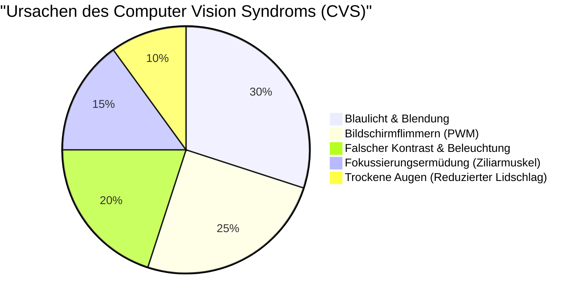
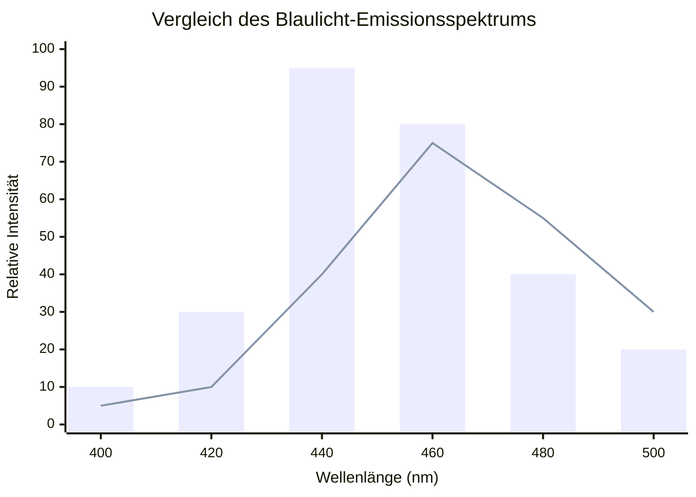
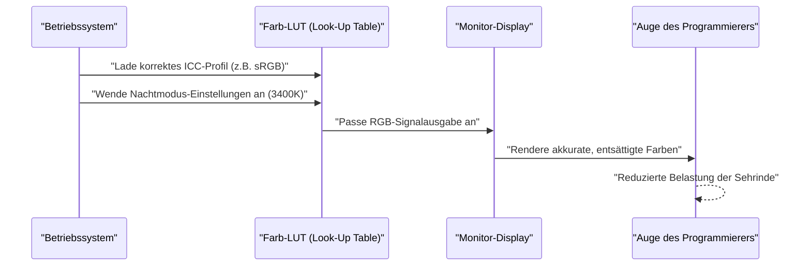
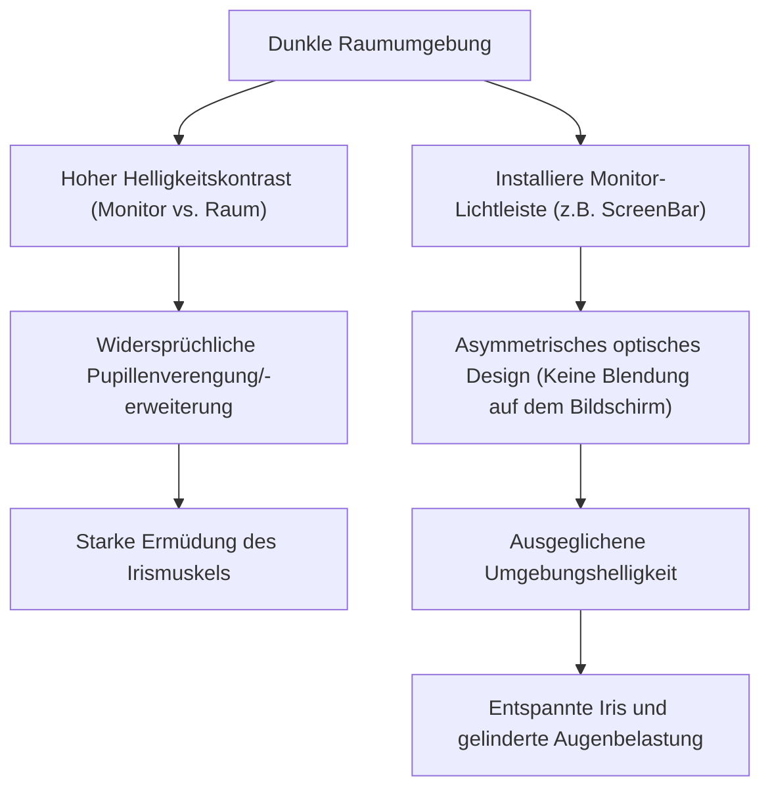

Für Programmierer und Softwareentwickler sind die Augen das wichtigste und am stärksten beanspruchte Werkzeug. In einem Alltag, in dem man 8 bis 10 Stunden oder sogar noch länger auf Editoren, Terminals und Browserfenster starrt, ist fast jeder Entwickler mit "Augenbelastung" (Computer Vision Syndrome: CVS) konfrontiert.

Wenn es um Maßnahmen gegen Augenbelastung geht, beschränken sich die Ratschläge im Allgemeinen auf oberflächliche Tipps wie "Augentropfen verwenden", "regelmäßig Pausen machen" oder "Blaulichtfilter-Brillen tragen". Als Entwickler sollte man jedoch die Grundursache (Root Cause) des Problems identifizieren und das System (die Umgebung) von Grund auf optimieren.

In diesem Artikel werden wir den Mechanismus der Augenbelastung bei Programmierern aus der Perspektive der Physik (Optik), Biochemie, Ergonomie und der Hardware-Architektur von Displays gründlich analysieren. Wir werden tief in die ultimativen Monitoreinstellungen und Gadgets eintauchen, um diese Belastung zu verringern, unterstützt durch mathematische Formeln und Diagramme.

---

# Kapitel 1: Den Mechanismus der Augenbelastung (CVS) durch Physik und Biochemie entschlüsseln

Das Computer Vision Syndrom (CVS) wird nicht durch einen einzigen Faktor verursacht. Wie das folgende Kreisdiagramm zeigt, verflechten sich verschiedene Elemente komplex miteinander und führen zu müden Augen, Schmerzen, trockenen Augen und allgemeiner körperlicher Erschöpfung.



Hier werden wir insbesondere die stark beeinflussenden "physikalischen Eigenschaften des Lichts" und die "Fokussierungsfunktion des Augapfels" erläutern.

## 1.1 Physikalische Eigenschaften und Photonenenergie von Blaulicht

Das von Displays ausgestrahlte Blaulicht (blaues Licht) liegt ungefähr im Wellenlängenbereich von $400 \text{ nm} \sim 490 \text{ nm}$. Warum dies die Augen belastet, lässt sich durch die Grundlagen der Quantenmechanik, die "Planck-Einstein-Gleichung", erklären.

Die Energie $E$ des Lichts wird durch die folgende Formel ausgedrückt:

$$ E = h\nu = \frac{hc}{\lambda} $$

Hier haben die einzelnen Variablen folgende Bedeutung:
- $E$ : Energie pro Photon (Joule)
- $h$ : Plancksches Wirkungsquantum ($6.626 \times 10^{-34} \text{ J}\cdot\text{s}$)
- $c$ : Lichtgeschwindigkeit im Vakuum ($3.0 \times 10^8 \text{ m/s}$)
- $\lambda$ : Wellenlänge des Lichts (m)
- $\nu$ : Frequenz des Lichts (Hz)

Die wichtige Tatsache, die diese Formel zeigt, ist: **"Die Lichtenergie $E$ ist umgekehrt proportional zur Wellenlänge $\lambda$."** Das bedeutet, dass Blaulicht, welches die kürzeste Wellenlänge im sichtbaren Licht hat, eine extrem hohe Energie besitzt. Diese hochenergetischen Photonen werden von der Hornhaut und Linse kaum absorbiert oder abgeschwächt. Sie dringen tief in die Netzhaut ein und üben starken oxidativen Stress auf die Photorezeptoren aus.

## 1.2 Chromatische Aberration (Farbfehler) und Fokusverschiebung

Aus einer weiteren optischen Perspektive betrachtet, führen Unterschiede in der Lichtwellenlänge zu Unterschieden im "Brechungsindex". Der Brechungsindex $n$ eines Mediums (hier z. B. die Linse) hängt von der Wellenlänge $\lambda$ ab und wird durch die Cauchysche Dispersionsformel angenähert:

$$ n(\lambda) = B + \frac{C}{\lambda^2} $$

($B, C$ sind mediumsabhängige Konstanten)

Wie aus dieser Formel ersichtlich ist, wird der Brechungsindex $n$ umso größer, je kürzer die Wellenlänge $\lambda$ (wie bei Blaulicht) ist. Selbst wenn rotes Licht perfekt auf die Netzhaut fokussiert ist, wird Blaulicht daher stark gebrochen und fokussiert **vor der Netzhaut**.
Wenn das Gehirn diese "Unschärfe des Bildes durch Blaulicht (Chromatische Aberration)" erkennt, sendet es ständig Befehle an den Ziliarmuskel, um den Fokus neu einzustellen. Dies ist ein Hauptgrund für die unbewusste Ermüdung der Augenmuskulatur.

## 1.3 Der Ziliarmuskel und die Linsengleichung

Wenn wir auf kleinen Text auf einem Monitor fokussieren, passen unsere Augen die Dicke der Linse (Kristalllinse) an. Die Gleichung für dünne Linsen lautet wie folgt:

$$ \frac{1}{f} = \frac{1}{a} + \frac{1}{b} $$

- $f$: Brennweite der Linse
- $a$: Abstand vom Auge zum Monitor (Gegenstandsweite)
- $b$: Abstand von der Linse zur Netzhaut (Bildweite: Bei einem erwachsenen Augapfel konstant ca. $24 \text{ mm}$)

Wenn während des Programmierens der Abstand $a$ zum Monitor über einen längeren Zeitraum kurz ist (z. B. $40 \text{ cm} \sim 50 \text{ cm}$), muss die Brennweite $f$ extrem kurz gehalten werden, um ein scharfes Bild auf der Netzhaut zu erzeugen (und $b$ konstant zu halten). Wenn der Ziliarmuskel stundenlang extrem kontrahiert bleibt, gerät er in einen krampfhaften Zustand, was zu starker Augenbelastung führt, die mit Nackenverspannungen und Kopfschmerzen einhergeht.

---

# Kapitel 2: Auswahl des Hardware-Displays und Beseitigung von Ermüdungsfaktoren

Um die Augenbelastung zu verringern, müssen vor den Softwareeinstellungen zunächst die Hardwarespezifikationen überprüft und verbessert werden. Insbesondere die "Dimm-Methode" und die "Bildwiederholfrequenz" sind Punkte, bei denen man keine Kompromisse eingehen sollte.

## 2.1 Der Schrecken des PWM-Dimmens: Das unsichtbare Flimmern aufdecken

Die Technologien zur Anpassung der Helligkeit von LCD- und OLED-Monitoren lassen sich grob in "DC-Dimming (Direct Current)" und "PWM-Dimming (Pulse-Width Modulation)" unterteilen.

PWM-Dimming ist eine Technologie, die die Helligkeit des Bildschirms künstlich anpasst, indem die Hintergrundbeleuchtungs-LEDs so schnell ein- und ausgeschaltet werden, dass es für das menschliche Auge unsichtbar ist. Das Verhältnis von "Einschaltzeit" zu "Ausschaltzeit" bestimmt die Helligkeit. Die durchschnittliche Leuchtdichte $L$ basierend auf dem Tastgrad (Duty Cycle) von PWM wird durch die folgende Formel ausgedrückt:

$$ L = L_{max} \times \frac{T_{on}}{T_{on} + T_{off}} \times 100 \ (\%) $$

- $T_{on}$ : Zeit, in der die LED eingeschaltet ist
- $T_{off}$ : Zeit, in der die LED ausgeschaltet ist
- $L_{max}$ : Maximale Leuchtdichte beim Spitzenwert

Wenn die Frequenz des PWM-Dimmens niedrig ist (z. B. $200 \text{ Hz} \sim 300 \text{ Hz}$), reagieren das Gehirn und die Pupillen unbewusst auf das Blinken des Lichts, selbst wenn man das Bildschirmflimmern nicht bewusst wahrnimmt. Sie wiederholen ständig die Erweiterung und Verengung der Pupille. Dies führt zu extremer Erschöpfung, Kopfschmerzen und sogar Übelkeit.

**[Methode zur Erkennung von PWM und Gegenmaßnahmen]**
Um zu überprüfen, ob Ihr Monitor PWM-Dimming verwendet, starten Sie die Kamera-App Ihres Smartphones und nehmen Sie einen weißen Bildschirm des Monitors (z. B. eine leere Browserseite) im "Zeitlupenmodus" auf. Wenn dunkle Streifen (Banding) im Video durch das Bild wandern, verwendet dieser Monitor niederfrequentes PWM-Dimming.
Wenn Programmierer einen Monitor auswählen, sollten sie unbedingt einen wählen, bei dem in den Spezifikationen **"Flicker-Free (DC-Dimming)"** angegeben ist.

## 2.2 Die ophthalmologischen Auswirkungen der Bildwiederholfrequenz (Hz) und der Bewegungsunschärfe

Die Bildwiederholfrequenz ist ein Wert (Hz), der angibt, wie oft der Monitor den Bildschirm in einer Sekunde aktualisiert.
Typische Büromonitore haben $60 \text{ Hz}$, aber in den letzten Jahren sind Monitore mit hohen Bildwiederholraten von $120 \text{ Hz}$ oder $144 \text{ Hz}$ weit verbreitet. Dies ist nicht nur für Gamer, sondern auch für Programmierer äußerst vorteilhaft.

Wenn man durch viel Code scrollt oder wenn viele Logs im Terminal durchlaufen, entsteht bei einem $60 \text{ Hz}$-Display "Bewegungsunschärfe (Ghosting)", teilweise aufgrund der Grenzen der Pixel-Reaktionszeit. Die Augen versuchen unbewusst, die Form des Textes auch beim Scrollen zu erfassen und ständig neu zu fokussieren. Wenn der Text unscharf ist, steigt die Verarbeitungslast des visuellen Kortex im Gehirn drastisch an.
Bei einem Display mit $120 \text{ Hz}$ oder mehr ist der Text auch beim Scrollen klar erkennbar, wodurch diese unbewussten Augenbewegungen und die Belastung durch die Fokussierung erheblich reduziert werden.

## 2.3 Paneltypen und Kontrastverhältnis (IPS, VA, OLED)

Das Kontrastverhältnis des Bildschirms ist direkt mit der Sichtbarkeit von Text verbunden.
Das "Weber-Fechner-Gesetz", welches besagt, dass die menschliche Wahrnehmungsgröße proportional zum Logarithmus des Reizes ist, wird durch die folgende Formel ausgedrückt:

$$ p = k \ln \left( \frac{S}{S_0} \right) $$

($p$: Wahrnehmungsgröße, $S$: physikalische Reizstärke, $S_0$: Schwellenwert, $k$: Konstante)

Das bedeutet, dass das menschliche Auge stärker auf das "relative Helligkeitsverhältnis (Kontrast)" reagiert als auf die absolute Helligkeit.
Wenn man über lange Zeiträume farblich hervorgehobenen Code (Syntax Highlighting) liest, machen VA-Panels ($3000:1$) mit tiefen Schwarztönen (hohes Kontrastverhältnis) oder OLED-Panels ($1.000.000:1\sim$), bei denen Pixel vollständig ausgeschaltet werden können, die Umrisse des Textes sehr klar und verbessern die Sichtbarkeit.
Wie später beschrieben wird, kann das Betrachten eines Bildschirms mit extrem hohem Kontrast in einem dunklen Raum jedoch dazu führen, dass sich die Pupillen zu stark zusammenziehen, was wiederum ermüdend ist. Ein Gleichgewicht mit dem Umgebungslicht ist unerlässlich.

Das folgende Diagramm vergleicht das Emissionsspektrum eines Standard-LCD-Monitors mit dem von neueren OLED-Displays (Design mit reduziertem Blaulichtanteil), die in letzter Zeit viel Aufmerksamkeit erhalten.



---

# Kapitel 3: Monitorkalibrierung und Betriebssystem-/Software-Einstellungen

Genauso wichtig wie die Wahl der Hardware sind das Farbraummanagement des Betriebssystems und die Kalibrierung.

## 3.1 Die Falle des Farbraums (sRGB vs. DCI-P3) und das ICC-Profil

Moderne Monitore werben oft mit einem "großen Farbraum", wie z. B. einer DCI-P3-Abdeckung von über 95 %. Dies kann jedoch für Programmierwecke zum Nachteil werden.
Wenn Sie in einer Windows-Umgebung einen Monitor mit großem Farbraum verwenden, ohne das richtige ICC-Profil (Farbprofil des International Color Consortium) anzuwenden, werden die standardmäßigen, für sRGB entwickelten Syntax-Highlighting-Farben in VS Code (z. B. rote oder grüne Warnfarben) unnatürlich intensiv (übersättigt) dargestellt.
Da diese extrem leuchtenden Farben eine starke Reizung der Augen verursachen, wird dringend empfohlen, entweder das richtige ICC-Profil über die Anzeigeeinstellungen des Betriebssystems zu installieren oder in den OSD-Einstellungen des Monitors in den "sRGB-Emulationsmodus" zu wechseln.

Das folgende Sequenzdiagramm veranschaulicht den Prozess der Anwendung des richtigen ICC-Profils und das Rendern augenfreundlicher Farben.



## 3.2 Softwarebasierte Gegenmaßnahmen (f.lux / Nachtmodus)

Die einfachste und effektivste Maßnahme gegen Blaulicht ist eine Software, die die Farbtemperatur dynamisch an die Tageszeit anpasst.
- Windows: **Nachtmodus (Night Light)**
- macOS: **Night Shift**
- Drittanbieter: **f.lux**

Die Farbtemperatur wird in Kelvin ($\text{K}$) angegeben. Das Sonnenlicht am Tag hat etwa $5500\text{K} \sim 6500\text{K}$ (bläuliches Licht). Wenn dieses Licht kontinuierlich auf das Auge trifft, wird die Ausschüttung von "Melatonin (Schlafhormon)" in der Zirbeldrüse des Gehirns unterdrückt.
Indem man diese Software ab dem Abend nutzt, um die Farbtemperatur auf $3400\text{K} \sim 1900\text{K}$ (warme Orange- bis Rottöne) zu senken, kann die Emission von Blaulicht physikalisch reduziert werden. Dies hilft, den zirkadianen Rhythmus (innere Uhr) aufrechtzuerhalten, und verhindert, dass hochenergetische Photonen das Auge erreichen.

---

# Kapitel 4: Die ultimativen Hardware-Lösungen: Einsatz neuester Gadgets

Wenn die bisher besprochenen Maßnahmen die Ermüdung nicht lindern, ist eine Investition in externe Gadgets erforderlich, um die Umgebung drastisch zu verändern.

## 4.1 Bias Lighting und Monitor-Lichtleisten (ScreenBar)

Wenn man in einem dunklen Raum auf einen hellen Monitor starrt, entsteht ein starker Kontrast zwischen dem Zentrum des Sichtfeldes (hohe Leuchtdichte) und der Peripherie (niedrige Leuchtdichte). Dies nennt man **"Blendung (Discomfort Glare)"**.
In dieser Umgebung versucht das Auge, die Pupille zu weiten, um Licht hereinzulassen, während es sich gleichzeitig wegen der Helligkeit in der Mitte widersprüchlich bemüht, die Pupille zu verengen. Dies führt zu einer starken Ermüdung des Irismuskels.

Die Lösung hierfür ist "Bias Lighting" (Hintergrundbeleuchtung).
Besonders empfehlenswert sind "Monitor-Lichtleisten" (ScreenBars), wie z.B. die **BenQ ScreenBar**.



Das wichtigste Merkmal der ScreenBar ist das "asymmetrische optische Design (Asymmetrical Optical Design)". Durch einen speziellen Reflektor und eine Linse wird kein Licht direkt auf den Bildschirm des Monitors geworfen (wodurch Reflexionen und Blendung auf dem Bildschirm verhindert werden). Stattdessen werden nur die Tastatur vor Ihnen und der Bereich hinter dem Monitor gleichmäßig beleuchtet. Dadurch wird der Helligkeitsunterschied (Kontrastverhältnis) im gesamten Sichtfeld drastisch verringert und die Belastung der Augen eliminiert.

## 4.2 Der Paradigmenwechsel der E-Ink-Displays (Dasung & Boox)

Beim Lesen langer API-Referenzen, technischer Bücher (PDFs) oder beim Durcharbeiten von Code ist die **Verwendung eines "E-Ink-Displays" (elektronisches Papier) als Zweitmonitor** die ultimative moderne Lösung.

Im Gegensatz zu LCDs oder OLEDs haben E-Ink-Displays keine eigene Hintergrundbeleuchtung. Sie nutzen winzige Kapseln mit geladenen weißen und schwarzen Pigmentpartikeln (wie Titandioxid), die durch elektrische Spannung bewegt werden (elektrophoretische Technologie). Text wird angezeigt, indem das Umgebungslicht reflektiert wird.
- **Physikalische Blaulichtemission: Null**
- **Flimmern durch PWM oder Bildwiederholrate: Absolut null**

Wenn Sie einen E-Ink-Monitor wie die **Dasung Paperlike**-Serie (z. B. 25,3 Zoll) oder den **Onyx Boox Mira** vertikal als dedizierten Submonitor für Text aufstellen, können Sie Dokumente mit dem gleichen Gefühl lesen, als würden Sie auf bedrucktem Papier lesen.
Es gibt den Nachteil der Verzögerung beim Zeichnen (niedrige Bildwiederholfrequenz), aber wenn man ihn ausschließlich für das "Lesen statischer Texte" in einer Programmierumgebung verwendet, gibt es kein augenfreundlicheres Gerät auf dem Planeten.

---

# Kapitel 5: Ergonomie und Anwendungsregeln

Egal, wie großartig die Hardware ist, die Sie zusammenstellen, es ist zwecklos, wenn die Körperhaltung oder die Verhaltensregeln des Benutzers falsch sind.

## 5.1 Strömungsmechanik trockener Augen und Blickwinkel

Trockene Augen bedeuten nicht nur das unangenehme Gefühl "trockener Augen". Wenn die Tränenfilmschicht auf der Hornhautoberfläche zerstört ist, wird das Licht unregelmäßig reflektiert, wodurch die Sicht verschwommen wird. Dies führt zu einem Teufelskreis aus weiterer Augenbelastung (Überbeanspruchung des Ziliarmuskels).
Die Verdunstungsrate der Tränenflüssigkeit ist proportional zur der Luft ausgesetzten Oberfläche des Augapfels (Lidspaltenfläche).

Der ideale Blickwinkel $\theta$ für die Monitorplatzierung liegt bei etwa $15^\circ \sim 20^\circ$ unterhalb der horizontalen Sichtlinie.
Wenn wir den horizontalen Abstand von der Monitormitte zum Auge als $d$ und den Höhenunterschied zwischen Monitormitte und Augenhöhe als $h$ bezeichnen, gilt die folgende trigonometrische Funktion:

$$ \tan \theta = \frac{h}{d} $$

Wenn beispielsweise der Abstand $d$ zum Monitor $60 \text{ cm}$ (typische Schreibtischumgebung) beträgt, müssen wir für $\theta = 15^\circ$ Folgendes berechnen:

$$ h = 60 \times \tan(15^\circ) \approx 60 \times 0.267 = 16.02 \text{ cm} $$

Das bedeutet, dass **die Mitte des Monitors idealerweise etwa $16 \text{ cm}$ unterhalb der Augenhöhe liegen sollte**.
Indem der Blick leicht nach unten gerichtet wird, senkt sich das obere Augenlid auf natürliche Weise und die freiliegende Fläche des Augapfels verringert sich. Dies verhindert die Verdunstung der Tränenflüssigkeit drastisch. Verwenden Sie einen Monitorarm (z. B. von Ergotron) und stellen Sie diese Höhe millimetergenau ein.

## 5.2 Konsequente Anwendung und Automatisierung der weltweiten "20-20-20-Regel"

Die **"20-20-20-Regel"** ist eine Methode zur Erholung von Augenbelastung bei der Nutzung digitaler Geräte, die von der American Academy of Ophthalmology (AAO) und Augenärzten weltweit empfohlen wird.

**"Alle 20 Minuten 20 Sekunden lang auf etwas in mindestens 20 Fuß (ca. 6 Meter) Entfernung blicken."**

Durch diese einfache Handlung wird der extrem angespannte Ziliarmuskel gezwungen, sich zu entspannen. Die Linse wird dünner und die Fokussierungsfunktion wird zurückgesetzt.
Da Programmierer beim Eintritt in den "Flow-Zustand" oft die Zeit vergessen, ist es eine typische Ingenieurslösung, ein System aufzubauen, das diese Regel automatisch erzwingt.
Hier ist ein extrem einfaches Skript, das Python `tkinter` verwendet, um alle 20 Minuten ein Pop-up-Fenster zu erzwingen.

```python
import time
import tkinter as tk
from tkinter import messagebox

def remind_20_20_20():
    # Hauptfenster ausblenden
    root = tk.Tk()
    root.withdraw()
    
    while True:
        # 20 Minuten (1200 Sekunden) warten
        time.sleep(20 * 60)
        
        # Warn-Dialog im Vordergrund anzeigen
        messagebox.showinfo(
            title="20-20-20 Regel",
            message="Bitte nehmen Sie die Augen vom Bildschirm und schauen Sie 20 Sekunden lang auf etwas, das mehr als 6 Meter entfernt ist!\n(Entspannt den Ziliarmuskel)"
        )
        
        # 20 Sekunden zur Entspannung
        time.sleep(20)

if __name__ == '__main__':
    # Im Hintergrund ausführen
    remind_20_20_20()
```

Indem Sie ein solches Skript im Autostart registrieren oder es mit dem Standard-Aufgabenplaner / Cron des Betriebssystems ausführen lassen, können Sie diesen zwingenden Erholungszyklus in Ihren Alltag integrieren.

---

# Fazit: Maßnahmen gegen Augenbelastung als Investition in die Zukunft

Unsere Karriere als Softwareentwickler erstreckt sich über Jahrzehnte. Was diese Karriere stützt, ist nicht eine teure Tastatur oder die neueste CPU, sondern zweifellos unsere eigenen "Augen" und unser "Gehirn".

1. **Die physikalische Belastung von Lichtenergie ($E = hc/\lambda$) und Fokussierung verstehen**
2. **Einen flimmerfreien (DC-Dimming) Monitor mit hoher Bildwiederholrate einführen**
3. **Den relativen Kontrast der Umgebung mit Bias Lighting wie ScreenBar optimieren**
4. **E-Ink-Monitore als das ultimative Gerät zum Lesen von Text in Betracht ziehen**
5. **Mit einem Monitorarm den optimalen Blickwinkel basierend auf $\tan \theta = h/d$ schaffen und die "20-20-20-Regel" systematisieren**

Diese Maßnahmen können vorübergehende Kosten und Aufwand mit sich bringen. Sie sind jedoch die kosteneffektivste "technologische Investition", um die gesundheitliche Lebensdauer der Augen zu verlängern und die lebenslange Produktivität und Lebensqualität (QOL) zu maximieren. Überprüfen Sie jetzt Ihre Entwicklungsumgebung und implementieren Sie etwas Fürsorge für Ihre Augen.
