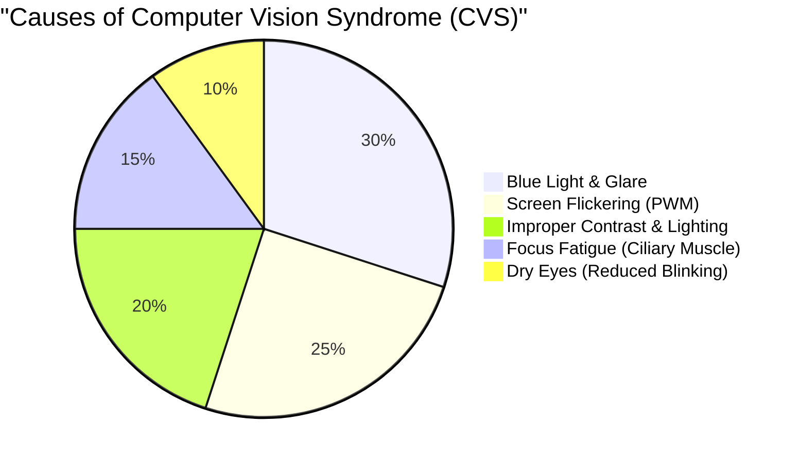
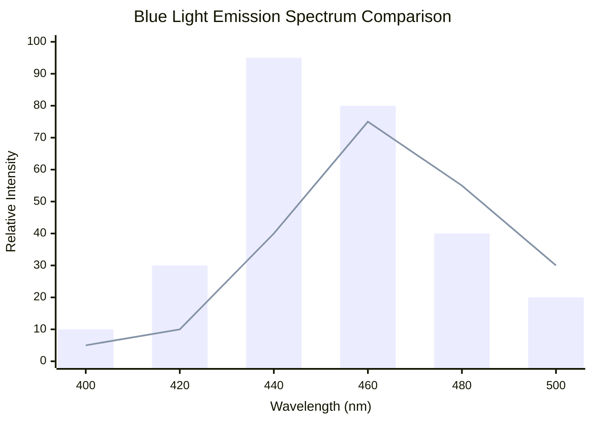
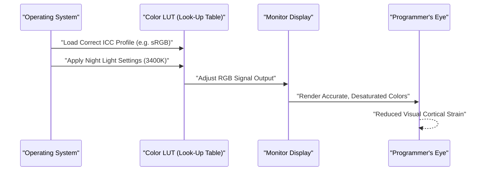
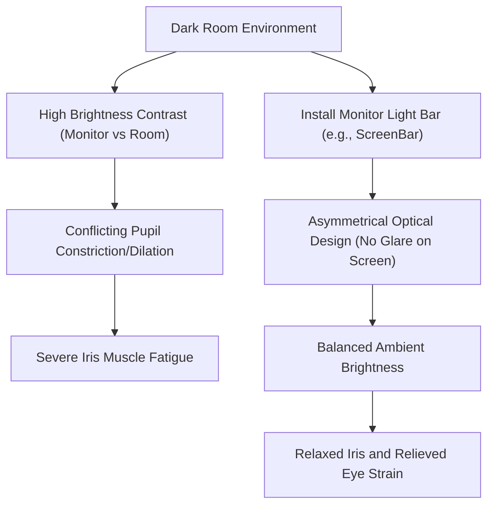

For programmers and software engineers, the "eyes" are their most important and heavily abused tools of the trade. Spending 8 to 10 hours a day, sometimes even more, constantly looking at editors, terminals, and browser screens, almost every engineer faces "Computer Vision Syndrome" (CVS) or eye strain.

Generally, countermeasures against eye strain tend to end with superficial advice such as "use eye drops," "take appropriate breaks," or "wear blue light blocking glasses." However, as engineers, we should identify the root cause of the problem and optimize it from the system (environment) layer.

In this article, we will thoroughly dissect the mechanics of a programmer's eye strain from the perspectives of physics (optics), biochemistry, ergonomics, and display hardware architecture. We will delve deeply into the ultimate monitor settings and gadgets to relieve it, using mathematical formulas and illustrations.

---

# Chapter 1: Unraveling the Mechanics of Eye Strain (CVS) Through Physics and Biochemistry

Computer Vision Syndrome (CVS) is not caused by a single factor. As shown in the pie chart below, various elements are complexly intertwined, leading to eye fatigue, pain, dry eyes, and overall bodily fatigue.



Here, we will explain the "physical properties of light" and the "focus adjustment function of the eyeball," which have particularly significant impacts.

## 1.1 Physical Properties of Blue Light and Photon Energy

Blue light emitted from displays is located roughly in the wavelength band of $400 \text{ nm} \sim 490 \text{ nm}$. The reason why this puts a strain on the eyes can be explained by the "Planck-Einstein relation," which is the foundation of quantum mechanics.

The energy of light $E$ is expressed by the following formula:

$$ E = h\nu = \frac{hc}{\lambda} $$

Here, each variable has the following meaning:
- $E$ : Energy per photon (Joule)
- $h$ : Planck constant ($6.626 \times 10^{-34} \text{ J}\cdot\text{s}$)
- $c$ : Speed of light in a vacuum ($3.0 \times 10^8 \text{ m/s}$)
- $\lambda$ : Wavelength of light (m)
- $\nu$ : Frequency of light (Hz)

The important fact indicated by this formula is that **"the energy of light $E$ is inversely proportional to the wavelength $\lambda$."** In other words, blue light, which has the shortest wavelength among visible light, possesses extremely high energy. These high-energy photons are less likely to be absorbed or attenuated by the cornea or crystalline lens, reaching deep into the retina and applying strong oxidative stress to the photoreceptor cells.

## 1.2 Chromatic Aberration and Focus Shift

Furthermore, from an optical perspective, differences in the wavelength of light create differences in the "refractive index." The refractive index $n$ of a medium (such as the crystalline lens in this case) depends on the wavelength $\lambda$, and is approximated by Cauchy's equation:

$$ n(\lambda) = B + \frac{C}{\lambda^2} $$

($B, C$ are constants unique to the medium)

As can be seen from this formula, the shorter the wavelength $\lambda$ of the blue light, the larger the refractive index $n$. Therefore, even if red light is perfectly focused on the retina, blue light is strongly refracted and comes to a focus **in front of the retina**.
When the brain recognizes this "image blurring due to blue light (chromatic aberration)," it constantly sends commands to the ciliary muscle to unconsciously try to refocus. This is a major factor in the unconscious fatigue of the eye muscles.

## 1.3 Focus Adjustment Muscle (Ciliary Muscle) and Thin Lens Equation

When we focus on fine text on a monitor, we adjust the thickness of the crystalline lens inside our eyes. The thin lens equation is as follows:

$$ \frac{1}{f} = \frac{1}{a} + \frac{1}{b} $$

- $f$: Focal length of the crystalline lens
- $a$: Distance from the eye to the monitor (object distance)
- $b$: Distance from the crystalline lens to the retina (image distance: constant at about $24 \text{ mm}$ in an adult eyeball)

During programming, if the distance $a$ to the monitor is kept short (e.g., $40 \text{ cm} \sim 50 \text{ cm}$) for a long time, the focal length $f$ must be kept extremely short in order to form an accurate image on the retina (keeping $b$ constant). If the ciliary muscle remains extremely contracted for hours, the muscle falls into a state of spasm, causing severe eye strain accompanied by stiff shoulders and headaches.

---

# Chapter 2: Hardware Display Selection and Elimination of Fatigue Factors

To alleviate eye fatigue, it is necessary to first verify and improve the hardware specifications before tweaking software settings. In particular, the "dimming method" and "refresh rate" are points where you should not compromise.

## 2.1 The Terror of PWM Dimming: Uncovering Invisible Flicker

The technologies for adjusting the brightness of LCD (Liquid Crystal Display) and OLED (Organic Light-Emitting Diode) monitors are broadly divided into "DC (Direct Current) dimming" and "PWM (Pulse-Width Modulation) dimming."

PWM dimming is a technology that blinks the backlight LEDs at a high speed invisible to the human eye, artificially adjusting screen brightness through the ratio of its "on time" to "off time." The average brightness $L$ determined by the duty cycle of the PWM is expressed by the following equation:

$$ L = L_{max} \times \frac{T_{on}}{T_{on} + T_{off}} \times 100 \ (\%) $$

- $T_{on}$ : Time the LED is on
- $T_{off}$ : Time the LED is off
- $L_{max}$ : Maximum peak brightness

When the frequency of PWM dimming is low (e.g., $200 \text{ Hz} \sim 300 \text{ Hz}$), even if you do not consciously perceive the screen flickering, the brain and pupils unconsciously react to the blinking light, repeatedly dilating and constricting. This induces extreme fatigue, headaches, and even nausea.

**[How to Detect PWM and Countermeasures]**
To check if your monitor uses PWM dimming, launch the camera app on your smartphone, set it to "slow-motion video" mode, and record a white screen on your monitor (like a blank browser page). If dark horizontal bands (banding) appear moving across the video, that monitor employs low-frequency PWM dimming.
When programmers choose a monitor, they should absolutely select one where the specifications clearly state **"Flicker-Free (DC dimming)."**

## 2.2 Ophthalmological Impact of Refresh Rate (Hz) and Motion Blur

The refresh rate is a numerical value (Hz) indicating how many times the monitor redraws the screen per second.
Standard office monitors are $60 \text{ Hz}$, but high refresh rate monitors like $120 \text{ Hz}$ or $144 \text{ Hz}$ have become popular in recent years. This is extremely beneficial not only for gamers but also for programmers.

When scrolling through massive amounts of code or when a large volume of logs flows in the terminal, a $60 \text{ Hz}$ display will experience "motion blur" (afterimages) combined with the limitations of pixel response times. The eye unconsciously tries to capture the shape of the text and keep it in focus even during scrolling, but if the characters are blurred, the processing load on the brain's visual cortex spikes dramatically.
With a display of $120 \text{ Hz}$ or higher, text remains clearly visible even while scrolling, significantly reducing the burden of these unconscious eye movements and focus adjustments.

## 2.3 Panel Types and Contrast Ratio (IPS, VA, OLED)

The contrast ratio of a screen directly affects text legibility.
The "Weber-Fechner Law," which states that the magnitude of human sensation is proportional to the logarithm of the stimulus, is expressed by the following formula:

$$ p = k \ln \left( \frac{S}{S_0} \right) $$

($p$: magnitude of sensation, $S$: physical magnitude of stimulus, $S_0$: threshold, $k$: constant)

In other words, the human eye reacts more strongly to the "relative brightness ratio (contrast)" than to absolute brightness.
When reading syntax-highlighted code for long periods, VA panels ($3000:1$) with deep blacks (high contrast ratio) or OLED panels ($1,000,000:1$ and up) that can completely turn off individual pixels make character outlines very clear and improve legibility.
However, as explained later, looking at an extremely high-contrast screen in a pitch-black room causes the pupils to constrict too much, leading to fatigue instead, so a balance with ambient light is essential.

The chart below compares the conceptual emission spectrum of a standard LCD monitor with modern OLED (low blue light design).



---

# Chapter 3: Monitor Calibration and OS / Software Settings

Equally as important as hardware selection is color space management and calibration on the OS side.

## 3.1 The Trap of Color Gamut (sRGB vs DCI-P3) and ICC Profiles

Modern monitors often boast a "wide color gamut" such as 95%+ DCI-P3 coverage, but this can backfire for programming purposes.
In a Windows environment, if a wide color gamut monitor is used without applying the appropriate ICC profile (a color profile defined by the International Color Consortium), the syntax highlighting in VS Code, which is designated in standard sRGB (e.g., red or green warning colors), will be displayed in unnaturally vivid, oversaturated hues.
Because these intense colors strongly stimulate the eyes, it is highly recommended to either install the correct ICC profile from the OS display settings or switch the monitor's OSD settings to "sRGB Emulation Mode."

The sequence diagram below illustrates the process of rendering eye-friendly colors once the correct ICC profile is applied.



## 3.2 Software Countermeasures (f.lux / Night Light)

The easiest and most effective measure against blue light is software that dynamically changes the Color Temperature according to the time of day.
- Windows: **Night Light**
- macOS: **Night Shift**
- Third-party: **f.lux**

Color temperature is expressed in Kelvin ($\text{K}$). Daytime sunlight is approximately $5500\text{K} \sim 6500\text{K}$ (bluish-white light), but if your eyes are constantly exposed to this, the secretion of "melatonin (sleep hormone)" in the pineal gland of the brain is suppressed.
After evening, by using these software tools to lower the color temperature down to $3400\text{K} \sim 1900\text{K}$ (warm orange to red), you can physically reduce the amount of blue light emitted. This not only keeps your circadian rhythm (body clock) normal but also prevents high-energy photons from reaching your eyeballs.

---

# Chapter 4: The Ultimate Hardware Solution: Adopting the Latest Gadgets

If the measures explained so far fail to alleviate your fatigue, you need to invest in external gadgets to drastically change your environment.

## 4.1 Bias Lighting and Monitor Light Bars (ScreenBar)

When you stare at a bright monitor in a dark room, a severe contrast occurs between the center of your field of vision (high brightness) and the periphery (low brightness). This is called **"Discomfort Glare."**
Under these conditions, the eyes fall into a contradictory state where they try to dilate the pupils to take in light while simultaneously trying to constrict them against the central glare, leading to severe fatigue of the iris muscles.

The solution to this is "Bias Lighting."
Particularly recommended are "monitor light bars" like the **BenQ ScreenBar**.



The greatest feature of the ScreenBar is its "Asymmetrical Optical Design." Through special reflectors and lenses, it does not shine light directly onto the monitor screen itself (preventing screen reflection and glare), and uniformly illuminates only the keyboard in front of you and the space behind the monitor. This dramatically mitigates the brightness difference (contrast ratio) across the entire field of vision, eliminating the burden on the eyes.

## 4.2 The E-Ink Display Paradigm Shift (Dasung & Boox)

For reading lengthy API references, technical books (PDFs), or code, the ultimate modern solution is using an **"E-Ink (electronic paper) display" as a secondary monitor**.

Unlike LCD or OLED, E-Ink does not have a self-emitting backlight. It displays text by applying voltage to move charged white and black pigment particles (such as titanium dioxide) inside capsules (electrophoresis), reflecting the ambient light.
- **Physical blue light emission: Zero**
- **Flicker associated with PWM or refresh rates: Absolutely zero**

By placing an E-Ink monitor like the **Dasung Paperlike** series (e.g., 25.3 inches) or **Onyx Boox Mira** vertically as a dedicated text sub-monitor, you can read documents with the exact same sensation as reading printed paper.
While it has the drawback of drawing delay (low refresh rate), if limited strictly to the "reading of static text" in a programming environment, there is no device on earth kinder to the eyes.

---

# Chapter 5: Ergonomics and Operational Rules

No matter how excellent the hardware you assemble is, it is meaningless if the human operating it has the wrong posture or rules.

## 5.1 Fluid Dynamics of Dry Eyes and Line of Sight Angle

Dry eyes are not just a discomfort of "eyes feeling dry." When the tear film on the surface of the cornea is destroyed, light diffuses irregularly, blurring your vision, which leads to a vicious cycle of further eye strain (overworking the ciliary muscles).
The evaporation rate of tears is proportional to the surface area of the eyeball exposed to the air (palpebral fissure area).

The ideal line of sight angle $\theta$ for monitor placement is considered to be $15^\circ \sim 20^\circ$ downward from the horizontal line.
When the horizontal distance from the center of the monitor to the eye is $d$, and the height difference between the monitor center and eye level is $h$, the following trigonometric function holds true:

$$ \tan \theta = \frac{h}{d} $$

For example, if the distance $d$ to the monitor is $60 \text{ cm}$ (a typical desk environment), to set $\theta = 15^\circ$:

$$ h = 60 \times \tan(15^\circ) \approx 60 \times 0.267 = 16.02 \text{ cm} $$

In other words, **ideally, the center of the monitor should be about $16 \text{ cm}$ below eye level.**
By directing your line of sight slightly downward, your upper eyelids naturally drop, reducing the exposed area of the eyeball, which can dramatically prevent tear evaporation. Install a monitor arm (like Ergotron) and accurately set this height down to the millimeter.

## 5.2 Strict Adherence to and Automation of the Global Standard "20-20-20 Rule"

The "20-20-20 Rule" is a recovery method for digital device eye strain recommended by the American Academy of Ophthalmology (AAO) and ophthalmologists worldwide.

**"Every 20 minutes, look at something 20 feet (about 6 meters) away for 20 seconds."**

Through this simple action, the extremely contracted ciliary muscles are forcibly relaxed, the crystalline lens thins out, and the focus adjustment function is reset.
Because programmers often lose track of time when entering a flow state, the engineer-like solution is to build a mechanism that automatically enforces this rule.
Below is an example of an extremely simple script using Python's `tkinter` that forcibly displays a popup every 20 minutes.

```python
import time
import tkinter as tk
from tkinter import messagebox

def remind_20_20_20():
    # Hide the main window
    root = tk.Tk()
    root.withdraw()
    
    while True:
        # Wait for 20 minutes (1200 seconds)
        time.sleep(20 * 60)
        
        # Display a warning dialog in the foreground
        messagebox.showinfo(
            title="20-20-20 Rule",
            message="Please look away from the screen and stare at something at least 6 meters away for 20 seconds!\n(To relax your ciliary muscles)"
        )
        
        # 20 seconds for relaxation
        time.sleep(20)

if __name__ == '__main__':
    # Run in the background
    remind_20_20_20()
```

By registering such a script at startup or running it via the OS standard task scheduler/Cron, you can integrate a mandatory recovery cycle into your daily life.

---

# Conclusion: Eye Strain Countermeasures as an Investment in the Future

Our careers as software engineers will last for decades. What supports that career is not an expensive keyboard or the latest CPU, but undeniably our own "eyes" and "brain."

1. **Understand the physical load of light energy ($E = hc/\lambda$) and focus adjustment.**
2. **Introduce a flicker-free (DC dimming) and high refresh rate monitor.**
3. **Optimize the relative contrast of the environment with bias lighting such as a ScreenBar.**
4. **Consider an E-Ink monitor as the ultimate text viewing device.**
5. **Create an optimal line of sight angle based on $\tan \theta = h/d$ using a monitor arm, and systemize the "20-20-20 Rule."**

While these measures may involve temporary expenses and effort, they are arguably the most cost-effective "technical investments" to extend the healthy lifespan of your eyes and maximize your lifelong productivity and QOL (Quality of Life). Reevaluate your development environment right now and implement some compassion for your eyes.
