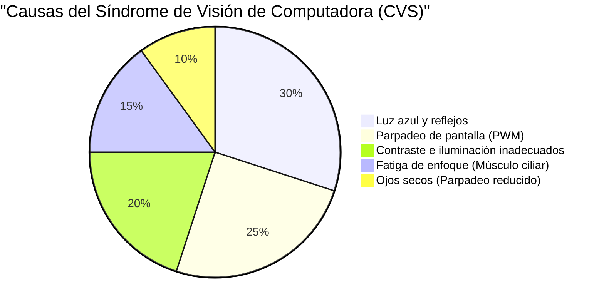
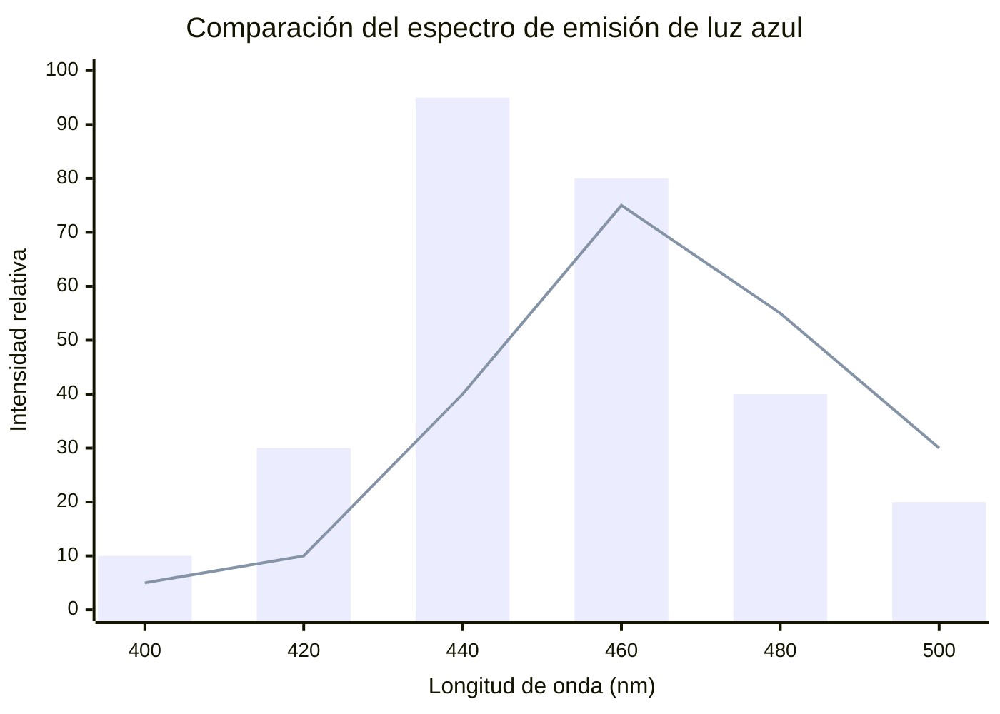
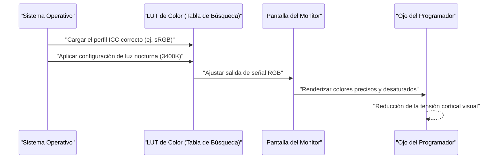
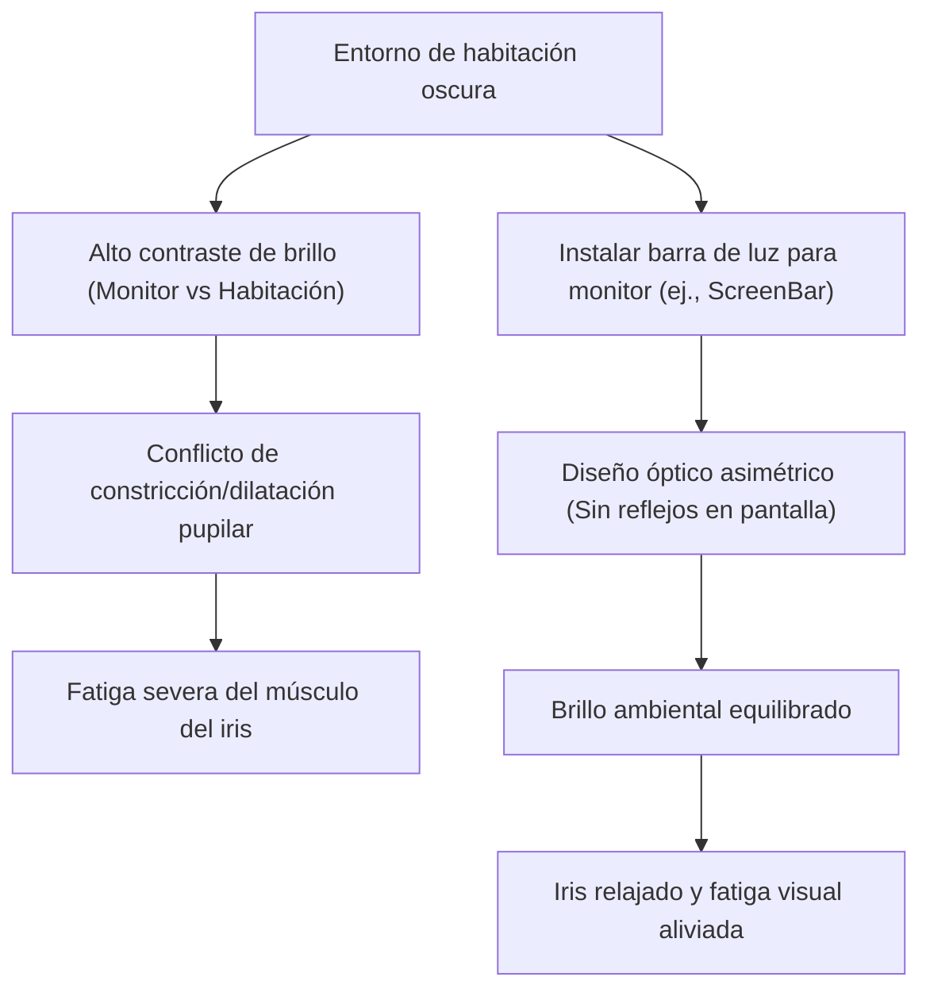

Para los programadores e ingenieros de software, los "ojos" son la herramienta más importante y la que más se sobreesfuerza en el trabajo. En una vida en la que pasamos de 8 a 10 horas al día, y a veces más, frente a pantallas de editores, terminales y navegadores, casi todos los ingenieros se enfrentan a la "Fatiga visual (Computer Vision Syndrome: CVS)".

Generalmente, las medidas contra la fatiga visual tienden a limitarse a consejos superficiales como "usar gotas para los ojos", "tomar descansos adecuados" o "usar gafas que bloquean la luz azul". Sin embargo, como ingenieros, debemos identificar la causa raíz (Root Cause) del problema y buscar la optimización desde la capa del sistema (entorno).

En este artículo, desde las perspectivas de la física (óptica), la bioquímica, la ergonomía y la arquitectura de hardware de las pantallas, analizaremos exhaustivamente los mecanismos de la fatiga visual de los programadores. Y para aliviarla, profundizaremos en la configuración definitiva del monitor y los gadgets, intercalando fórmulas matemáticas e ilustraciones.

---

# Capítulo 1: Desentrañando los mecanismos de la fatiga visual (CVS) desde la física y la bioquímica

El Síndrome de Visión de Computadora (CVS) no es provocado por un solo factor. Como se muestra en el siguiente gráfico circular, varios elementos se entrelazan de forma compleja para causar fatiga ocular, dolor, ojos secos y una sensación de fatiga sistémica.



Aquí, explicaremos especialmente las "características físicas de la luz" y la "función de ajuste de enfoque del globo ocular", que tienen un gran impacto.

## 1.1 Características físicas de la luz azul y energía de los fotones

La luz azul (luz de color azul) emitida por las pantallas se sitúa en un rango de longitud de onda de aproximadamente $400 \text{ nm} \sim 490 \text{ nm}$. Por qué esto sobrecarga los ojos puede explicarse mediante la "relación de Planck-Einstein", que es la base de la mecánica cuántica.

La energía de la luz $E$ se expresa con la siguiente fórmula:

$$ E = h\nu = \frac{hc}{\lambda} $$

Aquí, cada variable tiene el siguiente significado:
- $E$ : Energía por fotón (Joules)
- $h$ : Constante de Planck ($6.626 \times 10^{-34} \text{ J}\cdot\text{s}$)
- $c$ : Velocidad de la luz en el vacío ($3.0 \times 10^8 \text{ m/s}$)
- $\lambda$ : Longitud de onda de la luz (m)
- $\nu$ : Frecuencia de la luz (Hz)

El hecho importante que muestra esta fórmula es que **"la energía de la luz $E$ es inversamente proporcional a la longitud de onda $\lambda$"**. Es decir, la luz azul, que tiene la longitud de onda más corta dentro de la luz visible, posee una energía extremadamente alta. Estos fotones de alta energía no son fácilmente absorbidos o atenuados por la córnea o el cristalino, alcanzando el fondo de la retina y causando un fuerte estrés oxidativo en las células fotorreceptoras.

## 1.2 Aberración cromática (Chromatic Aberration) y desenfoque

Además, desde el punto de vista óptico, la diferencia en la longitud de onda de la luz produce una diferencia en el "índice de refracción". El índice de refracción $n$ de un medio (como el cristalino en este caso) depende de la longitud de onda $\lambda$ y se aproxima por la fórmula de dispersión de Cauchy:

$$ n(\lambda) = B + \frac{C}{\lambda^2} $$

($B, C$ son constantes específicas del medio)

Como se puede ver en esta fórmula, cuanto más corta es la longitud de onda $\lambda$ de la luz azul, mayor es el índice de refracción $n$. Por lo tanto, incluso si la luz roja y otras están enfocadas exactamente en la retina, la luz azul se refracta considerablemente y forma la imagen **frente a la retina**.
Cuando el cerebro percibe este "desenfoque de imagen debido a la luz azul (aberración cromática)", envía continuamente señales al músculo ciliar para intentar reajustar el enfoque. Este es un factor importante por el cual los músculos del ojo se fatigan de forma subconsciente.

## 1.3 Músculo de ajuste de enfoque (músculo ciliar) y la fórmula de las lentes

Cuando enfocamos un texto pequeño en el monitor, estamos ajustando el grosor del cristalino (lente) dentro de nuestros ojos. La fórmula de las lentes delgadas es la siguiente:

$$ \frac{1}{f} = \frac{1}{a} + \frac{1}{b} $$

- $f$: Distancia focal del cristalino
- $a$: Distancia del ojo al monitor (distancia del objeto)
- $b$: Distancia del cristalino a la retina (distancia de la imagen: aproximadamente constante en $24 \text{ mm}$ en el globo ocular de un adulto)

Durante la programación, si la distancia al monitor $a$ es corta (ejemplo: $40 \text{ cm} \sim 50 \text{ cm}$) y se mantiene por mucho tiempo, para formar una imagen exacta en la retina (mantener $b$ constante), debemos mantener la distancia focal $f$ extremadamente corta. Cuando el músculo ciliar se mantiene en un estado de contracción extrema durante horas, el músculo sufre espasmos, causando una fatiga visual severa acompañada de rigidez en los hombros y dolores de cabeza.

---

# Capítulo 2: Selección del hardware de pantalla y eliminación de factores de fatiga

Para reducir la fatiga ocular, antes de configurar el software, primero debe comprobar y mejorar las especificaciones del hardware. En particular, el "método de atenuación" y la "tasa de refresco" son puntos en los que no se debe comprometer.

## 2.1 El terror de la atenuación PWM: Descubriendo el parpadeo invisible

Las tecnologías para ajustar el brillo de los monitores de cristal líquido (LCD) y OLED se dividen en términos generales en "Atenuación DC (Direct Current)" y "Atenuación PWM (Pulse-Width Modulation)".

La atenuación PWM ajusta el brillo de la pantalla de forma pseudo-óptica haciendo parpadear los LED de retroiluminación a una velocidad tan alta que es invisible para el ojo humano, cambiando la proporción del "tiempo de encendido" y el "tiempo de apagado". El brillo promedio $L$ según el ciclo de trabajo (Duty Cycle) de PWM se expresa con la siguiente fórmula:

$$ L = L_{max} \times \frac{T_{on}}{T_{on} + T_{off}} \times 100 \ (\%) $$

- $T_{on}$ : Tiempo que el LED está encendido
- $T_{off}$ : Tiempo que el LED está apagado
- $L_{max}$ : Brillo máximo en el pico

Cuando la frecuencia de atenuación PWM es baja (ejemplo: $200 \text{ Hz} \sim 300 \text{ Hz}$), aunque no sienta conscientemente el parpadeo (flicker) de la pantalla, su cerebro y pupilas reaccionarán subconscientemente a la luz intermitente, repitiendo la dilatación y constricción de la pupila. Esto causa fatiga extrema, dolores de cabeza y, en ocasiones, náuseas.

**【Método de detección y contramedidas para PWM】**
Para comprobar si su monitor utiliza atenuación PWM, abra la aplicación de cámara de su teléfono inteligente y, en modo "cámara lenta", intente grabar una pantalla blanca (como una página en blanco en el navegador). Si se ven bandas negras (banding) moviéndose en el vídeo, significa que ese monitor emplea atenuación PWM de baja frecuencia.
Al elegir un monitor, los programadores siempre deben optar por aquellos que indiquen explícitamente **"Libre de parpadeos (Flicker-Free / atenuación DC)"** en sus especificaciones.

## 2.2 Tasa de refresco (Hz) y el impacto oftalmológico del desenfoque de movimiento

La tasa de refresco es un valor (Hz) que indica cuántas veces por segundo el monitor actualiza la pantalla.
Los monitores de oficina típicos son de $60 \text{ Hz}$, pero en los últimos años se han popularizado los monitores de alta tasa de refresco de $120 \text{ Hz}$ o $144 \text{ Hz}$. Esto es extremadamente beneficioso no solo para los jugadores, sino también para los programadores.

Al desplazarse por grandes cantidades de código o cuando una gran cantidad de registros fluyen en el terminal, en una pantalla de $60 \text{ Hz}$, se produce un "desenfoque de movimiento (motion blur)" combinado con el límite de la velocidad de respuesta de los píxeles. Durante el desplazamiento, sus ojos intentan capturar inconscientemente la forma del texto para mantenerlo enfocado, pero si los caracteres están borrosos, la carga de procesamiento en la corteza visual del cerebro aumenta dramáticamente.
Con una pantalla de $120 \text{ Hz}$ o más, el texto en movimiento se puede ver claramente, por lo que esta carga subconsciente de movimiento ocular y ajuste de enfoque se puede reducir significativamente.

## 2.3 Tipos de paneles y relación de contraste (IPS, VA, OLED)

La relación de contraste de la pantalla afecta directamente la legibilidad del texto.
La "Ley de Weber-Fechner", que establece que la magnitud de la sensación humana es proporcional al logaritmo del estímulo, se expresa mediante la siguiente fórmula:

$$ p = k \ln \left( \frac{S}{S_0} \right) $$

($p$: magnitud de la sensación, $S$: magnitud física del estímulo, $S_0$: umbral, $k$: constante)

En otras palabras, el ojo humano reacciona más fuertemente a la "proporción de brillo relativo (contraste)" que al brillo absoluto.
Cuando se lee código con resaltado de sintaxis durante largos períodos, los paneles VA con negros profundos (alta relación de contraste, ej: $3000:1$) o los paneles OLED que pueden apagar completamente los píxeles individuales ($1,000,000:1$ o más) hacen que los contornos de las letras sean muy nítidos, mejorando la visibilidad.
Sin embargo, como se mencionará más adelante, ver una pantalla de contraste extremadamente alto en una habitación completamente oscura hará que sus pupilas se contraigan demasiado, causando fatiga, por lo que es esencial equilibrarla con la luz ambiental.

El siguiente gráfico compara la imagen del espectro de emisión de un monitor LCD estándar con el OLED (diseño de reducción de luz azul) que ha llamado la atención recientemente.



---

# Capítulo 3: Calibración de monitores y configuración del SO/Software

Tan importante como elegir el hardware es gestionar el espacio de color y la calibración en el lado del sistema operativo.

## 3.1 La trampa de la gama de colores (sRGB vs DCI-P3) y los perfiles ICC

Los monitores recientes suelen presumir de una "amplia gama de colores", como cubrir más del 95% de DCI-P3, pero esto puede ser contraproducente para fines de programación.
En un entorno Windows, si se usa un monitor de amplia gama de colores sin aplicar el perfil ICC (International Color Consortium) adecuado, el resaltado de sintaxis de VS Code especificado en el sRGB estándar (por ejemplo, colores de advertencia rojos o verdes) se mostrará de forma antinaturalmente colorida (sobresaturada).
Como estos colores intensos irritan los ojos, se recomienda encarecidamente instalar el perfil ICC correcto desde la configuración de pantalla del sistema operativo o cambiar al "modo de emulación sRGB" en la configuración OSD del monitor.

El siguiente diagrama de secuencia muestra el proceso mediante el cual se aplica el perfil ICC correcto y se renderizan colores agradables a la vista.



## 3.2 Soluciones de software (f.lux / Night Light)

El software que cambia dinámicamente la temperatura de color (Color Temperature) según la hora del día es la medida más fácil y eficaz contra la luz azul.
- Windows: **Night Light (Luz nocturna)**
- macOS: **Night Shift**
- Terceros: **f.lux**

La temperatura de color se expresa en Kelvin ($\text{K}$). La luz solar durante el día es de aproximadamente $5500\text{K} \sim 6500\text{K}$ (luz blanco-azulada), pero si nos exponemos a esta luz continuamente, la secreción de "melatonina (hormona del sueño)" en la glándula pineal del cerebro se suprime.
A partir de la tarde, utilizar estos programas para reducir la temperatura de color a $3400\text{K} \sim 1900\text{K}$ (tonos cálidos naranja-rojo) reduce físicamente la emisión de luz azul, mantiene la normalidad del ritmo circadiano (reloj biológico) y previene la llegada de fotones de alta energía al globo ocular.

---

# Capítulo 4: Soluciones de hardware definitivas: Introducción de los últimos gadgets

Si su fatiga ocular persiste incluso después de aplicar las medidas analizadas hasta ahora, es hora de invertir en gadgets externos para cambiar drásticamente su entorno.

## 4.1 Iluminación sesgada (Bias Lighting) y barras de luz para monitores (ScreenBar)

Mirar fijamente a un monitor brillante en una habitación oscura crea un contraste severo entre el centro (alto brillo) y la periferia de su visión (bajo brillo). A esto se le llama **"Deslumbramiento molesto (Discomfort Glare)"**.
Bajo este entorno, los ojos intentan captar luz abriendo las pupilas, mientras que simultáneamente intentan cerrarlas contra el deslumbramiento central. Este estado conflictivo fatiga severamente el músculo del iris.

La solución para esto es la "Iluminación sesgada (Bias Lighting)".
Lo que recomendamos especialmente son las "barras de luz que se cuelgan del monitor", como la **BenQ ScreenBar**.



La principal característica de la ScreenBar es su "Diseño óptico asimétrico (Asymmetrical Optical Design)". Gracias a reflectores y lentes especiales, no emite luz directamente sobre la pantalla del monitor (evitando reflejos y deslumbramientos en la pantalla), iluminando de forma uniforme y exclusiva el espacio del teclado frente a usted y el área detrás del monitor. Esto alivia drásticamente la diferencia de brillo (relación de contraste) en todo el campo visual y hace desaparecer la carga sobre los ojos.

## 4.2 El cambio de paradigma de las pantallas E-Ink (Dasung y Boox)

Al leer grandes referencias de API, libros técnicos (PDF) o código, lo que podemos llamar la solución definitiva moderna es usar una **"Pantalla de E-Ink (papel electrónico)"** como monitor secundario.

A diferencia del LCD y OLED, las pantallas E-Ink no tienen su propia retroiluminación. Mueven partículas de pigmento blanco y negro cargadas (como dióxido de titanio) dentro de microcápsulas utilizando voltaje (método electroforético) y muestran texto reflejando la luz ambiental.
- **Emisión física de luz azul: Cero**
- **Parpadeo (Flicker) asociado con PWM o actualización: Completamente cero**

Si coloca monitores E-Ink como la serie **Dasung Paperlike** (ej. 25,3 pulgadas) o el **Onyx Boox Mira** en orientación vertical como monitores secundarios dedicados al texto, puede leer documentos con la misma sensación que si estuviera leyendo material impreso en papel.
Tienen el inconveniente de la latencia de dibujo (baja tasa de refresco), pero si nos limitamos al "uso para lectura de texto estático" en un entorno de programación, no existe un dispositivo más amigable con la vista en el planeta.

---

# Capítulo 5: Ergonomía (Ingeniería humana) y reglas operativas

Por muy excelente que sea el hardware que prepare, carecerá de sentido si la postura y las reglas de funcionamiento del ser humano que lo utiliza son incorrectas.

## 5.1 Dinámica de fluidos del ojo seco y ángulo de visión

El ojo seco no es solo una sensación incómoda de "ojos resecos"; cuando se destruye la capa de lágrimas en la superficie de la córnea, la luz se refleja de forma difusa, la visión se vuelve borrosa y, como resultado, se crea un círculo vicioso que induce aún más fatiga visual (uso excesivo del músculo ciliar).
La cantidad de evaporación de las lágrimas es proporcional a la superficie del globo ocular expuesta al aire (área de la fisura palpebral).

Se dice que el ángulo de visión ideal $\theta$ para la ubicación del monitor es de $15^\circ \sim 20^\circ$ hacia abajo desde la línea horizontal.
Dado que $d$ es la distancia horizontal desde el centro del monitor hasta los ojos, y $h$ es la diferencia de altura entre el centro del monitor y la altura de los ojos, se cumple la siguiente función trigonométrica:

$$ \tan \theta = \frac{h}{d} $$

Por ejemplo, si la distancia al monitor $d$ es $60 \text{ cm}$ (un entorno de escritorio típico), para que $\theta = 15^\circ$:

$$ h = 60 \times \tan(15^\circ) \approx 60 \times 0.267 = 16.02 \text{ cm} $$

En otras palabras, **lo ideal es que el centro del monitor esté a unos $16 \text{ cm}$ por debajo del nivel de los ojos**.
Al mirar ligeramente hacia abajo, el párpado superior desciende naturalmente, reduciendo el área de exposición del globo ocular, lo que puede prevenir drásticamente la evaporación de las lágrimas. Utilice un brazo para monitor (como Ergotron) e introduzca esta altura con precisión milimétrica.

## 5.2 Implementación estricta y automatización del estándar mundial "Regla 20-20-20"

El método de recuperación de la fatiga ocular al usar dispositivos digitales, recomendado por la Academia Americana de Oftalmología (AAO) y los oftalmólogos de todo el mundo, es la **"Regla 20-20-20"**.

**"Cada 20 minutos, mire algo que esté a 20 pies (unos 6 metros) de distancia durante 20 segundos"**

Con esta simple acción, los músculos ciliares, que se habían contraído extremadamente, se ven obligados a relajarse (aflojarse), el cristalino se vuelve más delgado y se restablece la función de ajuste del enfoque.
Dado que los programadores pierden la noción del tiempo cuando entran en un estado de concentración (flow), construir un mecanismo que obligue automáticamente a cumplir esta regla es una solución propia de un ingeniero.
A continuación, se muestra un ejemplo de un script extremadamente simple utilizando `tkinter` de Python para mostrar de forma forzada un cuadro de diálogo de advertencia cada 20 minutos.

```python
import time
import tkinter as tk
from tkinter import messagebox

def remind_20_20_20():
    # Ocultar la ventana principal
    root = tk.Tk()
    root.withdraw()
    
    while True:
        # Esperar 20 minutos (1200 segundos)
        time.sleep(20 * 60)
        
        # Mostrar el diálogo de advertencia en primer plano
        messagebox.showinfo(
            title="Regla 20-20-20",
            message="¡Aparte los ojos de la pantalla y mire a más de 6 metros de distancia durante 20 segundos!\n(Para relajar los músculos ciliares)"
        )
        
        # 20 segundos para relajarse
        time.sleep(20)

if __name__ == '__main__':
    # Ejecutar en segundo plano
    remind_20_20_20()
```

Al registrar un script de este tipo en el inicio, o al ejecutarlo con el programador de tareas estándar del sistema operativo o Cron, puede incorporar un ciclo obligatorio de recuperación en su vida.

---

# Conclusión: Medidas contra la fatiga ocular como inversión para el futuro

Nuestras carreras como ingenieros de software continuarán durante décadas. Lo que sostiene esa carrera no es un teclado costoso ni la CPU más reciente, sino sin duda nuestros propios "ojos" y "cerebro".

1. **Comprender la energía de la luz ($E = hc/\lambda$) y la carga física del ajuste de enfoque**
2. **Introducir un monitor libre de parpadeos (atenuación DC) y de alta tasa de refresco**
3. **Optimizar el contraste relativo del entorno con iluminación sesgada (Bias Lighting) como ScreenBar**
4. **Considerar el monitor E-Ink como el dispositivo definitivo para la lectura de texto**
5. **Crear un ángulo de visión óptimo basado en $\tan \theta = h/d$ con un brazo de monitor, y sistematizar la "Regla 20-20-20"**

Estas medidas pueden implicar algunos gastos y esfuerzos temporales, pero podrían decirse que son la "inversión tecnológica" más rentable para prolongar la esperanza de vida saludable de los ojos y maximizar la productividad y la calidad de vida (QOL) a lo largo de su vida. Revise su entorno de desarrollo de inmediato e intente implementar la compasión hacia sus ojos.
