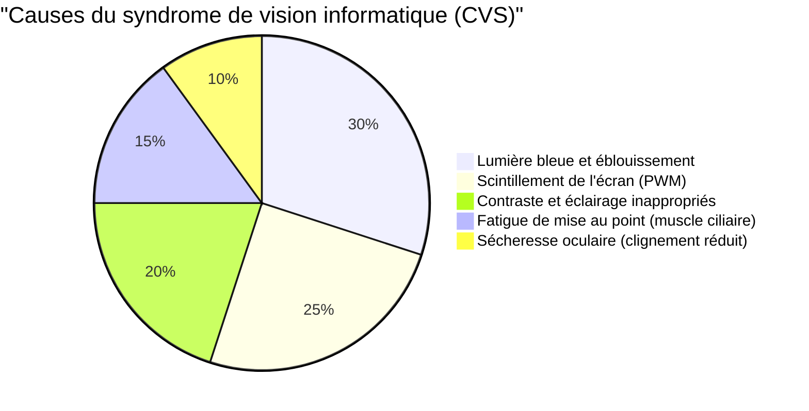
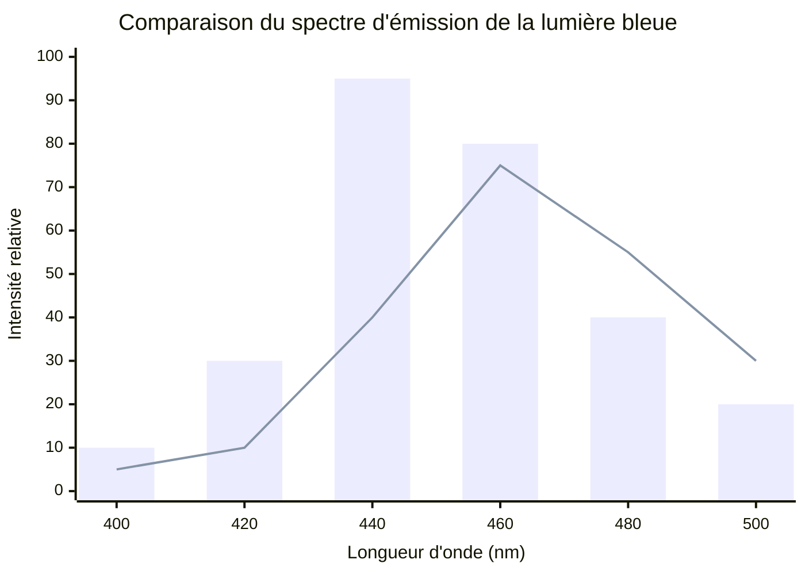
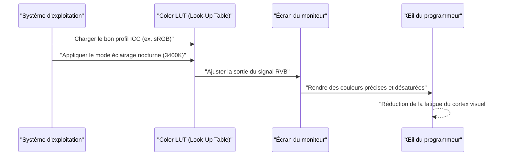
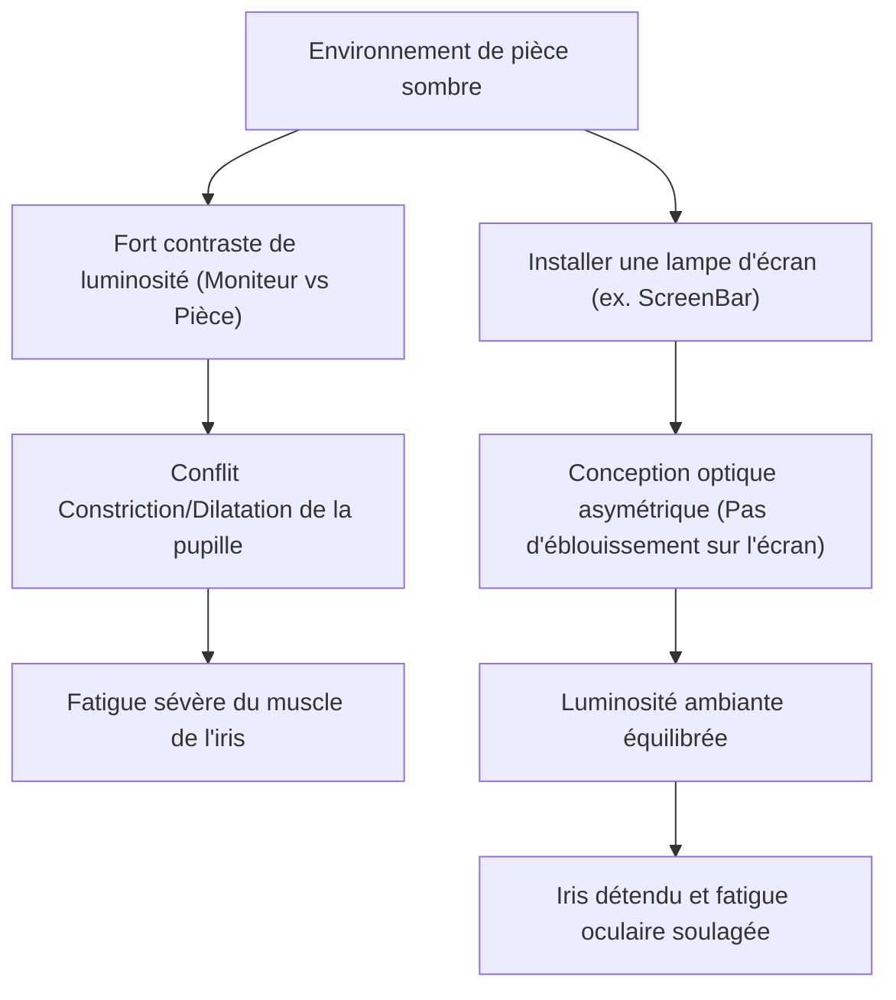

Pour les programmeurs et ingénieurs logiciels, les « yeux » sont l'outil de travail le plus important et le plus sollicité. Passant de 8 à 10 heures par jour, et parfois plus, devant des éditeurs, des terminaux et des navigateurs, presque tous les ingénieurs sont confrontés à la « fatigue oculaire (Computer Vision Syndrome : CVS) ».

En général, les conseils contre la fatigue oculaire se limitent à des recommandations superficielles comme « mettre des gouttes pour les yeux », « prendre des pauses régulières » ou « porter des lunettes anti-lumière bleue ». Cependant, en tant qu'ingénieur, il convient d'identifier la cause fondamentale (Root Cause) du problème et d'optimiser le système (l'environnement) dès sa base.

Dans cet article, nous allons disséquer en profondeur les mécanismes de la fatigue oculaire des programmeurs du point de vue de la physique (optique), de la biochimie, de l'ergonomie et de l'architecture matérielle des écrans, et nous plongerons dans les configurations de moniteurs et les gadgets ultimes pour l'atténuer, en nous appuyant sur des formules mathématiques et des schémas.

---

# Chapitre 1 : Décrypter les mécanismes de la fatigue oculaire (CVS) par la physique et la biochimie

Le syndrome de vision informatique (CVS) n'est pas causé par un seul facteur. Comme le montre le diagramme circulaire ci-dessous, divers éléments s'entremêlent de manière complexe pour provoquer fatigue oculaire, douleurs, sécheresse des yeux et fatigue générale.



Nous expliquerons ici plus particulièrement les « propriétés physiques de la lumière » et la « fonction d'accommodation de l'œil », qui ont un impact majeur.

## 1.1 Propriétés physiques de la lumière bleue et énergie des photons

La lumière bleue émise par les écrans se situe approximativement dans la bande de longueur d'onde de $400 \text{ nm} \sim 490 \text{ nm}$. La raison pour laquelle elle fatigue les yeux peut s'expliquer par la base de la mécanique quantique, la « relation de Planck-Einstein ».

L'énergie $E$ de la lumière est exprimée par la formule suivante :

$$ E = h\nu = \frac{hc}{\lambda} $$

Ici, chaque variable a la signification suivante :
- $E$ : Énergie par photon (Joule)
- $h$ : Constante de Planck ($6.626 \times 10^{-34} \text{ J}\cdot\text{s}$)
- $c$ : Vitesse de la lumière dans le vide ($3.0 \times 10^8 \text{ m/s}$)
- $\lambda$ : Longueur d'onde de la lumière (m)
- $\nu$ : Fréquence de la lumière (Hz)

Le fait important révélé par cette formule est que **« l'énergie $E$ de la lumière est inversement proportionnelle à sa longueur d'onde $\lambda$ »**. Autrement dit, la lumière bleue, qui a la longueur d'onde la plus courte parmi les lumières visibles, possède une énergie extrêmement élevée. Ces photons à haute énergie sont difficilement absorbés ou atténués par la cornée et le cristallin, et atteignent les profondeurs de la rétine, causant un puissant stress oxydatif aux cellules photoréceptrices.

## 1.2 Aberration chromatique (Chromatic Aberration) et décalage focal

De plus, d'un point de vue optique, la différence de longueur d'onde de la lumière crée une différence d'« indice de réfraction ». L'indice de réfraction $n$ du milieu (ici le cristallin, etc.) dépend de la longueur d'onde $\lambda$ et est approximé par l'équation de dispersion de Cauchy.

$$ n(\lambda) = B + \frac{C}{\lambda^2} $$

($B$ et $C$ sont des constantes propres au milieu)

Comme le montre cette formule, plus la longueur d'onde $\lambda$ de la lumière bleue est courte, plus l'indice de réfraction $n$ est grand. Par conséquent, même si la lumière rouge forme une image parfaitement nette sur la rétine, la lumière bleue est fortement réfractée et forme une image **devant la rétine**.
Lorsque le cerveau perçoit ce « flou de l'image dû à la lumière bleue (aberration chromatique) », il envoie en permanence l'ordre au muscle ciliaire d'ajuster la mise au point. C'est l'un des facteurs majeurs de l'épuisement inconscient des muscles oculaires.

## 1.3 Muscle d'accommodation (muscle ciliaire) et formule des lentilles

Lorsque nous faisons la mise au point sur de petits textes à l'écran, l'épaisseur du cristallin (lentille) dans l'œil s'ajuste. La formule des lentilles minces est la suivante :

$$ \frac{1}{f} = \frac{1}{a} + \frac{1}{b} $$

- $f$ : Distance focale du cristallin
- $a$ : Distance de l'œil au moniteur (distance de l'objet)
- $b$ : Distance du cristallin à la rétine (distance de l'image : constante à environ $24 \text{ mm}$ pour un globe oculaire adulte)

Lors de la programmation, si la distance $a$ avec l'écran est courte (ex. $40 \text{ cm} \sim 50 \text{ cm}$) pendant une longue période, afin de former une image précise sur la rétine (maintenir $b$ constant), la distance focale $f$ doit être maintenue extrêmement courte. Cette contraction extrême prolongée des muscles ciliaires pendant des heures provoque des spasmes musculaires, entraînant une fatigue oculaire sévère accompagnée de raideurs de la nuque et de maux de tête.

---

# Chapitre 2 : Choix du matériel d'affichage et élimination des facteurs de fatigue

Pour réduire la fatigue oculaire, avant de régler les logiciels, il faut d'abord vérifier et améliorer les spécifications matérielles. En particulier, la « méthode de gradation » et le « taux de rafraîchissement » sont des points sur lesquels il ne faut pas faire de compromis.

## 2.1 La terreur de la gradation PWM : Révéler le scintillement invisible

Les technologies permettant de régler la luminosité des écrans LCD et OLED se divisent en deux grandes catégories : la « gradation DC (Direct Current) » et la « gradation PWM (Pulse-Width Modulation) ».

La gradation PWM est une technologie qui fait clignoter les LED du rétroéclairage à une vitesse si élevée qu'elle est invisible à l'œil humain, et qui ajuste artificiellement la luminosité de l'écran en fonction du ratio entre le « temps d'allumage » et le « temps d'extinction ». La luminosité moyenne $L$ selon le cycle de service (Duty Cycle) du PWM est exprimée par la formule suivante :

$$ L = L_{max} \times \frac{T_{on}}{T_{on} + T_{off}} \times 100 \ (\%) $$

- $T_{on}$ : Temps pendant lequel la LED est allumée
- $T_{off}$ : Temps pendant lequel la LED est éteinte
- $L_{max}$ : Luminosité maximale en crête

Si la fréquence de la gradation PWM est faible (ex. $200 \text{ Hz} \sim 300 \text{ Hz}$), même si on ne perçoit pas consciemment le scintillement de l'écran (flicker), le cerveau et les pupilles réagissent inconsciemment au clignotement de la lumière, entraînant une dilatation et une contraction répétées des pupilles. Cela provoque une fatigue extrême, des maux de tête et même des nausées.

**[Méthode de détection du PWM et solutions]**
Pour vérifier si votre écran utilise la gradation PWM, ouvrez l'application appareil photo de votre smartphone, passez en mode « ralenti » (Slow Motion) et filmez un écran blanc du moniteur (comme une page blanche de navigateur). Si vous voyez des bandes noires se déplacer sur la vidéo, cela signifie que votre écran utilise une gradation PWM à basse fréquence.
Lorsqu'un programmeur choisit un moniteur, il devrait absolument opter pour un modèle dont la fiche technique mentionne **« Sans scintillement (Flicker-Free / Gradation DC) »**.

## 2.2 Taux de rafraîchissement (Hz) et impact ophtalmologique du flou de mouvement

Le taux de rafraîchissement est le nombre de fois que l'écran est mis à jour en une seconde (Hz).
Les écrans de bureau standards sont à $60 \text{ Hz}$, mais ces dernières années, des écrans à taux de rafraîchissement élevé comme $120 \text{ Hz}$ ou $144 \text{ Hz}$ se sont démocratisés. Ceci est extrêmement bénéfique non seulement pour les joueurs, mais aussi pour les programmeurs.

Lorsqu'on fait défiler une grande quantité de code ou que beaucoup de logs défilent dans le terminal, un écran $60 \text{ Hz}$ produit un « flou de mouvement » (motion blur) en raison des limites de la vitesse de réponse des pixels. Même pendant le défilement, l'œil tente inconsciemment de faire la mise au point sur la forme du texte, et si le texte est flou, la charge de traitement dans le cortex visuel du cerveau augmente de façon spectaculaire.
Avec un écran de $120 \text{ Hz}$ ou plus, le texte reste parfaitement visible même pendant le défilement, ce qui réduit considérablement la charge de ces mouvements oculaires et accommodements inconscients.

## 2.3 Types de dalles et ratio de contraste (IPS, VA, OLED)

Le ratio de contraste de l'écran est directement lié à la lisibilité du texte.
La « Loi de Weber-Fechner », selon laquelle l'intensité de la sensation humaine est proportionnelle au logarithme du stimulus, s'exprime par la formule suivante :

$$ p = k \ln \left( \frac{S}{S_0} \right) $$

($p$ : intensité de la sensation, $S$ : intensité physique du stimulus, $S_0$ : seuil, $k$ : constante)

En d'autres termes, l'œil humain réagit plus fortement au « ratio de luminosité relative (contraste) » qu'à la luminosité absolue.
Pour lire du code avec coloration syntaxique pendant de longues heures, les dalles VA avec des noirs profonds (rapport de contraste élevé de $3000:1$) ou les dalles OLED capables d'éteindre chaque pixel individuellement ($1 000 000:1$ et plus) rendent les contours du texte extrêmement nets et améliorent la lisibilité.
Cependant, comme nous le verrons plus loin, regarder un écran avec un contraste extrêmement élevé dans une pièce sombre provoque une contraction excessive des pupilles, ce qui fatigue davantage les yeux. Il est donc indispensable d'équilibrer cela avec la lumière ambiante.

Le graphique suivant compare le spectre d'émission d'un écran LCD standard avec celui d'un OLED moderne (conçu pour réduire la lumière bleue).



---

# Chapitre 3 : Calibration du moniteur et paramètres du système d'exploitation / logiciels

La gestion de l'espace colorimétrique et la calibration côté système d'exploitation sont tout aussi importantes que le choix du matériel.

## 3.1 Le piège du gamut (sRGB vs DCI-P3) et le profil ICC

Les moniteurs récents mettent souvent en avant un « large gamut », comme une couverture DCI-P3 de plus de 95 %, mais cela peut se retourner contre vous en programmation.
Dans un environnement Windows, si vous utilisez un écran à large gamut sans appliquer le profil ICC approprié (profil colorimétrique défini par le Consortium International de la Couleur), la coloration syntaxique de VS Code (comme le rouge ou le vert pour les avertissements), qui est définie pour le sRGB standard, s'affichera avec des couleurs artificiellement saturées et criardes.
Ces couleurs intenses étant très stimulantes pour les yeux, il est fortement recommandé d'installer le profil ICC correct depuis les paramètres d'affichage de l'OS, ou de passer le moniteur en mode « Émulation sRGB » via ses menus OSD.

Le diagramme de séquence ci-dessous illustre le processus par lequel l'application d'un profil ICC correct permet un rendu de couleurs plus doux pour les yeux.



## 3.2 Solutions logicielles (f.lux / Night Light)

Le moyen le plus simple et le plus efficace de lutter contre la lumière bleue consiste à utiliser des logiciels qui modifient dynamiquement la température de couleur (Color Temperature) en fonction de l'heure.
- Windows : **Éclairage nocturne (Night Light)**
- macOS : **Night Shift**
- Tiers : **f.lux**

La température de couleur s'exprime en kelvins ($\text{K}$). La lumière du soleil en journée se situe autour de $5500\text{K} \sim 6500\text{K}$ (lumière bleutée). S'exposer continuellement à cette lumière inhibe la sécrétion de « mélatonine » (hormone du sommeil) par la glande pinéale du cerveau.
Le soir, en utilisant ces logiciels pour abaisser la température de couleur à $3400\text{K} \sim 1900\text{K}$ (teintes chaudes allant de l'orange au rouge), on réduit physiquement l'émission de lumière bleue. Cela permet de préserver le rythme circadien (horloge biologique) et d'empêcher les photons à haute énergie d'atteindre le globe oculaire.

---

# Chapitre 4 : La solution matérielle ultime : L'adoption des derniers gadgets

Si les mesures expliquées jusqu'ici ne suffisent pas à dissiper la fatigue, il est nécessaire d'investir dans des gadgets externes pour transformer radicalement l'environnement.

## 4.1 L'éclairage en biais (Bias Lighting) et la lampe d'écran (ScreenBar)

Regarder un écran lumineux dans une pièce sombre crée un contraste violent entre le centre de la vision (haute luminosité) et la périphérie (basse luminosité). C'est ce qu'on appelle **« l'éblouissement d'inconfort (Discomfort Glare) »**.
Dans ces conditions, l'œil tente d'absorber la lumière en dilatant la pupille, tout en voulant la contracter à cause de la luminosité centrale. Cette contradiction épuise le muscle de l'iris.

La solution à ce problème est « l'éclairage en biais » (Bias Lighting).
Les « lampes à fixer sur le moniteur », comme la **BenQ ScreenBar**, sont particulièrement recommandées.



La caractéristique principale de la ScreenBar est sa « conception optique asymétrique (Asymmetrical Optical Design) ». Grâce à un réflecteur et une lentille spéciaux, la lumière n'éclaire pas l'écran lui-même (évitant ainsi les reflets et l'éblouissement sur l'écran), mais illumine de façon uniforme uniquement le clavier et l'espace situé derrière le moniteur. Cela réduit drastiquement la différence de luminosité (ratio de contraste) dans l'ensemble du champ visuel et élimine la pression exercée sur les yeux.

## 4.2 Le changement de paradigme des écrans E-Ink (Dasung & Boox)

Pour la lecture de longues références d'API, de livres techniques (PDF) ou de code, la solution ultime moderne consiste à **utiliser un écran à encre électronique (E-Ink) comme moniteur secondaire**.

Contrairement aux écrans LCD ou OLED, l'E-Ink ne possède pas de rétroéclairage. Il affiche le texte en déplaçant des particules de pigment blanc et noir (comme le dioxyde de titane) sous l'effet d'une tension (électrophorèse), et reflète la lumière ambiante.
- **Émission physique de lumière bleue : Zéro**
- **Scintillement lié au PWM ou au rafraîchissement : Totalement zéro**

En plaçant un moniteur E-Ink comme la série **Dasung Paperlike** (25,3 pouces, etc.) ou l'**Onyx Boox Mira** en mode portrait comme moniteur secondaire dédié au texte, vous pouvez lire des documents avec la même sensation que s'ils étaient imprimés sur papier.
Bien qu'il y ait un inconvénient de latence d'affichage (faible taux de rafraîchissement), pour un usage strictement limité à la « lecture de texte statique » dans un environnement de programmation, il n'y a pas d'appareil plus doux pour les yeux sur Terre.

---

# Chapitre 5 : Ergonomie et règles d'utilisation

Avoir le meilleur matériel ne sert à rien si les postures et les règles de l'utilisateur sont inadaptées.

## 5.1 Dynamique des fluides de l'œil sec et angle de vue

La sécheresse oculaire n'est pas seulement une sensation d'inconfort (« yeux secs »). La destruction du film lacrymal à la surface de la cornée provoque une réflexion diffuse de la lumière, rendant la vision floue et entraînant, par conséquent, un cercle vicieux de fatigue oculaire supplémentaire (surmenage du muscle ciliaire).
Le taux d'évaporation des larmes est proportionnel à la surface de l'œil exposée à l'air (fente palpébrale).

L'angle de vue idéal $\theta$ pour la position du moniteur serait de $15^\circ \sim 20^\circ$ vers le bas par rapport à la ligne d'horizon.
En définissant $d$ comme la distance horizontale du centre du moniteur à l'œil, et $h$ comme la différence de hauteur entre le centre du moniteur et la hauteur des yeux, on obtient la fonction trigonométrique suivante :

$$ \tan \theta = \frac{h}{d} $$

Par exemple, si la distance au moniteur $d$ est de $60 \text{ cm}$ (environnement de bureau standard), pour obtenir $\theta = 15^\circ$ :

$$ h = 60 \times \tan(15^\circ) \approx 60 \times 0.267 = 16.02 \text{ cm} $$

En d'autres termes, **le centre du moniteur devrait idéalement se situer à environ $16 \text{ cm}$ en dessous de la hauteur des yeux**.
Regarder légèrement vers le bas fait naturellement descendre la paupière supérieure, réduisant ainsi la surface exposée de l'œil, ce qui prévient de manière drastique l'évaporation des larmes. Il est conseillé d'utiliser un bras de moniteur (comme Ergotron) pour régler cette hauteur avec une précision millimétrique.

## 5.2 Application stricte et automatisation de la norme mondiale « Règle des 20-20-20 »

La méthode de récupération de la fatigue oculaire recommandée par l'Académie Américaine d'Ophtalmologie (AAO) et les ophtalmologistes du monde entier lors de l'utilisation d'appareils numériques est la **« Règle des 20-20-20 »**.

**« Toutes les 20 minutes, regardez un objet situé à au moins 20 pieds (environ 6 mètres) pendant 20 secondes. »**

Cette action simple force le muscle ciliaire, qui était extrêmement contracté, à se détendre (relâchement). Le cristallin s'amincit et la fonction d'accommodation est réinitialisée.
Les programmeurs oubliant souvent le temps lorsqu'ils entrent dans un état de « flow », la solution digne d'un ingénieur consiste à créer un système forçant automatiquement cette règle.
Voici un exemple très simple de script utilisant `tkinter` en Python pour afficher un popup obligatoire toutes les 20 minutes.

```python
import time
import tkinter as tk
from tkinter import messagebox

def remind_20_20_20():
    # Masquer la fenêtre principale
    root = tk.Tk()
    root.withdraw()
    
    while True:
        # Attendre 20 minutes (1200 secondes)
        time.sleep(20 * 60)
        
        # Afficher la boîte de dialogue d'avertissement au premier plan
        messagebox.showinfo(
            title="Règle des 20-20-20",
            message="Détachez vos yeux de l'écran et regardez à au moins 6 mètres pendant 20 secondes !\n(Cela permet de détendre le muscle ciliaire)"
        )
        
        # 20 secondes de détente
        time.sleep(20)

if __name__ == '__main__':
    # Exécuter en arrière-plan
    remind_20_20_20()
```

En enregistrant un script comme celui-ci au démarrage ou en l'exécutant avec le planificateur de tâches de l'OS (Cron), vous pouvez intégrer ce cycle de récupération forcée dans votre routine quotidienne.

---

# Conclusion : La prévention de la fatigue oculaire comme investissement pour l'avenir

Notre carrière d'ingénieur logiciel dure plusieurs décennies. Ce qui soutient cette carrière, ce n'est pas un clavier onéreux ou le dernier processeur, mais indéniablement nos propres « yeux » et « cerveau ».

1. **Comprendre l'énergie de la lumière ($E = hc/\lambda$) et la charge physique de l'accommodation**
2. **Adopter un moniteur sans scintillement (gradation DC) et à taux de rafraîchissement élevé**
3. **Optimiser le contraste relatif de l'environnement avec un éclairage en biais tel que la ScreenBar**
4. **Envisager un moniteur E-Ink comme appareil ultime pour la lecture de texte**
5. **Utiliser un bras de moniteur pour créer l'angle de vue optimal basé sur $\tan \theta = h/d$, et systématiser la « règle des 20-20-20 »**

Bien que ces mesures puissent impliquer des dépenses et des efforts temporaires, on peut dire qu'elles constituent l'« investissement technologique » le plus rentable pour prolonger la durée de vie saine de vos yeux et maximiser votre productivité ainsi que votre qualité de vie (QOL) tout au long de votre vie. Révisez dès maintenant votre environnement de développement et implémentez un peu de soin pour vos yeux.
