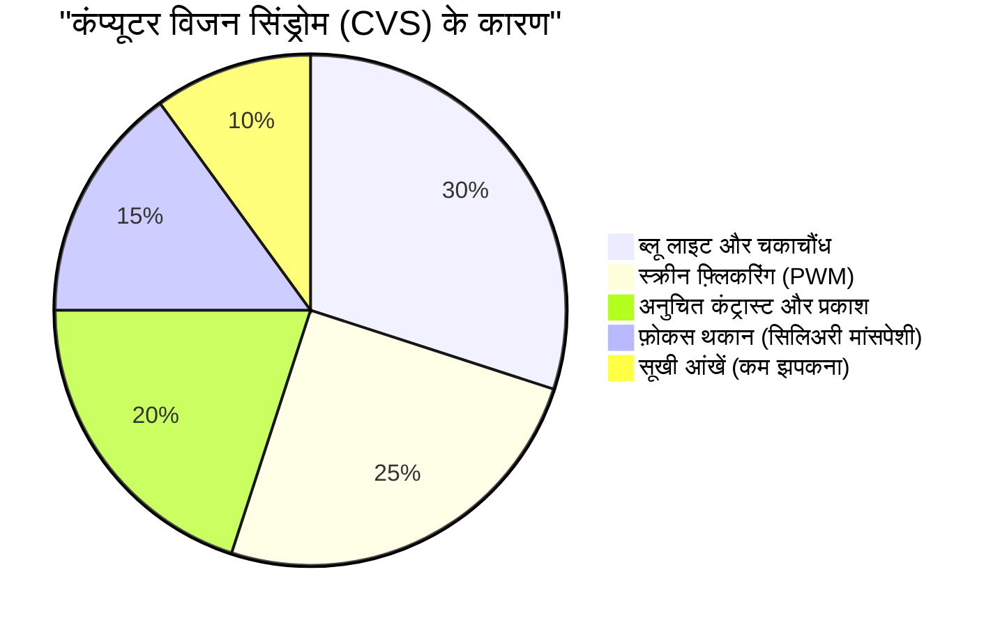
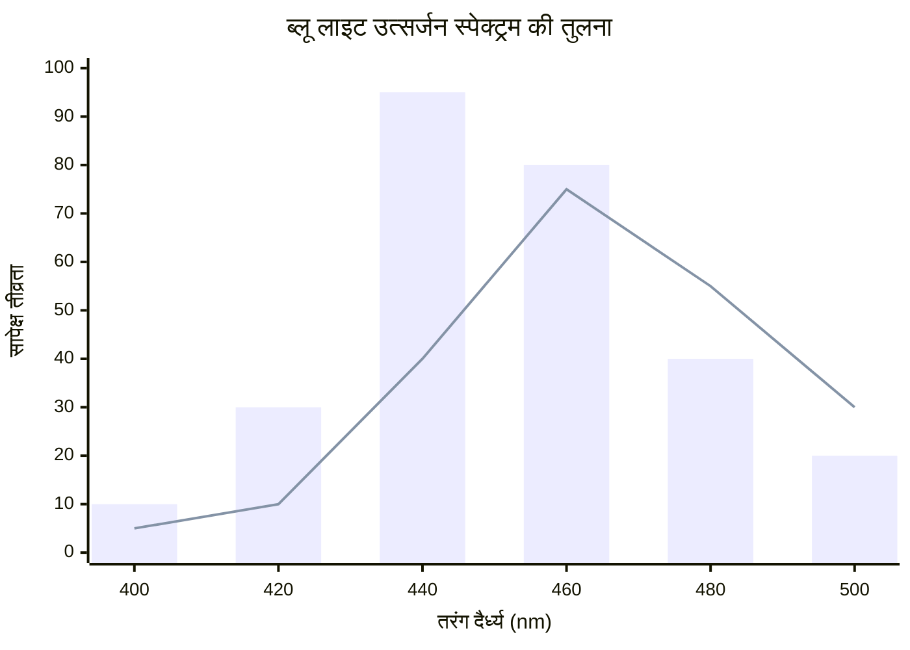
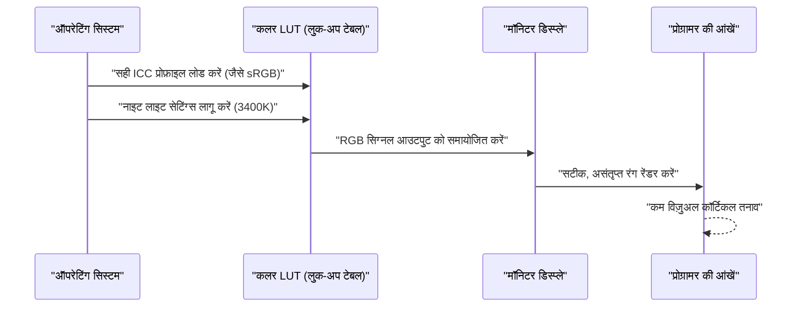
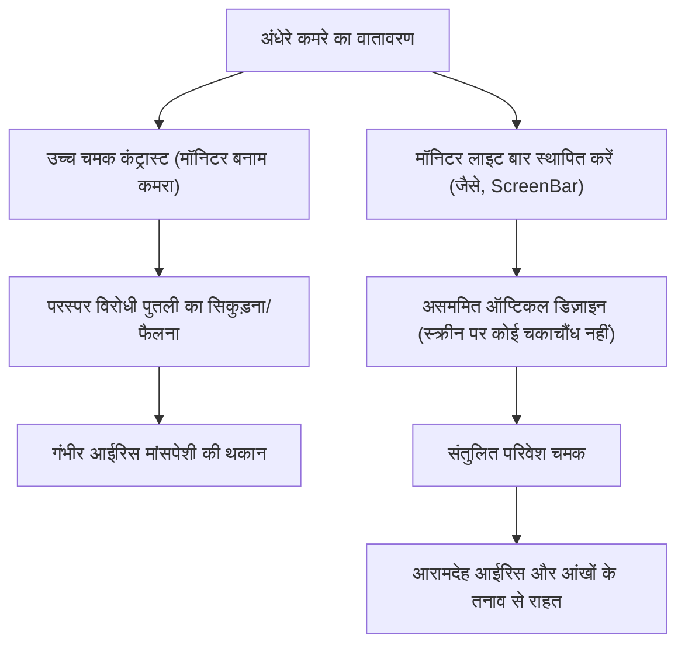

प्रोग्रामर और सॉफ्टवेयर इंजीनियरों के लिए, "आंखें" उनका सबसे महत्वपूर्ण और अधिक इस्तेमाल होने वाला उपकरण हैं। हर दिन 8 से 10 घंटे या उससे अधिक समय तक एडिटर, टर्मिनल और ब्राउज़र की स्क्रीन को देखते हुए, लगभग सभी इंजीनियरों को "आंखों के तनाव (Computer Vision Syndrome: CVS)" का सामना करना पड़ता है।

आमतौर पर, आंखों के तनाव के लिए सलाह अक्सर सतही होती है जैसे "आई ड्रॉप्स का उपयोग करें", "नियमित ब्रेक लें", या "ब्लू लाइट ब्लॉकिंग चश्मा पहनें"। हालांकि, एक इंजीनियर के रूप में, हमें समस्या के मूल कारण (Root Cause) की पहचान करनी चाहिए और सिस्टम (वातावरण) स्तर से इसे अनुकूलित करना चाहिए।

इस लेख में, हम भौतिकी (प्रकाशिकी), जैव रसायन, एर्गोनॉमिक्स और डिस्प्ले के हार्डवेयर आर्किटेक्चर के दृष्टिकोण से प्रोग्रामर की आंखों के तनाव के तंत्र का गहराई से विश्लेषण करेंगे, और इसे कम करने के लिए अंतिम मॉनिटर सेटिंग्स और गैजेट्स पर चर्चा करेंगे, साथ ही गणितीय समीकरणों और आरेखों का भी उपयोग करेंगे।

---

# अध्याय 1: भौतिकी और जैव रसायन के दृष्टिकोण से आंखों के तनाव (CVS) के तंत्र को समझना

कंप्यूटर विज़न सिंड्रोम (CVS) किसी एक कारण से नहीं होता है। जैसा कि नीचे दिए गए पाई चार्ट में दिखाया गया है, विभिन्न कारक जटिल रूप से आपस में जुड़े हुए हैं जिससे आंखों की थकान, दर्द, सूखी आंखें और समग्र शारीरिक थकान होती है।



यहां, हम विशेष रूप से बड़े प्रभाव वाले "प्रकाश की भौतिक विशेषताओं" और "आंख के फोकस समायोजन कार्य" के बारे में चर्चा करेंगे।

## 1.1 ब्लू लाइट की भौतिक विशेषताएं और फोटॉन ऊर्जा

डिस्प्ले से निकलने वाली ब्लू लाइट (नीला प्रकाश) लगभग $400 \text{ nm} \sim 490 \text{ nm}$ के तरंग दैर्ध्य बैंड में स्थित होती है। यह आंखों पर तनाव क्यों डालती है, इसे क्वांटम यांत्रिकी की नींव, "प्लैंक-आइंस्टीन संबंध" द्वारा समझाया जा सकता है।

प्रकाश की ऊर्जा $E$ को निम्नलिखित सूत्र द्वारा व्यक्त किया गया है:

$$ E = h\nu = \frac{hc}{\lambda} $$

यहां, प्रत्येक चर का अर्थ निम्नलिखित है:
- $E$ : प्रति फोटॉन ऊर्जा (Joule)
- $h$ : प्लैंक स्थिरांक ($6.626 \times 10^{-34} \text{ J}\cdot\text{s}$)
- $c$ : निर्वात में प्रकाश की गति ($3.0 \times 10^8 \text{ m/s}$)
- $\lambda$ : प्रकाश की तरंग दैर्ध्य (m)
- $\nu$ : प्रकाश की आवृत्ति (Hz)

यह समीकरण जो महत्वपूर्ण तथ्य दर्शाता है वह यह है कि **"प्रकाश की ऊर्जा $E$, तरंग दैर्ध्य $\lambda$ के व्युत्क्रमानुपाती है"**। दूसरे शब्दों में, दृश्यमान प्रकाश के बीच सबसे कम तरंग दैर्ध्य वाली ब्लू लाइट में अत्यधिक उच्च ऊर्जा होती है। ये उच्च-ऊर्जा फोटॉन कॉर्निया या लेंस द्वारा आसानी से अवशोषित या क्षीण नहीं होते हैं, वे रेटिना में गहराई तक पहुंचते हैं, और विज़ुअल कोशिकाओं पर शक्तिशाली ऑक्सीडेटिव तनाव डालते हैं।

## 1.2 रंगीन विपथन (Chromatic Aberration) और फोकस में बदलाव

ऑप्टिकल दृष्टिकोण से आगे देखते हुए, प्रकाश की तरंग दैर्ध्य में अंतर "अपवर्तनांक (refractive index)" में अंतर पैदा करता है। माध्यम (यहां, लेंस, आदि) का अपवर्तनांक $n$ तरंग दैर्ध्य $\lambda$ पर निर्भर करता है, और कौची के फैलाव सूत्र (Cauchy's dispersion formula) द्वारा अनुमानित है।

$$ n(\lambda) = B + \frac{C}{\lambda^2} $$

($B, C$ माध्यम के लिए विशिष्ट स्थिरांक हैं)

जैसा कि इस सूत्र से देखा जा सकता है, तरंग दैर्ध्य $\lambda$ जितना छोटा होगा (जैसे ब्लू लाइट), अपवर्तनांक $n$ उतना ही बड़ा होगा। इसलिए, भले ही लाल प्रकाश रेटिना पर पूरी तरह से केंद्रित हो, ब्लू लाइट काफी अपवर्तित हो जाती है, और **रेटिना के सामने** एक छवि बनाती है।
जब मस्तिष्क इस "ब्लू लाइट के कारण धुंधली छवि (रंगीन विपथन)" को पहचानता है, तो यह फोकस को लगातार समायोजित करने के लिए सिलिअरी मांसपेशियों को संकेत भेजता रहता है। अनजाने में आंखों की मांसपेशियों के थकने का यह एक प्रमुख कारण है।

## 1.3 फोकस समायोजन मांसपेशी (सिलिअरी मांसपेशी) और लेंस सूत्र

जब हम मॉनिटर पर बारीक टेक्स्ट पर ध्यान केंद्रित करते हैं, तो आंखों के अंदर क्रिस्टलीय लेंस की मोटाई समायोजित हो रही होती है। पतले लेंस का सूत्र इस प्रकार है:

$$ \frac{1}{f} = \frac{1}{a} + \frac{1}{b} $$

- $f$: क्रिस्टलीय लेंस की फोकल लंबाई
- $a$: आंख से मॉनिटर तक की दूरी (वस्तु की दूरी)
- $b$: क्रिस्टलीय लेंस से रेटिना तक की दूरी (छवि की दूरी: एक वयस्क की आंख में लगभग $24 \text{ mm}$ पर स्थिर)

प्रोग्रामिंग के दौरान, यदि मॉनिटर की दूरी $a$ लंबे समय तक कम (उदाहरण के लिए: $40 \text{ cm} \sim 50 \text{ cm}$) रहती है, तो रेटिना पर सटीक छवि बनाने के लिए ($b$ को स्थिर रखने के लिए), फोकल लंबाई $f$ को अत्यधिक कम बनाए रखना होता है। जब सिलिअरी मांसपेशियां घंटों तक अत्यधिक सिकुड़ी हुई अवस्था में रहती हैं, तो मांसपेशियां ऐंठन में चली जाती हैं, जिससे कंधे में दर्द और सिरदर्द के साथ आंखों में गंभीर थकान होती है।

---

# अध्याय 2: हार्डवेयर डिस्प्ले का चयन और थकान के कारणों को खत्म करना

आंखों की थकान को कम करने के लिए, सॉफ़्टवेयर सेटिंग्स से पहले हार्डवेयर विनिर्देशों की जांच करना और उन्हें सुधारना आवश्यक है। विशेष रूप से "डिमिंग विधि" और "रिफ्रेश रेट" ऐसे बिंदु हैं जहां आपको समझौता नहीं करना चाहिए।

## 2.1 PWM डिमिंग का आतंक: अदृश्य फ़्लिकर को उजागर करना

लिक्विड क्रिस्टल (LCD) या ऑर्गेनिक EL (OLED) मॉनिटर की चमक को समायोजित करने वाली तकनीकों को मोटे तौर पर "DC (डायरेक्ट करंट) डिमिंग" और "PWM (पल्स-विड्थ मॉड्यूलेशन) डिमिंग" में विभाजित किया जा सकता है।

PWM डिमिंग एक ऐसी तकनीक है जो बैकलाइट के LED को इतनी तेज़ गति से ब्लिंक कराती है जो मानव आंख के लिए अदृश्य है, और उस "चालू समय" और "बंद समय" के अनुपात के आधार पर स्क्रीन की चमक को कृत्रिम रूप से समायोजित करती है। PWM के ड्यूटी अनुपात (Duty Cycle) के कारण औसत चमक $L$ को निम्न सूत्र द्वारा व्यक्त किया गया है:

$$ L = L_{max} \times \frac{T_{on}}{T_{on} + T_{off}} \times 100 \ (\%) $$

- $T_{on}$ : वह समय जब LED चालू हो
- $T_{off}$ : वह समय जब LED बंद हो
- $L_{max}$ : पीक पर अधिकतम चमक

जब PWM डिमिंग आवृत्ति कम होती है (उदाहरण के लिए: $200 \text{ Hz} \sim 300 \text{ Hz}$), भले ही आप सचेत रूप से स्क्रीन के झिलमिलाहट (फ़्लिकर) को महसूस न करें, मस्तिष्क और पुतलियां अनजाने में प्रकाश के चमकने पर प्रतिक्रिया करती हैं, और पुतलियां बार-बार फैलती और सिकुड़ती हैं। यह अत्यधिक थकान, सिरदर्द और यहां तक कि मतली का कारण बनता है।

**【PWM का पता लगाने की विधि और उपाय】**
यह जांचने के लिए कि आपका मॉनिटर PWM डिमिंग का उपयोग करता है या नहीं, अपने स्मार्टफोन के कैमरा ऐप को लॉन्च करें और "स्लो मोशन" मोड में मॉनिटर की एक सफेद स्क्रीन (जैसे कि ब्राउज़र का खाली पृष्ठ) शूट करने का प्रयास करें। यदि वीडियो में काले रंग की पट्टियां (banding) चलती हुई दिखाई देती हैं, तो वह मॉनिटर कम-आवृत्ति वाले PWM डिमिंग को अपना रहा है।
प्रोग्रामर के लिए मॉनिटर चुनते समय, आपको हमेशा ऐसा मॉनिटर चुनना चाहिए जिसके विनिर्देशों में **"फ़्लिकर-फ्री (DC डिमिंग)"** स्पष्ट रूप से लिखा हो।

## 2.2 रिफ्रेश रेट (Hz) और मोशन ब्लर का नेत्र विज्ञान संबंधी प्रभाव

रिफ्रेश रेट यह दर्शाता है कि मॉनिटर 1 सेकंड में स्क्रीन को कितनी बार फिर से बनाता है (Hz)।
सामान्य ऑफिस मॉनिटर $60 \text{ Hz}$ के होते हैं, लेकिन हाल के वर्षों में $120 \text{ Hz}$ और $144 \text{ Hz}$ के उच्च रिफ्रेश रेट वाले मॉनिटर लोकप्रिय हो गए हैं। यह केवल गेमर्स के लिए नहीं, बल्कि प्रोग्रामर्स के लिए भी अत्यंत लाभदायक है।

जब भारी मात्रा में कोड स्क्रॉल किया जाता है, या टर्मिनल में बहुत सारे लॉग प्रवाहित होते हैं, तो पिक्सेल प्रतिक्रिया गति की सीमा के साथ मिलकर $60 \text{ Hz}$ के डिस्प्ले में "मोशन ब्लर (afterimage)" होता है। आंखें अनजाने में स्क्रॉल करते समय भी टेक्स्ट के आकार को पकड़ने और उस पर ध्यान केंद्रित करने की कोशिश करती हैं, लेकिन यदि अक्षर धुंधले हैं, तो मस्तिष्क के विज़ुअल कॉर्टेक्स का प्रोसेसिंग भार नाटकीय रूप से बढ़ जाता है।
$120 \text{ Hz}$ या उच्च डिस्प्ले के साथ, स्क्रॉल करते समय भी टेक्स्ट स्पष्ट रूप से दिखाई देता है, जिससे आंखों की अनैच्छिक गति और फोकस समायोजन के भार को काफी कम किया जा सकता है।

## 2.3 पैनल का प्रकार और कंट्रास्ट अनुपात (IPS, VA, OLED)

स्क्रीन का कंट्रास्ट अनुपात सीधे टेक्स्ट की दृश्यता को प्रभावित करता है।
"वेबर-फेचनर का नियम", जो बताता है कि मानवीय अनुभूति की मात्रा उत्तेजना के लघुगणक के समानुपाती है, को निम्न सूत्र द्वारा व्यक्त किया गया है:

$$ p = k \ln \left( \frac{S}{S_0} \right) $$

($p$: अनुभूति की मात्रा, $S$: उत्तेजना की भौतिक मात्रा, $S_0$: सीमा (threshold), $k$: स्थिरांक)

दूसरे शब्दों में, मानव आंखें पूर्ण चमक की तुलना में "सापेक्ष चमक के अनुपात (कंट्रास्ट)" पर अधिक मजबूती से प्रतिक्रिया करती हैं।
सिंटैक्स-हाइलाइट किए गए कोड को लंबे समय तक पढ़ते समय, एक गहरे काले रंग (उच्च कंट्रास्ट अनुपात) वाला VA पैनल ($3000:1$) या एक OLED पैनल ($1,000,000:1$ ~) जो पिक्सेल-बाय-पिक्सेल आधार पर पूरी तरह से बंद हो सकता है, अक्षरों की रूपरेखा को बहुत स्पष्ट बनाता है और दृश्यता बढ़ाता है।
हालांकि, जैसा कि नीचे बताया गया है, पूरी तरह से अंधेरे कमरे में अत्यधिक उच्च कंट्रास्ट वाली स्क्रीन को देखने से पुतलियां बहुत अधिक सिकुड़ जाएंगी, जिससे थकान होगी, इसलिए परिवेशी प्रकाश के साथ संतुलन आवश्यक है।

निम्नलिखित चार्ट एक मानक LCD मॉनिटर और एक OLED (कम नीली रोशनी वाली डिज़ाइन) के उत्सर्जन स्पेक्ट्रम की छवि की तुलना करता है, जिसने हाल ही में ध्यान आकर्षित किया है।



---

# अध्याय 3: मॉनिटर कैलिब्रेशन और OS/सॉफ़्टवेयर सेटिंग्स

हार्डवेयर के चयन जितना ही महत्वपूर्ण, OS साइड पर कलर स्पेस मैनेजमेंट और कैलिब्रेशन है।

## 3.1 कलर गैमट (sRGB बनाम DCI-P3) का जाल और ICC प्रोफ़ाइल

हाल के मॉनिटर्स अक्सर "वाइड कलर गैमट" का विज्ञापन करते हैं, जैसे कि 95% से अधिक का DCI-P3 कवरेज, लेकिन प्रोग्रामिंग उद्देश्यों के लिए यह नुकसानदेह हो सकता है।
विंडोज वातावरण में, यदि आप उचित ICC प्रोफ़ाइल (अंतर्राष्ट्रीय रंग कंसोर्टियम द्वारा परिभाषित रंग प्रोफ़ाइल) को लागू किए बिना एक वाइड कलर गैमट मॉनिटर का उपयोग करते हैं, तो मानक sRGB में निर्दिष्ट VS Code सिंटैक्स हाइलाइट्स (जैसे लाल और हरे रंग के चेतावनी रंग) अप्राकृतिक रूप से ज्वलंत (ओवरसैचुरेटेड) दिखाई देंगे।
ये तीव्र रंग आंखों को बहुत उत्तेजित करते हैं, इसलिए ओएस डिस्प्ले सेटिंग्स से सही ICC प्रोफ़ाइल स्थापित करने या मॉनिटर की OSD सेटिंग्स में "sRGB एमुलेशन मोड" पर स्विच करने की पुरजोर अनुशंसा की जाती है।

निम्नलिखित अनुक्रम आरेख उस प्रक्रिया को दर्शाता है जब एक सही ICC प्रोफ़ाइल लागू की जाती है, और आंखों के अनुकूल रंग प्रस्तुत किए जाते हैं।



## 3.2 सॉफ़्टवेयर द्वारा उपाय (f.lux / नाइट लाइट)

ब्लू लाइट से निपटने के लिए सबसे आसान और प्रभावी उपाय ऐसे सॉफ़्टवेयर का उपयोग करना है जो दिन के समय के अनुसार रंग तापमान (Color Temperature) को गतिशील रूप से बदलता है।
- Windows: **नाइट लाइट (Night Light)**
- macOS: **नाइट शिफ्ट (Night Shift)**
- थर्ड पार्टी: **f.lux**

रंग का तापमान केल्विन ($\text{K}$) में मापा जाता है। दिन के दौरान सूर्य का प्रकाश लगभग $5500\text{K} \sim 6500\text{K}$ (नीला-सफेद प्रकाश) होता है, लेकिन यदि आप लगातार इसका सामना करते हैं, तो मस्तिष्क की पीनियल ग्रंथि में "मेलाटोनिन (नींद का हार्मोन)" का स्राव दब जाता है।
शाम के बाद, इन सॉफ़्टवेयर का उपयोग करके रंग के तापमान को $3400\text{K} \sim 1900\text{K}$ (गर्म नारंगी-से-लाल) तक कम करके, आप ब्लू लाइट के उत्सर्जन को शारीरिक रूप से कम कर सकते हैं, सामान्य सर्कैडियन रिदम (जैविक घड़ी) को बनाए रख सकते हैं, और उच्च-ऊर्जा फोटॉन को आंखों तक पहुंचने से रोक सकते हैं।

---

# अध्याय 4: अंतिम हार्डवेयर समाधान: नवीनतम गैजेट्स का परिचय

यदि अब तक बताए गए उपायों से भी थकान दूर नहीं होती है, तो पर्यावरण को महत्वपूर्ण रूप से बदलने के लिए बाहरी गैजेट्स में निवेश करना आवश्यक है।

## 4.1 बायस लाइटिंग (Bias Lighting) और मॉनिटर-माउंटेड लाइट (ScreenBar)

जब आप एक अंधेरे कमरे में उज्ज्वल मॉनिटर को देखते हैं, तो दृश्य के केंद्र (उच्च चमक) और परिधि (कम चमक) के बीच एक तीव्र कंट्रास्ट होता है। इसे **"असुविधाजनक चकाचौंध (Discomfort Glare)"** कहा जाता है।
इस वातावरण में, आंखें प्रकाश को ग्रहण करने के लिए पुतली को खोलने का प्रयास करती हैं, जबकि साथ ही केंद्र में चमक के जवाब में पुतली को बंद करने का प्रयास करती हैं, जिससे आईरिस की मांसपेशियां गंभीर रूप से थक जाती हैं।

"बायस लाइटिंग (Bias Lighting)" इसका समाधान है।
विशेष रूप से **BenQ ScreenBar** जैसे "मॉनिटर-माउंटेड लाइट्स" की सिफारिश की जाती है।



ScreenBar की सबसे बड़ी विशेषता इसकी "असममित ऑप्टिकल डिज़ाइन (Asymmetrical Optical Design)" है। विशेष रिफ्लेक्टर और लेंस का उपयोग करके, यह मॉनिटर की स्क्रीन पर ही प्रकाश नहीं डालता है (स्क्रीन पर प्रतिबिंब और चकाचौंध को रोकता है), बल्कि केवल कीबोर्ड और मॉनिटर के पीछे के स्थान को समान रूप से प्रकाशित करता है। यह दृश्य के पूरे क्षेत्र में चमक के अंतर (कंट्रास्ट अनुपात) को नाटकीय रूप से कम करता है, और आंखों पर पड़ने वाले तनाव को समाप्त करता है।

## 4.2 ई-इंक (E-Ink) डिस्प्ले का पैराडाइम शिफ्ट (Dasung और Boox)

लंबे API संदर्भों, तकनीकी पुस्तकों (PDF), या कोड पढ़ने के काम में, आज के अंतिम समाधान को **"ई-इंक (इलेक्ट्रॉनिक पेपर) डिस्प्ले" का सब-मॉनिटर के रूप में उपयोग** कहा जा सकता है।

LCD और OLED के विपरीत, ई-इंक में स्वयं का कोई उत्सर्जक बैकलाइट नहीं होता है। कैप्सूल में आवेशित सफेद और काले वर्णक कणों (जैसे कि टाइटेनियम डाइऑक्साइड) को वोल्टेज द्वारा ले जाया जाता है (इलेक्ट्रोफोरेटिक विधि), और यह आसपास के प्रकाश को परावर्तित करके अक्षरों को प्रदर्शित करता है।
- **भौतिक ब्लू लाइट उत्सर्जन: शून्य**
- **PWM या रिफ्रेशिंग से जुड़ा फ़्लिकर: पूरी तरह से शून्य**

यदि आप **Dasung Paperlike** श्रृंखला (जैसे 25.3 इंच) या **Onyx Boox Mira** जैसे ई-इंक मॉनिटर को टेक्स्ट के लिए समर्पित सब-मॉनिटर के रूप में लंबवत (vertically) रूप से रखते हैं, तो आप दस्तावेज़ों को बिल्कुल वैसे ही पढ़ सकते हैं जैसे कि आप छपे हुए कागज़ को पढ़ रहे हों।
हालाँकि ड्राइंग में देरी (कम रिफ्रेश रेट) का एक नुकसान है, लेकिन यदि आप इसे प्रोग्रामिंग वातावरण में केवल "स्थिर टेक्स्ट पढ़ने" तक सीमित रखते हैं, तो पृथ्वी पर इससे अधिक आंखों के अनुकूल कोई अन्य उपकरण नहीं है।

---

# अध्याय 5: एर्गोनॉमिक्स (मानव इंजीनियरिंग) और संचालन नियम

चाहे आप कितने भी बेहतरीन हार्डवेयर क्यों न ले आएं, यदि उसका उपयोग करने वाले व्यक्ति की मुद्रा और नियम गलत हैं तो यह अर्थहीन है।

## 5.1 ड्राई आई (सूखी आंखें) की द्रव गतिकी और दृष्टि का कोण

ड्राई आई सिर्फ "आंखों के सूखने" की असुविधा नहीं है, बल्कि एक दुष्चक्र पैदा करती है जहां कॉर्निया की सतह पर आंसू की परत नष्ट हो जाती है, जिससे प्रकाश बेतरतीब ढंग से परावर्तित होता है, दृष्टि धुंधली होती है, और परिणामस्वरूप आंखों में और तनाव (सिलिअरी मांसपेशी का अत्यधिक उपयोग) होता है।
आंसुओं के वाष्पीकरण की मात्रा हवा के संपर्क में आने वाली आंख की सतह के क्षेत्रफल (palpebral fissure area) के समानुपाती होती है।

आदर्श मॉनिटर प्लेसमेंट के लिए दृष्टि का कोण $\theta$ क्षैतिज रेखा से $15^\circ \sim 20^\circ$ नीचे माना जाता है।
यदि मॉनिटर के केंद्र से आंखों तक की क्षैतिज दूरी $d$ है, और मॉनिटर के केंद्र और आंखों के स्तर के बीच की ऊंचाई का अंतर $h$ है, तो निम्नलिखित त्रिकोणमितीय फलन लागू होता है:

$$ \tan \theta = \frac{h}{d} $$

उदाहरण के लिए, यदि मॉनिटर की दूरी $d$, $60 \text{ cm}$ (एक सामान्य डेस्क वातावरण) है, तो $\theta = 15^\circ$ सेट करने के लिए:

$$ h = 60 \times \tan(15^\circ) \approx 60 \times 0.267 = 16.02 \text{ cm} $$

दूसरे शब्दों में, **आदर्श रूप से, मॉनिटर का केंद्र आंखों के स्तर से लगभग $16 \text{ cm}$ नीचे होना चाहिए**।
थोड़ा नीचे देखने से, ऊपरी पलक स्वाभाविक रूप से नीचे आ जाती है और आंख का खुला क्षेत्र कम हो जाता है, जिससे आंसुओं के वाष्पीकरण को नाटकीय रूप से रोका जा सकता है। कृपया मॉनिटर आर्म (जैसे एर्गोट्रॉन) का उपयोग करें और इस ऊंचाई को मिलीमीटर तक सटीक रूप से सेट करें।

## 5.2 वैश्विक मानक "20-20-20 नियम" का कड़ाई से पालन और स्वचालन

अमेरिकन एकेडमी ऑफ ऑप्थल्मोलॉजी (AAO) और दुनिया भर के नेत्र रोग विशेषज्ञों द्वारा डिजिटल उपकरणों का उपयोग करते समय आंखों के तनाव से उबरने के लिए अनुशंसित तरीका **"20-20-20 नियम"** है।

**"हर 20 मिनट में, 20 फीट (लगभग 6 मीटर) दूर की किसी चीज़ को 20 सेकंड तक देखें।"**

इस सरल क्रिया से अत्यधिक सिकुड़ी हुई सिलिअरी मांसपेशी को शिथिल (आराम) होने के लिए मजबूर किया जाता है, क्रिस्टलीय लेंस पतला हो जाता है, और फोकस समायोजन कार्य रीसेट हो जाता है।
चूंकि प्रोग्रामर अक्सर फ्लो स्टेट में प्रवेश करने पर समय का ट्रैक खो देते हैं, इसलिए स्वचालित रूप से इस नियम को लागू करने के लिए एक सिस्टम बनाना इंजीनियरों के लिए एक उचित समाधान है।
नीचे एक बेहद सरल स्क्रिप्ट का उदाहरण दिया गया है जो Python के `tkinter` का उपयोग करके हर 20 मिनट में एक पॉपअप को जबरन प्रदर्शित करता है।

```python
import time
import tkinter as tk
from tkinter import messagebox

def remind_20_20_20():
    # मुख्य विंडो छिपाएं
    root = tk.Tk()
    root.withdraw()
    
    while True:
        # 20 मिनट (1200 सेकंड) प्रतीक्षा करें
        time.sleep(20 * 60)
        
        # सबसे सामने एक चेतावनी डायलॉग प्रदर्शित करें
        messagebox.showinfo(
            title="20-20-20 Rule",
            message="स्क्रीन से अपनी आँखें हटाएँ, और 20 सेकंड के लिए 6 मीटर या उससे अधिक दूरी पर देखें!\n(सिलिअरी मांसपेशियों को आराम दें)"
        )
        
        # आराम के लिए 20 सेकंड
        time.sleep(20)

if __name__ == '__main__':
    # बैकग्राउंड में चलाएं
    remind_20_20_20()
```

इस तरह की स्क्रिप्ट को स्टार्टअप में रजिस्टर करके या इसे OS-मानक कार्य शेड्यूलर/Cron के साथ चलाकर, आप अपने जीवन में एक जबरन रिकवरी साइकिल (recovery cycle) शामिल कर सकते हैं।

---

# निष्कर्ष: भविष्य के निवेश के रूप में आंखों के तनाव के उपाय

सॉफ्टवेयर इंजीनियर के रूप में हमारा करियर दशकों तक चलता है। जो चीज इस करियर का समर्थन करती है वह एक महंगा कीबोर्ड या नवीनतम CPU नहीं है, बल्कि निस्संदेह हमारी अपनी "आंखें" और "मस्तिष्क" हैं।

1. **प्रकाश ऊर्जा ($E = hc/\lambda$) और फोकस समायोजन के भौतिक भार को समझें**
2. **एक फ़्लिकर-फ्री (DC डिमिंग) और उच्च रिफ्रेश रेट मॉनिटर पेश करें**
3. **ScreenBar जैसी बायस लाइटिंग (Bias lighting) का उपयोग करके पर्यावरण के सापेक्ष कंट्रास्ट को अनुकूलित करें**
4. **परम टेक्स्ट-रीडिंग डिवाइस के रूप में एक ई-इंक (E-Ink) मॉनिटर पर विचार करें**
5. **एक मॉनिटर आर्म का उपयोग करके $\tan \theta = h/d$ के आधार पर इष्टतम दृष्टि कोण बनाएं, और "20-20-20 नियम" को सिस्टमेटिक करें**

हालांकि इन उपायों में कुछ अस्थायी खर्च या प्रयास शामिल हो सकता है, लेकिन इन्हें आपकी आंखों के स्वास्थ्य जीवन को बढ़ाने और जीवन भर उत्पादकता और QOL (जीवन की गुणवत्ता) को अधिकतम करने के लिए सबसे अधिक लागत-प्रभावी "तकनीकी निवेश" कहा जा सकता है। कृपया अभी अपने विकास के माहौल की समीक्षा करें और अपनी आंखों की देखभाल को लागू करें।
