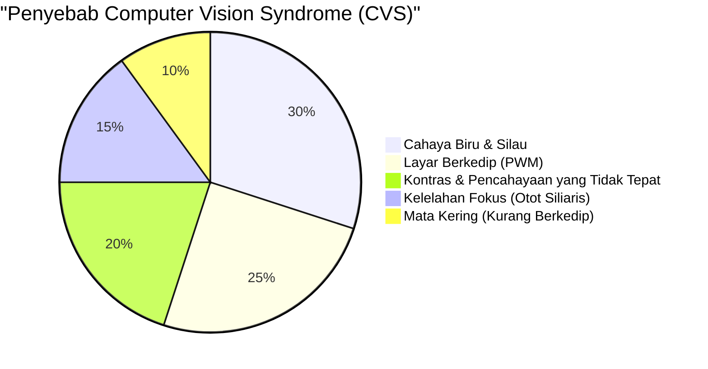
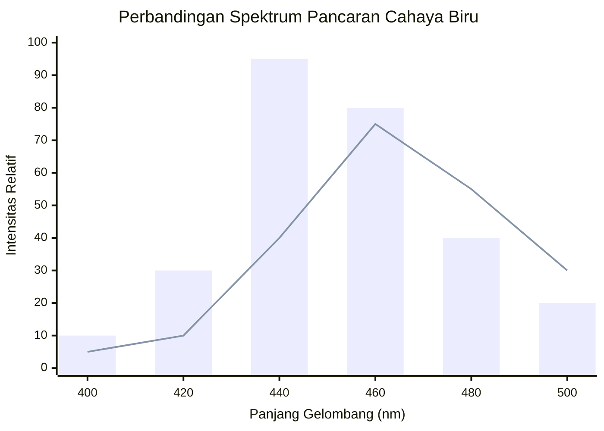
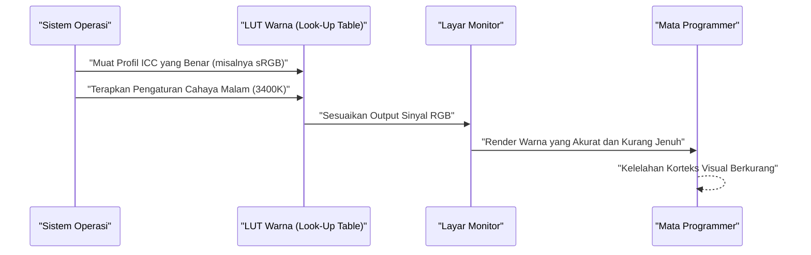
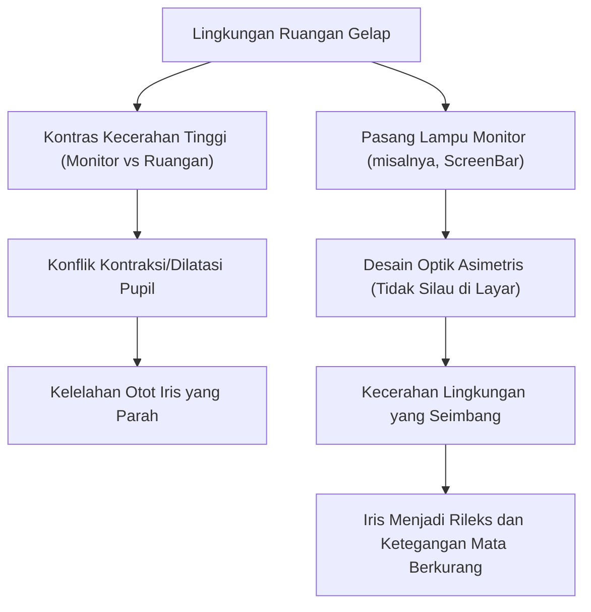

Bagi programmer dan software engineer, "mata" adalah alat kerja yang paling penting sekaligus paling sering dipaksa bekerja keras. Dalam kehidupan sehari-hari di mana kita menghabiskan 8 hingga 10 jam, terkadang lebih, menatap layar editor, terminal, dan browser, hampir semua engineer menghadapi "Ketegangan Mata (Computer Vision Syndrome: CVS)".

Secara umum, penanganan untuk ketegangan mata sering kali hanya sebatas saran superfisial seperti "menggunakan obat tetes mata", "beristirahat secukupnya", atau "memakai kacamata anti radiasi (blue light)". Namun, sebagai seorang engineer, kita harus mengidentifikasi akar permasalahan (Root Cause) dan melakukan optimalisasi dari lapisan sistem (lingkungan).

Pada artikel ini, kita akan membedah secara menyeluruh mekanisme ketegangan mata programmer dari sudut pandang fisika (optik), biokimia, ergonomi, dan arsitektur perangkat keras layar, serta mendalami pengaturan monitor dan gadget pamungkas untuk menguranginya, lengkap dengan rumus dan ilustrasi.

---

# Bab 1: Mengungkap Mekanisme Ketegangan Mata (CVS) Melalui Fisika dan Biokimia

Computer Vision Syndrome (CVS) tidak disebabkan oleh satu faktor saja. Seperti yang ditunjukkan pada diagram lingkaran di bawah ini, berbagai elemen saling terkait secara kompleks sehingga berujung pada kelelahan mata, rasa sakit, mata kering, dan kelelahan tubuh secara keseluruhan.



Di sini, kita akan menjelaskan secara khusus tentang "karakteristik fisik cahaya" dan "fungsi penyesuaian fokus bola mata" yang memiliki pengaruh besar.

## 1.1 Karakteristik Fisik Cahaya Biru dan Energi Foton

Cahaya biru (blue light) yang dipancarkan dari layar kira-kira berada pada rentang panjang gelombang $400 \text{ nm} \sim 490 \text{ nm}$. Mengapa ini membebani mata dapat dijelaskan dengan dasar mekanika kuantum yaitu "Hubungan Planck-Einstein".

Energi $E$ yang dimiliki oleh cahaya dinyatakan dengan rumus berikut:

$$ E = h\nu = \frac{hc}{\lambda} $$

Di sini, setiap variabel memiliki arti sebagai berikut:
- $E$ : Energi per satu foton (Joule)
- $h$ : Konstanta Planck ($6.626 \times 10^{-34} \text{ J}\cdot\text{s}$)
- $c$ : Kecepatan cahaya dalam ruang hampa ($3.0 \times 10^8 \text{ m/s}$)
- $\lambda$ : Panjang gelombang cahaya (m)
- $\nu$ : Frekuensi cahaya (Hz)

Fakta penting yang ditunjukkan oleh rumus ini adalah **"Energi cahaya $E$ berbanding terbalik dengan panjang gelombang $\lambda$"**. Artinya, cahaya biru, yang memiliki panjang gelombang terpendek di antara cahaya tampak, memiliki energi yang sangat tinggi. Foton berenergi tinggi ini sulit diserap dan dilemahkan oleh kornea maupun lensa mata, sehingga mencapai bagian dalam retina dan memberikan stres oksidatif yang kuat pada sel-sel fotoreseptor.

## 1.2 Aberasi Kromatik (Chromatic Aberration) dan Pergeseran Titik Fokus

Lebih jauh lagi dari perspektif optik, perbedaan panjang gelombang cahaya menghasilkan perbedaan "indeks bias". Indeks bias $n$ dari suatu medium (di sini seperti lensa mata) bergantung pada panjang gelombang $\lambda$, dan didekati oleh persamaan dispersi Cauchy.

$$ n(\lambda) = B + \frac{C}{\lambda^2} $$

($B, C$ adalah konstanta spesifik medium)

Seperti yang terlihat dari persamaan ini, semakin pendek panjang gelombang $\lambda$ dari cahaya biru, semakin besar indeks bias $n$-nya. Oleh karena itu, bahkan dalam kondisi di mana cahaya merah dan lainnya terfokus dengan sempurna di retina, cahaya biru dibiaskan secara kuat dan membentuk bayangan **di depan retina**.
Ketika otak mengenali "keburaman bayangan akibat cahaya biru (aberasi kromatik)" ini, otak terus menerus mengirimkan perintah ke otot siliaris untuk mencoba menyesuaikan fokus kembali. Inilah faktor utama mengapa otot mata menjadi lelah tanpa kita sadari.

## 1.3 Otot Penyesuai Fokus (Otot Siliaris) dan Persamaan Lensa

Saat kita memfokuskan pandangan pada teks kecil di monitor, di dalam mata, kita menyesuaikan ketebalan lensa mata. Persamaan lensa tipis adalah sebagai berikut:

$$ \frac{1}{f} = \frac{1}{a} + \frac{1}{b} $$

- $f$: Jarak fokus lensa mata
- $a$: Jarak dari mata ke monitor (jarak objek)
- $b$: Jarak dari lensa mata ke retina (jarak bayangan: konstan sekitar $24 \text{ mm}$ pada bola mata orang dewasa)

Selama memprogram, jika jarak dengan monitor $a$ pendek (misalnya: $40 \text{ cm} \sim 50 \text{ cm}$) dan berlangsung lama, untuk membentuk bayangan yang akurat di retina (menjaga $b$ tetap konstan), jarak fokus $f$ harus dipertahankan sangat pendek. Kontraksi otot siliaris yang ekstrem selama berjam-jam membuat otot tersebut menjadi tegang dan kram, menyebabkan ketegangan mata parah yang disertai bahu kaku dan sakit kepala.

---

# Bab 2: Pemilihan Layar Perangkat Keras dan Eliminasi Faktor Kelelahan

Untuk mengurangi kelelahan mata, sebelum mengubah pengaturan perangkat lunak, pertama-tama kita perlu memeriksa dan memperbaiki spesifikasi perangkat keras. Secara khusus, "metode peredupan" (dimming) dan "refresh rate" adalah poin yang tidak boleh dikompromikan.

## 2.1 Kengerian Peredupan PWM: Mengungkap Kedipan Tak Terlihat

Teknologi untuk mengatur kecerahan monitor kristal cair (LCD) atau organik EL (OLED) secara garis besar terbagi menjadi "Peredupan DC (Direct Current)" dan "Peredupan PWM (Pulse-Width Modulation)".

Peredupan PWM adalah teknologi yang mengedipkan LED backlight dengan kecepatan tinggi yang tidak terlihat oleh mata manusia, dan secara artifisial menyesuaikan kecerahan layar berdasarkan rasio "waktu nyala" dan "waktu mati". Kecerahan rata-rata $L$ berdasarkan siklus kerja (Duty Cycle) PWM dinyatakan dengan rumus berikut:

$$ L = L_{max} \times \frac{T_{on}}{T_{on} + T_{off}} \times 100 \ (\%) $$

- $T_{on}$ : Waktu LED menyala
- $T_{off}$ : Waktu LED mati
- $L_{max}$ : Kecerahan maksimum saat puncak

Jika frekuensi peredupan PWM rendah (misalnya: $200 \text{ Hz} \sim 300 \text{ Hz}$), meskipun kita tidak secara sadar merasakan kedipan (flicker) layar, otak dan pupil secara tidak sadar bereaksi terhadap kedipan cahaya, sehingga pupil terus berdilatasi dan berkontraksi. Inilah yang menyebabkan kelelahan ekstrem, sakit kepala, bahkan mual.

**[Cara Mendeteksi PWM dan Solusinya]**
Untuk memeriksa apakah monitor Anda menggunakan peredupan PWM, buka aplikasi kamera ponsel cerdas Anda dan cobalah merekam layar putih monitor (seperti halaman kosong browser) dalam mode "perekaman gerak lambat" (slow-motion). Jika video menunjukkan pola garis-garis hitam (banding) yang bergerak, berarti monitor tersebut menggunakan peredupan PWM frekuensi rendah.
Saat seorang programmer memilih monitor, sangat diwajibkan untuk memilih monitor yang secara jelas menyatakan **"Bebas Kedipan (Peredupan DC)" (Flicker-Free)** dalam lembar spesifikasinya.

## 2.2 Pengaruh Oftalmologi dari Refresh Rate (Hz) dan Motion Blur

Refresh rate adalah nilai (Hz) yang menunjukkan berapa kali monitor menggambar ulang layar dalam satu detik.
Monitor kantor pada umumnya memiliki $60 \text{ Hz}$, tetapi belakangan ini monitor dengan refresh rate tinggi seperti $120 \text{ Hz}$ atau $144 \text{ Hz}$ mulai populer. Hal ini tidak hanya menguntungkan bagi para gamer, tetapi juga sangat bermanfaat bagi programmer.

Saat menggulir (scroll) banyak kode atau melihat banyak log yang mengalir di terminal, batas kecepatan respons piksel pada layar $60 \text{ Hz}$ akan menyebabkan terjadinya "motion blur (bayangan/jejak pergerakan)". Selama menggulir, mata secara tidak sadar terus mencoba menangkap bentuk teks dan memfokuskannya; jika teks terlihat kabur, beban pemrosesan korteks visual otak akan melonjak tajam.
Dengan layar berspesifikasi $120 \text{ Hz}$ atau lebih, teks yang digulir dapat terlihat jelas, sehingga sangat mengurangi beban pergerakan mata bawah sadar dan penyesuaian fokus ini.

## 2.3 Jenis Panel dan Rasio Kontras (IPS, VA, OLED)

Rasio kontras layar berdampak langsung pada keterbacaan teks.
"Hukum Weber-Fechner", yang menyatakan bahwa intensitas sensasi manusia sebanding dengan logaritma intensitas stimulus, dinyatakan dengan rumus berikut:

$$ p = k \ln \left( \frac{S}{S_0} \right) $$

（$p$: Intensitas sensasi, $S$: Besaran fisik stimulus, $S_0$: Ambang batas absolut, $k$: Konstanta）

Artinya, mata manusia merespons lebih kuat terhadap "rasio kecerahan relatif (kontras)" daripada kecerahan absolut.
Saat membaca kode yang menggunakan penyorotan sintaks (syntax highlighting) untuk waktu yang lama, panel VA (contoh $3000:1$) dengan warna hitam pekat (rasio kontras tinggi), atau panel OLED ($1.000.000:1$ ke atas) yang dapat mematikan per piksel secara total, akan membuat garis luar teks sangat jelas dan meningkatkan keterbacaan.
Namun, seperti yang akan dibahas nanti, menatap layar dengan kontras sangat tinggi di ruangan gelap gulita akan membuat pupil berkontraksi secara berlebihan dan justru menyebabkan kelelahan, sehingga keseimbangan dengan cahaya sekitar menjadi hal yang mutlak.

Grafik di bawah ini membandingkan citra spektrum pancaran cahaya dari monitor LCD standar dan OLED (dengan desain pengurangan cahaya biru) yang baru-baru ini menarik perhatian.



---

# Bab 3: Kalibrasi Monitor dan Pengaturan OS / Perangkat Lunak

Manajemen ruang warna dari sisi OS dan kalibrasi adalah hal yang sama pentingnya dengan pemilihan perangkat keras.

## 3.1 Jebakan Gamut Warna (sRGB vs DCI-P3) dan Profil ICC

Monitor baru-baru ini sering kali menjadikan "gamut warna luas" seperti cakupan DCI-P3 95% atau lebih sebagai nilai jual, namun hal ini justru dapat menjadi bumerang dalam penggunaan pemrograman.
Di lingkungan Windows, jika monitor dengan gamut warna luas digunakan tanpa menerapkan profil ICC (profil warna yang ditetapkan oleh International Color Consortium) yang tepat, penyorotan sintaks VS Code yang dirancang untuk sRGB standar (misalnya warna peringatan merah dan hijau) akan ditampilkan dalam warna-warni yang sangat mencolok dan tidak wajar (kondisi terlalu jenuh/oversaturated).
Warna-warna intens ini memberikan stimulasi yang kuat pada mata, sehingga sangat disarankan untuk menginstal profil ICC yang benar dari pengaturan layar OS, atau beralih ke mode "Emulasi sRGB" pada pengaturan OSD monitor.

Diagram urutan di bawah ini menunjukkan proses hingga profil ICC yang benar diterapkan dan warna yang ramah mata berhasil dirender.



## 3.2 Solusi Perangkat Lunak (f.lux / Night Light)

Sebagai penangkal cahaya biru, perangkat lunak yang mengubah suhu warna (Color Temperature) secara dinamis menyesuaikan waktu adalah cara yang paling mudah dan efektif.
- Windows: **Night Light (Mode Malam)**
- macOS: **Night Shift**
- Pihak Ketiga: **f.lux**

Suhu warna dinyatakan dalam Kelvin ($\text{K}$). Cahaya matahari siang hari berada di sekitar $5500\text{K} \sim 6500\text{K}$ (cahaya putih kebiruan); jika mata terus-menerus terpapar cahaya ini, sekresi "melatonin (hormon tidur)" pada kelenjar pineal di otak akan terhambat.
Setelah sore hari, menggunakan perangkat lunak semacam ini untuk menurunkan suhu warna hingga $3400\text{K} \sim 1900\text{K}$ (warna hangat seperti oranye hingga merah) akan mengurangi jumlah emisi cahaya biru secara fisik. Hal ini dapat menjaga ritme sirkadian (jam biologis) agar tetap normal, sekaligus mencegah sampainya foton berenergi tinggi ke bola mata.

---

# Bab 4: Solusi Perangkat Keras Pamungkas: Pengenalan Gadget Terbaru

Jika langkah-langkah yang dijelaskan sejauh ini belum mampu menghilangkan rasa lelah Anda, investasi pada gadget eksternal untuk mengubah lingkungan secara drastis diperlukan.

## 4.1 Bias Lighting dan Lampu Gantung Monitor (ScreenBar)

Menatap layar monitor yang terang di ruangan yang gelap menciptakan perbedaan kontras yang ekstrem antara bagian tengah bidang pandang (kecerahan tinggi) dan bagian tepinya (kecerahan rendah). Hal ini disebut **"Silau yang Tidak Nyaman (Discomfort Glare)"**.
Dalam lingkungan seperti ini, mata berada dalam kondisi yang saling bertentangan—membuka pupil untuk memasukkan cahaya sekaligus menutup pupil karena silau dari tengah—sehingga otot iris menjadi sangat lelah.

Solusi untuk ini adalah "Bias Lighting".
Yang sangat direkomendasikan adalah "lampu gantung monitor" (Monitor Light Bar) seperti **BenQ ScreenBar**.



Fitur terbesar ScreenBar ada pada "Desain Optik Asimetris (Asymmetrical Optical Design)". Melalui pelat reflektor dan lensa khusus, alat ini tidak menyinari layar monitor itu sendiri (mencegah pantulan/silau pada layar), dan hanya menerangi keyboard di tangan serta ruang di belakang monitor secara merata. Ini secara drastis mengurangi perbedaan kecerahan (rasio kontras) di seluruh bidang pandang, sehingga beban pada mata pun hilang.

## 4.2 Pergeseran Paradigma Layar E-Ink (Dasung & Boox)

Dalam membaca referensi API yang panjang, buku-buku teknis (PDF), maupun kode, yang dapat disebut sebagai solusi modern pamungkas adalah **menjadikan "Layar E-Ink (Kertas Elektronik)" sebagai sub-monitor**.

Berbeda dengan LCD dan OLED, E-Ink tidak memiliki lampu latar (backlight) yang memancarkan cahaya sendiri. Layar ini menampilkan teks dengan memantulkan cahaya sekitar, dengan memindahkan partikel pigmen hitam dan putih bermuatan (seperti titanium dioksida) di dalam kapsul menggunakan tegangan (metode elektroforesis).
- **Jumlah pancaran cahaya biru secara fisik: Nol**
- **Kedipan akibat PWM atau penyegaran layar (refresh): Benar-benar nol**

Jika Anda menempatkan monitor E-Ink seperti seri **Dasung Paperlike** (misalnya 25,3 inci) atau **Onyx Boox Mira** secara vertikal (portrait) sebagai sub-monitor khusus teks, Anda bisa membaca dokumen dengan sensasi yang sama persis seperti membaca bahan cetak di atas kertas.
Meskipun memiliki kelemahan berupa penundaan penggambaran layar (refresh rate rendah), untuk kebutuhan khusus "membaca teks statis" dalam lingkungan pemrograman, tidak ada lagi perangkat keras di muka bumi ini yang lebih ramah di mata daripada ini.

---

# Bab 5: Ergonomi dan Aturan Penggunaan

Sebaik apa pun perangkat keras yang dikumpulkan, itu tidak akan ada artinya jika postur tubuh manusia dan aturan pengoperasiannya salah.

## 5.1 Dinamika Fluida Mata Kering dan Sudut Pandang

Mata kering tidak hanya memberi rasa tidak nyaman "mata kering", tetapi kerusakan pada lapisan air mata di permukaan kornea akan menyebabkan cahaya terpantul tidak beraturan dan membuat penglihatan kabur. Pada akhirnya, ini menciptakan lingkaran setan dengan memicu kelelahan mata lebih lanjut (kerja paksa pada otot siliaris).
Jumlah penguapan air mata sebanding dengan luas permukaan bola mata yang terpapar udara (luas fisura palpebra).

Sudut pandang $\theta$ untuk penempatan monitor yang ideal dikatakan $15^\circ \sim 20^\circ$ ke bawah dari garis horizontal.
Jika jarak horizontal dari pusat monitor ke mata adalah $d$, dan perbedaan tinggi antara pusat monitor dengan tinggi mata adalah $h$, maka berlaku fungsi trigonometri berikut:

$$ \tan \theta = \frac{h}{d} $$

Misalnya, jika jarak dari monitor $d$ adalah $60 \text{ cm}$ (lingkungan meja pada umumnya), untuk mendapatkan $\theta = 15^\circ$:

$$ h = 60 \times \tan(15^\circ) \approx 60 \times 0.267 = 16.02 \text{ cm} $$

Artinya, **sangat ideal jika pusat monitor berada sekitar $16 \text{ cm}$ lebih rendah dari tinggi mata**.
Dengan pandangan yang sedikit menunduk ke bawah, kelopak mata atas akan turun secara alami, sehingga luas paparan bola mata berkurang dan penguapan air mata dapat dicegah secara drastis. Pertimbangkanlah untuk memakai lengan monitor (monitor arm) (seperti Ergotron) dan aturlah tinggi ini secara akurat hingga satuan milimeter.

## 5.2 Penerapan dan Otomatisasi "Aturan 20-20-20" Standar Dunia

Metode pemulihan kelelahan mata saat menggunakan perangkat digital yang direkomendasikan oleh American Academy of Ophthalmology (AAO) dan dokter mata di seluruh dunia adalah **"Aturan 20-20-20"**.

**"Setiap 20 menit, tatap sesuatu sejauh minimal 20 kaki (sekitar 6 meter) selama 20 detik."**

Melalui tindakan sederhana ini, otot siliaris yang mengalami kontraksi ekstrem dipaksa untuk relaksasi, lensa mata menjadi tipis, dan fungsi penyesuaian fokus direset kembali.
Karena programmer sering kali lupa waktu ketika memasuki kondisi flow, solusi khas dari seorang engineer adalah membuat mekanisme untuk memaksa aturan ini dijalankan secara otomatis.
Di bawah ini adalah contoh skrip yang sangat sederhana menggunakan `tkinter` di Python untuk menampilkan popup paksa setiap 20 menit.

```python
import time
import tkinter as tk
from tkinter import messagebox

def remind_20_20_20():
    # Sembunyikan jendela utama
    root = tk.Tk()
    root.withdraw()
    
    while True:
        # Tunggu selama 20 menit (1200 detik)
        time.sleep(20 * 60)
        
        # Tampilkan kotak dialog peringatan di paling depan
        messagebox.showinfo(
            title="Aturan 20-20-20",
            message="Alihkan pandangan dari layar, dan tataplah benda 6 meter ke depan selama 20 detik!\n(Relaksasikan otot siliaris Anda)"
        )
        
        # 20 detik untuk relaksasi
        time.sleep(20)

if __name__ == '__main__':
    # Jalankan di latar belakang
    remind_20_20_20()
```

Dengan mendaftarkan skrip semacam ini ke aplikasi startup atau menjalankannya lewat Penjadwal Tugas OS (Task Scheduler) atau Cron, Anda dapat menyematkan siklus pemulihan paksa ke dalam rutinitas Anda.

---

# Penutup: Mengatasi Ketegangan Mata Sebagai Investasi Masa Depan

Karier kita sebagai software engineer bisa berlangsung hingga puluhan tahun. Yang menopang karier tersebut bukanlah keyboard yang mahal atau CPU terbaru, melainkan jelas tidak lain adalah "mata" dan "otak" kita sendiri.

1. **Memahami beban fisik dari penyesuaian fokus dan energi cahaya ($E = hc/\lambda$)**
2. **Mengenalkan monitor dengan refresh rate tinggi dan Bebas Kedipan (Flicker-Free/Peredupan DC)**
3. **Mengoptimalkan kontras relatif lingkungan dengan Bias Lighting seperti ScreenBar**
4. **Mempertimbangkan monitor E-Ink sebagai perangkat pembaca teks yang paling pamungkas**
5. **Menggunakan lengan monitor untuk menciptakan sudut pandang optimal berdasarkan $\tan \theta = h/d$ dan mensistemasikan "Aturan 20-20-20"**

Langkah-langkah ini mungkin membutuhkan biaya atau upaya yang bersifat sementara, tetapi ini dapat disebut sebagai "investasi teknis" dengan efektivitas biaya (cost-effectiveness) terbaik yang memaksimalkan produktivitas seumur hidup dan QOL (kualitas hidup) Anda, serta memperpanjang umur sehat pada mata. Mari tinjau kembali lingkungan pengembangan Anda saat ini juga dan cobalah untuk mengimplementasikan kepedulian terhadap mata Anda.
