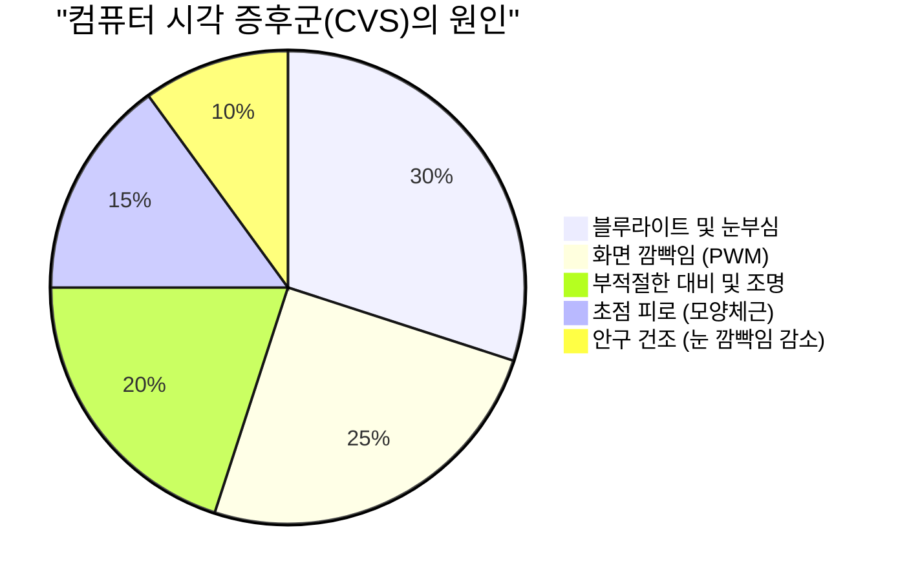
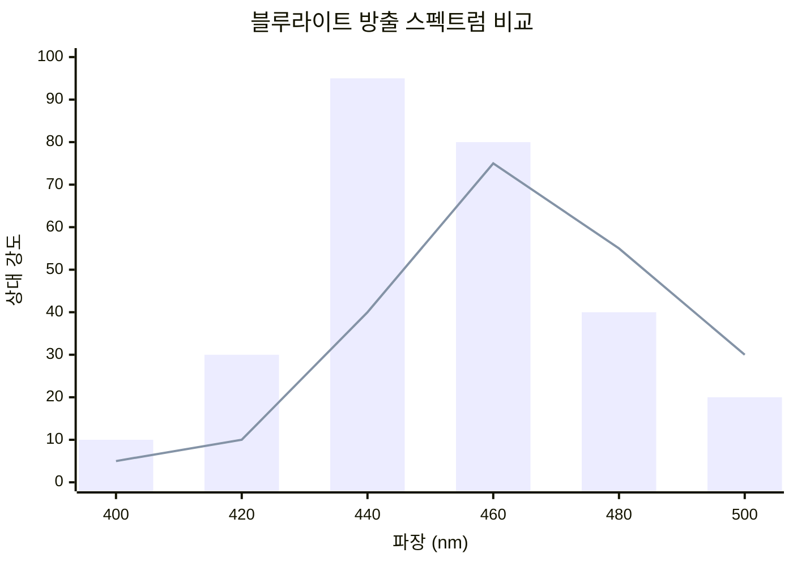
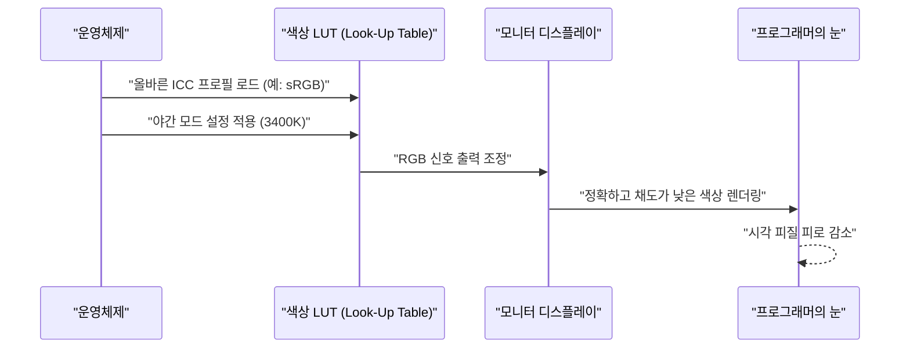
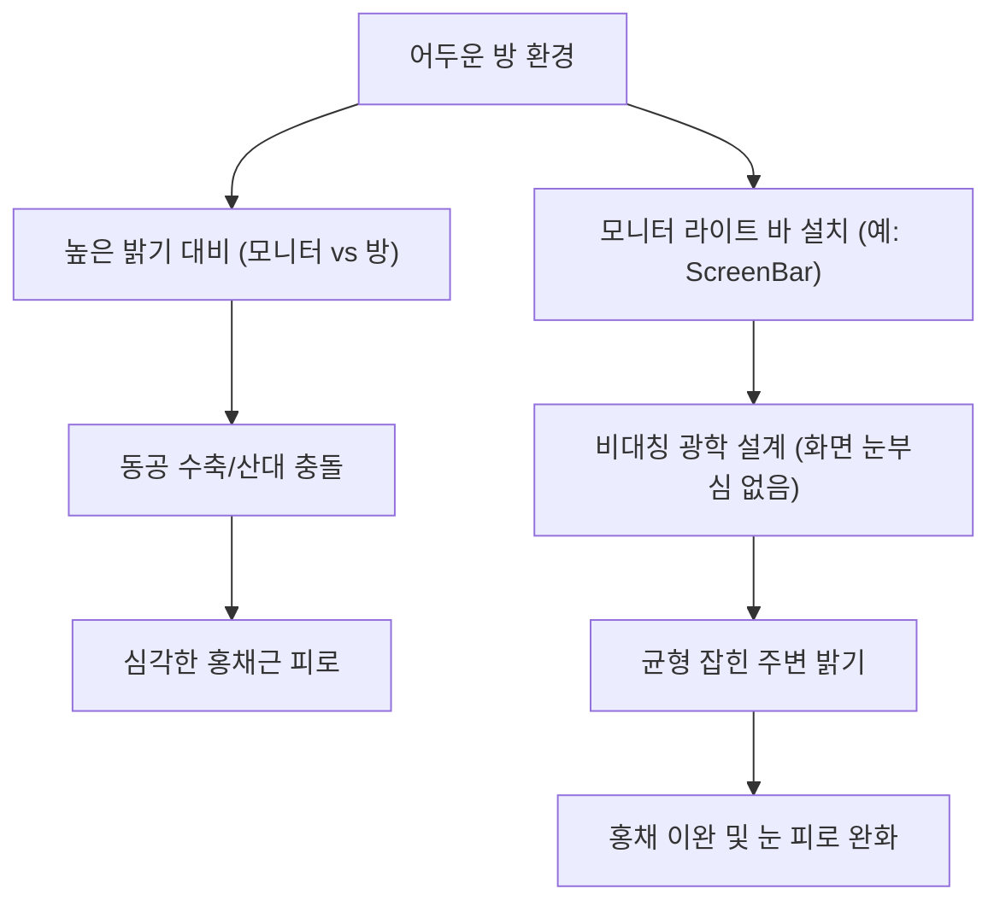

프로그래머나 소프트웨어 엔지니어에게 '눈'은 가장 중요하면서도 혹사당하는 작업 도구입니다. 매일 8시간에서 10시간, 때로는 그 이상의 시간을 에디터나 터미널, 브라우저 화면과 마주하는 생활 속에서, 거의 모든 엔지니어가 직면하는 것이 '눈 피로(안정피로, Computer Vision Syndrome: CVS)'입니다.

일반적으로 눈 피로에 대한 대책이라고 하면 '안약을 넣는다', '적당히 휴식을 취한다', '블루라이트 차단 안경을 쓴다'와 같은 표면적인 조언에 그치기 쉽습니다. 하지만 엔지니어라면 문제의 근본 원인(Root Cause)을 특정하고, 시스템(환경) 계층에서 최적화를 도모해야 합니다.

본 문서에서는 물리학(광학), 생화학, 인간공학, 그리고 디스플레이의 하드웨어 아키텍처 관점에서 프로그래머의 눈 피로 메커니즘을 철저하게 해부하고, 이를 경감하기 위한 궁극적인 모니터 설정 및 기기에 대해 수식과 도해를 섞어 깊이 있게 살펴보겠습니다.

---

# 제1장: 눈 피로(CVS) 메커니즘을 물리와 생화학으로 풀어내기

컴퓨터 시각 증후군(CVS)은 단일 요인으로 발생하는 것이 아닙니다. 아래의 원그래프에서 보여주듯이 다양한 요소가 복잡하게 얽혀 눈의 피로, 통증, 안구 건조증, 그리고 전신 피로감으로 이어집니다.



여기서는 특히 영향이 큰 '빛의 물리적 특성'과 '안구의 초점 조절 기능'에 대해 설명합니다.

## 1.1 블루라이트의 물리적 특성과 광자 에너지

디스플레이에서 방출되는 블루라이트(청색광)는 대략 $400 \text{ nm} \sim 490 \text{ nm}$ 의 파장대에 위치합니다. 이것이 왜 눈에 부담을 주는지 양자역학의 기초인 '플랑크-아인슈타인 관계식'으로 설명할 수 있습니다.

빛이 가진 에너지 $E$ 는 다음 수식으로 표현됩니다.

$$ E = h\nu = \frac{hc}{\lambda} $$

여기서 각 변수는 다음 의미를 갖습니다.
- $E$ : 광자(포톤) 1개당 에너지 (Joule)
- $h$ : 플랑크 상수 ($6.626 \times 10^{-34} \text{ J}\cdot\text{s}$)
- $c$ : 진공 중의 빛의 속도 ($3.0 \times 10^8 \text{ m/s}$)
- $\lambda$ : 빛의 파장 (m)
- $\nu$ : 빛의 진동수 (Hz)

이 수식이 보여주는 중요한 사실은 **"빛의 에너지 $E$ 는 파장 $\lambda$ 에 반비례한다"**는 것입니다. 즉, 가시광선 중에서 가장 파장이 짧은 블루라이트는 매우 높은 에너지를 가지고 있습니다. 이 고에너지 광자는 각막이나 수정체에서 흡수·감쇠되기 어려워 망막 깊숙한 곳까지 도달하여, 시세포에 강력한 산화 스트레스를 줍니다.

## 1.2 색수차(Chromatic Aberration)와 초점의 어긋남

나아가 광학적 관점에서 보면, 빛의 파장 차이는 '굴절률'의 차이를 만들어냅니다. 매질(여기서는 수정체 등)의 굴절률 $n$ 은 파장 $\lambda$ 에 의존하며, 코시의 분산 공식에 의해 근사됩니다.

$$ n(\lambda) = B + \frac{C}{\lambda^2} $$

($B, C$ 는 매질 고유의 상수)

이 공식에서 알 수 있듯이, 파장 $\lambda$ 가 짧은 블루라이트일수록 굴절률 $n$ 이 커집니다. 따라서 적색광 등이 망막 위에 정확히 초점을 맺는 상태라 하더라도, 블루라이트는 크게 굴절되어 **망막 앞쪽**에 상을 맺어 버립니다.
뇌는 이 '블루라이트에 의한 상의 흐릿함(색수차)'을 인식하면, 끊임없이 초점을 다시 맞추도록 모양체근에 지속적으로 명령을 내립니다. 이것이 무의식중에 눈 근육이 피로해지는 큰 요인입니다.

## 1.3 초점 조절 근육(모양체근)과 렌즈 공식

우리가 모니터 상의 미세한 텍스트에 초점을 맞출 때, 눈 안에서는 수정체(렌즈)의 두께를 조절합니다. 얇은 렌즈의 공식은 다음과 같습니다.

$$ \frac{1}{f} = \frac{1}{a} + \frac{1}{b} $$

- $f$: 수정체의 초점 거리
- $a$: 눈에서 모니터까지의 거리(물체 거리)
- $b$: 수정체에서 망막까지의 거리(상 거리: 성인의 안구에서는 약 $24 \text{ mm}$ 로 일정)

프로그래밍 중 모니터와의 거리 $a$ 가 짧은 상태(예: $40 \text{ cm} \sim 50 \text{ cm}$)가 오랫동안 지속되면, 망막 위에 정확한 상을 맺기( $b$ 를 일정하게 유지하기) 위해 초점 거리 $f$ 를 극단적으로 짧게 유지해야 합니다. 모양체근이 극도로 수축된 상태가 몇 시간이나 계속되면서 근육은 경련 상태에 빠지고, 어깨 결림이나 두통을 동반한 극심한 눈 피로를 유발합니다.

---

# 제2장: 하드웨어 디스플레이 선정과 피로 요인 배제

눈의 피로를 줄이기 위해서는 소프트웨어 설정에 앞서 먼저 하드웨어 사양을 확인하고 개선할 필요가 있습니다. 특히 '디밍(조광) 방식'과 '주사율(재생률)'은 타협해서는 안 될 포인트입니다.

## 2.1 PWM 디밍의 공포: 보이지 않는 플리커 파헤치기

LCD(액정)나 OLED(유기 EL) 모니터의 밝기를 조절하는 기술에는 크게 'DC(Direct Current) 디밍'과 'PWM(Pulse-Width Modulation) 디밍'이 있습니다.

PWM 디밍은 백라이트의 LED를 인간의 눈에 보이지 않을 정도로 고속으로 점멸시켜, 그 '점등 시간'과 '소등 시간'의 비율에 의해 화면 밝기를 유사하게 조절하는 기술입니다. PWM의 듀티비(Duty Cycle)에 따른 평균 휘도 $L$ 은 다음 식으로 표현됩니다.

$$ L = L_{max} \times \frac{T_{on}}{T_{on} + T_{off}} \times 100 \ (\%) $$

- $T_{on}$ : LED가 점등되어 있는 시간
- $T_{off}$ : LED가 소등되어 있는 시간
- $L_{max}$ : 피크 시 최대 휘도

PWM 디밍의 주파수가 낮을(예: $200 \text{ Hz} \sim 300 \text{ Hz}$) 경우, 의식적으로는 화면의 깜빡임(플리커)을 느끼지 못하더라도 뇌나 동공은 빛의 점멸에 무의식적으로 반응하여 동공의 산대와 수축을 반복합니다. 이것이 극심한 피로, 두통, 나아가 구역질을 유발합니다.

**【PWM 감지 방법과 대책】**
자신의 모니터가 PWM 디밍인지 확인하려면, 스마트폰의 카메라 앱을 실행해 '슬로우 모션 촬영' 모드로 모니터의 흰 화면(브라우저의 빈 페이지 등)을 촬영해 보세요. 영상에 검은 줄무늬(밴딩)가 이동하는 모습이 찍힌다면, 그 모니터는 저주파수 PWM 디밍을 채택하고 있는 것입니다.
프로그래머가 모니터를 선택할 때는 사양서에 **"플리커 프리(DC 디밍)"**라고 명시되어 있는 제품을 절대적으로 골라야 합니다.

## 2.2 주사율(Hz)과 모션 블러의 안과학적 영향

주사율(재생률)이란 모니터가 1초에 화면을 몇 번 다시 그리는지를 나타내는 수치(Hz)입니다.
일반적인 사무용 모니터는 $60 \text{ Hz}$ 이지만, 최근에는 $120 \text{ Hz}$ 나 $144 \text{ Hz}$ 의 고주사율 모니터가 보급되고 있습니다. 이는 게이머뿐만 아니라 프로그래머에게도 매우 유익합니다.

대량의 코드를 스크롤하거나 터미널에 대량의 로그가 흐를 때, $60 \text{ Hz}$ 디스플레이에서는 픽셀 응답 속도의 한계까지 더해져 '모션 블러(잔상)'가 발생합니다. 눈은 스크롤 중에도 무의식적으로 텍스트의 형태를 파악하려고 초점을 계속 맞추려 하지만, 글자가 흔들리면 뇌의 시각 피질의 처리 부하가 급격하게 치솟습니다.
$120 \text{ Hz}$ 이상의 디스플레이라면 스크롤 중인 텍스트도 뚜렷하게 알아볼 수 있어, 이 무의식적인 안구 운동과 초점 조절 부하를 크게 줄일 수 있습니다.

## 2.3 패널 방식과 명암비(IPS, VA, OLED)

화면의 명암비(대비)는 텍스트의 가독성과 직결됩니다.
인간의 감각량은 자극의 로그에 비례한다는 '베버-페히너의 법칙'은 다음 수식으로 표현됩니다.

$$ p = k \ln \left( \frac{S}{S_0} \right) $$

($p$: 감각량, $S$: 자극의 물리량, $S_0$: 임계값, $k$: 상수)

즉, 인간의 눈은 절대적인 밝기보다 '상대적인 밝기 비율(대비)'에 강하게 반응합니다.
구문 강조(Syntax Highlight) 처리된 코드를 장시간 읽을 때, 검은색이 깊게 표현되는(명암비가 높은) VA 패널($3000:1$)이나 픽셀 단위로 완전히 끌 수 있는 OLED 패널($1,000,000:1$~)은 글자의 윤곽선을 매우 선명하게 만들어 가독성을 높입니다.
하지만 뒤에서 언급하겠지만, 아주 어두운 방에서 극단적으로 높은 대비의 화면을 보면 동공이 너무 수축해 오히려 피로해지므로, 주변광과의 균형이 필수적입니다.

아래 차트는 표준적인 LCD 모니터와 최근 주목받는 OLED(블루라이트 저감 설계)의 발광 스펙트럼 이미지를 비교한 것입니다.



---

# 제3장: 모니터 캘리브레이션과 OS 및 소프트웨어 설정

하드웨어 선정 못지않게 중요한 것이 OS 측의 색 공간 관리와 캘리브레이션입니다.

## 3.1 색역(sRGB vs DCI-P3)의 함정과 ICC 프로필

최근 모니터들은 DCI-P3 커버리지 95% 이상 등 '광색역'을 내세우고 있지만, 이것이 프로그래밍 용도에서는 오히려 독이 될 수 있습니다.
Windows 환경에서 적절한 ICC 프로필(International Color Consortium에서 정한 컬러 프로필)을 적용하지 않고 광색역 모니터를 사용하면, 표준적인 sRGB로 지정된 VS Code의 구문 강조(예: 빨간색이나 초록색의 경고 색상)가 부자연스러울 정도로 매우 짙고 화려하게(과포화 상태로) 표시됩니다.
이 강렬한 색상은 눈에 강한 자극을 주므로, OS 디스플레이 설정에서 올바른 ICC 프로필을 설치하거나 모니터 측 OSD 설정에서 'sRGB 에뮬레이션 모드'로 전환할 것을 강력히 권장합니다.

아래 시퀀스 다이어그램은 올바른 ICC 프로필이 적용되어 눈에 편안한 색상이 렌더링되기까지의 프로세스를 보여줍니다.



## 3.2 소프트웨어를 통한 대책(f.lux / 야간 모드)

블루라이트 대책으로 가장 간편하고 효과적인 것이 색온도(Color Temperature)를 시간대에 맞춰 동적으로 변경하는 소프트웨어입니다.
- Windows: **야간 모드(Night Light)**
- macOS: **Night Shift**
- 서드파티: **f.lux**

색온도는 켈빈($\text{K}$)으로 표시됩니다. 낮 동안의 태양광은 대략 $5500\text{K} \sim 6500\text{K}$(푸르스름한 빛)이지만, 이것을 눈에 계속 쬐면 뇌의 송과선에서 '멜라토닌(수면 호르몬)' 분비가 억제됩니다.
저녁 이후에는 이러한 소프트웨어를 사용하여 색온도를 $3400\text{K} \sim 1900\text{K}$(따뜻한 계열의 오렌지색~적색)까지 낮춤으로써, 블루라이트 발광량을 물리적으로 줄이고 24시간 주기 리듬(생체 시계)을 정상적으로 유지하는 동시에 안구에 고에너지 광자가 도달하는 것을 막을 수 있습니다.

---

# 제4장: 궁극의 하드웨어 솔루션: 최신 기기 도입

여기까지 설명한 대책으로도 피로가 풀리지 않는다면, 환경을 극적으로 바꾸기 위한 외부 기기에 대한 투자가 필요합니다.

## 4.1 바이어스 라이팅(Bias Lighting)과 모니터 램프(ScreenBar)

방이 어두운 상태에서 밝은 모니터를 바라보면, 시야의 중심부(고휘도)와 주변부(저휘도)에 극심한 명암 차이가 발생합니다. 이를 **'불쾌 글레어(Discomfort Glare)'**라고 부릅니다.
이 환경에서는 눈이 빛을 받아들이려 동공을 여는 동시에, 중심의 눈부심에 대항해 동공을 닫으려는 모순된 상태가 되어 홍채근이 심하게 피로해집니다.

이를 해결하는 것이 '바이어스 라이팅(Bias Lighting)'입니다.
특히 추천하는 것은 **BenQ ScreenBar** 등의 '모니터 램프(모니터 걸이형 라이트)'입니다.



ScreenBar의 가장 큰 특징은 '비대칭 광학 설계(Asymmetrical Optical Design)'에 있습니다. 특수한 반사판과 렌즈를 통해 모니터 화면 자체에는 빛을 비추지 않고(화면 반사 및 눈부심 방지), 키보드가 있는 손과 모니터 뒷면 공간만 균일하고 밝게 비춥니다. 이를 통해 시야 전체의 휘도 차이(명암비)가 극적으로 완화되어 눈에 가해지는 부담이 사라집니다.

## 4.2 E-Ink 디스플레이의 패러다임 전환 (Dasung & Boox)

방대한 API 레퍼런스, 기술 서적(PDF), 혹은 코드를 읽는 작업에 있어, 현대의 궁극적인 솔루션이라 부를 수 있는 것이 **'E-Ink(전자 잉크) 디스플레이'의 서브 모니터 활용**입니다.

E-Ink는 LCD나 OLED와 달리 스스로 빛을 내는 백라이트가 없습니다. 캡슐 안의 전하를 띤 흰색과 검은색 안료 입자(이산화티타늄 등)를 전압으로 이동시켜(전기영동 방식), 주변 환경광을 반사하여 글자를 표시합니다.
- **물리적인 블루라이트 발광량: 제로(0)**
- **PWM이나 주사율에 따른 플리커: 완전히 제로(0)**

**Dasung Paperlike** 시리즈(25.3인치 등)나 **Onyx Boox Mira** 같은 E-Ink 모니터를 세로로 세워 텍스트 전용 서브 모니터로 배치하면, 마치 종이 인쇄물을 읽는 것과 같은 감각으로 문서를 읽을 수 있습니다.
화면 갱신 속도(낮은 주사율)라는 단점은 있지만, 프로그래밍 환경에서의 '정적인 텍스트 읽기' 용도로 한정한다면 이보다 눈에 편안한 기기는 지구상에 존재하지 않습니다.

---

# 제5장: 인체공학(Ergonomics)과 운영 규칙

아무리 훌륭한 하드웨어를 갖추더라도, 그것을 사용하는 사람의 자세나 규칙이 잘못되었다면 아무 소용이 없습니다.

## 5.1 안구 건조의 유체 역학과 시선 각도

안구 건조는 단순히 '눈이 뻑뻑하다'는 불쾌감뿐만 아니라, 각막 표면의 눈물막이 파괴됨으로써 빛이 난반사되고 시야가 흐려져, 결과적으로 더 심한 눈 피로(모양체근 혹사)를 유발하는 악순환을 낳습니다.
눈물의 증발량은 공기와 닿아 있는 안구의 표면적(안열 면적)에 비례합니다.

이상적인 모니터 배치의 시선 각도 $\theta$ 는 수평선에서 아래로 $15^\circ \sim 20^\circ$ 라고 알려져 있습니다.
모니터 중심에서 눈까지의 수평 거리를 $d$, 모니터 중심과 눈 높이의 고저차를 $h$ 라고 할 때, 다음과 같은 삼각함수가 성립합니다.

$$ \tan \theta = \frac{h}{d} $$

예를 들어 모니터와의 거리 $d$ 가 $60 \text{ cm}$(일반적인 데스크 환경)일 때, $\theta = 15^\circ$ 로 하려면:

$$ h = 60 \times \tan(15^\circ) \approx 60 \times 0.267 = 16.02 \text{ cm} $$

즉, **모니터의 중심은 눈 높이보다 약 $16 \text{ cm}$ 아래에 있는 것이 이상적**입니다.
시선이 살짝 아래를 향함으로써 윗눈꺼풀이 자연스럽게 내려가 안구의 노출 면적이 감소하므로, 눈물의 증발을 극적으로 막을 수 있습니다. 모니터 암(어고트론 등)을 도입하여 이 높이를 밀리미터 단위로 정확하게 세팅하십시오.

## 5.2 세계 표준 '20-20-20 규칙'의 철저한 준수와 자동화

미국안과학회(AAO)나 전 세계 안과의사들이 권장하는 디지털 기기 사용 시 눈 피로 회복법이 **'20-20-20 규칙'**입니다.

**『20분마다, 20피트(약 6미터) 이상 먼 곳을, 20초 동안 바라본다』**

이 단순한 동작을 통해 극도로 수축해 있던 모양체근이 강제로 이완(릴랙스)되고, 수정체가 얇아져 초점 조절 기능이 초기화됩니다.
프로그래머는 몰입(Flow) 상태에 들어가면 시간 가는 줄 모르기 때문에, 이 규칙을 강제하는 시스템을 자동으로 구축하는 것이 엔지니어다운 해결책입니다.
다음은 Python의 `tkinter` 를 사용하여 20분마다 강제로 팝업을 띄우는 매우 간단한 스크립트 예제입니다.

```python
import time
import tkinter as tk
from tkinter import messagebox

def remind_20_20_20():
    # 메인 창 숨기기
    root = tk.Tk()
    root.withdraw()
    
    while True:
        # 20분(1200초) 대기
        time.sleep(20 * 60)
        
        # 최상단에 경고 대화상자 표시
        messagebox.showinfo(
            title="20-20-20 규칙",
            message="화면에서 눈을 떼고, 6미터 이상 먼 곳을 20초 동안 바라보세요!\n(모양체근을 이완시킵니다)"
        )
        
        # 이완을 위한 20초
        time.sleep(20)

if __name__ == '__main__':
    # 백그라운드에서 실행
    remind_20_20_20()
```

이런 스크립트를 시작 프로그램에 등록하거나, OS 기본 작업 스케줄러(혹은 Cron)를 통해 실행되도록 하면, 강제적인 회복 사이클을 생활 속에 편입시킬 수 있습니다.

---

# 맺음말: 미래를 위한 투자로서의 눈 피로 대책

우리 소프트웨어 엔지니어의 커리어는 수십 년간 이어집니다. 그 커리어를 지탱하는 것은 비싼 키보드나 최신 CPU가 아니라, 틀림없는 내 자신의 '눈'과 '뇌'입니다.

1. **빛의 에너지 ($E = hc/\lambda$) 와 초점 조절의 물리적 부하를 이해한다**
2. **플리커 프리(DC 디밍) 및 고주사율 모니터를 도입한다**
3. **ScreenBar 등 바이어스 라이팅으로 환경의 상대 명암비를 최적화한다**
4. **궁극의 텍스트 열람용 기기로서 E-Ink 모니터를 검토한다**
5. **모니터 암으로 $\tan \theta = h/d$ 에 기반한 최적의 시선 각도를 만들고, '20-20-20 규칙'을 시스템화한다**

이러한 대책들은 일시적인 지출이나 수고를 동반할 수 있지만, 눈의 건강 수명을 늘리고 평생에 걸친 생산성과 삶의 질(QOL)을 극대화하기 위한 가장 비용 효율적인 '기술 투자'라고 할 수 있습니다. 지금 당장 자신의 개발 환경을 재점검하고, 눈에 대한 배려를 구현해 보십시오.
