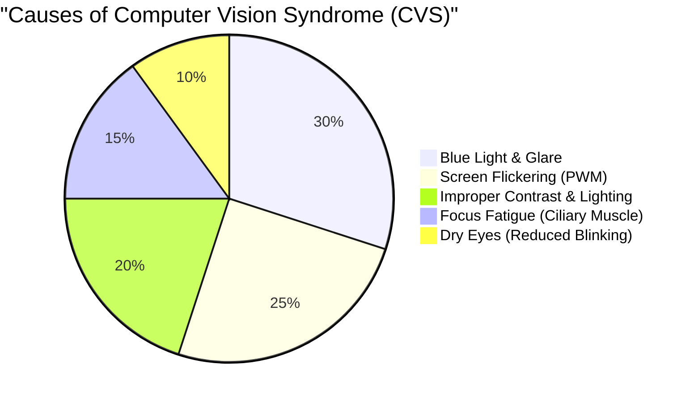
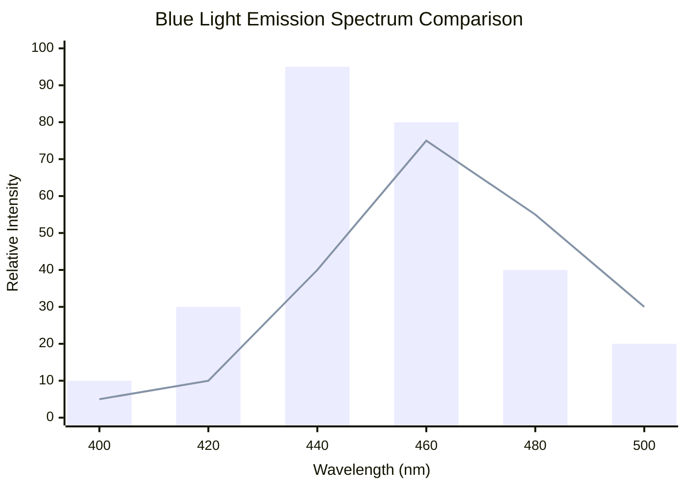
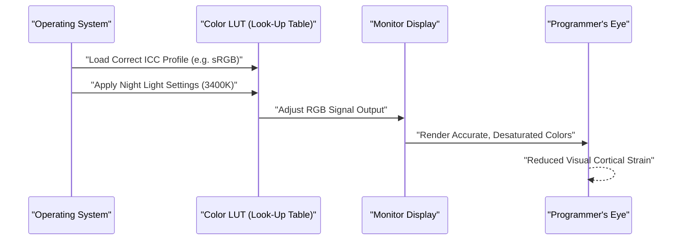
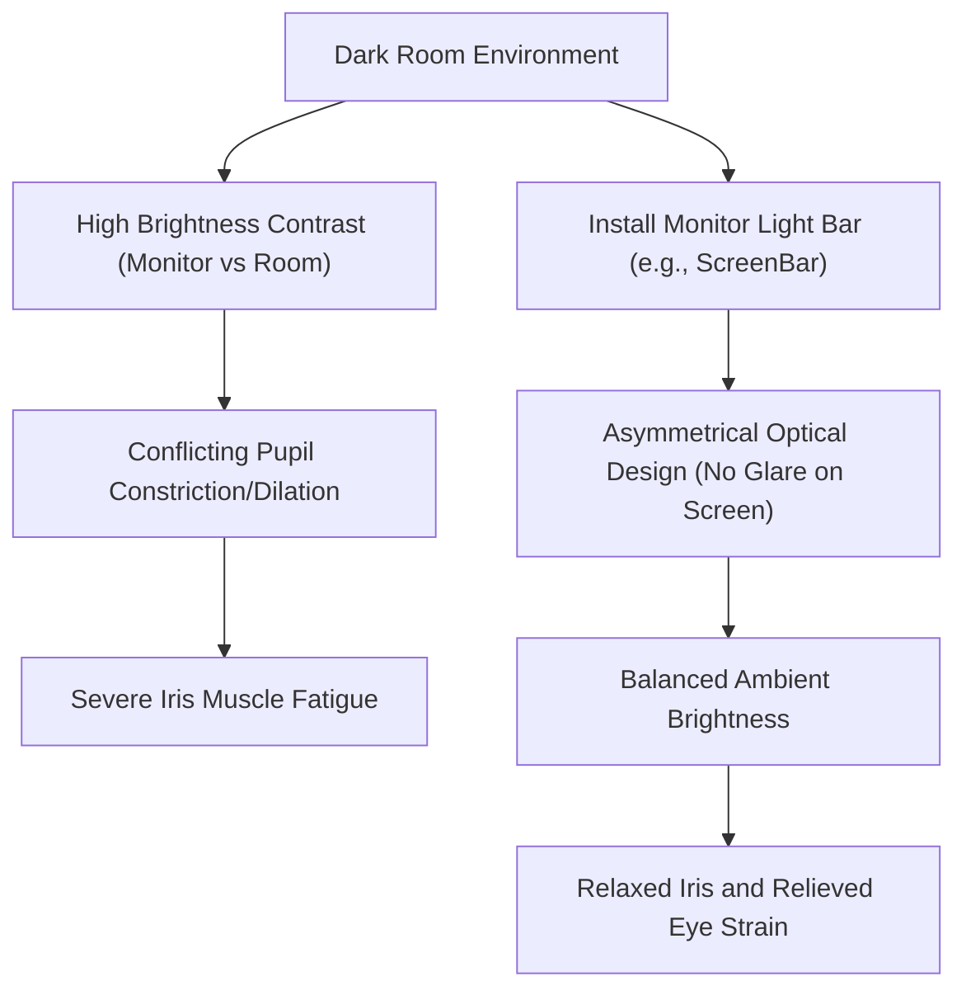

プログラマーやソフトウェアエンジニアにとって、「目」は最も重要かつ酷使される商売道具です。毎日8時間から10時間、時にはそれ以上の時間をエディタやターミナル、ブラウザの画面と向き合い続ける生活の中で、ほぼすべてのエンジニアが直面するのが「眼精疲労（Computer Vision Syndrome: CVS）」です。

一般的に眼精疲労への対策というと「目薬をさす」「適度に休憩をとる」「ブルーライトカットメガネをかける」といった表層的なアドバイスに終始しがちです。しかし、エンジニアたるもの、問題の根本原因（Root Cause）を特定し、システム（環境）のレイヤーから最適化を図るべきです。

本記事では、物理学（光学）、生化学、人間工学、そしてディスプレイのハードウェア・アーキテクチャの観点から、プログラマーの眼精疲労のメカニズムを徹底的に解剖し、それを軽減するための究極のモニター設定およびガジェットについて、数式と図解を交えながら深掘りしていきます。

---

# 第1章：眼精疲労（CVS）のメカニズムを物理と生化学から解き明かす

コンピュータビジョン症候群（CVS）は単一の要因で引き起こされるわけではありません。以下の円グラフに示すように、様々な要素が複雑に絡み合って目の疲れ、痛み、ドライアイ、そして全身の疲労感へと繋がります。



ここでは、特に影響の大きい「光の物理的特性」と「眼球のピント調節機能」について解説します。

## 1.1 ブルーライトの物理的特性と光子エネルギー

ディスプレイから発せられるブルーライト（青色光）は、おおよそ $400 \text{ nm} \sim 490 \text{ nm}$ の波長帯に位置します。これがなぜ目に負担をかけるのかは、量子力学の基礎である「プランク＝アインシュタインの関係式」によって説明できます。

光の持つエネルギー $E$ は、以下の数式で表されます。

$$ E = h\nu = \frac{hc}{\lambda} $$

ここで、各変数は以下の意味を持ちます。
- $E$ : 光子（フォトン）1個あたりのエネルギー (Joule)
- $h$ : プランク定数 ($6.626 \times 10^{-34} \text{ J}\cdot\text{s}$)
- $c$ : 真空中の光の速さ ($3.0 \times 10^8 \text{ m/s}$)
- $\lambda$ : 光の波長 (m)
- $\nu$ : 光の振動数 (Hz)

この数式が示す重要な事実は、**「光のエネルギー $E$ は、波長 $\lambda$ に反比例する」**ということです。つまり、可視光線の中で最も波長が短いブルーライトは、極めて高いエネルギーを持っています。この高エネルギーの光子は、角膜や水晶体で吸収・減衰されにくく、網膜の深部まで到達し、視細胞に強力な酸化ストレスを与えます。

## 1.2 色収差（Chromatic Aberration）と焦点のズレ

さらに光学的な観点から見ると、光の波長の違いは「屈折率」の違いを生み出します。媒質（ここでは水晶体など）の屈折率 $n$ は、波長 $\lambda$ に依存し、コーシーの分散公式によって近似されます。

$$ n(\lambda) = B + \frac{C}{\lambda^2} $$

($B, C$ は媒質固有の定数)

この公式から分かるように、波長 $\lambda$ が短いブルーライトほど屈折率 $n$ が大きくなります。そのため、赤色光などが網膜上にぴったりピントを結ぶ状態であっても、ブルーライトは大きく屈折し、**網膜の手前**で像を結んでしまいます。
脳はこの「ブルーライトによる像のボヤケ（色収差）」を認識すると、絶えずピントを合わせ直そうと毛様体筋へ指令を出し続けます。これが、無意識下で目の筋肉が疲労していく大きな要因です。

## 1.3 ピント調節筋（毛様体筋）とレンズの公式

我々がモニター上の細かいテキストに焦点を合わせる際、目の中では水晶体（レンズ）の厚みを調節しています。薄いレンズの公式は以下の通りです。

$$ \frac{1}{f} = \frac{1}{a} + \frac{1}{b} $$

- $f$: 水晶体の焦点距離
- $a$: 目からモニターまでの距離（オブジェクト距離）
- $b$: 水晶体から網膜までの距離（像距離：成人の眼球では約 $24 \text{ mm}$ で一定）

プログラミング中、モニターとの距離 $a$ が短い状態（例：$40 \text{ cm} \sim 50 \text{ cm}$）が長く続くと、網膜上に正確な像を結ぶ（$b$を一定に保つ）ために、焦点距離 $f$ を極端に短く維持し続けなければなりません。毛様体筋が極度に収縮した状態が何時間も続くことで、筋肉は痙攣状態に陥り、肩こりや頭痛を伴う激しい眼精疲労を引き起こします。

---

# 第2章：ハードウェア・ディスプレイの選定と疲労要因の排除

目の疲労を軽減するためには、ソフトウェアの設定の前に、まずハードウェアの仕様を確認・改善する必要があります。特に「調光方式」と「リフレッシュレート」は妥協してはいけないポイントです。

## 2.1 PWM調光の恐怖：見えないフリッカーを暴く

液晶（LCD）や有機EL（OLED）モニターの輝度を調整する技術には、大きく分けて「DC（Direct Current）調光」と「PWM（Pulse-Width Modulation）調光」が存在します。

PWM調光は、バックライトのLEDを人間の目には見えないほどの高速で点滅させ、その「点灯時間」と「消灯時間」の比率によって画面の明るさを擬似的に調整する技術です。PWMのデューティ比（Duty Cycle）による平均輝度 $L$ は以下の式で表されます。

$$ L = L_{max} \times \frac{T_{on}}{T_{on} + T_{off}} \times 100 \ (\%) $$

- $T_{on}$ : LEDが点灯している時間
- $T_{off}$ : LEDが消灯している時間
- $L_{max}$ : ピーク時の最大輝度

PWM調光の周波数が低い（例：$200 \text{ Hz} \sim 300 \text{ Hz}$）場合、意識的には画面のちらつき（フリッカー）を感じなくても、脳や瞳孔は光の点滅に無意識に反応し、瞳孔の散大と収縮を繰り返します。これが極度の疲労、頭痛、さらには吐き気を引き起こします。

**【PWMの検出方法と対策】**
自分のモニターがPWM調光かどうかを確認するには、スマートフォンのカメラアプリを起動し、「スローモーション撮影」モードでモニターの白い画面（ブラウザの空白ページなど）を撮影してみてください。動画に黒い縞模様（バンディング）が移動する様子が映れば、そのモニターは低周波のPWM調光を採用しています。
プログラマーがモニターを選ぶ際は、仕様書に**「フリッカーフリー（DC調光）」**と明記されているものを絶対に選ぶべきです。

## 2.2 リフレッシュレート（Hz）とモーションブラーの眼科学的影響

リフレッシュレートとは、モニターが1秒間に画面を何回書き換えるかを示す数値（Hz）です。
一般的なオフィスモニターは $60 \text{ Hz}$ ですが、近年は $120 \text{ Hz}$ や $144 \text{ Hz}$ の高リフレッシュレートモニターが普及しています。これはゲーマーだけでなく、プログラマーにとっても極めて有益です。

大量のコードをスクロールしたり、ターミナルで大量のログが流れる際、$60 \text{ Hz}$ のディスプレイではピクセル応答速度の限界も相まって「モーションブラー（残像）」が発生します。目はスクロール中も無意識にテキストの形状を捉えようとしてピントを合わせ続けますが、文字がブレていると脳の視覚野の処理負荷が劇的に跳ね上がります。
$120 \text{ Hz}$ 以上のディスプレイであれば、スクロール中のテキストもくっきりと視認できるため、この無意識の眼球運動とピント調節の負荷を大幅に削減できます。

## 2.3 パネル方式とコントラスト比（IPS, VA, OLED）

画面のコントラスト比は、テキストの視認性に直結します。
人間の感覚量は刺激の対数に比例するという「ウェーバー＝フェヒナーの法則」は以下の式で表されます。

$$ p = k \ln \left( \frac{S}{S_0} \right) $$

（$p$: 感覚量, $S$: 刺激の物理量, $S_0$: 閾値, $k$: 定数）

つまり、人間の目は絶対的な明るさよりも「相対的な明るさの比率（コントラスト）」に強く反応します。
シンタックスハイライトされたコードを長時間読む場合、黒の沈み込みが深い（コントラスト比が高い）VAパネル（$3000:1$）や、ピクセル単位で完全に消灯できるOLEDパネル（$1,000,000:1$〜）は、文字のアウトラインを非常にクリアにし、視認性を高めます。
ただし、後述するように、真っ暗な部屋で極端に高コントラストの画面を見ると、瞳孔が収縮しすぎて逆に疲れるため、環境光とのバランスが必須です。

以下のチャートは、標準的なLCDモニターと、近年注目されるOLED（ブルーライト低減設計）の発光スペクトルのイメージを比較したものです。



---

# 第3章：モニターのキャリブレーションとOS・ソフトウェア設定

ハードウェアの選定と同じくらい重要なのが、OS側の色空間管理とキャリブレーションです。

## 3.1 色域（sRGB vs DCI-P3）の罠とICCプロファイル

最近のモニターはDCI-P3カバー率95%以上など「広色域」を売りにしていますが、これがプログラミング用途では仇となることがあります。
Windows環境において、適切なICCプロファイル（International Color Consortiumが定めたカラープロファイル）を適用せずに広色域モニターを使用すると、標準的なsRGBで指定されたVS Codeのシンタックスハイライト（例えば赤や緑の警告色）が、不自然なほど極彩色（過飽野状態）で表示されます。
この強烈な色は目に強い刺激を与えるため、OSのディスプレイ設定から正しいICCプロファイルをインストールするか、モニター側のOSD設定で「sRGBエミュレーションモード」に切り替えることを強く推奨します。

以下のシーケンス図は、正しいICCプロファイルが適用され、目に優しい色がレンダリングされるまでのプロセスを示しています。



## 3.2 ソフトウェアによる対策（f.lux / Night Light）

ブルーライト対策として最も手軽かつ効果的なのが、色温度（Color Temperature）を時間帯に合わせて動的に変更するソフトウェアです。
- Windows: **Night Light（夜間モード）**
- macOS: **Night Shift**
- サードパーティ: **f.lux**

色温度はケルビン（$\text{K}$）で表されます。日中の太陽光はおよそ $5500\text{K} \sim 6500\text{K}$（青白い光）ですが、これを目に浴び続けると、脳の松果体における「メラトニン（睡眠ホルモン）」の分泌が抑制されます。
夕方以降は、これらのソフトウェアを用いて色温度を $3400\text{K} \sim 1900\text{K}$（暖色系のオレンジ～赤）まで下げることで、ブルーライトの発光量を物理的に削減し、サーカディアンリズム（体内時計）を正常に保つとともに、眼球への高エネルギー光子の到達を防ぐことができます。

---

# 第4章：究極のハードウェア・ソリューション：最新ガジェットの導入

ここまで解説した対策でも疲労が抜けない場合、環境を劇的に変えるための外部ガジェットへの投資が必要です。

## 4.1 バイアスライティングとモニター掛け式ライト（ScreenBar）

部屋が暗い状態で明るいモニターを見つめると、視野の中心部（高輝度）と周辺部（低輝度）で激しいコントラストが生じます。これを**「不快グレア（Discomfort Glare）」**と呼びます。
この環境下では、目は光を取り込もうとして瞳孔を開きつつ、中心の眩しさに対して瞳孔を閉じようとする矛盾した状態になり、虹彩筋が激しく疲労します。

これを解決するのが「バイアスライティング（Bias Lighting）」です。
特におすすめなのが **BenQ ScreenBar** などの「モニター掛け式ライト」です。



ScreenBarの最大の特徴は「非対称配光設計（Asymmetrical Optical Design）」にあります。特殊な反射板とレンズにより、モニターの画面自体には光を当てず（画面の反射・グレアを防ぐ）、手元のキーボードとモニター背面の空間だけを均一に明るく照らします。これにより、視野全体の輝度差（コントラスト比）が劇的に緩和され、目への負担が消失します。

## 4.2 E-Inkディスプレイのパラダイムシフト（Dasung & Boox）

長大なAPIリファレンス、技術書（PDF）、あるいはコードのリーディング作業において、現代の究極のソリューションと呼べるのが**「E-Ink（電子ペーパー）ディスプレイ」のサブモニター化**です。

E-Inkは液晶や有機ELと異なり、自ら発光するバックライトを持ちません。カプセル内の帯電した白と黒の顔料粒子（酸化チタンなど）を電圧で移動させ（電気泳動方式）、周囲の環境光を反射して文字を表示します。
- **物理的なブルーライト発光量：ゼロ**
- **PWMやリフレッシュに伴うフリッカー：完全にゼロ**

**Dasung Paperlike**シリーズ（25.3インチなど）や、**Onyx Boox Mira**といったE-Inkモニターを縦置きにしてテキスト専用のサブモニターとして配置すれば、まるで紙の印刷物を読んでいるのと同じ感覚でドキュメントを読むことができます。
描画の遅延（リフレッシュレートの低さ）という弱点はありますが、プログラミング環境における「静的なテキストのリーディング」用途に限定すれば、これ以上目に優しいデバイスは地球上に存在しません。

---

# 第5章：エルゴノミクス（人間工学）と運用ルール

どんなに素晴らしいハードウェアを揃えても、運用する人間の姿勢やルールが間違っていれば意味がありません。

## 5.1 ドライアイの流体力学と視線角度

ドライアイは単に「目が乾く」という不快感だけでなく、角膜表面の涙液層が破壊されることで光が乱反射し、視界がぼやけ、結果としてさらなる眼精疲労（毛様体筋の酷使）を引き起こす悪循環を生みます。
涙液の蒸発量は、空気に触れている眼球の表面積（眼裂面積）に比例します。

理想的なモニター配置の視線角度 $\theta$ は、水平線から下方に $15^\circ \sim 20^\circ$ とされています。
モニターの中心から目までの水平距離を $d$、モニター中心と目の高さの高低差を $h$ としたとき、以下の三角関数が成り立ちます。

$$ \tan \theta = \frac{h}{d} $$

例えば、モニターとの距離 $d$ が $60 \text{ cm}$（一般的なデスク環境）の場合、$\theta = 15^\circ$ とするには：

$$ h = 60 \times \tan(15^\circ) \approx 60 \times 0.267 = 16.02 \text{ cm} $$

つまり、**モニターの中心は、目の高さよりも約 $16 \text{ cm}$ 下にあるのが理想的**です。
視線が少し下を向くことで、上まぶたが自然に下がり、眼球の露出面積が減少するため、涙液の蒸発を劇的に防ぐことができます。モニターアーム（エルゴトロンなど）を導入し、この高さをミリ単位で正確にセッティングしてください。

## 5.2 世界標準「20-20-20ルール」の徹底と自動化

アメリカ眼科学会（AAO）や世界中の眼科医が推奨する、デジタルデバイス利用時の眼精疲労回復メソッドが**「20-20-20 ルール」**です。

**『20分おきに、20フィート（約6メートル）以上先を、20秒間見つめる』**

このシンプルな動作により、極度に収縮していた毛様体筋が強制的に弛緩（リラックス）し、水晶体が薄くなり、ピント調節機能がリセットされます。
プログラマーはフロー状態に入ると時間を忘れてしまうため、自動的にこのルールを強制する仕組みを構築するのがエンジニアらしい解決策です。
以下は、Pythonの `tkinter` を使って20分ごとに強制的にポップアップを表示する極めてシンプルなスクリプトの例です。

```python
import time
import tkinter as tk
from tkinter import messagebox

def remind_20_20_20():
    # メインウィンドウを隠す
    root = tk.Tk()
    root.withdraw()
    
    while True:
        # 20分（1200秒）待機
        time.sleep(20 * 60)
        
        # 最前面に警告ダイアログを表示
        messagebox.showinfo(
            title="20-20-20 Rule",
            message="画面から目を離し、6メートル以上先を20秒間見つめてください！\n(毛様体筋をリラックスさせます)"
        )
        
        # リラックスのための20秒間
        time.sleep(20)

if __name__ == '__main__':
    # バックグラウンドで実行
    remind_20_20_20()
```

このようなスクリプトをスタートアップに登録するか、OS標準のタスクスケジューラ・Cronで動作させることで、強制的なリカバリーサイクルを生活に組み込むことができます。

---

# おわりに：将来への投資としての眼精疲労対策

我々ソフトウェアエンジニアのキャリアは数十年続きます。そのキャリアを支えるのは、高価なキーボードでも最新のCPUでもなく、紛れもなく自分自身の「目」と「脳」です。

1. **光のエネルギー ($E = hc/\lambda$) とピント調節の物理的負荷を理解する**
2. **フリッカーフリー（DC調光）かつ高リフレッシュレートのモニターを導入する**
3. **ScreenBar等のバイアスライティングで環境の相対コントラストを最適化する**
4. **究極のテキスト閲覧用デバイスとしてE-Inkモニターを検討する**
5. **モニターアームで $\tan \theta = h/d$ に基づく最適な視線角度を作り、「20-20-20ルール」をシステム化する**

これらの対策は、一時的な出費や手間を伴うかもしれませんが、目の健康寿命を延ばし、生涯にわたる生産性とQOL（生活の質）を最大化するための、最も費用対効果の高い「技術投資」と言えるでしょう。今すぐ自分の開発環境を見直し、目への思いやりを実装してみてください。
