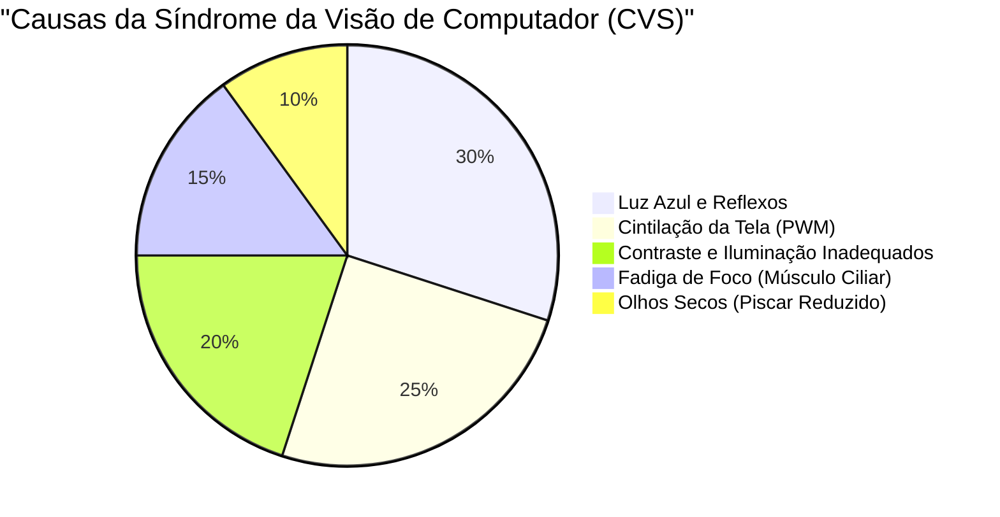
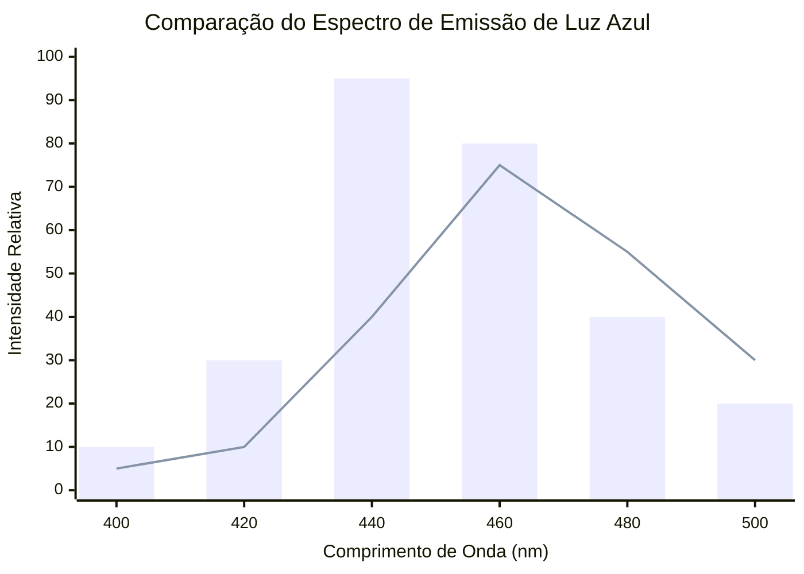
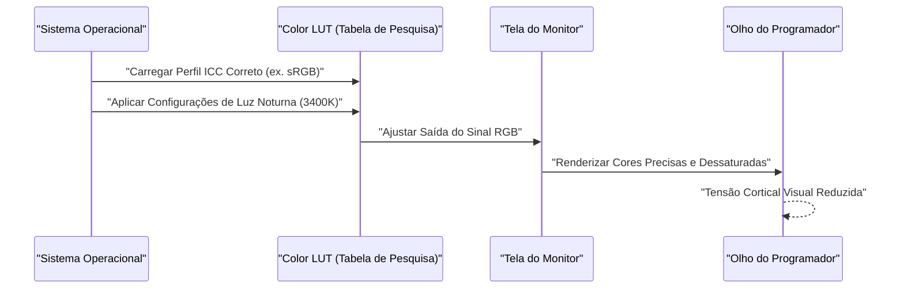
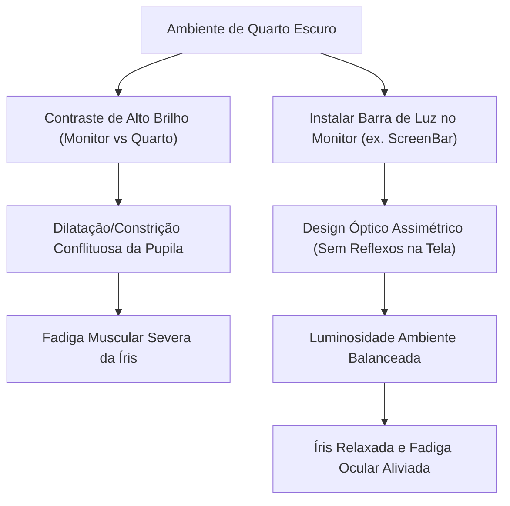

Para programadores e engenheiros de software, os "olhos" são a ferramenta de trabalho mais importante e mais sobrecarregada. Em uma rotina diária onde se passa de 8 a 10 horas, às vezes até mais, olhando constantemente para telas de editores, terminais e navegadores, quase todos os engenheiros enfrentam a "Fadiga Ocular (Síndrome da Visão de Computador: CVS)".

Geralmente, contramedidas para a fadiga ocular tendem a se limitar a conselhos superficiais, como "usar colírios", "fazer pausas adequadas" ou "usar óculos com bloqueio de luz azul". No entanto, como engenheiros, devemos identificar a causa raiz (Root Cause) do problema e buscar a otimização na camada do sistema (ambiente).

Neste artigo, a partir da perspectiva da física (óptica), bioquímica, ergonomia e da arquitetura de hardware de telas, dissecaremos minuciosamente os mecanismos da fadiga ocular em programadores, aprofundando-nos nas configurações definitivas de monitores e gadgets para aliviá-la, usando fórmulas matemáticas e ilustrações.

---

# Capítulo 1: Desvendando os Mecanismos da Fadiga Ocular (CVS) Através da Física e da Bioquímica

A Síndrome da Visão de Computador (CVS) não é causada por um único fator. Como mostrado no gráfico de pizza abaixo, vários elementos se entrelaçam de forma complexa, levando ao cansaço visual, dor, olhos secos e a uma sensação de fadiga em todo o corpo.



Aqui, explicaremos especificamente as "propriedades físicas da luz" e a "função de ajuste de foco do globo ocular", que têm impactos significativamente maiores.

## 1.1 Propriedades Físicas e Energia dos Fótons da Luz Azul

A luz azul emitida pelos monitores situa-se aproximadamente na faixa de comprimento de onda de $400 \text{ nm} \sim 490 \text{ nm}$. O motivo pelo qual isso sobrecarrega os olhos pode ser explicado pela "relação de Planck-Einstein", fundamento da mecânica quântica.

A energia $E$ possuída pela luz é expressa pela seguinte fórmula:

$$ E = h\nu = \frac{hc}{\lambda} $$

Aqui, cada variável possui o seguinte significado:
- $E$ : Energia por fóton (Joule)
- $h$ : Constante de Planck ($6.626 \times 10^{-34} \text{ J}\cdot\text{s}$)
- $c$ : Velocidade da luz no vácuo ($3.0 \times 10^8 \text{ m/s}$)
- $\lambda$ : Comprimento de onda da luz (m)
- $\nu$ : Frequência da luz (Hz)

O fato importante demonstrado por essa fórmula é que **"a energia da luz $E$ é inversamente proporcional ao comprimento de onda $\lambda$"**. Em outras palavras, a luz azul, que possui o menor comprimento de onda entre a luz visível, detém uma energia extremamente alta. Esses fótons de alta energia são dificilmente absorvidos e atenuados pela córnea e pelo cristalino, alcançando as profundezas da retina e causando forte estresse oxidativo às células fotorreceptoras.

## 1.2 Aberração Cromática (Chromatic Aberration) e Desalinhamento Focal

Observando mais a fundo do ponto de vista óptico, a diferença nos comprimentos de onda da luz cria uma diferença no "índice de refração". O índice de refração $n$ de um meio (neste caso, o cristalino, etc.) depende do comprimento de onda $\lambda$ e é aproximado pela equação de dispersão de Cauchy:

$$ n(\lambda) = B + \frac{C}{\lambda^2} $$

($B, C$ são constantes inerentes ao meio)

Como pode ser visto através desta fórmula, quanto menor o comprimento de onda $\lambda$ da luz azul, maior será o índice de refração $n$. Por essa razão, mesmo em um estado onde a luz vermelha foca perfeitamente na retina, a luz azul refrata-se fortemente e forma uma imagem **antes da retina**.
Quando o cérebro reconhece esse "desfoque da imagem pela luz azul (aberração cromática)", ele continuamente envia comandos ao músculo ciliar para tentar reajustar o foco. Este é um grande fator para a fadiga inconsciente dos músculos oculares.

## 1.3 Músculo de Ajuste de Foco (Músculo Ciliar) e a Equação das Lentes

Quando focamos em textos pequenos no monitor, ajustamos a espessura do cristalino (lente) dentro do olho. A equação das lentes delgadas é a seguinte:

$$ \frac{1}{f} = \frac{1}{a} + \frac{1}{b} $$

- $f$: Distância focal do cristalino
- $a$: Distância do olho ao monitor (distância do objeto)
- $b$: Distância do cristalino à retina (distância da imagem: cerca de $24 \text{ mm}$ constante no globo ocular de um adulto)

Durante a programação, se a distância $a$ até o monitor for curta (ex: $40 \text{ cm} \sim 50 \text{ cm}$) e isso durar por muito tempo, a fim de formar uma imagem precisa na retina (mantendo $b$ constante), a distância focal $f$ deve ser mantida extremamente curta. Quando esse estado em que os músculos ciliares estão fortemente contraídos dura horas, os músculos podem entrar em um estado de espasmo, causando uma grave fadiga ocular acompanhada de rigidez nos ombros e dores de cabeça.

---

# Capítulo 2: Seleção de Telas de Hardware e Eliminação de Fatores de Fadiga

Para aliviar a fadiga ocular, antes das configurações de software, devemos primeiramente verificar e melhorar as especificações do hardware. Em particular, o "método de escurecimento (dimming)" e a "taxa de atualização (refresh rate)" são pontos onde não se deve fazer concessões.

## 2.1 O Terror do Escurecimento PWM: Desmascarando a Cintilação Invisível

A tecnologia para ajustar o brilho dos monitores de cristal líquido (LCD) e de diodo emissor de luz orgânico (OLED) pode ser dividida a grosso modo em "Escurecimento DC (Direct Current)" e "Escurecimento PWM (Pulse-Width Modulation)".

O escurecimento PWM é uma técnica onde os LEDs da luz de fundo piscam tão rapidamente que não podem ser vistos pelo olho humano, e o brilho da tela é ajustado de forma simulada pela proporção de tempo em que a luz permanece "ligada" e "desligada". O brilho médio $L$ através do ciclo de trabalho (Duty Cycle) do PWM é expresso pela seguinte equação:

$$ L = L_{max} \times \frac{T_{on}}{T_{on} + T_{off}} \times 100 \ (\%) $$

- $T_{on}$ : Tempo que o LED está aceso
- $T_{off}$ : Tempo que o LED está apagado
- $L_{max}$ : Brilho máximo no pico

Se a frequência do escurecimento PWM for baixa (ex: $200 \text{ Hz} \sim 300 \text{ Hz}$), mesmo que você não sinta conscientemente a cintilação da tela (flicker), o cérebro e as pupilas reagem inconscientemente aos flashes de luz, e as pupilas repetidamente se dilatam e se contraem. Isso causa fadiga extrema, dores de cabeça e até mesmo náuseas.

**【Método de Detecção e Medidas contra PWM】**
Para verificar se o seu monitor possui escurecimento PWM, tente abrir o aplicativo da câmera no seu smartphone e gravar a tela branca do monitor (como uma página em branco no navegador) no modo "câmera lenta". Se linhas pretas em movimento (banding) aparecerem no vídeo, aquele monitor utiliza escurecimento PWM de baixa frequência.
Quando um programador escolhe um monitor, deve-se sempre escolher um em que as especificações declarem claramente: **"Flicker-Free (Sem cintilação / Escurecimento DC)"**.

## 2.2 Efeitos Oftalmológicos da Taxa de Atualização (Hz) e do Desfoque de Movimento (Motion Blur)

A taxa de atualização é o valor (Hz) que indica quantas vezes o monitor redesenha a tela por segundo.
Os monitores de escritório padrão possuem $60 \text{ Hz}$, mas nos últimos anos monitores com altas taxas de atualização, como $120 \text{ Hz}$ e $144 \text{ Hz}$, têm se popularizado. Isso é extremamente benéfico não só para gamers, mas também para programadores.

Ao rolar através de grandes quantidades de código ou quando uma vasta quantidade de logs passa no terminal, monitores de $60 \text{ Hz}$, junto aos limites da velocidade de resposta dos pixels, produzem "desfoque de movimento (motion blur)". O olho tenta inconscientemente capturar o formato do texto e continua tentando focar durante a rolagem; se as letras estiverem borradas, a carga de processamento do córtex visual no cérebro aumenta drasticamente.
Em monitores de $120 \text{ Hz}$ ou mais, mesmo o texto em rolagem pode ser visto com clareza, reduzindo substancialmente essa carga no movimento inconsciente dos olhos e nos ajustes de foco.

## 2.3 Tipos de Painel e Taxa de Contraste (IPS, VA, OLED)

A taxa de contraste de uma tela afeta diretamente a visibilidade dos textos.
A "Lei de Weber-Fechner", que dita que a magnitude de uma sensação humana é proporcional ao logaritmo do estímulo, é expressa pela seguinte equação:

$$ p = k \ln \left( \frac{S}{S_0} \right) $$

($p$: Magnitude da sensação, $S$: Quantidade física de estímulo, $S_0$: Limiar, $k$: Constante)

Em suma, os olhos humanos reagem muito mais à "razão de brilho relativo (contraste)" do que ao brilho absoluto.
Ao ler código com realce de sintaxe (syntax highlighting) por longas horas, os painéis VA, que produzem pretos muito profundos (taxa de contraste alta de $3000:1$), ou painéis OLED, que podem apagar completamente os pixels individualmente ($1,000,000:1$ e superior), tornam os contornos das letras muito mais nítidos e aprimoram a visibilidade.
No entanto, conforme discutido mais adiante, olhar para telas de contraste extremamente alto em um quarto totalmente escuro contrai excessivamente a pupila e causa mais fadiga, portanto, é imperativo o equilíbrio com a luz ambiente.

O gráfico a seguir compara a imagem do espectro de emissão entre monitores LCD padrão e os monitores OLED recentes (com design de redução de luz azul).



---

# Capítulo 3: Calibração do Monitor e Configurações de OS e Software

Tão importante quanto a escolha do hardware, é o gerenciamento de espaço de cores e a calibração no lado do SO.

## 3.1 A Armadilha da Gama de Cores (sRGB vs DCI-P3) e Perfil ICC

Os monitores recentes destacam-se frequentemente por suas "amplas gamas de cores", cobrindo 95% ou mais de DCI-P3, no entanto, para propósitos de programação, isso pode acabar sendo prejudicial.
No ambiente Windows, se um monitor de ampla gama de cores for usado sem a aplicação do Perfil ICC (International Color Consortium) adequado, o realce de sintaxe do VS Code designado em sRGB padrão (como as cores de advertência vermelhas ou verdes) será exibido artificialmente saturado e rico.
Como essas cores intensas dão um forte estímulo aos olhos, é extremamente recomendado instalar o Perfil ICC correto através das configurações de exibição do SO ou alternar para o "Modo de Emulação sRGB" a partir das configurações OSD do monitor.

O diagrama de sequência a seguir ilustra o processo desde a aplicação do perfil ICC correto até a renderização de cores amigáveis aos olhos.



## 3.2 Contramedidas de Software (f.lux / Luz Noturna)

A contramedida mais fácil e eficaz contra a luz azul é usar um software que altere dinamicamente a temperatura de cor (Color Temperature) de acordo com a hora do dia.
- Windows: **Luz Noturna (Night Light)**
- macOS: **Night Shift**
- Terceiros: **f.lux**

A temperatura de cor é expressa em Kelvin ($\text{K}$). A luz do sol durante o dia fica em torno de $5500\text{K} \sim 6500\text{K}$ (luz branco-azulada), mas se os olhos forem continuamente expostos a ela, a secreção de "melatonina (hormônio do sono)" na glândula pineal do cérebro é suprimida.
A partir do entardecer, usar tais softwares para baixar as temperaturas de cor para $3400\text{K} \sim 1900\text{K}$ (cores quentes, laranja a vermelho) reduz fisicamente a quantidade de emissão de luz azul. Isso pode manter o ritmo circadiano (relógio biológico) normal e impedir que fótons de alta energia atinjam o globo ocular.

---

# Capítulo 4: A Solução Definitiva de Hardware: Adoção dos Gadgets Mais Recentes

Se as medidas explicadas até agora não aliviarem a fadiga, é necessário investir em gadgets externos para mudar o ambiente drasticamente.

## 4.1 Iluminação de Viés (Bias Lighting) e Luminária Acoplada de Monitor (ScreenBar)

Olhar para um monitor claro em um ambiente escuro cria um forte contraste entre o centro do campo de visão (alto brilho) e a periferia (baixo brilho). Isso é chamado de **"Brilho Desconfortável (Discomfort Glare)"**.
Nesse ambiente, os olhos tentam dilatar a pupila para capturar luz, ao mesmo tempo em que tentam fechá-la devido ao brilho no centro. Esse estado contraditório fadiga enormemente o músculo da íris.

A solução para isso é a "Iluminação de Viés (Bias Lighting)".
Particularmente recomendadas são as "luminárias acopladas no monitor", como a **BenQ ScreenBar**.



A maior característica da ScreenBar é o seu "Design Óptico Assimétrico (Asymmetrical Optical Design)". Usando refletores e lentes especiais, ela não lança luz na própria tela (evitando reflexos e ofuscamentos), mas ilumina uniformemente apenas o teclado e o espaço atrás do monitor. Isso reduz drasticamente a diferença de brilho (taxa de contraste) em todo o campo de visão, eliminando o fardo sobre os olhos.

## 4.2 Mudança de Paradigma Através de Monitores E-Ink (Dasung & Boox)

Para a leitura de longas referências de API, livros técnicos (PDFs) ou na leitura de códigos, a solução moderna definitiva é a **utilização de um "Monitor E-Ink (papel eletrônico)" como monitor secundário**.

Ao contrário de telas de cristal líquido (LCD) ou OLED, o E-Ink não possui luz de fundo que emite luz por si só. Ele move partículas de pigmento carregadas em branco e preto (como dióxido de titânio) dentro de microcápsulas através de voltagem (método eletroforético), e exibe o texto refletindo a luz ambiente do entorno.
- **Quantidade física de emissão de luz azul: zero**
- **Cintilação de PWM e de atualização: totalmente zero**

Ao colocar verticalmente monitores E-Ink, como a série **Dasung Paperlike** (25.3 polegadas, etc.) ou o **Onyx Boox Mira**, para funcionarem como monitores secundários apenas de texto, você pode ler documentos exatamente com a mesma sensação de ler materiais impressos em papel.
Embora haja a desvantagem do atraso no desenho (baixa taxa de atualização), se o uso for estritamente limitado à "leitura de texto estático" no ambiente de programação, não existe nenhum outro dispositivo na Terra que seja tão amigável aos seus olhos.

---

# Capítulo 5: Ergonomia e Regras de Operação

Por melhor que seja o hardware montado, não fará sentido se a postura e as regras da pessoa que o opera estiverem erradas.

## 5.1 Mecânica dos Fluidos de Olhos Secos e o Ângulo do Foco Visual

Os olhos secos não representam apenas o desconforto subjetivo de "ter os olhos ressecados"; a destruição da camada lacrimal na superfície da córnea causa um reflexo difuso da luz que embaça a visão, resultando em um círculo vicioso rumo a ainda mais fadiga ocular (abuso do músculo ciliar).
A taxa de evaporação da lágrima é proporcional à área da superfície do globo ocular que está exposta ao ar (área da fenda palpebral).

O ângulo ideal $\theta$ do foco visual para um ajuste de tela é cerca de $15^\circ \sim 20^\circ$ para baixo, a contar da linha horizontal.
Considerando $d$ como a distância horizontal do centro do monitor até os olhos, e $h$ como a diferença de elevação do centro do monitor e da altura dos olhos, a seguinte função trigonométrica se aplica:

$$ \tan \theta = \frac{h}{d} $$

Por exemplo, no caso em que a distância ao monitor $d$ é $60 \text{ cm}$ (um ambiente de escrivaninha normal), para ter $\theta = 15^\circ$:

$$ h = 60 \times \tan(15^\circ) \approx 60 \times 0.267 = 16.02 \text{ cm} $$

Em outras palavras, **é ideal que o centro do monitor fique cerca de $16 \text{ cm}$ abaixo do nível dos olhos.**
Ao apontar a linha de visão ligeiramente para baixo, as pálpebras superiores descem naturalmente, e a área de exposição do globo ocular diminui, impedindo drasticamente a evaporação das lágrimas. Por favor, introduza um braço de monitor (como Ergotron, etc.) e ajuste essa altura com precisão milimétrica.

## 5.2 Implementação Severa e Automação da Regra Global "20-20-20"

O método de recuperação de fadiga ocular durante o uso de dispositivos digitais, recomendado pela Academia Americana de Oftalmologia (AAO) e por oftalmologistas em todo o mundo, é a **"Regra 20-20-20"**.

**『A cada 20 minutos, olhar para algo a pelo menos 20 pés (cerca de 6 metros) de distância, durante 20 segundos』**

Com este simples movimento, o músculo ciliar que estava extremamente contraído é forçosamente relaxado, o cristalino torna-se mais fino e a função de ajuste de foco é reiniciada.
Como os programadores esquecem o tempo quando entram no estado de fluxo (flow), criar um mecanismo para forçar essa regra automaticamente é a solução com cara de engenheiro.
O exemplo abaixo é um script extremamente simples em Python, usando `tkinter`, que força uma janela pop-up a cada 20 minutos.

```python
import time
import tkinter as tk
from tkinter import messagebox

def remind_20_20_20():
    # Ocultar a janela principal
    root = tk.Tk()
    root.withdraw()
    
    while True:
        # Esperar 20 minutos (1200 segundos)
        time.sleep(20 * 60)
        
        # Mostrar o diálogo de aviso em primeiro plano
        messagebox.showinfo(
            title="Regra 20-20-20",
            message="Desvie os olhos da tela e olhe para algo a 6 metros de distância por 20 segundos!\n(Relaxa o músculo ciliar)"
        )
        
        # 20 segundos para relaxar
        time.sleep(20)

if __name__ == '__main__':
    # Executar em segundo plano
    remind_20_20_20()
```

Ao registrar esse script na inicialização do sistema ou ao rodá-lo por meio de agendadores de tarefas padrão do SO como o Cron, você pode incorporar um ciclo obrigatório de recuperação em sua vida diária.

---

# Conclusão: Medidas de Fadiga Ocular como um Investimento para o Futuro

Nossa carreira como engenheiros de software dura décadas. O que sustenta essa carreira não é um teclado caro ou a CPU mais recente, mas inequivocamente os nossos próprios "olhos" e "cérebro".

1. **Compreender a energia da luz ($E = hc/\lambda$) e a carga física de ajustar o foco.**
2. **Introduzir monitores "Flicker-Free" (escurecimento DC) com alta taxa de atualização.**
3. **Otimizar o contraste relativo do ambiente com iluminações de viés (Bias Lighting), como a ScreenBar.**
4. **Considerar os monitores E-Ink como o dispositivo definitivo para visualização de textos.**
5. **Usar um braço de monitor para criar o ângulo visual ideal, baseado em $\tan \theta = h/d$, e sistematizar a "Regra 20-20-20".**

Essas medidas podem vir com algum gasto e esforço temporários. Contudo, elas maximizam o período de vida de saúde ocular e a produtividade e qualidade de vida (QOL) por toda a vida, podendo ser chamadas de o "investimento tecnológico" mais custo-efetivo. Reveja seu ambiente de desenvolvimento agora mesmo e tente implementar um pouco de consideração para os seus olhos.
