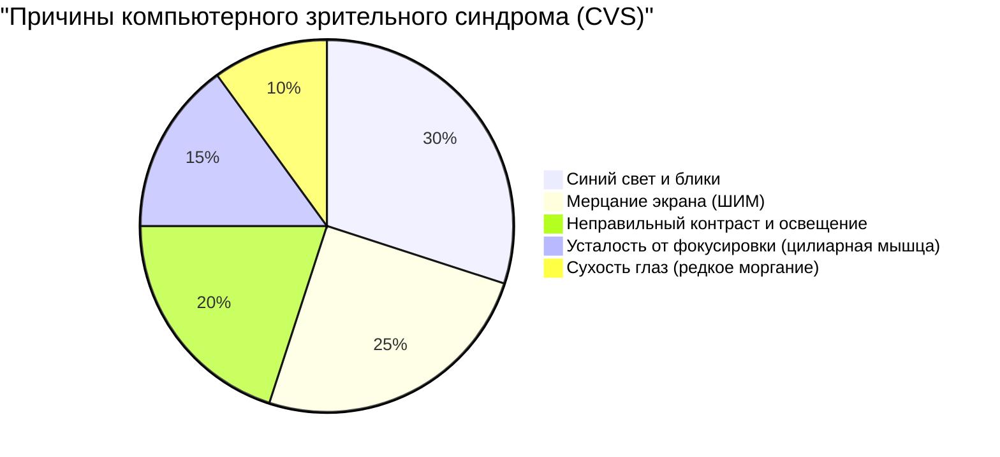
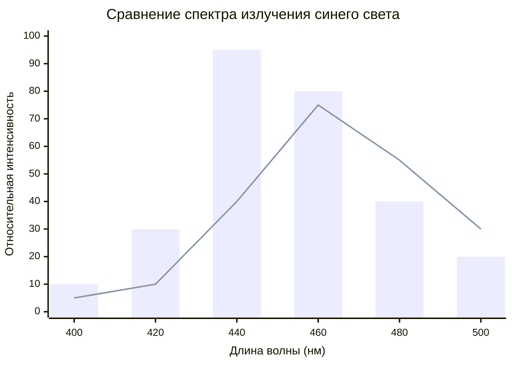
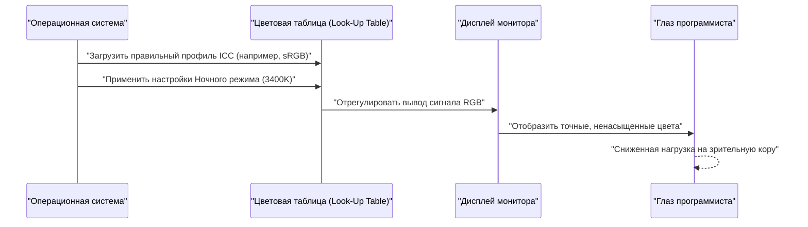
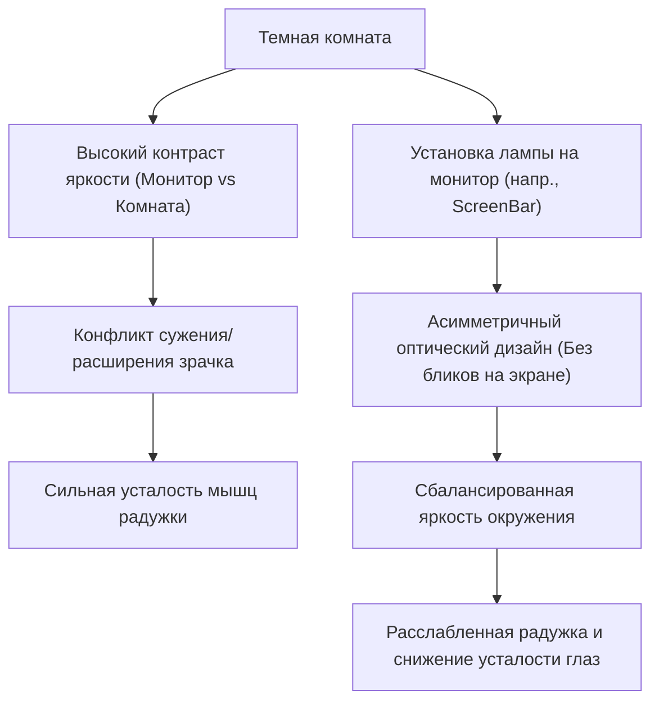

Для программистов и инженеров-разработчиков программного обеспечения «глаза» — это самый важный и наиболее эксплуатируемый рабочий инструмент. В условиях, когда ежедневно от 8 до 10 часов, а иногда и больше, приходится смотреть на экраны редакторов, терминалов и браузеров, почти каждый инженер сталкивается с «компьютерным зрительным синдромом» (Computer Vision Syndrome: CVS, зрительное утомление).

Обычно советы по борьбе с усталостью глаз ограничиваются поверхностными рекомендациями: «закапывайте капли для глаз», «делайте регулярные перерывы», «носите очки, блокирующие синий свет». Однако инженеры должны определять корневую причину (Root Cause) проблемы и проводить оптимизацию на уровне системы (среды).

В этой статье мы подробно, с использованием формул и иллюстраций, разберем механизмы зрительного утомления программистов с точки зрения физики (оптики), биохимии, эргономики и аппаратной архитектуры дисплеев. Также мы рассмотрим идеальные настройки монитора и гаджеты для минимизации этой проблемы.

---

# Глава 1: Раскрытие механизмов зрительного утомления (CVS) через физику и биохимию

Компьютерный зрительный синдром (CVS) не вызывается какой-то одной причиной. Как показано на круговой диаграмме ниже, различные факторы сложно переплетаются, приводя к усталости глаз, боли, сухости и общему чувству истощения.



Здесь мы рассмотрим наиболее значимые из них: «физические свойства света» и «функцию аккомодации глаза».

## 1.1 Физические свойства синего света и энергия фотонов

Синий свет (голубое излучение), излучаемый дисплеями, находится в диапазоне длин волн примерно $400 \text{ nm} \sim 490 \text{ nm}$. Почему это создает нагрузку на глаза, можно объяснить с помощью формулы Планка-Эйнштейна, фундаментального принципа квантовой механики.

Энергия света $E$ выражается следующей формулой:

$$ E = h\nu = \frac{hc}{\lambda} $$

Здесь каждая переменная имеет следующее значение:
- $E$ : Энергия одного фотона (Джоуль)
- $h$ : Постоянная Планка ($6.626 \times 10^{-34} \text{ J}\cdot\text{s}$)
- $c$ : Скорость света в вакууме ($3.0 \times 10^8 \text{ m/s}$)
- $\lambda$ : Длина волны света (m)
- $\nu$ : Частота света (Hz)

Важный вывод из этой формулы заключается в том, что **«энергия света $E$ обратно пропорциональна длине волны $\lambda$»**. Это означает, что синий свет, имеющий самую короткую длину волны в видимом спектре, обладает чрезвычайно высокой энергией. Эти высокоэнергетические фотоны слабо поглощаются или ослабляются роговицей и хрусталиком, достигая глубоких слоев сетчатки и вызывая сильный окислительный стресс в фоторецепторных клетках.

## 1.2 Хроматическая аберрация и смещение фокуса

С оптической точки зрения разница в длине волны света приводит к разнице в «показателе преломления». Показатель преломления $n$ среды (в данном случае хрусталика) зависит от длины волны $\lambda$ и аппроксимируется дисперсионной формулой Коши:

$$ n(\lambda) = B + \frac{C}{\lambda^2} $$

(где $B, C$ — константы, зависящие от среды)

Как видно из этой формулы, чем короче длина волны $\lambda$ (как у синего света), тем больше показатель преломления $n$. В результате, даже если красный свет идеально фокусируется на сетчатке, синий свет преломляется сильнее и фокусируется **перед сетчаткой**.
Когда мозг распознает эту «размытость изображения из-за синего света (хроматическую аберрацию)», он постоянно подает сигналы цилиарной мышце для перефокусировки. Это является главной причиной бессознательного утомления глазных мышц.

## 1.3 Мышцы, регулирующие фокус (цилиарная мышца), и формула линзы

Когда мы фокусируемся на мелком тексте на мониторе, наши глаза регулируют толщину хрусталика (линзы). Формула тонкой линзы выглядит следующим образом:

$$ \frac{1}{f} = \frac{1}{a} + \frac{1}{b} $$

- $f$: Фокусное расстояние хрусталика
- $a$: Расстояние от глаз до монитора (расстояние до объекта)
- $b$: Расстояние от хрусталика до сетчатки (расстояние до изображения: у взрослого глаза постоянно и составляет около $24 \text{ mm}$)

Во время программирования, если расстояние $a$ до монитора остается небольшим в течение длительного времени (например, $40 \text{ cm} \sim 50 \text{ cm}$), хрусталик должен поддерживать экстремально короткое фокусное расстояние $f$, чтобы точно сфокусировать изображение на сетчатке (сохраняя $b$ постоянным). Если цилиарная мышца остается в состоянии сильного сокращения часами, она спазмируется, что приводит к сильному зрительному утомлению, сопровождающемуся жесткостью в плечах и головной болью.

---

# Глава 2: Выбор аппаратного обеспечения и устранение факторов утомления

Чтобы уменьшить нагрузку на глаза, перед настройкой программного обеспечения необходимо проверить и улучшить аппаратные характеристики. В частности, «метод затемнения» и «частота обновления» — это параметры, на которых нельзя экономить.

## 2.1 Ужасы ШИМ-затемнения: Раскрытие невидимого мерцания

Технологии регулировки яркости ЖК (LCD) и OLED мониторов можно разделить на две основные категории: «DC-затемнение (затемнение постоянным током)» и «ШИМ-затемнение (широтно-импульсная модуляция)».

ШИМ-затемнение (PWM) — это технология, при которой светодиоды подсветки включаются и выключаются с высокой скоростью, невидимой для человеческого глаза. Яркость экрана искусственно регулируется соотношением времени «включения» и «выключения». Средняя яркость $L$, зависящая от скважности ШИМ (Duty Cycle), выражается следующей формулой:

$$ L = L_{max} \times \frac{T_{on}}{T_{on} + T_{off}} \times 100 \ (\%) $$

- $T_{on}$ : Время, в течение которого светодиод включен
- $T_{off}$ : Время, в течение которого светодиод выключен
- $L_{max}$ : Максимальная пиковая яркость

Если частота ШИМ низкая (например, $200 \text{ Hz} \sim 300 \text{ Hz}$), даже если вы сознательно не замечаете мерцания экрана (фликера), мозг и зрачки бессознательно реагируют на мигание света, вызывая постоянное расширение и сужение зрачков. Это приводит к сильной усталости, головным болям и даже тошноте.

**[Как обнаружить ШИМ и что делать]**
Чтобы проверить, использует ли ваш монитор ШИМ-затемнение, откройте приложение камеры на смартфоне, включите режим «замедленной съемки» (Slow-motion) и наведите на белый экран монитора (например, пустую страницу браузера). Если на видео появляются движущиеся черные полосы (бандинг), монитор использует низкочастотное ШИМ-затемнение.
При выборе монитора программисту следует обязательно искать модели, в характеристиках которых указано **«Flicker-Free (DC-затемнение)»** или "Без мерцания".

## 2.2 Частота обновления (Гц) и офтальмологическое влияние размытия в движении

Частота обновления (Refresh rate) указывает, сколько раз в секунду монитор перерисовывает экран (в Гц).
Стандартные офисные мониторы имеют частоту $60 \text{ Hz}$, но в последние годы стали популярны мониторы с высокой частотой обновления, такие как $120 \text{ Hz}$ или $144 \text{ Hz}$. Это крайне полезно не только для геймеров, но и для программистов.

При прокрутке большого объема кода или быстром потоке логов в терминале на $60 \text{ Hz}$ мониторе возникает «размытие в движении» (motion blur) из-за ограничений скорости отклика пикселей. Глаза бессознательно пытаются сфокусироваться и распознать формы текста даже во время прокрутки, и если текст размыт, нагрузка на зрительную кору мозга резко возрастает.
На мониторе с частотой $120 \text{ Hz}$ и выше текст остается четким даже во время прокрутки, что значительно снижает бессознательные движения глаз и нагрузку на аккомодацию.

## 2.3 Типы панелей и контрастность (IPS, VA, OLED)

Коэффициент контрастности экрана напрямую влияет на читаемость текста.
Закон Вебера-Фехнера, утверждающий, что интенсивность ощущения пропорциональна логарифму интенсивности раздражителя, выражается следующей формулой:

$$ p = k \ln \left( \frac{S}{S_0} \right) $$

($p$: Интенсивность ощущения, $S$: Физическая величина раздражителя, $S_0$: Порог, $k$: Константа)

Иными словами, человеческий глаз сильнее реагирует на «относительное отношение яркости (контраст)», чем на абсолютную яркость.
При длительном чтении кода с подсветкой синтаксиса панели VA (с контрастностью $3000:1$), обеспечивающие глубокий черный цвет, или панели OLED (от $1,000,000:1$ и выше), способные полностью отключать отдельные пиксели, делают контуры текста очень четкими и улучшают читаемость.
Однако, как будет обсуждаться далее, взгляд на экран с чрезвычайно высокой контрастностью в совершенно темной комнате вызывает чрезмерное сужение зрачков, что приводит к утомлению. Поэтому баланс с внешним освещением является обязательным.

Следующий график сравнивает спектры излучения стандартного ЖК-монитора (LCD) и современных OLED панелей (с технологией снижения синего света).



---

# Глава 3: Калибровка монитора и настройки ОС / Программного обеспечения

Не менее важным, чем выбор оборудования, является управление цветовым пространством в ОС и калибровка.

## 3.1 Ловушка цветового охвата (sRGB против DCI-P3) и профили ICC

Многие современные мониторы рекламируют «широкий цветовой охват», например покрытие более 95% DCI-P3, но это может стать проблемой для программирования.
В среде Windows, если использовать монитор с широким цветовым охватом без применения правильного профиля ICC (International Color Consortium), подсветка синтаксиса в VS Code (например, красные или зеленые предупреждающие цвета), предназначенная для стандартного sRGB, будет отображаться в неестественно ярких (перенасыщенных) тонах.
Эти интенсивные цвета сильно раздражают глаза, поэтому настоятельно рекомендуется либо установить правильный профиль ICC через настройки дисплея ОС, либо переключиться в «Режим эмуляции sRGB» в настройках самого монитора (OSD).

Следующая диаграмма последовательности иллюстрирует процесс от применения правильного профиля ICC до рендеринга безопасных для глаз цветов.



## 3.2 Программные решения (f.lux / Night Light)

Самый простой и эффективный способ защиты от синего света — использование программного обеспечения, которое динамически изменяет цветовую температуру (Color Temperature) в зависимости от времени суток.
- Windows: **Night Light (Ночной свет)**
- macOS: **Night Shift**
- Сторонние приложения: **f.lux**

Цветовая температура измеряется в Кельвинах ($\text{K}$). Дневной солнечный свет составляет около $5500\text{K} \sim 6500\text{K}$ (голубоватый свет). Если постоянно смотреть на такой свет, подавляется выработка «мелатонина (гормона сна)» в шишковидной железе мозга.
С наступлением вечера использование этих программ для снижения цветовой температуры до $3400\text{K} \sim 1900\text{K}$ (теплые оранжевые или красные тона) физически уменьшает излучение синего света. Это помогает поддерживать нормальный циркадный ритм (внутренние часы) и предотвращает попадание высокоэнергетических фотонов в глаз.

---

# Глава 4: Идеальные аппаратные решения: Внедрение новейших гаджетов

Если меры, описанные выше, не снимают усталость, необходимо инвестировать во внешние устройства (гаджеты) для радикального изменения рабочей среды.

## 4.1 Фоновое освещение (Bias Lighting) и лампы на монитор (ScreenBar)

Если смотреть на яркий монитор в темной комнате, возникает резкий контраст между центральным зрением (высокая яркость) и периферическим (низкая яркость). Это называется **«Дискомфортными бликами (Discomfort Glare)»**.
В таких условиях глаза пытаются открыть зрачки, чтобы уловить свет из темной комнаты, но одновременно пытаются сузить их из-за яркости в центре. Это противоречивое состояние приводит к сильной усталости мышц радужки.

Решением является «Фоновое освещение (Bias Lighting)».
Особенно рекомендуются «лампы на монитор», такие как **BenQ ScreenBar**.



Главная особенность ScreenBar — это «асимметричный оптический дизайн». Благодаря специальным отражателям и линзам лампа не светит прямо на экран (предотвращая блики и отражения), а равномерно освещает только клавиатуру перед вами и пространство за монитором. Это резко снижает разницу в яркости (коэффициент контрастности) во всем поле зрения, полностью устраняя нагрузку на глаза.

## 4.2 Смена парадигмы с E-Ink дисплеями (Dasung и Boox)

Для чтения длинных справочников API, технической литературы (PDF) или больших объемов кода современным ультимативным решением является использование **дисплеев E-Ink (электронная бумага) в качестве дополнительных мониторов**.

В отличие от ЖК и OLED, E-Ink экраны не имеют собственной подсветки, которая излучает свет. Они работают путем перемещения заряженных белых и черных пигментных частиц (таких как диоксид титана) внутри микрокапсул с помощью напряжения (электрофорез) и отражают окружающий свет для отображения текста.
- **Физическое излучение синего света: Ноль**
- **Мерцание из-за ШИМ или частоты обновления: Абсолютный ноль**

Вертикально разместив монитор E-Ink, такой как **Dasung Paperlike** (например, 25.3 дюйма) или **Onyx Boox Mira**, в качестве дополнительного дисплея специально для текста, вы сможете читать документы с таким же ощущением, как если бы читали распечатанную бумагу.
Несмотря на недостаток в виде задержки отрисовки (низкая частота обновления), для «чтения статического текста» в среде программирования не существует устройства, более безопасного для глаз.

---

# Глава 5: Эргономика и правила работы

Каким бы отличным ни было ваше оборудование, оно не будет иметь значения, если ваша осанка или правила работы неверны.

## 5.1 Гидродинамика сухого глаза и угол обзора

Синдром сухого глаза — это не просто дискомфорт от «сухости». Разрушение слезной пленки на поверхности роговицы вызывает рассеивание света, что приводит к помутнению зрения и, как следствие, к еще большему зрительному утомлению (перенапряжению цилиарной мышцы), создавая порочный круг.
Количество испаряющейся слезной жидкости пропорционально площади поверхности глаза, контактирующей с воздухом (площадь глазной щели).

Идеальный угол обзора (линия взгляда) для размещения монитора $\theta$ составляет от $15^\circ \sim 20^\circ$ вниз от горизонтали.
Если $d$ — горизонтальное расстояние от глаз до центра монитора, а $h$ — разница по высоте между центром монитора и уровнем глаз, то применима следующая тригонометрическая функция:

$$ \tan \theta = \frac{h}{d} $$

Например, если расстояние до монитора $d$ составляет $60 \text{ cm}$ (стандартная конфигурация стола), для получения $\theta = 15^\circ$ нужно:

$$ h = 60 \times \tan(15^\circ) \approx 60 \times 0.267 = 16.02 \text{ cm} $$

Иными словами, **идеально, если центр монитора находится примерно на $16 \text{ cm}$ ниже уровня глаз**.
Небольшой наклон взгляда вниз заставляет верхнее веко естественным образом опуститься, уменьшая открытую площадь глаза и радикально предотвращая испарение слез. Рекомендуется использовать кронштейн для монитора (например, Ergotron), чтобы установить эту высоту с точностью до миллиметра.

## 5.2 Соблюдение и автоматизация мирового стандарта «Правило 20-20-20»

Американская академия офтальмологии (AAO) и офтальмологи по всему миру рекомендуют метод восстановления после зрительного утомления при использовании цифровых устройств, известный как **«Правило 20-20-20»**.

**«Каждые 20 минут смотрите на что-то на расстоянии не менее 20 футов (около 6 метров) в течение 20 секунд».**

Это простое действие принудительно расслабляет сильно сокращенную цилиарную мышцу, истончает хрусталик и сбрасывает функцию аккомодации.
Поскольку программисты в состоянии потока часто забывают о времени, инженерным решением будет создание системы автоматического принудительного соблюдения этого правила.
Ниже приведен пример крайне простого скрипта на Python с использованием `tkinter`, который принудительно отображает всплывающее окно каждые 20 минут.

```python
import time
import tkinter as tk
from tkinter import messagebox

def remind_20_20_20():
    # Скрыть главное окно
    root = tk.Tk()
    root.withdraw()
    
    while True:
        # Ожидание 20 минут (1200 секунд)
        time.sleep(20 * 60)
        
        # Отобразить диалог с предупреждением поверх остальных окон
        messagebox.showinfo(
            title="Правило 20-20-20",
            message="Отведите взгляд от экрана и смотрите на расстояние более 6 метров в течение 20 секунд!\n(Это расслабит цилиарную мышцу)"
        )
        
        # 20 секунд для расслабления
        time.sleep(20)

if __name__ == '__main__':
    # Запуск в фоновом режиме
    remind_20_20_20()
```

Добавив подобный скрипт в автозагрузку или запуская его через стандартный планировщик задач ОС или Cron, вы сможете внедрить принудительный цикл восстановления в свою рутину.

---

# Заключение: Инвестиции в будущее — борьба со зрительным утомлением

Карьера инженера-разработчика программного обеспечения длится десятилетиями. Ее поддерживает не дорогая клавиатура и не новейший процессор, а, несомненно, ваши собственные «глаза» и «мозг».

1. **Понимайте энергию света ($E = hc/\lambda$) и физиологическую нагрузку на аккомодацию.**
2. **Используйте мониторы без мерцания (DC-затемнение) с высокой частотой обновления.**
3. **Оптимизируйте относительный контраст окружающей среды с помощью фонового освещения (например, ScreenBar).**
4. **Рассмотрите мониторы E-Ink как идеальное устройство для чтения текста.**
5. **Используйте кронштейн для монитора, чтобы создать оптимальный угол обзора на основе $\tan \theta = h/d$, и автоматизируйте «Правило 20-20-20».**

Эти меры могут потребовать временных финансовых и организационных затрат, но это, безусловно, самые рентабельные «технические инвестиции» для увеличения продолжительности здоровья глаз и максимизации продуктивности и качества жизни (QOL) на протяжении всей жизни. Пересмотрите свою рабочую среду прямо сейчас и внедрите заботу о своих глазах.
