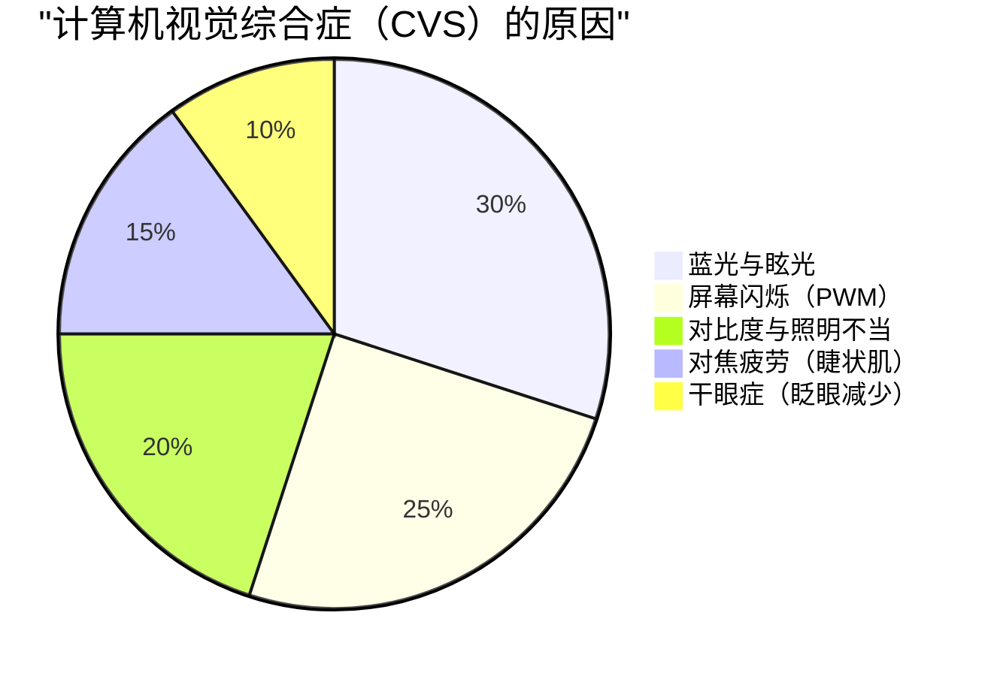
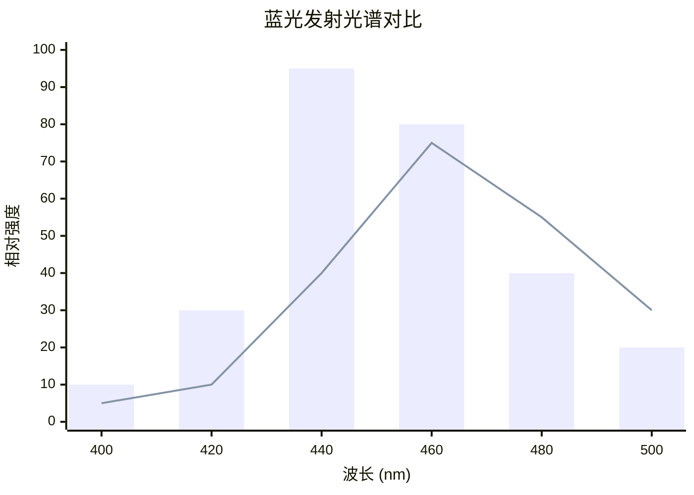
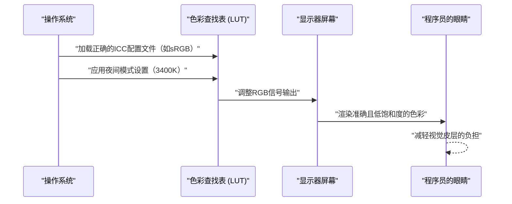
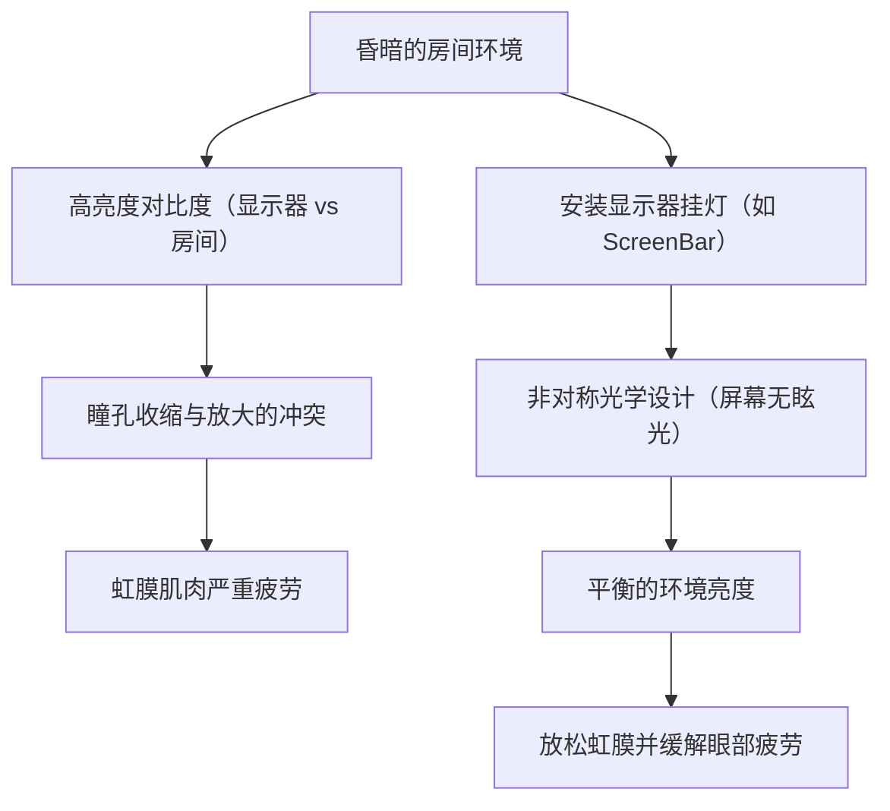

对于程序员和软件工程师来说，“眼睛”是最重要且最容易过度使用的工具。在每天需要面对编辑器、终端和浏览器屏幕8到10小时甚至更长时间的生活中，几乎所有工程师都会面临“计算机视觉综合症（Computer Vision Syndrome: CVS，即眼疲劳）”的问题。

通常，关于眼疲劳的对策往往局限于“滴眼药水”、“适度休息”、“戴防蓝光眼镜”等表层建议。然而，作为工程师，我们应该找出问题的根本原因（Root Cause），并从系统（环境）层面进行优化。

本文将从物理学（光学）、生物化学、人体工程学以及显示器硬件架构的角度，彻底解剖程序员眼疲劳的机制，并结合数学公式与图解，深入探讨为减轻这种疲劳而采用的终极显示器设置和小工具。

---

# 第1章：从物理学与生物化学解密眼疲劳（CVS）的机制

计算机视觉综合症（CVS）并不是由单一因素引起的。如下面的饼图所示，各种因素错综复杂地交织在一起，最终导致眼部疲劳、疼痛、干眼症，乃至全身的疲惫感。



在这里，我们将重点讲解影响尤为显著的“光的物理特性”与“眼球的对焦调节功能”。

## 1.1 蓝光的物理特性与光子能量

显示器发出的蓝光（蓝色光线）大约处于 $400 \text{ nm} \sim 490 \text{ nm}$ 的波长范围内。它之所以会对眼睛造成负担，可以通过量子力学的基础“普朗克-爱因斯坦关系式”来解释。

光所具有的能量 $E$ 可以用以下公式表示：

$$ E = h\nu = \frac{hc}{\lambda} $$

这里，各个变量的含义如下：
- $E$ : 单个光子（Photon）的能量 (Joule)
- $h$ : 普朗克常数 ($6.626 \times 10^{-34} \text{ J}\cdot\text{s}$)
- $c$ : 真空中的光速 ($3.0 \times 10^8 \text{ m/s}$)
- $\lambda$ : 光的波长 (m)
- $\nu$ : 光的频率 (Hz)

这个公式揭示了一个重要的事实：**“光的能量 $E$ 与波长 $\lambda$ 成反比”**。也就是说，在可见光中波长最短的蓝光，具有极高的能量。这种高能量的光子很难被角膜和晶状体吸收、衰减，它会直达视网膜深处，对视细胞造成强烈的氧化应激。

## 1.2 色差（Chromatic Aberration）与焦点偏移

从光学的角度来看，不同波长的光会产生不同的“折射率”。介质（这里指晶状体等）的折射率 $n$ 依赖于波长 $\lambda$，可以用柯西色散公式来近似：

$$ n(\lambda) = B + \frac{C}{\lambda^2} $$

（$B, C$ 是介质固有的常数）

从这个公式可以看出，波长 $\lambda$ 越短的蓝光，其折射率 $n$ 越大。因此，即使在红光等刚好准确聚焦在视网膜上的情况下，蓝光也会发生较大的折射，**在视网膜的前方**成像。
大脑在感知到这种“由蓝光引起的图像模糊（色差）”时，就会不断地向睫状肌发出重新对焦的指令。这就是无意识中眼部肌肉逐渐疲劳的主要原因。

## 1.3 对焦调节肌（睫状肌）与透镜公式

当我们在显示器上对焦阅读细小文本时，眼睛内部会调节晶状体（透镜）的厚度。薄透镜的公式如下：

$$ \frac{1}{f} = \frac{1}{a} + \frac{1}{b} $$

- $f$: 晶状体的焦距
- $a$: 眼睛到显示器的距离（物距）
- $b$: 晶状体到视网膜的距离（像距：成年人眼球中大约稳定在 $24 \text{ mm}$）

在编程过程中，当与显示器的距离 $a$ 较短（例如：$40 \text{ cm} \sim 50 \text{ cm}$）且状态持续较长时，为了在视网膜上准确成像（保持 $b$ 恒定），必须将焦距 $f$ 持续维持在极短的状态。睫状肌长达数小时处于极度收缩的状态，会导致肌肉陷入痉挛，引发伴有肩颈酸痛或头痛的严重眼疲劳。

---

# 第2章：硬件显示器的选择与疲劳因素的排除

为了减轻眼部疲劳，在设置软件之前，必须先检查并改善硬件规格。尤其是“调光方式”和“刷新率”，是绝不能妥协的关键点。

## 2.1 PWM调光的恐怖：揭露看不见的闪烁

液晶（LCD）和OLED显示器用来调节亮度的技术，主要分为“DC（Direct Current，直流）调光”和“PWM（Pulse-Width Modulation，脉宽调制）调光”两种。

PWM调光是一种通过让人眼无法察觉的高速闪烁背光LED，利用其“亮起时间”与“熄灭时间”的比例来模拟调节屏幕亮度的技术。基于PWM占空比（Duty Cycle）的平均亮度 $L$ 可由以下公式表示：

$$ L = L_{max} \times \frac{T_{on}}{T_{on} + T_{off}} \times 100 \ (\%) $$

- $T_{on}$ : LED亮起的时间
- $T_{off}$ : LED熄灭的时间
- $L_{max}$ : 峰值时的最大亮度

当PWM调光的频率较低（例如：$200 \text{ Hz} \sim 300 \text{ Hz}$）时，即使主观上没有感觉到屏幕的闪烁（Flicker），大脑和瞳孔也会无意识地对光线的闪烁做出反应，导致瞳孔反复放大和缩小。这会引起极度的疲劳、头痛，甚至恶心。

**【PWM的检测方法与对策】**
要检查自己的显示器是否采用了PWM调光，可以打开智能手机的相机应用，在“慢动作拍摄”模式下拍摄显示器的白色画面（如浏览器的空白页面）。如果视频中出现移动的黑色条纹（频闪纹），说明该显示器采用了低频PWM调光。
程序员在选择显示器时，应该坚决选择规格书上明确标有**“无频闪（DC调光）”**的产品。

## 2.2 刷新率（Hz）与动态模糊的眼科学影响

刷新率是指显示器每秒钟重绘屏幕画面的次数（Hz）。
一般办公显示器为 $60 \text{ Hz}$，但近年来 $120 \text{ Hz}$ 或 $144 \text{ Hz}$ 的高刷新率显示器已经普及。这不仅对游戏玩家，对程序员也非常有益。

在快速滚动大量代码或终端流过大量日志时，在 $60 \text{ Hz}$ 的显示器上，加上像素响应速度的限制，就会产生“动态模糊（残影）”。即使在滚动中，眼睛也会无意识地试图捕捉文本的形状并持续对焦，但如果文字是模糊的，大脑视觉皮层的处理负荷就会急剧飙升。
如果是 $120 \text{ Hz}$ 以上的显示器，滚动中的文本也能清晰可见，从而大幅减少这种无意识的眼球运动和对焦调节的负荷。

## 2.3 面板技术与对比度（IPS, VA, OLED）

屏幕的对比度直接关系到文本的可见度。
人类的感知量与刺激的对数成正比，这一“韦伯-费希纳定律”可以用以下公式表示：

$$ p = k \ln \left( \frac{S}{S_0} \right) $$

（$p$: 感知量, $S$: 刺激的物理量, $S_0$: 阈值, $k$: 常数）

换句话说，比起绝对亮度，人眼对“相对亮度的比率（对比度）”反应更为强烈。
长时间阅读具有语法高亮的代码时，黑色下沉更深（对比度更高）的VA面板（$3000:1$），或者能精确到像素级完全熄灭的OLED面板（$1,000,000:1$及以上），能让文字的轮廓变得非常清晰，提高可见度。
不过，正如后文所述，在漆黑的房间里观看对比度过高的屏幕，瞳孔会过度收缩反而导致疲劳，因此必须与环境光取得平衡。

以下图表比较了标准LCD显示器与近年来备受关注的OLED（低蓝光设计）的发光光谱图像。



---

# 第3章：显示器校准与操作系统・软件设置

与选择硬件同等重要的，是操作系统侧的色彩空间管理与校准。

## 3.1 色域（sRGB vs DCI-P3）的陷阱与ICC配置文件

如今的显示器常以DCI-P3覆盖率95%以上等“广色域”为卖点，但这在编程用途中有时反而会帮倒忙。
在Windows环境中，如果不应用合适的ICC配置文件（国际色彩联盟定义的色彩配置文件）就使用广色域显示器，VS Code中为标准sRGB指定的语法高亮（例如红色或绿色的警告色）会以极不自然、过度鲜艳（过饱和）的状态显示出来。
这种强烈的色彩会对眼睛产生强烈的刺激，因此强烈建议从操作系统的显示设置中安装正确的ICC配置文件，或者在显示器自身的OSD设置中切换到“sRGB模拟模式”。

以下序列图展示了应用正确的ICC配置文件并渲染出护眼色彩的整个过程。



## 3.2 软件层面的对策（f.lux / Night Light）

作为防蓝光措施中最简便且有效的方法，就是使用能根据时间段动态改变色温（Color Temperature）的软件。
- Windows: **夜间模式（Night Light）**
- macOS: **Night Shift**
- 第三方: **f.lux**

色温以开尔文（$\text{K}$）表示。白天的阳光大约为 $5500\text{K} \sim 6500\text{K}$（偏蓝白的光），如果眼睛持续接收这种光线，大脑松果体中“褪黑素（睡眠荷尔蒙）”的分泌就会受到抑制。
傍晚以后，通过这些软件将色温降低到 $3400\text{K} \sim 1900\text{K}$（暖色系的橙色～红色），可以在物理上减少蓝光的发光量，在保持昼夜节律（生物钟）正常的同时，防止高能量光子到达眼球。

---

# 第4章：终极硬件解决方案：引入最新小工具

如果前面的措施都无法缓解疲劳，那就需要投资外部小工具来从根本上改变环境了。

## 4.1 偏置照明与显示器挂灯（ScreenBar）

在房间昏暗的状态下盯着明亮的显示器，视野中心区域（高亮度）和边缘区域（低亮度）之间会产生剧烈的对比。这被称为**“不舒适眩光（Discomfort Glare）”**。
在这种环境下，眼睛一边试图为了吸收光线而放大瞳孔，一边又试图为了阻挡中心的刺眼光线而缩小瞳孔，这会陷入自相矛盾的状态，导致虹膜肌极度疲劳。

解决这个问题的方法是“偏置照明（Bias Lighting）”。
特别推荐像 **BenQ ScreenBar** 这样的“显示器挂灯”。



ScreenBar最大的特点在于“非对称光学设计（Asymmetrical Optical Design）”。通过特殊的反光板和透镜，它不会将光线照射到显示器屏幕本身（防止屏幕反光・眩光），而是均匀照亮手部的键盘和显示器背后的空间。这样一来，整个视野的亮度差（对比度）得到极大缓解，眼睛的负担也随之消除。

## 4.2 E-Ink显示器的范式转换（Dasung & Boox）

在阅读冗长的API参考文档、技术书籍（PDF）或者代码时，现代的终极解决方案可以说是**将“E-Ink（电子墨水）显示器”作为副屏使用**。

与LCD和OLED不同，E-Ink没有自行发光的背光层。它是通过电压移动胶囊内带电的黑白颜料颗粒（如二氧化钛等）（电泳技术），并通过反射周围的环境光来显示文字。
- **物理上的蓝光发光量：零**
- **伴随PWM或刷新的闪烁：完全为零**

如果将像 **Dasung Paperlike** 系列（如25.3英寸）或 **Onyx Boox Mira** 这样的E-Ink显示器竖放，作为专门用于阅读文本的副屏配置在旁边，就能像阅读纸质印刷品一样阅读文档。
虽然存在画面刷新延迟（刷新率低）的缺点，但只要限定在编程环境中用于“静态文本阅读”，地球上再没有比这更护眼的设备了。

---

# 第5章：人体工程学（Ergonomics）与操作规范

不管配备了多么出色的硬件，如果使用者的姿势或规范错误，那就毫无意义。

## 5.1 干眼症的流体力学与视线角度

干眼症不仅仅是“眼睛发干”的不适感，还会因角膜表面的泪膜遭到破坏而导致光线漫反射，造成视野模糊，进而形成加剧眼疲劳（过度使用睫状肌）的恶性循环。
泪液的蒸发量与接触空气的眼球表面积（睑裂面积）成正比。

理想的显示器视线角度 $\theta$ 被认为应在水平线下方 $15^\circ \sim 20^\circ$。
假设从显示器中心到眼睛的水平距离为 $d$，显示器中心与眼睛高度的高低差为 $h$，则有如下三角函数关系：

$$ \tan \theta = \frac{h}{d} $$

例如，当与显示器的距离 $d$ 为 $60 \text{ cm}$（一般桌面环境）时，为了使 $\theta = 15^\circ$：

$$ h = 60 \times \tan(15^\circ) \approx 60 \times 0.267 = 16.02 \text{ cm} $$

也就是说，**理想情况下，显示器的中心应该比眼睛的高度低约 $16 \text{ cm}$**。
通过视线微微向下，上眼睑会自然下垂，眼球的暴露面积随之减小，可以极大地防止泪液蒸发。建议引入显示器支架（如Ergotron等），并将这个高度精确设置到毫米级。

## 5.2 彻底贯彻并自动化全球标准的“20-20-20法则”

美国眼科学会（AAO）和全球眼科医生推荐的数字设备使用时缓解眼疲劳的方法是**“20-20-20法则”**。

**『每隔20分钟，看向20英尺（约6米）远的地方，凝视20秒』**

通过这个简单的动作，原本极度收缩的睫状肌会被迫松弛（放松），晶状体变薄，对焦调节功能得到重置。
由于程序员一旦进入心流状态就会忘记时间，因此自动强制执行这个法则的机制，才是符合工程师风格的解决方案。
下面是一个使用Python的 `tkinter`，每隔20分钟强制弹出提示框的极简脚本示例：

```python
import time
import tkinter as tk
from tkinter import messagebox

def remind_20_20_20():
    # 隐藏主窗口
    root = tk.Tk()
    root.withdraw()
    
    while True:
        # 等待20分钟（1200秒）
        time.sleep(20 * 60)
        
        # 在最上层显示警告对话框
        messagebox.showinfo(
            title="20-20-20 Rule",
            message="请把视线从屏幕移开，看向6米以外的地方20秒钟！\n（让睫状肌放松）"
        )
        
        # 用于放松的20秒钟
        time.sleep(20)

if __name__ == '__main__':
    # 在后台运行
    remind_20_20_20()
```

将这种脚本注册到启动项，或者通过操作系统自带的任务计划程序・Cron来运行，就可以将这种强制的恢复循环融入到日常生活中。

---

# 结语：将防眼疲劳视为对未来的投资

我们软件工程师的职业生涯会长达数十年。支撑这段职业生涯的，不是昂贵的键盘，也不是最新的CPU，而是毫无疑问属于自己的“眼睛”和“大脑”。

1. **理解光能 ($E = hc/\lambda$) 和对焦调节的物理负荷**
2. **引入无频闪（DC调光）且高刷新率的显示器**
3. **利用ScreenBar等偏置照明来优化环境的相对对比度**
4. **考虑将E-Ink显示器作为终极的文本阅读设备**
5. **使用显示器支架，基于 $\tan \theta = h/d$ 打造最佳视线角度，并将“20-20-20法则”系统化**

这些对策或许会伴随着一时的开销和麻烦，但为了延长眼睛的健康寿命，最大限度地提升终生的生产力和QOL（生活质量），这无疑是性价比最高的“技术投资”。现在就重新审视你的开发环境，尝试为眼睛“实现”一份关爱吧。
