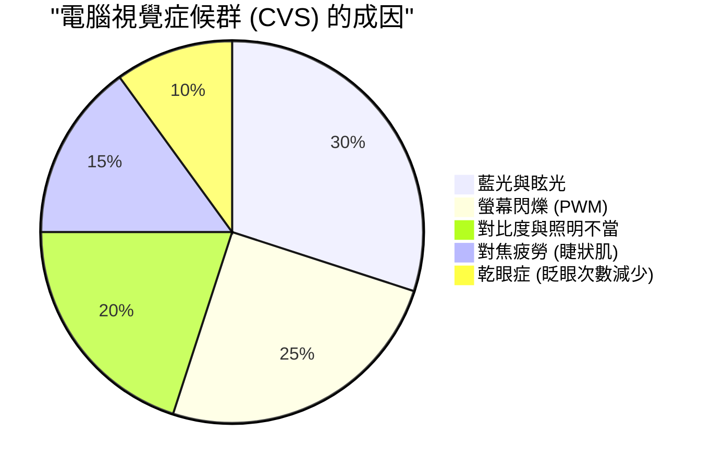
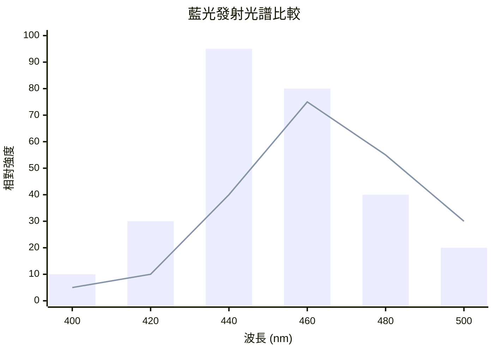
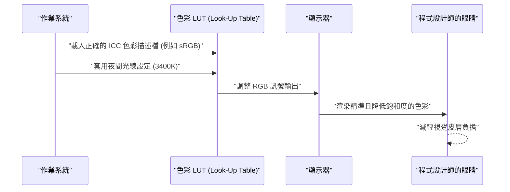
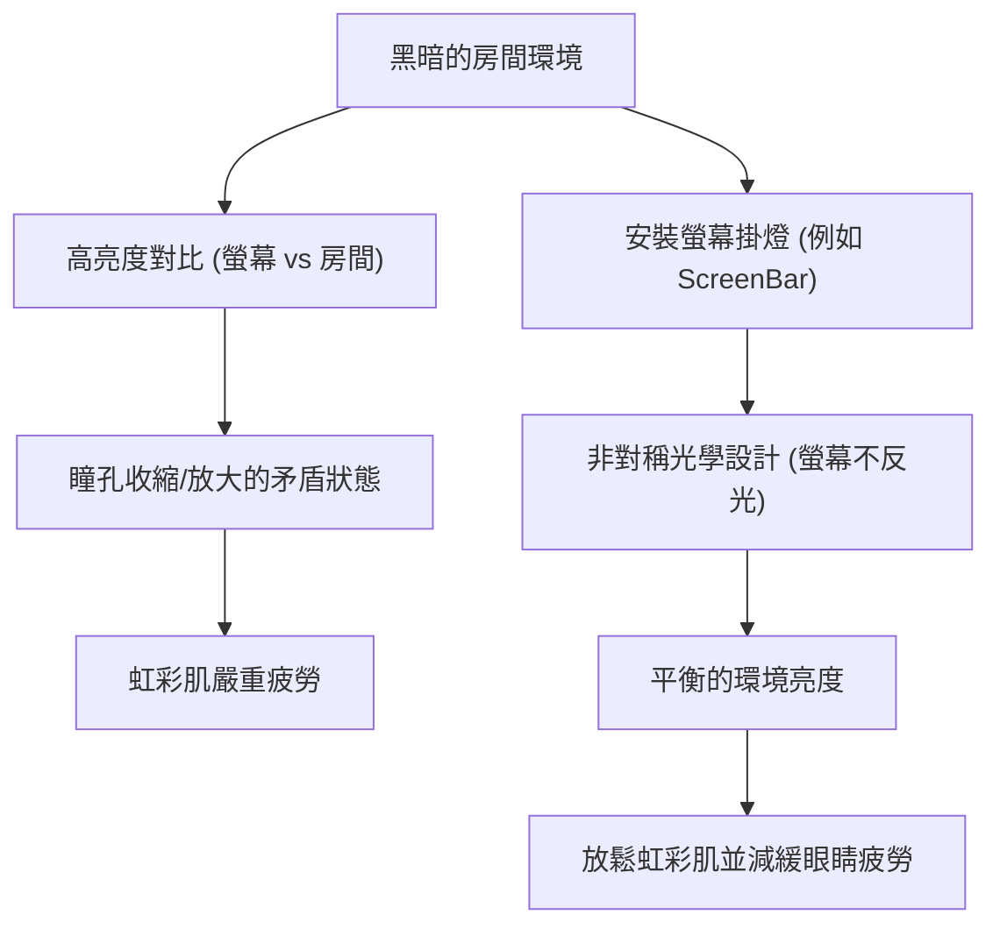

對程式設計師和軟體工程師來說，「眼睛」是最重要且最常被過度使用的生財工具。在每天需要面對編輯器、終端機和瀏覽器畫面 8 到 10 個小時，甚至更長時間的生活中，幾乎所有的工程師都會面臨「電腦視覺症候群（Computer Vision Syndrome: CVS）」，也就是眼睛疲勞的問題。

一般來說，對於眼睛疲勞的對策，往往侷限於「點眼藥水」、「適度休息」、「戴抗藍光眼鏡」等表面上的建議。然而，身為工程師，我們應該找出問題的根本原因（Root Cause），並從系統（環境）層面進行最佳化。

本文將從物理學（光學）、生物化學、人體工學，以及顯示器硬體架構的觀點出發，徹底剖析程式設計師眼睛疲勞的機制，並透過數學公式和圖解深入探討能減輕此症狀的終極螢幕設定與小工具。

---

# 第1章：從物理與生物化學解開電腦視覺症候群（CVS）的機制

電腦視覺症候群（CVS）並非由單一因素所引起。如下方的圓餅圖所示，它是多種因素錯綜複雜地交織在一起，進而導致眼睛疲勞、疼痛、乾眼症，甚至是全身的疲勞感。



在此，我們將針對影響特別大的「光的物理特性」與「眼球的對焦調節功能」進行解說。

## 1.1 藍光的物理特性與光子能量

顯示器發出的藍光（藍色光）大約落在 $400 \text{ nm} \sim 490 \text{ nm}$ 的波長範圍。為何這會對眼睛造成負擔，可以透過量子力學基礎的「普朗克-愛因斯坦關係式」來解釋。

光所帶有的能量 $E$ 可以用以下數學公式表示：

$$ E = h\nu = \frac{hc}{\lambda} $$

其中，各變數的意義如下：
- $E$ : 每個光子（Photon）的能量 (Joule)
- $h$ : 普朗克常數 ($6.626 \times 10^{-34} \text{ J}\cdot\text{s}$)
- $c$ : 真空中的光速 ($3.0 \times 10^8 \text{ m/s}$)
- $\lambda$ : 光的波長 (m)
- $\nu$ : 光的頻率 (Hz)

這個數學公式所揭示的重要事實是，**「光的能量 $E$ 與波長 $\lambda$ 成反比」**。也就是說，在可見光中波長最短的藍光，具有極高的能量。這種高能量的光子不易被角膜或水晶體吸收和衰減，會直接到達視網膜深處，對視細胞造成強烈的氧化壓力。

## 1.2 色差（Chromatic Aberration）與焦點偏移

進一步從光學的角度來看，光波長的不同會產生「折射率」的差異。介質（在這裡指水晶體等）的折射率 $n$ 依賴於波長 $\lambda$，可以透過柯西色散公式（Cauchy's equation）來近似。

$$ n(\lambda) = B + \frac{C}{\lambda^2} $$

($B, C$ 為介質固有的常數)

從這個公式可以看出，波長 $\lambda$ 越短的藍光，折射率 $n$ 越大。因此，即使是在紅光等光線恰好在視網膜上聚焦的狀態下，藍光也會產生較大的折射，並在**視網膜前方**成像。
當大腦意識到這種「由藍光引起的影像模糊（色差）」時，就會不斷地向睫狀肌發出重新對焦的指令。這是導致眼部肌肉在無意識下逐漸疲勞的一大主因。

## 1.3 對焦調節肌（睫狀肌）與透鏡公式

當我們將焦點對準螢幕上的細小文字時，眼睛內部會調節水晶體（透鏡）的厚度。薄透鏡公式如下：

$$ \frac{1}{f} = \frac{1}{a} + \frac{1}{b} $$

- $f$: 水晶體的焦距
- $a$: 眼睛到螢幕的距離（物距）
- $b$: 水晶體到視網膜的距離（像距：成人眼球大約固定為 $24 \text{ mm}$）

在編寫程式時，如果與螢幕的距離 $a$ 長期處於較短的狀態（例如：$40 \text{ cm} \sim 50 \text{ cm}$），為了在視網膜上形成準確的影像（保持 $b$ 恆定），就必須維持極短的焦距 $f$。當睫狀肌極度收縮的狀態持續數小時，肌肉就會陷入痙攣，進而引發伴隨肩頸痠痛和頭痛的嚴重眼睛疲勞。

---

# 第2章：硬體顯示器的選擇與疲勞因素的排除

為了減輕眼睛疲勞，在進行軟體設定之前，必須先確認並改善硬體的規格。特別是「調光方式」和「螢幕更新率」是絕對不能妥協的重點。

## 2.1 PWM調光的恐怖：揭開看不見的閃爍

調整液晶（LCD）或有機發光二極體（OLED）螢幕亮度的技術，主要可分為「DC（直流電）調光」和「PWM（脈衝寬度調變）調光」兩種。

PWM調光是透過讓人眼無法察覺的高速閃爍背光 LED，並利用「亮起時間」與「熄滅時間」的比例來模擬調整畫面亮度的技術。根據PWM的空占比（Duty Cycle），其平均亮度 $L$ 可以用以下公式表示：

$$ L = L_{max} \times \frac{T_{on}}{T_{on} + T_{off}} \times 100 \ (\%) $$

- $T_{on}$ : LED 亮起的時間
- $T_{off}$ : LED 熄滅的時間
- $L_{max}$ : 峰值時的最大亮度

當 PWM 調光的頻率較低（例如：$200 \text{ Hz} \sim 300 \text{ Hz}$）時，即使在意識上感覺不到畫面的閃爍（Flicker），大腦和瞳孔也會在無意識中對光的閃爍產生反應，導致瞳孔不斷地放大與收縮。這會引發極度疲勞、頭痛，甚至是噁心感。

**【PWM 的檢測方法與對策】**
要確認自己的螢幕是否為 PWM 調光，可以開啟智慧型手機的相機應用程式，使用「慢動作攝影」模式拍攝螢幕的白色畫面（如瀏覽器的空白頁面）。如果影片中出現移動的黑色條紋（Banding），就表示該螢幕採用的是低頻的 PWM 調光。
程式設計師在挑選螢幕時，絕對應該選擇規格表上明確標示為**「不閃屏（DC調光）」**的產品。

## 2.2 螢幕更新率（Hz）與動態模糊在眼科學上的影響

螢幕更新率是指顯示器每秒鐘重繪畫面的次數（Hz）。
一般的辦公室螢幕為 $60 \text{ Hz}$，但近年來 $120 \text{ Hz}$ 或 $144 \text{ Hz}$ 的高更新率螢幕已經相當普及。這不僅對遊戲玩家有益，對程式設計師來說也是極為有利的。

當捲動大量程式碼或在終端機中查看快速捲動的日誌時，在 $60 \text{ Hz}$ 的顯示器上，加上像素反應時間的限制，很容易產生「動態模糊（殘影）」。眼睛在捲動過程中會無意識地試圖捕捉文字的形狀並持續對焦，但如果文字是模糊的，大腦視覺皮層的處理負載就會急劇飆升。
如果是 $120 \text{ Hz}$ 以上的顯示器，即使在捲動中文字也能清晰可見，因此可以大幅減少這種無意識的眼球運動和對焦調節的負擔。

## 2.3 面板類型與對比度（IPS, VA, OLED）

畫面的對比度直接關係到文字的清晰度。
「韋伯-費希納定律」指出，人類的感覺量與刺激的對數成正比，其公式如下：

$$ p = k \ln \left( \frac{S}{S_0} \right) $$

（$p$: 感覺量, $S$: 刺激的物理量, $S_0$: 閾值, $k$: 常數）

也就是說，相較於絕對的亮度，人類的眼睛對「相對亮度的比例（對比度）」反應更為強烈。
當需要長時間閱讀具有語法突顯（Syntax Highlighting）的程式碼時，黑色下潛更深（對比度高）的 VA 面板（$3000:1$），或是能以像素為單位完全關閉背光的 OLED 面板（$1,000,000:1$起跳），都能讓文字的輪廓變得非常清晰，從而提升閱讀體驗。
然而，正如後文所述，若在全黑的房間觀看對比度極高的螢幕，瞳孔會因過度收縮而感到疲勞，因此必須與環境光取得平衡。

下方的圖表比較了標準的 LCD 螢幕與近年備受關注的 OLED（低藍光設計）發光光譜的差異。



---

# 第3章：螢幕校色與作業系統及軟體設定

與挑選硬體同等重要的，是作業系統端的色彩空間管理和螢幕校色。

## 3.1 色域（sRGB vs DCI-P3）的陷阱與 ICC 色彩描述檔

近期的螢幕常以具備 DCI-P3 覆蓋率 95% 以上的「廣色域」為賣點，但這在程式開發用途上有時反而會成為缺點。
在 Windows 環境下，若未套用正確的 ICC 色彩描述檔（由國際色彩聯盟所制定的色彩設定檔）就使用廣色域螢幕，那些原本基於標準 sRGB 指定的 VS Code 語法突顯顏色（例如紅色或綠色的警告色），將會呈現出極度不自然的飽和度（過飽和狀態）。
這些強烈的色彩會對眼睛造成強大刺激，因此強烈建議從作業系統的顯示器設定中安裝正確的 ICC 色彩描述檔，或者在螢幕的 OSD 設定中切換至「sRGB 模擬模式」。

下方的循序圖顯示了套用正確的 ICC 色彩描述檔，直至渲染出對眼睛舒適的色彩的過程。



## 3.2 軟體的應對措施（f.lux / 夜間光線）

作為抗藍光的對策，最簡單且有效的方法是使用能根據時間動態調整色溫（Color Temperature）的軟體。
- Windows: **夜間光線（Night Light）**
- macOS: **夜覽（Night Shift）**
- 第三方軟體: **f.lux**

色溫以克耳文（$\text{K}$）為單位表示。白天的陽光大約是 $5500\text{K} \sim 6500\text{K}$（帶藍的白光），如果眼睛持續接收這種光線，大腦松果體分泌「褪黑激素（睡眠荷爾蒙）」的作用就會受到抑制。
到了傍晚之後，可透過這些軟體將色溫降低到 $3400\text{K} \sim 1900\text{K}$（暖色系的橘色到紅色）。這不僅能物理性地減少藍光的發光量，也有助於維持正常的晝夜節律（生理時鐘），同時防止高能量光子到達眼球。

---

# 第4章：終極硬體解決方案：導入最新小工具

如果上述說明的對策仍無法消除疲勞，那就必須投資外部小工具，以徹底改變周圍的環境。

## 4.1 偏置照明（Bias Lighting）與螢幕掛燈（ScreenBar）

在黑暗的房間中注視明亮的螢幕，會造成視野中心（高亮度）與周圍（低亮度）之間產生極大的對比。這被稱為**「不適眩光（Discomfort Glare）」**。
在這種環境下，眼睛會為了接收光線而試圖放大瞳孔，同時又為了抵擋中心的刺眼強光而試圖縮小瞳孔。這種矛盾的狀態會導致虹彩肌嚴重疲勞。

解決這個問題的方法是採用「偏置照明（Bias Lighting）」。
特別推薦像 **BenQ ScreenBar** 這種「螢幕掛燈」。



ScreenBar 的最大特色在於其「非對稱光學設計（Asymmetrical Optical Design）」。透過特殊的反射板和透鏡，它不會將光線直接照射到螢幕表面（防止螢幕反光和眩光），而是均勻地照亮手邊的鍵盤以及螢幕後方的空間。這能大幅減緩整個視野的亮度差異（對比度），從而消除眼睛的負擔。

## 4.2 E-Ink 顯示器的典範轉移（Dasung & Boox）

在閱讀冗長的 API 參考文件、技術書籍（PDF）或原始碼時，現代終極的解決方案可以說是**將「E-Ink（電子紙）顯示器」作為副螢幕使用**。

與液晶或 OLED 不同，E-Ink 沒有自體發光的背光模組。它是透過電壓使膠囊內帶電的黑白顏料粒子（如二氧化鈦等）移動（電泳技術），並藉由反射周圍的環境光來顯示文字。
- **物理性的藍光發光量：零**
- **伴隨 PWM 或畫面更新的閃爍：完全為零**

如果將 **Dasung Paperlike** 系列（如 25.3 吋）或 **Onyx Boox Mira** 等 E-Ink 螢幕直立放置，作為純文字專用的副螢幕，就能體驗到如同閱讀紙本印刷品般的文件閱讀感受。
雖然它有畫面重繪延遲（更新率較低）的弱點，但若僅限於程式開發環境中的「靜態文字閱讀」用途，這世界上恐怕沒有比它對眼睛更友善的設備了。

---

# 第5章：人體工學（Ergonomics）與運作規則

無論準備了多麼頂級的硬體設備，如果操作者的姿勢或使用規則錯誤，也是徒勞無功。

## 5.1 乾眼症的流體力學與視線角度

乾眼症不僅僅是「眼睛乾澀」的不適感，角膜表面的淚液層一旦被破壞，就會導致光線漫反射、視線模糊，進而造成更嚴重的眼睛疲勞（睫狀肌過度使用），形成惡性循環。
淚液的蒸發量與眼球接觸空氣的表面積（眼裂面積）成正比。

理想的螢幕配置視線角度 $\theta$，應該在水平線下方 $15^\circ \sim 20^\circ$ 之間。
假設螢幕中心到眼睛的水平距離為 $d$，螢幕中心與眼睛高度的高低差為 $h$，則適用以下三角函數：

$$ \tan \theta = \frac{h}{d} $$

舉例來說，若與螢幕的距離 $d$ 為 $60 \text{ cm}$（一般辦公桌環境），要使 $\theta = 15^\circ$ 的話：

$$ h = 60 \times \tan(15^\circ) \approx 60 \times 0.267 = 16.02 \text{ cm} $$

換言之，**螢幕的中心點最好低於眼睛高度約 $16 \text{ cm}$**。
藉由視線微幅向下，上眼瞼會自然垂下，進而減少眼球的暴露面積，從而大幅防止淚液蒸發。強烈建議導入螢幕支架（如 Ergotron 等），並將這個高度調整到以毫米為單位的精準度。

## 5.2 徹底執行並自動化世界標準的「20-20-20 法則」

美國眼科醫學會（AAO）以及世界各地眼科醫師所推崇的數位裝置使用時舒緩眼睛疲勞的方法，就是**「20-20-20 法則」**。

**『每 20 分鐘，眺望 20 英尺（約 6 公尺）以外的距離，維持 20 秒』**

透過這個簡單的動作，可以強迫極度收縮的睫狀肌放鬆，使水晶體變薄，並重設對焦調節功能。
由於程式設計師進入心流狀態時往往會忘記時間，因此建立一套自動強制執行此法則的機制，才是符合工程師風格的解決方案。
以下是一個極為簡單的 Python 腳本範例，使用 `tkinter` 每 20 分鐘強制顯示一次彈出視窗。

```python
import time
import tkinter as tk
from tkinter import messagebox

def remind_20_20_20():
    # 隱藏主視窗
    root = tk.Tk()
    root.withdraw()
    
    while True:
        # 等待 20 分鐘 (1200 秒)
        time.sleep(20 * 60)
        
        # 在最上層顯示警告對話方塊
        messagebox.showinfo(
            title="20-20-20 Rule",
            message="請將視線離開螢幕，眺望 6 公尺外至少 20 秒！\n(讓睫狀肌放鬆)"
        )
        
        # 用於放鬆的 20 秒鐘
        time.sleep(20)

if __name__ == '__main__':
    # 在背景執行
    remind_20_20_20()
```

透過將這樣的腳本註冊到開機啟動項，或利用作業系統內建的工作排程器、Cron 來執行，就能將強制恢復的週期融入日常生活中。

---

# 結語：將眼睛疲勞對策視為對未來的投資

我們軟體工程師的職涯長達數十年。而支撐這段職涯的，不是昂貴的鍵盤，也不是最新款的 CPU，毫無疑問，而是我們自己的「眼睛」與「大腦」。

1. **理解光能量 ($E = hc/\lambda$) 與對焦調節所帶來的物理負荷**
2. **導入不閃屏（DC調光）且具備高螢幕更新率的顯示器**
3. **使用 ScreenBar 等偏置照明，最佳化環境的相對對比度**
4. **考慮將 E-Ink 螢幕作為終極的純文字閱讀設備**
5. **使用螢幕支架打造基於 $\tan \theta = h/d$ 的最佳視線角度，並將「20-20-20 法則」系統化**

這些對策或許會伴隨著短期的花費和功夫，但為了延長眼睛的健康壽命，並將一生中的生產力和生活品質（QOL）最大化，這可以說是最具成本效益的「技術投資」。請立即重新檢視自己的開發環境，將對眼睛的體貼實作進去吧。
