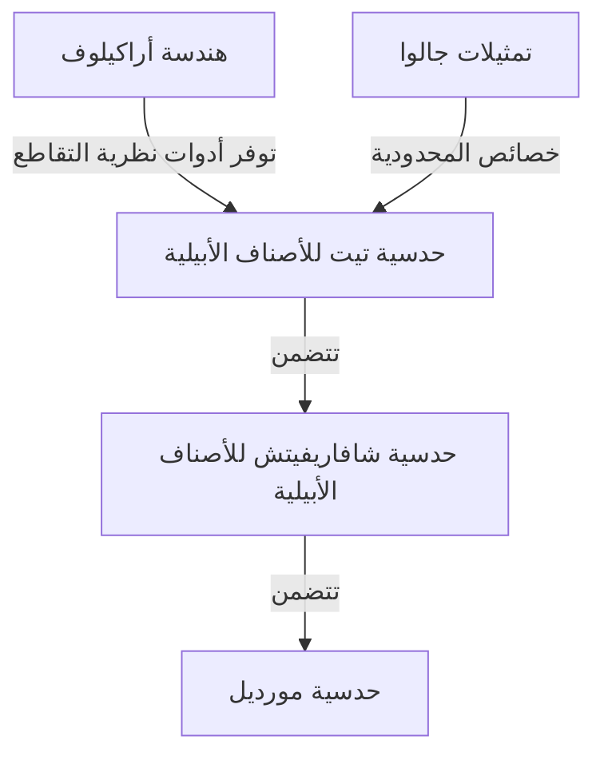
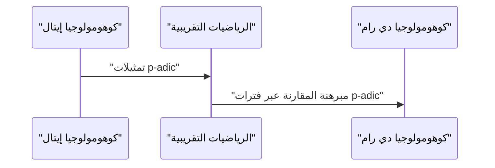

## 1. مقدمة: عملاق نظرية الأعداد الحديثة

يُعتبر [جيرد فالتينجز](https://kenji.blog/ar/p/faltings/) على نطاق واسع أحد أعمق علماء الهندسة الحسابية وأكثرهم تأثيراً في مجتمع الرياضيات من أواخر القرن العشرين وحتى القرن الحادي والعشرين. على وجه الخصوص، يقف برهانه على **حدسية مورديل** الذي حققه في عام 1983 كمعلم أثري لامع في تاريخ نظرية الأعداد والهندسة الجبرية. في هذا المقال، سنشرح بالتفصيل حياته، ونهجه الرياضي الفريد، والإنجازات الثورية التي قدمها لعالم الرياضيات.

## 2. حياته المبكرة ومسيرته

ولد فالتينجز في 28 يوليو 1954 في غلزنكيرشن، شمال الراين-وستفاليا، في ما كان يُعرف آنذاك بألمانيا الغربية. منذ سن مبكرة جدًا، أظهر موهبة استثنائية في الرياضيات والعلوم الطبيعية. عند دخوله جامعة مونستر، انغمس تماماً في البحث الرياضي، وأذهل من حوله بفهمه وحدسه المذهلين.

في عام 1978، حصل على درجة الدكتوراه تحت إشراف هانز-يواكيم ناستولد. تضمنت أبحاثه المبكرة الجبر التبادلي والهندسة الجبرية، واحتوت على رؤى عميقة حول خصائص الحلقات المحلية والكوهومولوجيا. بعد ذلك، صقل مواهبه في بيئات بحثية دولية، حيث عمل كمساعد في جامعة مونستر ثم ذهب لاحقاً إلى جامعة هارفارد كباحث ما بعد الدكتوراه. في عام 1982، تولى منصب أستاذ في جامعة فوبرتال، ليصبح نجماً صاعداً في مجتمع الرياضيات الألماني.

## 3. إنجاز تاريخي: حل حدسية مورديل

ما حفر اسم فالتينجز إلى الأبد في تاريخ الرياضيات كان بلا شك حله لـ **حدسية مورديل**. هذه الحدسية التي اقترحها [لويس مورديل](https://kenji.blog/ar/p/mordell/) في عام 1922 كانت مسألة عميقة للغاية تتعلق بعدد الحلول النسبية للمعادلات الديوفانتية.

ينص بيان الحدسية على ما يلي:

> المنحنى الجبري المعرف على حقل أعداد جبرية $K$ ذو جنس $g \ge 2$ يمتلك عدداً محدوداً فقط من النقاط النسبية على $K$.

كانت هذه الحدسية مرتبطة ارتباطًا وثيقًا بمبرهنة فيثاغورس و[مبرهنة فيرما الأخيرة](https://kenji.blog/ar/p/fermats-last-theorem/)، وكانت مسألة هائلة تحدت العديد من علماء الرياضيات العباقرة وفشلوا فيها على مر السنين.

هاجم فالتينجز هذه المسألة من خلال التلاعب بمهارة بالآليات الضخمة للهندسة الجبرية التي بناها [ألكسندر غروتينديك](https://kenji.blog/ar/p/grothendieck/)، مثل نظرية المخططات والكوهومولوجيا الإيتالية، ومن خلال تقديم إطار عمل جديد يُسمى هندسة أراكيلوف.

على الرغم من أن البنية المنطقية لبرهانه معقدة للغاية، إلا أنه يمكن تقسيم الفكرة الأساسية إلى المراحل الثلاث التالية (براهين الحدسيات).

برهن في البداية على **حدسية تيت** للأصناف الأبيلية واستخدمها لحل **حدسية شافاريفيتش**. ثم، باستخدام حيلة بارشين، والتي تنص على أنه إذا صحت حدسية شافاريفيتش فإن حدسية مورديل تصح أيضاً، وصل إلى النتيجة النهائية.

بالتعبير الرياضي، بالنسبة لمنحنى $C$ ذو جنس $g(C) \ge 2$، فإن عدد عناصر مجموعة النقاط النسبية $C(K)$ هو عدد محدود.
$$ |C(K)| < \infty \quad \text{من أجل } g(C) \ge 2 $$

لهذا الإنجاز المذهل، حصل فالتينجز على **ميدالية فيلدز**، وهي أعلى وسام في مجتمع الرياضيات، في المؤتمر الدولي لعلماء الرياضيات (ICM) الذي عُقد في بيركلي عام 1986.

## 4. هندسة أراكيلوف وارتفاع فالتينجز

لعب تطور هندسة أراكيلوف دوراً حاسماً في برهان حدسية مورديل. هذه النظرية التي أسسها سورين أراكيلوف كانت رائدة من حيث أنها دمجت المعلومات التحليلية في الأماكن اللانهائية (التقييمات الأرخميدية) في مخططات على حلقات الأعداد الصحيحة لحقول الأعداد.

طبق فالتينجز هندسة أراكيلوف هذه على نظرية التقاطع للأصناف الأبيلية وقدم المفهوم الذي يُسمى الآن **ارتفاع فالتينجز**. وهذا مقياس "للتعقيد" الحسابي للصنف الأبيلي وأصبح المفتاح لبرهان مبرهنات المحدودية.

## 5. مساهمات هائلة في نظرية هودج p-adic

حتى بعد حل حدسية مورديل، لم يعرف إبداع فالتينجز حدوداً. فقد حقق لاحقاً نتائج تصنع حقبة جديدة في مجال **نظرية هودج p-adic**.

كانت "مبرهنة المقارنة p-adic"، التي حدس بها جان-مارك فونتين وآخرون، مسألة صعبة بشكل ملحوظ لربط نظريتي كوهومولوجيا مختلفتين للأصناف الجبرية p-adically: الكوهومولوجيا الإيتالية وكوهومولوجيا دي رام.

طور فالتينجز طريقة جبرية جديدة كلياً تسمى "الرياضيات التقريبية" (Almost Mathematics) وبرهن بشكل كامل على مبرهنة المقارنة هذه.

بسبب هذا، تقدم فهم الظواهر p-adic في الهندسة الحسابية بشكل كبير، مما مهد الطريق مباشرة إلى طليعة الرياضيات الحديثة، مثل نظرية الفضاءات البيرفكتويدية التي طورها لاحقاً بيتر شولتز.

## 6. أسلوب البحث والتأثير على الخلفاء

يُعرف فالتينجز بأسلوبه الرياضي الصارم الذي لا يقبل المساومة وببصيرته العميقة. أوراقه البحثية مكثفة للغاية، حيث يتم تعبئة المنطق بدقة في كل التفاصيل، مما يتطلب مستوى متقدم من المعرفة المتخصصة وجهد هائل لفك تشفيرها.

طوال فترة عمله كأستاذ في جامعة برينستون وكمدير لمعهد ماكس بلانك للرياضيات، أشرف على العديد من علماء الرياضيات الشباب اللامعين. كانت ندواته ومحاضراته مشهورة بكونها "متطلبة للغاية"، وكانت أي بيانات غير دقيقة أو فهم غامض تقابل فوراً بانتقادات حادة. ومع ذلك، كان هذا الصرامة أيضاً انعكاساً لاحترامه الخالص للحقيقة الرياضية وعاطفته لتربية الجيل القادم ليكونوا باحثين حقيقيين.

## 7. خاتمة

سيُتداول اسم [جيرد فالتينجز](https://kenji.blog/ar/p/faltings/) إلى الأبد كحلال لـ **حدسية مورديل**. ومع ذلك، فإن عظمته الحقيقية لا تكمن فقط في حل مسألة صعبة واحدة، بل في خلق نماذج رياضية جديدة مثل هندسة أراكيلوف ونظرية هودج p-adic.

حتى اليوم، لا تزال النظريات والفلسفة التي ابتكرها تقدم إلهاماً هائلاً لعلماء الرياضيات في جميع أنحاء العالم. كلما حاولنا لمس هاوية نظرية الأعداد، فإن المسار الذي شقه فالتينجز يقع دائماً أمامنا.
