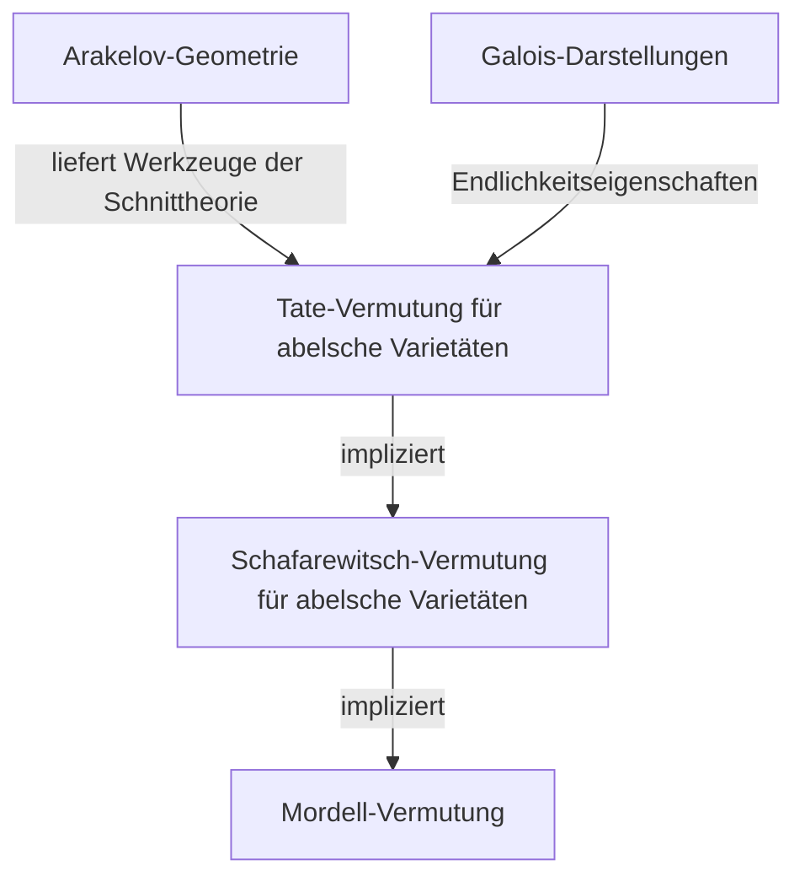
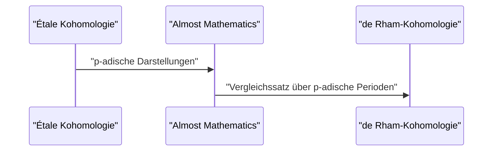

## 1. Einführung: Ein Gigant der modernen Zahlentheorie

[Gerd Faltings](https://kenji.blog/p/faltings/) ist weithin als einer der tiefgründigsten und einflussreichsten arithmetischen Geometer in der mathematischen Gemeinschaft vom späten 20. Jahrhundert bis ins 21. Jahrhundert anerkannt. Insbesondere sein 1983 vollbrachter Beweis der **Mordell-Vermutung** (Mordell Conjecture) steht als leuchtender Meilenstein in der Geschichte der Zahlentheorie und der algebraischen Geometrie. In diesem Artikel werden wir sein Leben, seinen einzigartigen mathematischen Ansatz und die revolutionären Errungenschaften, die er in die mathematische Welt brachte, ausführlich erläutern.

## 2. Frühes Leben und Karriere

Faltings wurde am 28. Juli 1954 in Gelsenkirchen, Nordrhein-Westfalen, im damaligen Westdeutschland geboren. Schon sehr früh zeigte er ein außergewöhnliches Talent für Mathematik und die Naturwissenschaften. Als er an die Universität Münster kam, tauchte er voll und ganz in die mathematische Forschung ein und erstaunte sein Umfeld mit seinem unglaublichen Verständnis und seiner Intuition.

1978 promovierte er unter der Leitung von Hans-Joachim Nastold. Seine frühen Forschungen befassten sich mit der kommutativen Algebra und der algebraischen Geometrie und enthielten tiefe Einblicke in die Eigenschaften lokaler Ringe und der Kohomologie. Danach verfeinerte er seine Talente in internationalen Forschungsumgebungen, arbeitete als Assistent an der Universität Münster und ging später als Postdoktorand an die Harvard University. 1982 übernahm er eine Professur an der Bergischen Universität Wuppertal und wurde zu einem jungen aufgehenden Stern in der deutschen Mathematikergemeinschaft.

## 3. Historische Errungenschaft: Die Lösung der Mordell-Vermutung

Was den Namen Faltings für immer in die Geschichte der Mathematik einprägte, war zweifellos seine Lösung der **Mordell-Vermutung**. Diese 1922 von [Louis Mordell](https://kenji.blog/p/mordell/) aufgestellte Vermutung war ein tiefgreifendes Problem bezüglich der Anzahl rationaler Lösungen von diophantischen Gleichungen.

Die Aussage der Vermutung lautet wie folgt:

> Eine algebraische Kurve über einem algebraischen Zahlkörper $K$ vom Geschlecht $g \ge 2$ hat nur endlich viele rationale Punkte über $K$.

Diese Vermutung war eng mit dem Satz des Pythagoras und dem Großen Fermatschen Satz verbunden und war ein gewaltiges Problem, an dem viele geniale Mathematiker im Laufe der Jahre gescheitert waren.

Faltings griff dieses Problem an, indem er die gewaltige Maschinerie der algebraischen Geometrie, die von [Alexander Grothendieck](https://kenji.blog/p/grothendieck/) aufgebaut worden war, wie die Schema-Theorie und die étale Kohomologie, geschickt manipulierte und außerdem einen neuen Rahmen namens Arakelov-Geometrie einführte.

Obwohl die logische Struktur seines Beweises hochkomplex ist, lässt sich die Kernidee in die folgenden drei Phasen (Beweise von Vermutungen) unterteilen.

Er bewies zunächst die **Tate-Vermutung** für abelsche Varietäten und nutzte sie zur Lösung der **Schafarewitsch-Vermutung**. Durch die Anwendung von Parshins Trick, der besagt, dass wenn die Schafarewitsch-Vermutung gilt, auch die Mordell-Vermutung gilt, gelangte er zur endgültigen Schlussfolgerung.

Mathematisch ausgedrückt, für eine Kurve $C$ mit dem Geschlecht $g(C) \ge 2$ ist die Mächtigkeit der Menge der rationalen Punkte $C(K)$ endlich.
$$ |C(K)| < \infty \quad \text{für } g(C) \ge 2 $$

Für diese erstaunliche Leistung wurde Faltings auf dem Internationalen Mathematikerkongress (ICM) 1986 in Berkeley mit der **Fields-Medaille**, der höchsten Auszeichnung in der mathematischen Gemeinschaft, geehrt.

## 4. Arakelov-Geometrie und Faltings-Höhe

Die Entwicklung der Arakelov-Geometrie spielte eine entscheidende Rolle beim Beweis der Mordell-Vermutung. Diese von Suren Arakelov begründete Theorie war bahnbrechend, da sie analytische Informationen an unendlichen Stellen (archimedische Bewertungen) in Schemata über den Ganzheitsringen von Zahlkörpern einbezog.

Faltings wandte diese Arakelov-Geometrie auf die Schnittheorie auf abelschen Varietäten an und führte das Konzept ein, das heute als **Faltings-Höhe** bezeichnet wird. Dies ist ein Maß für die arithmetische "Komplexität" einer abelschen Varietät und wurde zum Schlüssel für den Beweis der Endlichkeitssätze.

## 5. Immense Beiträge zur p-adischen Hodge-Theorie

Auch nach der Lösung der Mordell-Vermutung kannte Faltings' Kreativität keine Grenzen. Als Nächstes erzielte er epochemachende Ergebnisse auf dem Gebiet der **p-adischen Hodge-Theorie**.

Der "p-adische Vergleichssatz", der von Jean-Marc Fontaine und anderen vermutet worden war, war ein bemerkenswert schwieriges Problem der p-adischen Verbindung zweier verschiedener Kohomologietheorien algebraischer Varietäten: der étalen Kohomologie und der de Rham-Kohomologie.

Faltings entwickelte eine völlig neue algebraische Methode namens "Almost Mathematics" (Fast-Mathematik) und bewies diesen Vergleichssatz vollständig.

Dadurch wurde das Verständnis p-adischer Phänomene in der arithmetischen Geometrie dramatisch vorangetrieben und ebnete direkt den Weg an die Spitze der modernen Mathematik, wie etwa die später von Peter Scholze entwickelte Theorie der Perfektoiden Räume.

## 6. Forschungsstil und Einfluss auf Nachfolger

Faltings ist bekannt für seinen kompromisslos rigorosen mathematischen Stil und seine tiefe Einsicht. Seine Arbeiten sind extrem dicht, die Logik ist bis ins kleinste Detail durchgepackt, und sie erfordern ein hohes Maß an Spezialwissen und immense Anstrengungen, um sie zu entschlüsseln.

Während seiner Zeit als Professor an der Princeton University und als Direktor des Max-Planck-Instituts für Mathematik betreute er viele brillante junge Mathematiker. Seine Seminare und Vorlesungen waren dafür bekannt, "extrem anspruchsvoll" zu sein, und alle ungenauen Aussagen oder mehrdeutigen Erkenntnisse stießen sofort auf scharfe Kritik. Diese Strenge war jedoch auch ein Spiegelbild seines reinen Respekts vor der mathematischen Wahrheit und seiner Zuneigung, die nächste Generation zu echten Forschern heranzuziehen.

## 7. Fazit

Der Name [Gerd Faltings](https://kenji.blog/p/faltings/) wird für immer als der Löser der **Mordell-Vermutung** überliefert werden. Seine wahre Größe liegt jedoch nicht nur in der Lösung eines einzigen schwierigen Problems, sondern in der Schaffung neuer mathematischer Paradigmen wie der Arakelov-Geometrie und der p-adischen Hodge-Theorie.

Noch heute bieten die von ihm geschaffenen Theorien und Philosophien Mathematikern auf der ganzen Welt immense Inspiration. Wann immer wir versuchen, den Abgrund der Zahlentheorie zu berühren, liegt der von Faltings geschmiedete Weg immer vor uns.
