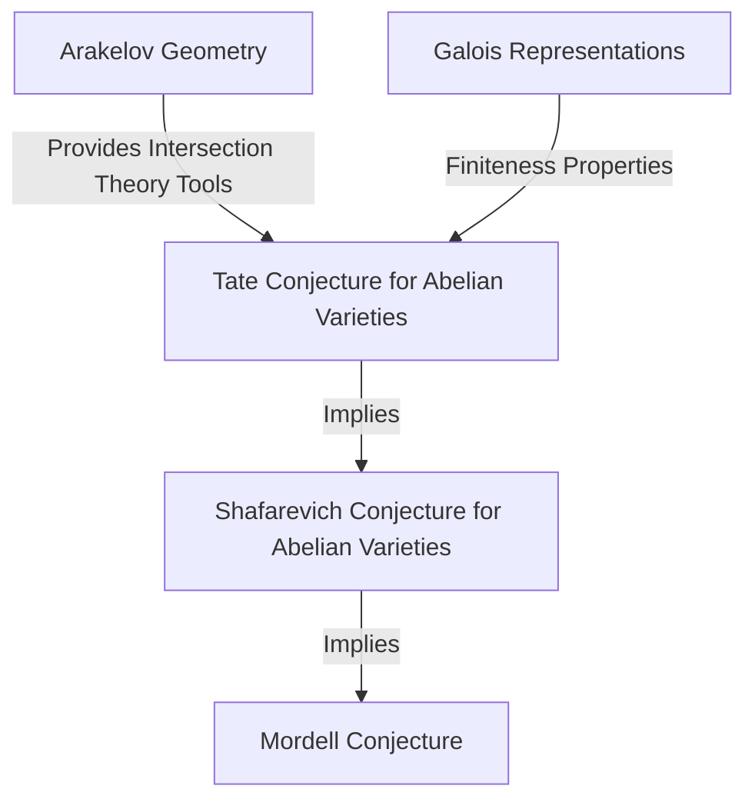
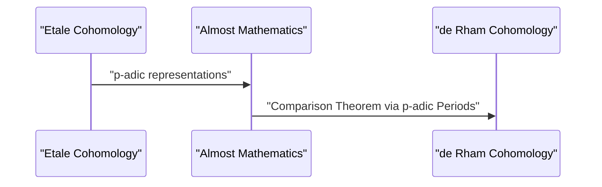

## 1. Introduction: A Giant of Modern Number Theory

[Gerd Faltings](https://kenji.blog/en/p/faltings/) is widely recognized as one of the deepest and most influential arithmetic geometers in the mathematics community from the late 20th century into the 21st century. In particular, his proof of the **Mordell Conjecture** achieved in 1983 stands as a brilliant monumental landmark in the history of number theory and algebraic geometry. In this article, we will thoroughly explain his life, his unique mathematical approach, and the revolutionary achievements he brought to the mathematical world.

## 2. Early Life and Career

Faltings was born on July 28, 1954, in Gelsenkirchen, North Rhine-Westphalia, in what was then West Germany. From a very early age, he showed an extraordinary talent for mathematics and the natural sciences. Upon entering the University of Münster, he immersed himself fully in mathematical research, astonishing those around him with his incredible comprehension and intuition.

In 1978, he obtained his Ph.D. under the supervision of Hans-Joachim Nastold. His early research involved commutative algebra and algebraic geometry, containing deep insights into the properties of local rings and cohomology. Afterwards, he honed his talents in international research environments, serving as an assistant at the University of Münster and later going to Harvard University as a postdoctoral researcher. In 1982, he took a professorship at the University of Wuppertal, becoming a young rising star in the German mathematical community.

## 3. Historic Achievement: Solving the Mordell Conjecture

What eternally engraved Faltings' name into the history of mathematics was undoubtedly his resolution of the **Mordell Conjecture**. Proposed by [Louis Mordell](https://kenji.blog/en/p/mordell/) in 1922, this conjecture was a profoundly deep problem regarding the number of rational solutions to Diophantine equations.

The statement of the conjecture is as follows:

> An algebraic curve over an algebraic number field $K$ of genus $g \ge 2$ has only finitely many rational points over $K$.

This conjecture was deeply related to the Pythagorean theorem and [Fermat's Last Theorem](https://kenji.blog/en/p/fermats-last-theorem/), and it was a formidable problem that many genius mathematicians had challenged and failed over the years.

Faltings attacked this problem by skillfully manipulating the massive machinery of algebraic geometry built by [Alexander Grothendieck](https://kenji.blog/en/p/grothendieck/), such as scheme theory and étale cohomology, and by further introducing a new framework called Arakelov geometry.

Although the logical structure of his proof is highly complex, the core idea can be divided into the following three stages (proofs of conjectures).

He first proved the **Tate conjecture** for abelian varieties and used it to resolve the **Shafarevich conjecture**. Then, by employing Parshin's trick, which states that if the Shafarevich conjecture holds then the Mordell conjecture also holds, he reached the final conclusion.

Expressed mathematically, for a curve $C$ of genus $g(C) \ge 2$, the cardinality of the set of rational points $C(K)$ is finite.
$$ |C(K)| < \infty \quad \text{for } g(C) \ge 2 $$

For this astonishing achievement, Faltings was awarded the **Fields Medal**, the highest honor in the mathematical community, at the International Congress of Mathematicians (ICM) held in Berkeley in 1986.

## 4. Arakelov Geometry and Faltings Height

The development of Arakelov geometry played a decisive role in the proof of the Mordell Conjecture. Founded by Suren Arakelov, this theory was groundbreaking in that it incorporated analytic information at infinite places (Archimedean valuations) into schemes over the rings of integers of number fields.

Faltings applied this Arakelov geometry to intersection theory on abelian varieties and introduced the concept now called the **Faltings height**. This is a measure of the arithmetic "complexity" of an abelian variety and became the key to proving the finiteness theorems.

## 5. Immense Contributions to p-adic Hodge Theory

Even after solving the Mordell Conjecture, Faltings' creativity knew no bounds. He next achieved epoch-making results in the field of **p-adic Hodge theory**.

The "p-adic comparison theorem," which had been conjectured by Jean-Marc Fontaine and others, was a remarkably difficult problem of p-adically connecting two different cohomology theories of algebraic varieties: étale cohomology and de Rham cohomology.

Faltings developed an entirely new algebraic method called "Almost Mathematics" and completely proved this comparison theorem.

Because of this, the understanding of p-adic phenomena in arithmetic geometry advanced dramatically, paving the way directly to the forefront of modern mathematics, such as the theory of Perfectoid Spaces later developed by Peter Scholze.

## 6. Research Style and Impact on Successors

Faltings is known for his uncompromisingly rigorous mathematical style and deep insight. His papers are highly dense, with logic thoroughly packed into every detail, requiring an advanced level of specialized knowledge and immense effort to decipher.

Throughout his time as a professor at Princeton University and as the director of the Max Planck Institute for Mathematics, he mentored many brilliant young mathematicians. His seminars and lectures were famous for being "extremely demanding," and any inaccurate statements or ambiguous understandings were immediately met with sharp criticism. However, this strictness was also a reflection of his pure respect for mathematical truth and his affection for raising the next generation into genuine researchers.

## 7. Conclusion

The name of [Gerd Faltings](https://kenji.blog/en/p/faltings/) will forever be passed down as the solver of the **Mordell Conjecture**. Yet, his true greatness lies not merely in solving a single hard problem, but in creating new mathematical paradigms such as Arakelov geometry and p-adic Hodge theory.

Even today, the theories and philosophy he created continue to provide immense inspiration to mathematicians around the world. Whenever we try to touch the abyss of number theory, the path forged by Faltings always lies ahead of us.
