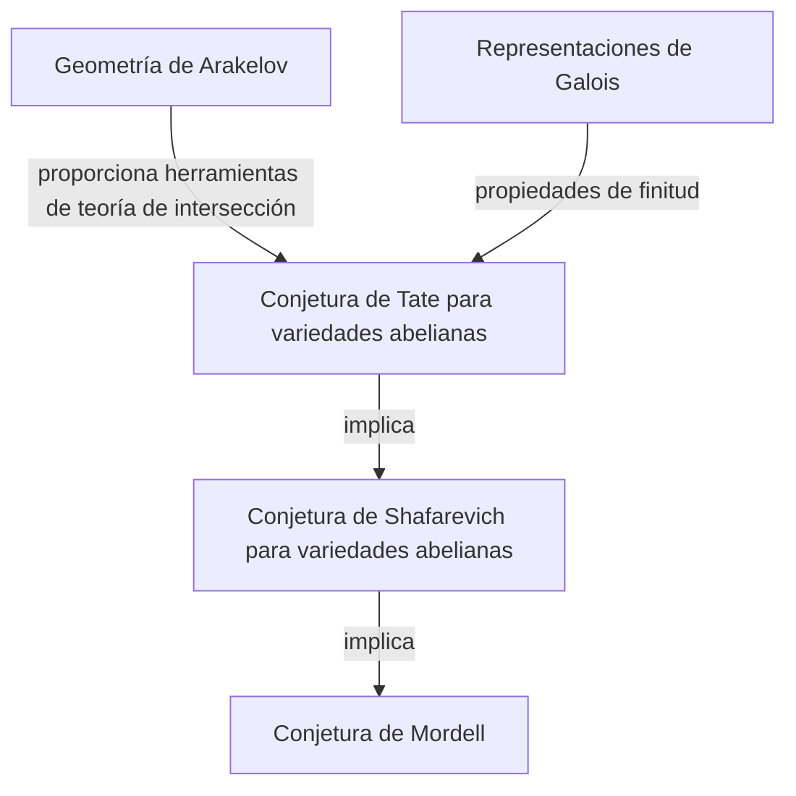
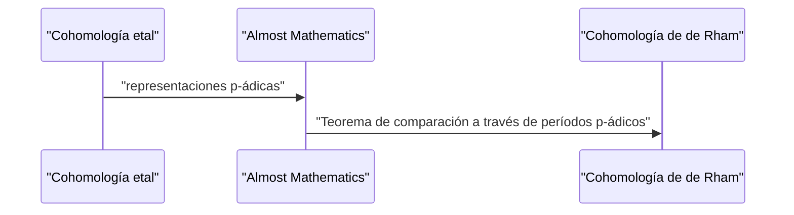

## 1. Introducción: Un gigante de la teoría de números moderna

[Gerd Faltings](https://kenji.blog/p/faltings/) es ampliamente reconocido como uno de los geómetras aritméticos más profundos e influyentes de la comunidad matemática desde finales del siglo XX hasta el siglo XXI. En particular, su demostración de la **Conjetura de Mordell** lograda en 1983 se erige como un brillante hito monumental en la historia de la teoría de números y la geometría algebraica. En este artículo, explicaremos detalladamente su vida, su enfoque matemático único y los logros revolucionarios que aportó al mundo matemático.

## 2. Primeros años y carrera

Faltings nació el 28 de julio de 1954 en Gelsenkirchen, Renania del Norte-Westfalia, en lo que entonces era Alemania Occidental. Desde muy temprana edad, mostró un talento extraordinario para las matemáticas y las ciencias naturales. Al ingresar a la Universidad de Münster, se sumergió de lleno en la investigación matemática, asombrando a quienes lo rodeaban con su increíble comprensión e intuición.

En 1978, obtuvo su doctorado bajo la supervisión de Hans-Joachim Nastold. Sus primeras investigaciones involucraron álgebra conmutativa y geometría algebraica, conteniendo profundas ideas sobre las propiedades de los anillos locales y la cohomología. Posteriormente, perfeccionó sus talentos en entornos de investigación internacionales, sirviendo como asistente en la Universidad de Münster y más tarde yendo a la Universidad de Harvard como investigador postdoctoral. En 1982, asumió una cátedra en la Universidad de Wuppertal, convirtiéndose en una joven estrella en ascenso en la comunidad matemática alemana.

## 3. Logro histórico: Resolución de la Conjetura de Mordell

Lo que grabó eternamente el nombre de Faltings en la historia de las matemáticas fue indudablemente su resolución de la **Conjetura de Mordell**. Propuesta por [Louis Mordell](https://kenji.blog/p/mordell/) en 1922, esta conjetura era un problema profundamente complejo con respecto al número de soluciones racionales de las ecuaciones diofánticas.

El enunciado de la conjetura es el siguiente:

> Una curva algebraica sobre un cuerpo numérico algebraico $K$ de género $g \ge 2$ tiene solo un número finito de puntos racionales sobre $K$.

Esta conjetura estaba profundamente relacionada con el teorema de Pitágoras y el Último Teorema de Fermat, y fue un problema formidable que muchos genios matemáticos habían desafiado y fallado a lo largo de los años.

Faltings atacó este problema manipulando hábilmente la enorme maquinaria de la geometría algebraica construida por [Alexander Grothendieck](https://kenji.blog/p/grothendieck/), como la teoría de esquemas y la cohomología etal, e introduciendo además un nuevo marco llamado geometría de Arakelov.

Aunque la estructura lógica de su demostración es altamente compleja, la idea central se puede dividir en las siguientes tres etapas (demostraciones de conjeturas).

Primero demostró la **Conjetura de Tate** para variedades abelianas y la usó para resolver la **Conjetura de Shafarevich**. Luego, empleando el truco de Parshin, que establece que si la conjetura de Shafarevich se cumple entonces la conjetura de Mordell también se cumple, llegó a la conclusión final.

Expresado matemáticamente, para una curva $C$ de género $g(C) \ge 2$, la cardinalidad del conjunto de puntos racionales $C(K)$ es finita.
$$ |C(K)| < \infty \quad \text{para } g(C) \ge 2 $$

Por este asombroso logro, Faltings fue galardonado con la **Medalla Fields**, el más alto honor en la comunidad matemática, en el Congreso Internacional de Matemáticos (ICM) celebrado en Berkeley en 1986.

## 4. Geometría de Arakelov y altura de Faltings

El desarrollo de la geometría de Arakelov jugó un papel decisivo en la demostración de la conjetura de Mordell. Fundada por Suren Arakelov, esta teoría fue pionera en el sentido de que incorporó información analítica en los lugares infinitos (valoraciones arquimedianas) en esquemas sobre los anillos de enteros de los cuerpos numéricos.

Faltings aplicó esta geometría de Arakelov a la teoría de intersección en variedades abelianas e introdujo el concepto que ahora se llama **altura de Faltings**. Esta es una medida de la "complejidad" aritmética de una variedad abeliana y se convirtió en la clave para demostrar los teoremas de finitud.

## 5. Inmensas contribuciones a la teoría de Hodge p-ádica

Incluso después de resolver la Conjetura de Mordell, la creatividad de Faltings no conoció límites. A continuación, logró resultados que marcaron una época en el campo de la **teoría de Hodge p-ádica**.

El "teorema de comparación p-ádico", que había sido conjeturado por Jean-Marc Fontaine y otros, era un problema notablemente difícil de conectar p-ádicamente dos teorías de cohomología diferentes de las variedades algebraicas: la cohomología etal y la cohomología de de Rham.

Faltings desarrolló un método algebraico completamente nuevo llamado "Almost Mathematics" (Casi matemáticas) y demostró completamente este teorema de comparación.

Debido a esto, la comprensión de los fenómenos p-ádicos en la geometría aritmética avanzó dramáticamente, allanando el camino directamente a la vanguardia de las matemáticas modernas, como la teoría de los Espacios Perfectoides desarrollada posteriormente por Peter Scholze.

## 6. Estilo de investigación e impacto en sus sucesores

Faltings es conocido por su estilo matemático intransigentemente riguroso y su profunda perspicacia. Sus trabajos son muy densos, con la lógica completamente empaquetada en cada detalle, requiriendo un nivel avanzado de conocimiento especializado e inmenso esfuerzo para descifrarlos.

A lo largo de su tiempo como profesor en la Universidad de Princeton y como director del Instituto Max Planck de Matemáticas, fue mentor de muchos jóvenes matemáticos brillantes. Sus seminarios y conferencias eran famosos por ser "extremadamente exigentes", y cualquier afirmación inexacta o comprensión ambigua recibía inmediatamente agudas críticas. Sin embargo, esta severidad era también un reflejo de su puro respeto por la verdad matemática y su afecto por criar a la próxima generación en verdaderos investigadores.

## 7. Conclusión

El nombre de [Gerd Faltings](https://kenji.blog/p/faltings/) se transmitirá para siempre como el solucionador de la **Conjetura de Mordell**. Sin embargo, su verdadera grandeza no reside simplemente en resolver un único problema difícil, sino en crear nuevos paradigmas matemáticos como la geometría de Arakelov y la teoría de Hodge p-ádica.

Incluso hoy en día, las teorías y la filosofía que creó continúan proporcionando una inmensa inspiración a matemáticos de todo el mundo. Siempre que intentamos tocar el abismo de la teoría de números, el camino forjado por Faltings siempre está ante nosotros.
