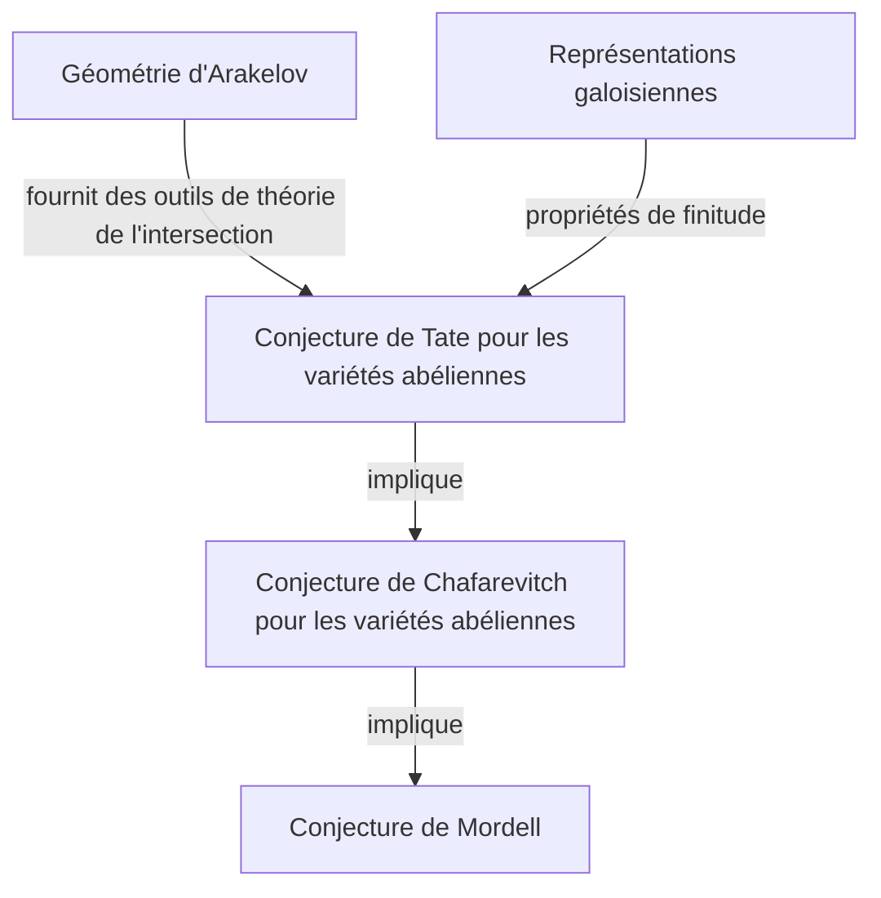
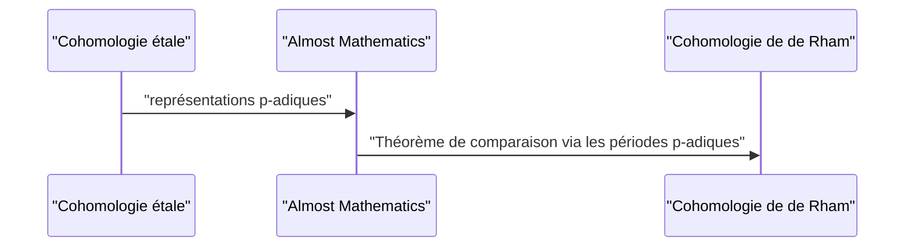

## 1. Introduction : Un géant de la théorie moderne des nombres

[Gerd Faltings](https://kenji.blog/p/faltings/) est largement reconnu comme l'un des géomètres arithmétiques les plus profonds et les plus influents de la communauté mathématique de la fin du 20e siècle au 21e siècle. En particulier, sa preuve de la **conjecture de Mordell** (Mordell Conjecture) réalisée en 1983 constitue un jalon monumental et brillant dans l'histoire de la théorie des nombres et de la géométrie algébrique. Dans cet article, nous expliquerons en détail sa vie, son approche mathématique unique et les réalisations révolutionnaires qu'il a apportées au monde mathématique.

## 2. Jeunesse et début de carrière

Faltings est né le 28 juillet 1954 à Gelsenkirchen, en Rhénanie-du-Nord-Westphalie, dans ce qui était alors l'Allemagne de l'Ouest. Dès son plus jeune âge, il a montré un talent extraordinaire pour les mathématiques et les sciences naturelles. En entrant à l'Université de Münster, il s'est pleinement plongé dans la recherche mathématique, étonnant son entourage par sa compréhension et son intuition incroyables.

En 1978, il obtient son doctorat sous la direction de Hans-Joachim Nastold. Ses premières recherches portaient sur l'algèbre commutative et la géométrie algébrique, contenant de profondes réflexions sur les propriétés des anneaux locaux et de la cohomologie. Par la suite, il a perfectionné ses talents dans des environnements de recherche internationaux, en tant qu'assistant à l'Université de Münster, puis en tant que chercheur postdoctoral à l'Université de Harvard. En 1982, il obtient un poste de professeur à l'Université de Wuppertal, devenant ainsi une jeune étoile montante de la communauté mathématique allemande.

## 3. Réalisation historique : La résolution de la conjecture de Mordell

Ce qui a gravé à jamais le nom de Faltings dans l'histoire des mathématiques est sans aucun doute sa résolution de la **conjecture de Mordell**. Proposée par [Louis Mordell](https://kenji.blog/p/mordell/) en 1922, cette conjecture était un problème très profond concernant le nombre de solutions rationnelles aux équations diophantiennes.

L'énoncé de la conjecture est le suivant :

> Une courbe algébrique définie sur un corps de nombres $K$ de genre $g \ge 2$ n'a qu'un nombre fini de points rationnels sur $K$.

Cette conjecture était profondément liée au théorème de Pythagore et au dernier théorème de Fermat, et c'était un problème redoutable que de nombreux mathématiciens de génie avaient tenté de résoudre en vain au fil des ans.

Faltings a attaqué ce problème en manipulant habilement la machinerie massive de la géométrie algébrique construite par [Alexandre Grothendieck](https://kenji.blog/p/grothendieck/), comme la théorie des schémas et la cohomologie étale, et en introduisant en outre un nouveau cadre appelé géométrie d'Arakelov.

Bien que la structure logique de sa preuve soit très complexe, l'idée centrale peut être divisée en les trois étapes suivantes (preuves de conjectures).

Il a d'abord prouvé la **conjecture de Tate** pour les variétés abéliennes et l'a utilisée pour résoudre la **conjecture de Chafarevitch**. Ensuite, en employant l'astuce de Parchine, qui stipule que si la conjecture de Chafarevitch est vraie alors la conjecture de Mordell est également vraie, il a atteint la conclusion finale.

Exprimé mathématiquement, pour une courbe $C$ de genre $g(C) \ge 2$, le cardinal de l'ensemble des points rationnels $C(K)$ est fini.
$$ |C(K)| < \infty \quad \text{pour } g(C) \ge 2 $$

Pour cette réalisation étonnante, Faltings a reçu la **médaille Fields**, la plus haute distinction de la communauté mathématique, lors du Congrès international des mathématiciens (ICM) tenu à Berkeley en 1986.

## 4. Géométrie d'Arakelov et hauteur de Faltings

Le développement de la géométrie d'Arakelov a joué un rôle décisif dans la preuve de la conjecture de Mordell. Fondée par Souren Arakelov, cette théorie était révolutionnaire dans la mesure où elle intégrait des informations analytiques aux places infinies (valuations archimédiennes) dans des schémas sur les anneaux d'entiers des corps de nombres.

Faltings a appliqué cette géométrie d'Arakelov à la théorie de l'intersection sur les variétés abéliennes et a introduit le concept aujourd'hui appelé **hauteur de Faltings**. C'est une mesure de la "complexité" arithmétique d'une variété abélienne et elle est devenue la clé pour prouver les théorèmes de finitude.

## 5. Contributions immenses à la théorie de Hodge p-adique

Même après avoir résolu la conjecture de Mordell, la créativité de Faltings ne connaissait aucune limite. Il a ensuite obtenu des résultats faisant époque dans le domaine de la **théorie de Hodge p-adique**.

Le "théorème de comparaison p-adique", qui avait été conjecturé par Jean-Marc Fontaine et d'autres, était un problème remarquablement difficile consistant à relier p-adiquement deux théories cohomologiques différentes des variétés algébriques : la cohomologie étale et la cohomologie de de Rham.

Faltings a développé une méthode algébrique entièrement nouvelle appelée "Almost Mathematics" (presque mathématiques) et a complètement prouvé ce théorème de comparaison.

Grâce à cela, la compréhension des phénomènes p-adiques en géométrie arithmétique a considérablement progressé, ouvrant directement la voie à l'avant-garde des mathématiques modernes, comme la théorie des espaces perfectoides développée plus tard par Peter Scholze.

## 6. Style de recherche et impact sur les successeurs

Faltings est connu pour son style mathématique d'une rigueur intransigeante et sa vision profonde. Ses articles sont très denses, la logique est minutieusement détaillée, nécessitant un niveau avancé de connaissances spécialisées et des efforts immenses pour les déchiffrer.

Tout au long de son mandat de professeur à l'Université de Princeton et de directeur de l'Institut Max-Planck de mathématiques, il a encadré de nombreux jeunes mathématiciens brillants. Ses séminaires et conférences étaient réputés pour être "extrêmement exigeants", et toute déclaration inexacte ou compréhension ambiguë se heurtait immédiatement à de vives critiques. Cependant, cette sévérité était aussi le reflet de son pur respect pour la vérité mathématique et de son affection pour l'élévation de la prochaine génération en véritables chercheurs.

## 7. Conclusion

Le nom de [Gerd Faltings](https://kenji.blog/p/faltings/) restera à jamais dans les mémoires comme celui qui a résolu la **conjecture de Mordell**. Pourtant, sa véritable grandeur ne réside pas seulement dans la résolution d'un problème difficile, mais dans la création de nouveaux paradigmes mathématiques tels que la géométrie d'Arakelov et la théorie de Hodge p-adique.

Aujourd'hui encore, les théories et la philosophie qu'il a créées continuent d'inspirer immensément les mathématiciens du monde entier. Chaque fois que nous essayons de toucher l'abîme de la théorie des nombres, le chemin tracé par Faltings s'offre toujours à nous.
