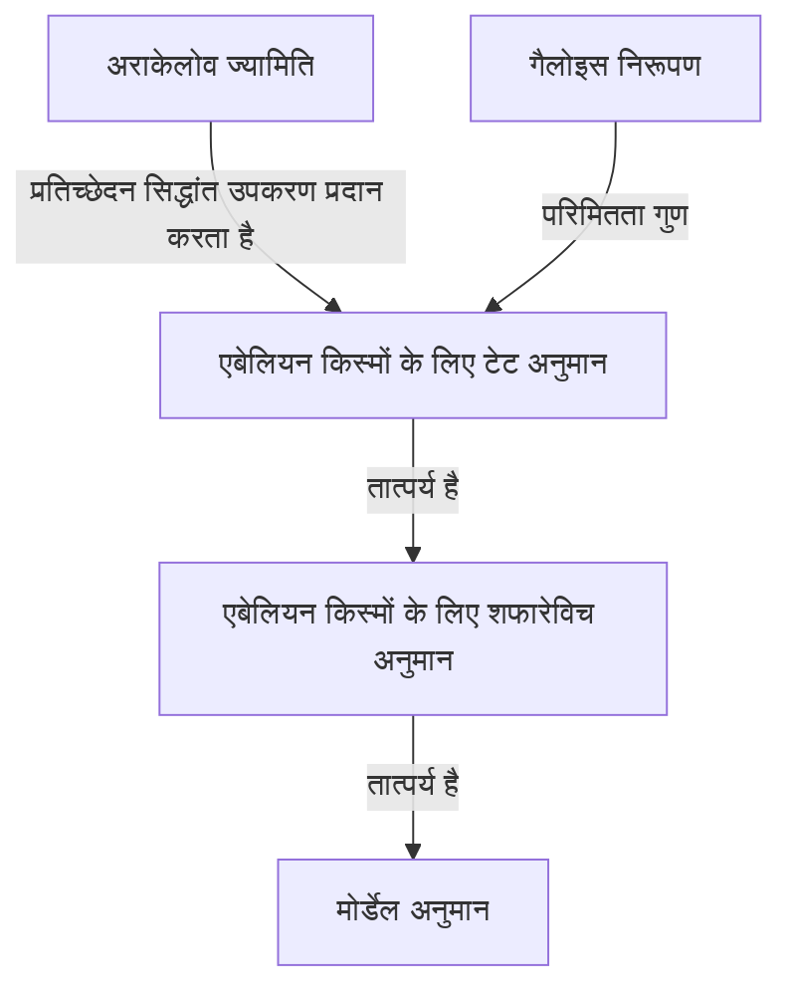
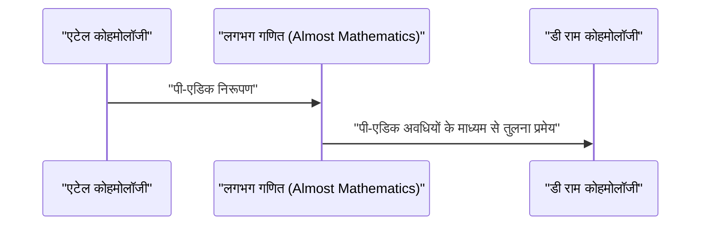

## 1. परिचय: आधुनिक संख्या सिद्धांत के एक दिग्गज

[गर्ड फाल्टिंग्स](https://kenji.blog/hi/p/faltings/) को 20वीं सदी के अंत से 21वीं सदी तक गणितीय समुदाय में सबसे गहरे और सबसे प्रभावशाली अंकगणितीय ज्यामितिज्ञों में से एक के रूप में व्यापक रूप से मान्यता प्राप्त है। विशेष रूप से, 1983 में उनके द्वारा प्राप्त **मोर्डेल अनुमान** (Mordell Conjecture) का प्रमाण संख्या सिद्धांत और बीजगणितीय ज्यामिति के इतिहास में एक शानदार स्मारकीय मील का पत्थर है। इस लेख में, हम उनके जीवन, उनके अद्वितीय गणितीय दृष्टिकोण और गणितीय दुनिया में उनके द्वारा लाई गई क्रांतिकारी उपलब्धियों के बारे में विस्तार से बताएंगे।

## 2. प्रारंभिक जीवन और करियर

फाल्टिंग्स का जन्म 28 जुलाई 1954 को गेलसेनकिर्चेन, नॉर्थ राइन-वेस्टफेलिया में हुआ था, जो उस समय पश्चिम जर्मनी था। बहुत कम उम्र से ही, उन्होंने गणित और प्राकृतिक विज्ञान के लिए एक असाधारण प्रतिभा दिखाई। मुंस्टर विश्वविद्यालय में प्रवेश करने पर, उन्होंने खुद को गणितीय अनुसंधान में पूरी तरह से डुबो दिया, और अपनी अविश्वसनीय समझ और अंतर्ज्ञान से अपने आस-पास के लोगों को चकित कर दिया।

1978 में, उन्होंने हंस-जोआचिम नास्टोल्ड की देखरेख में अपनी पीएचडी प्राप्त की। उनके प्रारंभिक शोध में कम्यूटेटिव बीजगणित और बीजगणितीय ज्यामिति शामिल थी, जिसमें स्थानीय वलय (local rings) और कोहमोलॉजी के गुणों के बारे में गहरी अंतर्दृष्टि शामिल थी। बाद में, उन्होंने अंतरराष्ट्रीय शोध वातावरण में अपनी प्रतिभा को निखारा, मुंस्टर विश्वविद्यालय में एक सहायक के रूप में कार्य किया और बाद में पोस्टडॉक्टरल शोधकर्ता के रूप में हार्वर्ड विश्वविद्यालय गए। 1982 में, उन्होंने वुप्पर्टल विश्वविद्यालय में प्रोफेसर का पद ग्रहण किया, और जर्मन गणितीय समुदाय में एक युवा उभरते हुए सितारे बन गए।

## 3. ऐतिहासिक उपलब्धि: मोर्डेल अनुमान का समाधान

जिस चीज ने गणित के इतिहास में फाल्टिंग्स का नाम हमेशा के लिए उकेर दिया, वह निस्संदेह **मोर्डेल अनुमान** का उनका समाधान था। 1922 में [लुईस मोर्डेल](https://kenji.blog/hi/p/mordell/) द्वारा प्रस्तावित, यह अनुमान डायोफैंटाइन समीकरणों के तर्कसंगत समाधानों की संख्या के संबंध में एक गहरा जटिल समस्या था।

अनुमान का कथन इस प्रकार है:

> जीनस $g \ge 2$ के बीजीय संख्या क्षेत्र $K$ पर एक बीजीय वक्र में $K$ पर केवल परिमित संख्या में परिमेय बिंदु होते हैं।

यह अनुमान पाइथागोरस के प्रमेय और फर्मेट के अंतिम प्रमेय से गहराई से संबंधित था, और यह एक दुर्जेय समस्या थी जिसे कई प्रतिभाशाली गणितज्ञों ने चुनौती दी थी और वर्षों से विफल रहे थे।

फाल्टिंग्स ने अलेक्जेंडर ग्रोटेंडिक द्वारा निर्मित बीजगणितीय ज्यामिति की विशाल मशीनरी, जैसे कि स्कीम थ्योरी और एटेल कोहमोलॉजी, को कुशलतापूर्वक हेरफेर करके और अराकेलोव ज्यामिति नामक एक नया ढांचा पेश करके इस समस्या पर हमला किया।

हालांकि उनके प्रमाण की तार्किक संरचना अत्यधिक जटिल है, लेकिन मुख्य विचार को निम्नलिखित तीन चरणों (अनुमानों के प्रमाण) में विभाजित किया जा सकता है।

उन्होंने पहले एबेलियन किस्मों के लिए **टेट अनुमान** साबित किया और इसका उपयोग **शफारेविच अनुमान** को हल करने के लिए किया। फिर, पर्शिन की चाल को नियोजित करके, जो बताता है कि यदि शफारेविच अनुमान सही है तो मोर्डेल अनुमान भी सही है, वे अंतिम निष्कर्ष पर पहुंचे।

गणितीय रूप से व्यक्त, जीनस $g(C) \ge 2$ के वक्र $C$ के लिए, तर्कसंगत बिंदुओं $C(K)$ के सेट की कार्डिनैलिटी परिमित है।
$$ |C(K)| < \infty \quad \text{के लिए } g(C) \ge 2 $$

इस आश्चर्यजनक उपलब्धि के लिए, फाल्टिंग्स को 1986 में बर्कले में आयोजित गणितज्ञों की अंतर्राष्ट्रीय कांग्रेस (ICM) में गणितीय समुदाय में सर्वोच्च सम्मान, **फील्ड्स मेडल** से सम्मानित किया गया था।

## 4. अराकेलोव ज्यामिति और फाल्टिंग्स ऊंचाई

अराकेलोव ज्यामिति के विकास ने मोर्डेल अनुमान के प्रमाण में निर्णायक भूमिका निभाई। सुरेन अराकेलोव द्वारा स्थापित, यह सिद्धांत अभूतपूर्व था क्योंकि इसने अनंत स्थानों (आर्किमिडीयन मूल्यांकन) पर विश्लेषणात्मक जानकारी को संख्या क्षेत्रों के पूर्णांकों के वलय पर स्कीमों में शामिल किया।

फाल्टिंग्स ने इस अराकेलोव ज्यामिति को एबेलियन किस्मों पर प्रतिच्छेदन सिद्धांत पर लागू किया और उस अवधारणा को पेश किया जिसे अब **फाल्टिंग्स ऊंचाई** कहा जाता है। यह एक एबेलियन किस्म की अंकगणितीय "जटिलता" का एक उपाय है और परिमितता प्रमेयों को साबित करने की कुंजी बन गया।

## 5. पी-एडिक हॉज थ्योरी में अपार योगदान

मोर्डेल अनुमान को हल करने के बाद भी, फाल्टिंग्स की रचनात्मकता की कोई सीमा नहीं थी। उन्होंने आगे **पी-एडिक हॉज थ्योरी** के क्षेत्र में युगांतरकारी परिणाम प्राप्त किए।

"पी-एडिक तुलना प्रमेय", जिसका अनुमान जीन-मार्क फोंटेन और अन्य लोगों द्वारा लगाया गया था, बीजीय किस्मों के दो अलग-अलग कोहमोलॉजी सिद्धांतों को पी-एडिक रूप से जोड़ने की एक उल्लेखनीय कठिन समस्या थी: एटेल कोहमोलॉजी और डी राम कोहमोलॉजी।

फाल्टिंग्स ने "लगभग गणित" (Almost Mathematics) नामक एक पूरी तरह से नई बीजगणितीय विधि विकसित की और इस तुलना प्रमेय को पूरी तरह से साबित कर दिया।

इस वजह से, अंकगणितीय ज्यामिति में पी-एडिक घटनाओं की समझ नाटकीय रूप से उन्नत हुई, जिससे सीधे आधुनिक गणित के अग्रिम पंक्ति का मार्ग प्रशस्त हुआ, जैसे कि पीटर स्कोल्ज़ द्वारा बाद में विकसित परफेक्टोइड रिक्त स्थान का सिद्धांत।

## 6. अनुसंधान शैली और उत्तराधिकारियों पर प्रभाव

फाल्टिंग्स अपनी असंबद्ध रूप से कठोर गणितीय शैली और गहरी अंतर्दृष्टि के लिए जाने जाते हैं। उनके शोध पत्र अत्यधिक घने होते हैं, हर विवरण में तर्क पूरी तरह से पैक होते हैं, जिन्हें समझने के लिए विशेष ज्ञान के एक उन्नत स्तर और अपार प्रयास की आवश्यकता होती है।

प्रिंसटन विश्वविद्यालय में एक प्रोफेसर के रूप में और मैक्स प्लैंक इंस्टीट्यूट फॉर मैथमेटिक्स के निदेशक के रूप में अपने पूरे समय में, उन्होंने कई शानदार युवा गणितज्ञों को सलाह दी। उनके सेमिनार और व्याख्यान "अत्यधिक मांग" के लिए प्रसिद्ध थे, और किसी भी गलत बयान या अस्पष्ट समझ को तुरंत तीखी आलोचनाओं का सामना करना पड़ता था। हालांकि, यह सख्ती गणितीय सत्य के प्रति उनके शुद्ध सम्मान और अगली पीढ़ी को वास्तविक शोधकर्ताओं के रूप में विकसित करने के उनके स्नेह का प्रतिबिंब भी थी।

## 7. निष्कर्ष

[गर्ड फाल्टिंग्स](https://kenji.blog/hi/p/faltings/) का नाम हमेशा के लिए **मोर्डेल अनुमान** के समाधानकर्ता के रूप में पारित किया जाएगा। फिर भी, उनकी सच्ची महानता केवल एक कठिन समस्या को हल करने में नहीं है, बल्कि अराकेलोव ज्यामिति और पी-एडिक हॉज थ्योरी जैसे नए गणितीय प्रतिमान बनाने में है।

आज भी, उनके द्वारा बनाए गए सिद्धांत और दर्शन दुनिया भर के गणितज्ञों को अपार प्रेरणा प्रदान करते रहते हैं। जब भी हम संख्या सिद्धांत की गहराई को छूने की कोशिश करते हैं, फाल्टिंग्स द्वारा बनाया गया रास्ता हमेशा हमारे सामने होता है।
