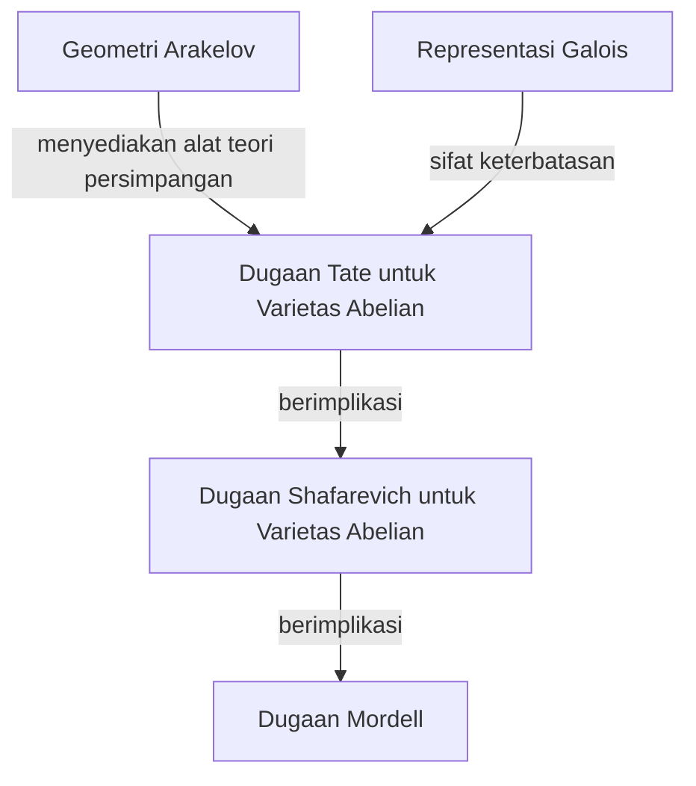
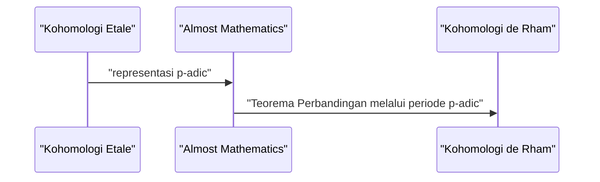

## 1. Pendahuluan: Raksasa Teori Bilangan Modern

Gerd Faltings secara luas diakui sebagai salah satu ahli geometri aritmatika yang paling mendalam dan berpengaruh dalam komunitas matematika dari akhir abad ke-20 hingga abad ke-21. Secara khusus, buktinya tentang **Dugaan Mordell** (Mordell Conjecture) yang dicapai pada tahun 1983 berdiri sebagai tonggak sejarah yang monumental dan brilian dalam sejarah teori bilangan dan geometri aljabar. Dalam artikel ini, kami akan menjelaskan secara mendetail tentang kehidupannya, pendekatan matematikanya yang unik, dan pencapaian revolusioner yang ia bawa ke dunia matematika.

## 2. Kehidupan Awal dan Karier

Faltings lahir pada tanggal 28 Juli 1954, di Gelsenkirchen, Rhine-Westphalia Utara, di tempat yang dulunya adalah Jerman Barat. Sejak usia sangat dini, ia menunjukkan bakat luar biasa dalam matematika dan ilmu alam. Saat memasuki Universitas Münster, ia membenamkan dirinya sepenuhnya dalam penelitian matematika, mengejutkan orang-orang di sekitarnya dengan pemahaman dan intuisinya yang luar biasa.

Pada tahun 1978, ia memperoleh gelar Ph.D. di bawah bimbingan Hans-Joachim Nastold. Penelitian awalnya melibatkan aljabar komutatif dan geometri aljabar, yang berisi wawasan mendalam tentang sifat-sifat cincin lokal dan kohomologi. Setelah itu, ia mengasah bakatnya di lingkungan penelitian internasional, menjabat sebagai asisten di Universitas Münster dan kemudian pergi ke Universitas Harvard sebagai peneliti pascadoktoral. Pada tahun 1982, ia mengambil jabatan profesor di Universitas Wuppertal, menjadi bintang muda yang sedang naik daun di komunitas matematika Jerman.

## 3. Pencapaian Bersejarah: Menyelesaikan Dugaan Mordell

Apa yang selamanya mengukir nama Faltings ke dalam sejarah matematika tidak diragukan lagi adalah penyelesaiannya atas **Dugaan Mordell**. Diajukan oleh Louis Mordell pada tahun 1922, dugaan ini adalah masalah yang sangat mendalam mengenai jumlah solusi rasional untuk persamaan Diophantine.

Pernyataan dugaannya adalah sebagai berikut:

> Sebuah kurva aljabar pada lapangan bilangan aljabar $K$ dari genus $g \ge 2$ hanya memiliki sejumlah titik rasional yang berhingga pada $K$.

Dugaan ini sangat berkaitan dengan teorema Pythagoras dan Teorema Terakhir Fermat, dan itu adalah masalah yang tangguh yang telah ditantang oleh banyak ahli matematika jenius dan gagal selama bertahun-tahun.

Faltings menyerang masalah ini dengan memanipulasi secara terampil mesin besar geometri aljabar yang dibangun oleh Alexander Grothendieck, seperti teori skema dan kohomologi etale, dan dengan memperkenalkan lebih lanjut kerangka kerja baru yang disebut geometri Arakelov.

Meskipun struktur logis dari buktinya sangat kompleks, ide intinya dapat dibagi menjadi tiga tahap berikut (bukti dugaan).

Dia pertama kali membuktikan **Dugaan Tate** untuk varietas abelian dan menggunakannya untuk menyelesaikan **Dugaan Shafarevich**. Kemudian, dengan menggunakan trik Parshin, yang menyatakan bahwa jika dugaan Shafarevich berlaku maka dugaan Mordell juga berlaku, ia mencapai kesimpulan akhir.

Dinyatakan secara matematis, untuk kurva $C$ dari genus $g(C) \ge 2$, kardinalitas himpunan titik rasional $C(K)$ adalah berhingga.
$$ |C(K)| < \infty \quad \text{untuk } g(C) \ge 2 $$

Untuk pencapaian yang mencengangkan ini, Faltings dianugerahi **Medali Fields**, penghargaan tertinggi dalam komunitas matematika, di Kongres Internasional Matematikawan (ICM) yang diadakan di Berkeley pada tahun 1986.

## 4. Geometri Arakelov dan Ketinggian Faltings

Perkembangan geometri Arakelov memainkan peran yang menentukan dalam pembuktian Dugaan Mordell. Didirikan oleh Suren Arakelov, teori ini inovatif karena menggabungkan informasi analitik di tempat tak terhingga (penilaian Archimedean) ke dalam skema atas cincin bilangan bulat dari lapangan bilangan.

Faltings menerapkan geometri Arakelov ini ke teori persimpangan pada varietas abelian dan memperkenalkan konsep yang sekarang disebut **ketinggian Faltings**. Ini adalah ukuran "kompleksitas" aritmatika dari varietas abelian dan menjadi kunci untuk membuktikan teorema keterbatasan.

## 5. Kontribusi Luar Biasa untuk Teori Hodge p-adic

Bahkan setelah menyelesaikan Dugaan Mordell, kreativitas Faltings tidak mengenal batas. Ia kemudian mencapai hasil yang sangat penting di bidang **teori Hodge p-adic**.

"Teorema perbandingan p-adic," yang telah diduga oleh Jean-Marc Fontaine dan lainnya, adalah masalah yang sangat sulit secara p-adic yang menghubungkan dua teori kohomologi yang berbeda dari varietas aljabar: kohomologi etale dan kohomologi de Rham.

Faltings mengembangkan metode aljabar yang sama sekali baru yang disebut "Almost Mathematics" (Hampir Matematika) dan sepenuhnya membuktikan teorema perbandingan ini.

Karena ini, pemahaman tentang fenomena p-adic dalam geometri aritmatika maju secara dramatis, membuka jalan langsung ke garis depan matematika modern, seperti teori Ruang Perfectoid yang kemudian dikembangkan oleh Peter Scholze.

## 6. Gaya Penelitian dan Dampak pada Penerus

Faltings dikenal karena gaya matematikanya yang sangat ketat dan wawasannya yang mendalam. Makalah-makalahnya sangat padat, dengan logika yang dikemas secara menyeluruh ke dalam setiap detail, yang membutuhkan tingkat pengetahuan khusus tingkat lanjut dan upaya keras untuk menguraikannya.

Sepanjang waktunya sebagai profesor di Universitas Princeton dan sebagai direktur Max Planck Institute for Mathematics, ia membimbing banyak matematikawan muda yang brilian. Seminar dan kuliahnya terkenal "sangat menuntut," dan setiap pernyataan yang tidak akurat atau pemahaman yang ambigu segera ditanggapi dengan kritik tajam. Namun, ketegasan ini juga merupakan cerminan dari rasa hormatnya yang murni terhadap kebenaran matematika dan kasih sayangnya untuk membesarkan generasi berikutnya menjadi peneliti sejati.

## 7. Kesimpulan

Nama Gerd Faltings akan selamanya diturunkan sebagai pemecah **Dugaan Mordell**. Namun, kehebatannya yang sebenarnya tidak hanya terletak pada memecahkan satu masalah sulit, tetapi pada menciptakan paradigma matematika baru seperti geometri Arakelov dan teori Hodge p-adic.

Bahkan hingga saat ini, teori dan filosofi yang ia ciptakan terus memberikan inspirasi luar biasa bagi para matematikawan di seluruh dunia. Kapan pun kita mencoba menyentuh jurang teori bilangan, jalan yang ditempa oleh Faltings selalu terbentang di hadapan kita.
