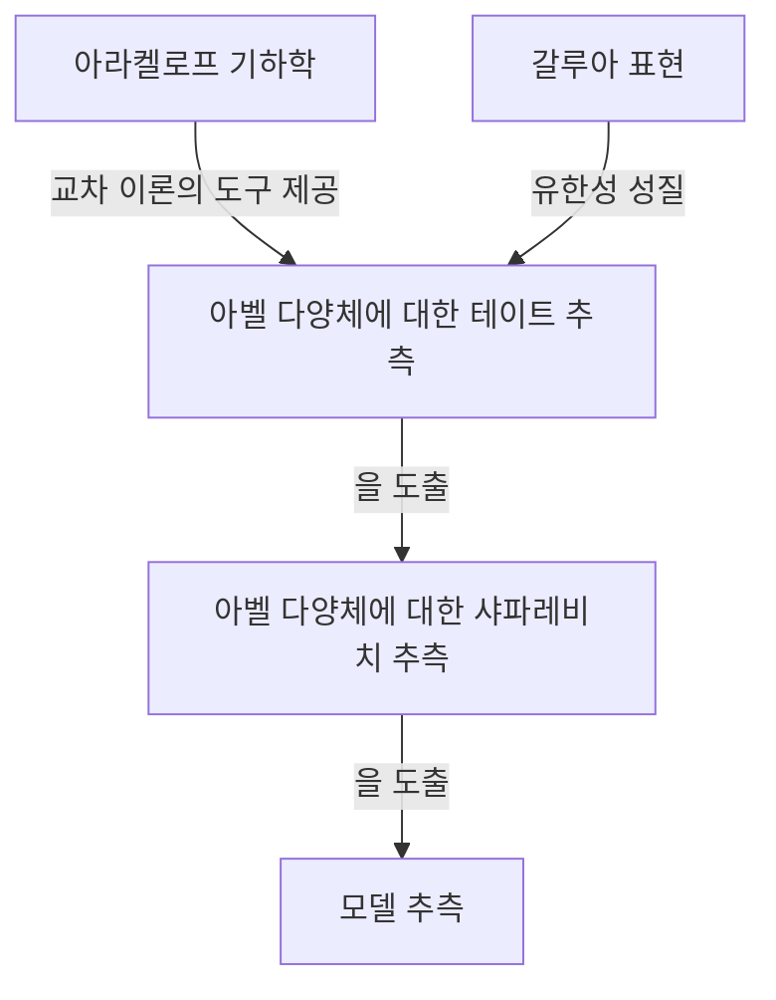
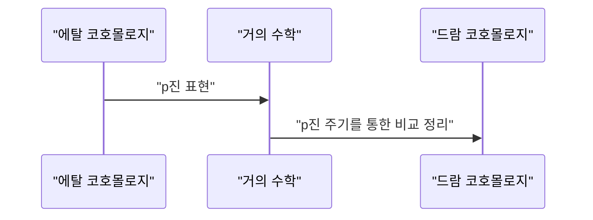

## 1. 서론: 현대 정수론의 거장

[게르트 팔팅스](https://kenji.blog/p/faltings/) ([Gerd Faltings](https://kenji.blog/p/faltings/)) 는 20세기 후반부터 21세기에 걸쳐 수학계에서 가장 깊고 가장 영향력 있는 산술 기하학자 중 한 명으로 널리 인정받고 있습니다. 특히, 1983년에 그가 이룩한 **모델 추측** (Mordell Conjecture) 의 증명은 정수론과 대수기하학의 역사에서 빛나는 기념비적인 이정표로 자리 잡고 있습니다. 본 기사에서는 그의 생애와 독특한 수학적 접근 방식, 그리고 그가 수학계에 가져온 혁신적인 업적에 대해 자세히 설명하겠습니다.

## 2. 성장 배경 및 초기 경력

팔팅스는 1954년 7월 28일, 당시 서독이었던 노르트라인베스트팔렌주의 겔젠키르헨에서 태어났습니다. 아주 어린 시절부터 그는 수학과 자연과학에 비범한 재능을 보였습니다. 뮌스터 대학교에 진학한 그는 수학 연구에 완전히 몰두하며 놀라운 이해력과 직관으로 주위 사람들을 놀라게 했습니다.

1978년, 그는 한스 요아힘 나스톨드의 지도 아래 박사 학위를 취득했습니다. 그의 초기 연구는 가환대수학과 대수기하학을 포함했으며, 국소환의 성질과 코호몰로지에 대한 깊은 통찰력을 담고 있었습니다. 이후 그는 뮌스터 대학교에서 조수로 재직하고 나중에 하버드 대학교로 박사후 연구원으로 가는 등 국제적인 연구 환경에서 자신의 재능을 연마했습니다. 1982년에는 부퍼탈 대학교의 교수로 취임하며 독일 수학계의 젊은 떠오르는 별이 되었습니다.

## 3. 역사적 업적: 모델 추측의 해결

팔팅스의 이름을 수학 역사에 영원히 새긴 것은 의심할 여지 없이 **모델 추측** 의 해결이었습니다. 1922년 [루이스 모델](https://kenji.blog/p/mordell/)이 제안한 이 추측은 [디오판토스](https://kenji.blog/p/diophantus/) 방정식의 유리수 해의 개수에 관한 매우 심오한 문제였습니다.

추측의 내용은 다음과 같습니다:

> 종수(genus)가 $g \ge 2$ 인 대수적 수체 $K$ 상의 대수 곡선은 $K$ 상에서 유한 개의 유리점만을 가진다.

이 추측은 피타고라스의 정리 및 [페르마의 마지막 정리](https://kenji.blog/p/fermats-last-theorem/)와 깊은 관련이 있었으며, 오랜 세월 동안 많은 천재 수학자들이 도전했으나 실패한 강력한 문제였습니다.

팔팅스는 [알렉산더 그로텐디크](https://kenji.blog/p/grothendieck/)가 구축한 스킴 이론과 에탈 코호몰로지 등 거대한 대수기하학의 기계를 능숙하게 조작하고, 나아가 아라켈로프 기하학이라는 새로운 틀을 도입함으로써 이 문제에 접근했습니다.

그의 증명의 논리 구조는 매우 복잡하지만, 핵심 아이디어는 다음의 세 단계(추측의 증명)로 나눌 수 있습니다.

그는 먼저 아벨 다양체에 대한 **테이트 추측** 을 증명하고, 이를 사용하여 **샤파레비치 추측** 을 해결했습니다. 그런 다음 샤파레비치 추측이 성립하면 모델 추측도 성립한다는 파르신의 트릭을 사용하여 최종 결론에 도달했습니다.

수식으로 표현하면, 종수 $g(C) \ge 2$ 인 곡선 $C$ 에 대해 유리점 집합 $C(K)$ 의 기수는 유한합니다.
$$ |C(K)| < \infty \quad \text{단, } g(C) \ge 2 $$

이 놀라운 업적으로 팔팅스는 1986년 버클리에서 열린 세계 수학자 대회(ICM)에서 수학계 최고의 영예인 **필즈상** 을 수상했습니다.

## 4. 아라켈로프 기하학과 팔팅스 높이

아라켈로프 기하학의 발전은 모델 추측 증명에 결정적인 역할을 했습니다. 수렌 아라켈로프가 창시한 이 이론은 수체의 정수환 상의 스킴에 무한 소수점(아르키메데스 부치)에서의 해석적 정보를 결합했다는 점에서 획기적이었습니다.

팔팅스는 이 아라켈로프 기하학을 아벨 다양체 상의 교차 이론에 응용하고, 현재 **팔팅스 높이** 라고 불리는 개념을 도입했습니다. 이것은 아벨 다양체의 산술적 "복잡성"을 측정하는 척도이며 유한성 정리를 증명하는 열쇠가 되었습니다.

## 5. p진 호지 이론에 대한 지대한 공헌

모델 추측을 해결한 후에도 팔팅스의 창의력은 한계가 없었습니다. 그는 다음으로 **p진 호지 이론** 분야에서 획기적인 결과를 이룩했습니다.

장마르크 퐁텐 등이 추측했던 "p진 비교 정리"는 대수 다양체의 에탈 코호몰로지와 드람 코호몰로지라는 두 개의 서로 다른 코호몰로지 이론을 p진적으로 연결하는 매우 어려운 문제였습니다.

팔팅스는 "거의 수학" (Almost Mathematics) 이라는 완전히 새로운 대수적 방법을 개발하여 이 비교 정리를 완벽하게 증명했습니다.

이로 인해 산술 기하학에서 p진 현상에 대한 이해가 비약적으로 발전했으며, 이후 피터 숄츠가 개발한 퍼펙토이드 공간(Perfectoid Spaces) 이론 등 현대 수학의 최전선으로 향하는 길이 바로 열리게 되었습니다.

## 6. 연구 스타일과 후학에 미친 영향

팔팅스는 타협을 허용하지 않는 엄격한 수학적 스타일과 깊은 통찰력으로 유명합니다. 그의 논문은 매우 밀도가 높고, 모든 세부 사항에 논리가 철저하게 담겨 있어서 해독하는 데 고도의 전문 지식과 엄청난 노력이 필요합니다.

프린스턴 대학교 교수 시절과 막스 플랑크 수학 연구소 소장 시절 내내 그는 많은 훌륭한 젊은 수학자들을 양성했습니다. 그의 세미나와 강의는 "매우 까다롭다"고 유명했으며, 부정확한 발언이나 모호한 이해는 즉시 날카로운 비판에 부딪혔습니다. 그러나 이러한 엄격함은 수학적 진리에 대한 그의 순수한 존중과 다음 세대를 진정한 연구자로 키우려는 애정의 반영이기도 했습니다.

## 7. 결론

[게르트 팔팅스](https://kenji.blog/p/faltings/)의 이름은 **모델 추측** 의 해결자로서 영원히 전해질 것입니다. 그러나 그의 진정한 위대함은 단순히 어려운 문제 하나를 해결한 것이 아니라 아라켈로프 기하학과 p진 호지 이론과 같은 새로운 수학적 패러다임을 창출한 데 있습니다.

오늘날에도 그가 창조한 이론과 철학은 전 세계 수학자들에게 엄청난 영감을 계속 제공하고 있습니다. 우리가 정수론의 심연에 닿으려 할 때마다, 팔팅스가 닦아놓은 길이 항상 우리 앞에 놓여 있습니다.
