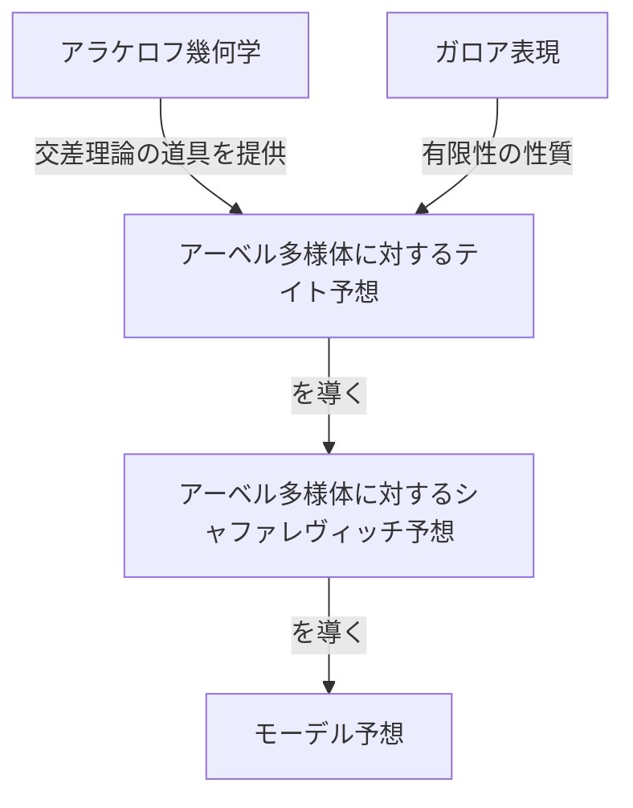
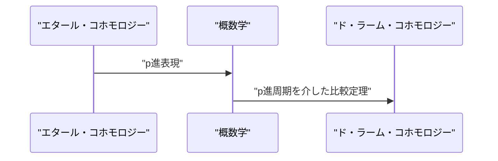

## 1. 導入：現代数論の巨人

[ゲルト・ファルティングス](https://kenji.blog/p/faltings/) (Gerd Faltings) は、20世紀後半から21世紀にかけての数学界において、最も深く、そして最も影響力のある数論幾何学者の一人として広く認知されています。特に、1983年に彼が達成した **[モーデル](https://kenji.blog/p/mordell/)予想** (Mordell Conjecture) の証明は、数論と代数幾何学の歴史において輝かしい金字塔となっています。本記事では、彼の生涯、独特の数学的アプローチ、そして彼が数学界にもたらした革新的な業績について、詳しく解説していきます。

## 2. 生い立ちと初期の経歴

[ファルティングス](https://kenji.blog/p/faltings/)は、1954年7月28日、西ドイツ（当時）のノルトライン＝ヴェストファーレン州ゲルゼンキルヒェンで誕生しました。彼は非常に早い段階から、数学と自然科学に対する特異な才能を示していました。ミュンスター大学に進学した彼は、本格的に数学の研究に没頭し、その驚異的な理解力と直感力で周囲を驚かせました。

1978年、彼はハンス＝ヨアヒム・ナストルド (Hans-Joachim Nastold) の指導の下、博士号を取得しました。彼の初期の研究は、可換環論や代数幾何学に関するものであり、特に局所環の性質やコホモロジーに関する深い洞察が含まれていました。その後、ミュンスター大学で助手を務め、さらにハーバード大学へ博士研究員として赴くなど、国際的な研究環境で自らの才能に磨きをかけました。1982年にはヴッパータール大学で教授職に就き、若くしてドイツ数学界の期待の星となりました。

## 3. 歴史的偉業：[モーデル](https://kenji.blog/p/mordell/)予想の解決

[ファルティングス](https://kenji.blog/p/faltings/)の名前を数学の歴史に永遠に刻み込むことになったのは、なんといっても **モーデル予想** の解決です。ルイス・モーデル (Louis Mordell) によって1922年に提唱されたこの予想は、[ディオファントス](https://kenji.blog/p/diophantus/)方程式の有理数解の数に関する非常に深遠な問題でした。

予想の内容は以下の通りです：

> 種数 (genus) が $g \ge 2$ であるような代数体 $K$ 上の代数曲線は、 $K$ 上に有限個の有理点しか持たない。

この予想は、[ピタゴラス](https://kenji.blog/p/pythagoras/)の定理や[フェルマーの最終定理](https://kenji.blog/p/fermats-last-theorem/)などとも深く関連しており、長年にわたって多くの天才数学者たちが挑んでは敗れ去ってきた難問でした。

[ファルティングス](https://kenji.blog/p/faltings/)は、アレクサンドル・グロタンディーク ([Alexander Grothendieck](https://kenji.blog/p/grothendieck/)) が築き上げたスキーム理論やエタール・コホモロジーといった巨大な代数幾何学の機械を巧みに操り、さらにアラケロフ幾何学 (Arakelov geometry) と呼ばれる新たな枠組みを導入することで、この問題にアタックしました。

彼の証明の論理構造は非常に複雑ですが、核となるアイデアは以下の3つの段階（予想の証明）に分けられます。

彼はまず、[アーベル](https://kenji.blog/p/abel/)多様体に関する **テイト予想** (Tate conjecture) を証明し、それを用いて **シャファレヴィッチ予想** (Shafarevich conjecture) を解決しました。そして、シャファレヴィッチ予想が成り立つならば[モーデル](https://kenji.blog/p/mordell/)予想も成り立つというパルシン (Parshin) のトリックを用いることで、最終的な結論に到達したのです。

数式で表すと、種数 $g(C) \ge 2$ の曲線 $C$ に対し、有理点の集合 $C(K)$ の濃度は有限となります。
$$ |C(K)| < \infty \quad \text{ただし } g(C) \ge 2 $$

この驚異的な業績により、[ファルティングス](https://kenji.blog/p/faltings/)は1986年にバークレーで開催された国際数学者会議 (ICM) において、数学界の最高栄誉である **フィールズ賞** (Fields Medal) を授与されました。

## 4. アラケロフ幾何学と[ファルティングス](https://kenji.blog/p/faltings/)の高さ

[モーデル](https://kenji.blog/p/mordell/)予想の証明において決定的な役割を果たしたのが、アラケロフ幾何学の発展です。スレン・アラケロフ (Suren Arakelov) によって創始されたこの理論は、代数体の整数環上のスキームに対して、無限素点（[アルキメデス](https://kenji.blog/p/archimedes/)付値）での解析的な情報を組み込むという画期的なものでした。

[ファルティングス](https://kenji.blog/p/faltings/)は、このアラケロフ幾何学をアーベル多様体上の交差理論に応用し、現在 **ファルティングスの高さ** (Faltings height) と呼ばれる概念を導入しました。これは、[アーベル](https://kenji.blog/p/abel/)多様体の数論的な「複雑さ」を測る尺度であり、有限性定理を証明するための鍵となりました。

## 5. p進ホッジ理論への絶大な貢献

[モーデル](https://kenji.blog/p/mordell/)予想の解決後も、[ファルティングス](https://kenji.blog/p/faltings/)の創造力はとどまるところを知りませんでした。彼は次に **p進ホッジ理論** (p-adic Hodge theory) の分野で画期的な成果を挙げました。

ジャン＝マルク・フォンテーヌ (Jean-Marc Fontaine) らによって予想されていた「p進比較定理」は、代数多様体のエタール・コホモロジーとド・ラーム・コホモロジーという、異なる2つのコホモロジー論をp進的に結びつけるという非常に難しい問題でした。

[ファルティングス](https://kenji.blog/p/faltings/)は、「概数学」 (Almost Mathematics) と呼ばれる全く新しい代数的手法を開発し、この比較定理を完全に証明しました。

これにより、数論幾何学におけるp進的な現象の理解は飛躍的に進み、後のピーター・ショルツ (Peter Scholze) によるパーフェクトイド空間 (Perfectoid Spaces) の理論など、現代数学の最前線へと直結する道が切り開かれました。

## 6. 研究スタイルと後進への影響

[ファルティングス](https://kenji.blog/p/faltings/)は、妥協を許さない厳格な数学的スタイルと、深い洞察力で知られています。彼の論文は非常に密度が高く、細部まで徹底的に論理が詰められているため、読み解くには高度な専門知識と多大な労力が必要とされます。

プリンストン大学での教授時代、そしてマックス・プランク数学研究所の所長時代を通じて、彼は多くの優秀な若手数学者を育成しました。彼のゼミや講演は「非常に厳しい」ことで有名であり、少しでも不正確な発言や曖昧な理解があれば、即座に鋭い指摘が飛んできました。しかし、その厳しさは数学の真理に対する純粋な敬意と、後進を本物の研究者に育て上げようとする愛情の裏返しでもありました。

## 7. おわりに

[ゲルト・ファルティングス](https://kenji.blog/p/faltings/)の名前は、 **[モーデル](https://kenji.blog/p/mordell/)予想** の解決者として永遠に語り継がれるでしょう。しかし、彼の真の偉大さは、一つの難問を解いたことだけではなく、アラケロフ幾何学やp進ホッジ理論といった、数学の新たなパラダイムを創出したことにあります。

現在もなお、彼の生み出した理論や哲学は、世界中の数学者たちに多大なインスピレーションを与え続けています。私たちが数論の深淵に触れようとするとき、そこには常に[ファルティングス](https://kenji.blog/p/faltings/)が切り拓いた道が広がっているのです。
