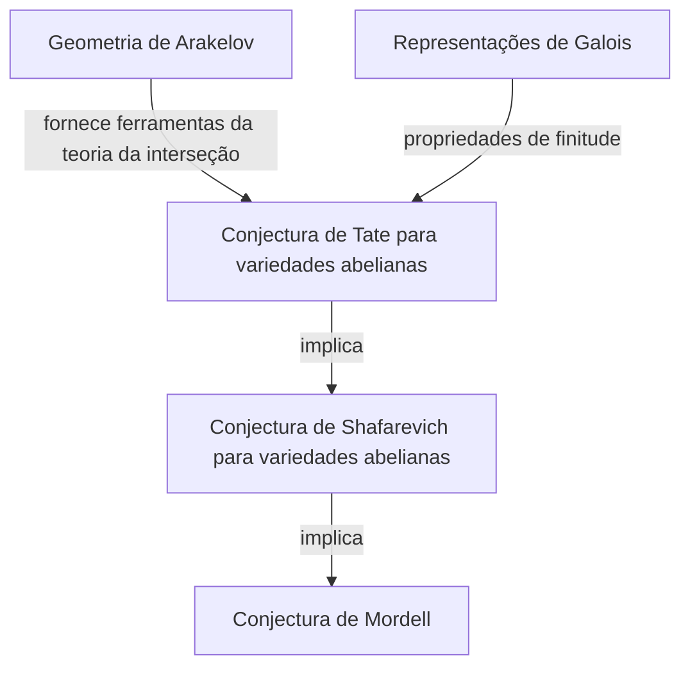
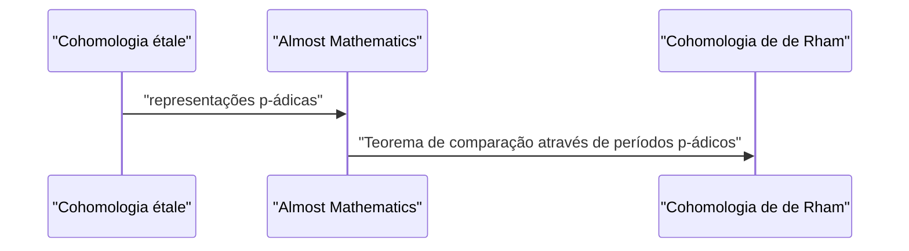

## 1. Introdução: Um gigante da moderna teoria dos números

[Gerd Faltings](https://kenji.blog/pt/p/faltings/) é amplamente reconhecido como um dos geômetras aritméticos mais profundos e influentes na comunidade matemática do final do século XX e adentrando o século XXI. Em particular, sua demonstração da **Conjectura de Mordell** alcançada em 1983 permanece como um marco monumental e brilhante na história da teoria dos números e da geometria algébrica. Neste artigo, explicaremos detalhadamente sua vida, sua abordagem matemática única e as realizações revolucionárias que ele trouxe para o mundo da matemática.

## 2. Início de Vida e Carreira

Faltings nasceu em 28 de julho de 1954, em Gelsenkirchen, Renânia do Norte-Vestfália, no que era então a Alemanha Ocidental. Desde muito cedo, ele mostrou um talento extraordinário para a matemática e as ciências naturais. Ao ingressar na Universidade de Münster, ele mergulhou totalmente na pesquisa matemática, surpreendendo os que estavam ao seu redor com sua incrível compreensão e intuição.

Em 1978, ele obteve seu Ph.D. sob a orientação de Hans-Joachim Nastold. Sua pesquisa inicial envolveu álgebra comutativa e geometria algébrica, contendo insights profundos sobre as propriedades de anéis locais e cohomologia. Em seguida, ele aprimorou seus talentos em ambientes de pesquisa internacionais, atuando como assistente na Universidade de Münster e depois indo para a Universidade de Harvard como pesquisador de pós-doutorado. Em 1982, assumiu um cargo de professor na Universidade de Wuppertal, tornando-se uma jovem estrela em ascensão na comunidade matemática alemã.

## 3. Realização Histórica: Resolvendo a Conjectura de Mordell

O que gravou eternamente o nome de Faltings na história da matemática foi sem dúvida a sua resolução da **Conjectura de Mordell**. Proposta por [Louis Mordell](https://kenji.blog/pt/p/mordell/) em 1922, esta conjectura era um problema profundamente complexo sobre o número de soluções racionais para equações diofantinas.

O enunciado da conjectura é o seguinte:

> Uma curva algébrica sobre um corpo de números algébricos $K$ de gênero $g \ge 2$ tem apenas um número finito de pontos racionais sobre $K$.

Esta conjectura estava profundamente relacionada ao teorema de Pitágoras e ao Último Teorema de [Fermat](https://kenji.blog/pt/p/fermat/), e foi um problema formidável que muitos gênios matemáticos haviam desafiado e falhado ao longo dos anos.

Faltings atacou este problema manipulando habilmente o maquinário massivo da geometria algébrica construído por [Alexander Grothendieck](https://kenji.blog/pt/p/grothendieck/), como a teoria dos esquemas e a cohomologia étale, e introduzindo ainda uma nova estrutura chamada geometria de Arakelov.

Embora a estrutura lógica de sua demonstração seja altamente complexa, a ideia central pode ser dividida nas seguintes três etapas (demonstrações de conjecturas).

Ele primeiro provou a **Conjectura de Tate** para variedades abelianas e a usou para resolver a **Conjectura de Shafarevich**. Então, empregando o truco de Parshin, que afirma que se a conjectura de Shafarevich é verdadeira então a conjectura de Mordell também o é, ele chegou à conclusão final.

Expresso matematicamente, para uma curva $C$ de gênero $g(C) \ge 2$, a cardinalidade do conjunto de pontos racionais $C(K)$ é finita.
$$ |C(K)| < \infty \quad \text{para } g(C) \ge 2 $$

Por essa conquista surpreendente, Faltings foi premiado com a **Medalha Fields**, a mais alta honraria da comunidade matemática, no Congresso Internacional de Matemáticos (ICM) realizado em Berkeley em 1986.

## 4. Geometria de Arakelov e Altura de Faltings

O desenvolvimento da geometria de Arakelov desempenhou um papel decisivo na prova da Conjectura de Mordell. Fundada por Suren Arakelov, esta teoria foi inovadora, pois incorporou informações analíticas em lugares infinitos (valorações arquimedianas) em esquemas sobre os anéis de inteiros de corpos de números.

Faltings aplicou essa geometria de Arakelov à teoria da interseção em variedades abelianas e introduziu o conceito agora chamado de **altura de Faltings**. Esta é uma medida da "complexidade" aritmética de uma variedade abeliana e tornou-se a chave para provar os teoremas de finitude.

## 5. Contribuições Imenso para a Teoria de Hodge p-ádica

Mesmo depois de resolver a Conjectura de Mordell, a criatividade de Faltings não conheceu limites. Em seguida, ele alcançou resultados marcantes no campo da **teoria de Hodge p-ádica**.

O "teorema de comparação p-ádico", que havia sido conjecturado por Jean-Marc Fontaine e outros, era um problema incrivelmente difícil de conectar p-adicamente duas teorias de cohomologia diferentes de variedades algébricas: cohomologia étale e cohomologia de de Rham.

Faltings desenvolveu um método algébrico inteiramente novo chamado "Almost Mathematics" (Quase matemática) e provou completamente este teorema de comparação.

Devido a isso, o entendimento dos fenômenos p-ádicos na geometria aritmética avançou dramaticamente, pavimentando o caminho diretamente para a vanguarda da matemática moderna, como a teoria dos Espaços Perfectóides desenvolvida posteriormente por Peter Scholze.

## 6. Estilo de Pesquisa e Impacto nos Sucessores

Faltings é conhecido por seu estilo matemático intransigentemente rigoroso e por seu profundo insight. Seus artigos são altamente densos, com a lógica totalmente compactada em todos os detalhes, exigindo um nível avançado de conhecimento especializado e um enorme esforço para decifrar.

Ao longo de seu tempo como professor na Universidade de Princeton e como diretor do Instituto Max Planck de Matemática, ele orientou muitos jovens matemáticos brilhantes. Seus seminários e palestras eram famosos por serem "extremamente exigentes", e quaisquer declarações imprecisas ou compreensões ambíguas eram imediatamente recebidas com críticas agudas. No entanto, essa severidade era também um reflexo de seu puro respeito pela verdade matemática e de sua afeição por criar a próxima geração de verdadeiros pesquisadores.

## 7. Conclusão

O nome de [Gerd Faltings](https://kenji.blog/pt/p/faltings/) será para sempre transmitido como o solucionador da **Conjectura de Mordell**. No entanto, sua verdadeira grandeza reside não apenas em resolver um único problema difícil, mas em criar novos paradigmas matemáticos como a geometria de Arakelov e a teoria de Hodge p-ádica.

Ainda hoje, as teorias e a filosofia que ele criou continuam a fornecer imensa inspiração a matemáticos em todo o mundo. Sempre que tentamos tocar o abismo da teoria dos números, o caminho forjado por Faltings sempre se encontra diante de nós.
