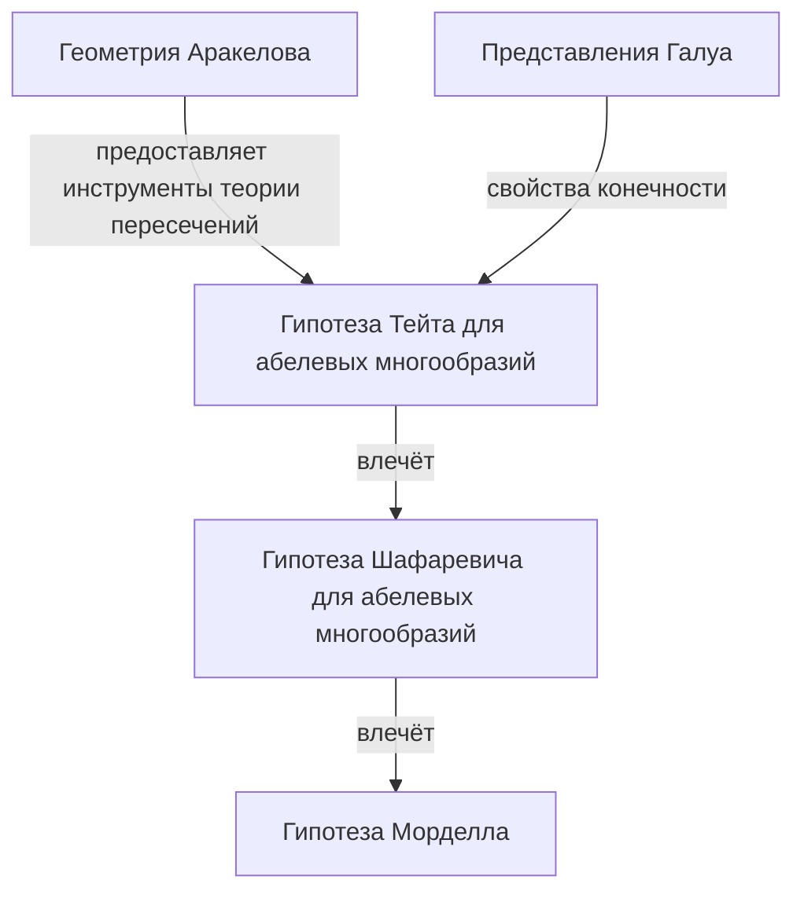
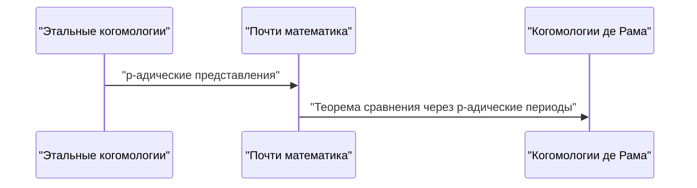

## 1. Введение: Гигант современной теории чисел

Герд Фальтингс широко признан одним из самых глубоких и влиятельных арифметических геометров в математическом сообществе с конца 20-го века до начала 21-го века. В частности, его доказательство **гипотезы Морделла** в 1983 году является блестящей монументальной вехой в истории теории чисел и алгебраической геометрии. В этой статье мы подробно расскажем о его жизни, его уникальном математическом подходе и революционных достижениях, которые он принес в математический мир.

## 2. Ранние годы и карьера

Фальтингс родился 28 июля 1954 года в Гельзенкирхене, Северный Рейн-Вестфалия, в тогдашней Западной Германии. С самого раннего возраста он проявлял необычайный талант к математике и естественным наукам. Поступив в Мюнстерский университет, он полностью погрузился в математические исследования, поражая окружающих своим невероятным пониманием и интуицией.

В 1978 году он получил степень доктора философии под руководством Ханса-Иоахима Настольда. Его ранние исследования касались коммутативной алгебры и алгебраической геометрии и содержали глубокие идеи о свойствах локальных колец и когомологиях. Затем он оттачивал свои таланты в международной исследовательской среде, работая ассистентом в Мюнстерском университете, а затем отправившись в Гарвардский университет в качестве постдокторанта. В 1982 году он занял должность профессора в Вуппертальском университете, став молодой восходящей звездой в немецком математическом сообществе.

## 3. Историческое достижение: Доказательство гипотезы Морделла

То, что навсегда вписало имя Фальтингса в историю математики, без сомнения, было его решение **гипотезы Морделла**. Выдвинутая Луисом Морделлом в 1922 году, эта гипотеза была глубочайшей проблемой, касающейся числа рациональных решений диофантовых уравнений.

Утверждение гипотезы звучит следующим образом:

> Алгебраическая кривая над полем алгебраических чисел $K$ рода $g \ge 2$ имеет лишь конечное число рациональных точек над $K$.

Эта гипотеза была тесно связана с теоремой Пифагора и Великой теоремой Ферма, и это была сложнейшая задача, которую пытались и не смогли решить многие гениальные математики на протяжении многих лет.

Фальтингс атаковал эту проблему, умело манипулируя массивным аппаратом алгебраической геометрии, созданным Александром Гротендиком, таким как теория схем и этальные когомологии, а также введя новую структуру, называемую геометрией Аракелова.

Хотя логическая структура его доказательства весьма сложна, основную идею можно разделить на следующие три этапа (доказательства гипотез).

Сначала он доказал **гипотезу Тейта** для абелевых многообразий и использовал ее для решения **гипотезы Шафаревича**. Затем, применив трюк Паршина, который гласит, что если верна гипотеза Шафаревича, то верна и гипотеза Морделла, он пришел к окончательному выводу.

Выражаясь математически, для кривой $C$ рода $g(C) \ge 2$ мощность множества рациональных точек $C(K)$ конечна.
$$ |C(K)| < \infty \quad \text{для } g(C) \ge 2 $$

За это поразительное достижение Фальтингс был удостоен **Филдсовской премии**, высшей награды в математическом сообществе, на Международном конгрессе математиков (ICM), состоявшемся в Беркли в 1986 году.

## 4. Геометрия Аракелова и высота Фальтингса

Развитие геометрии Аракелова сыграло решающую роль в доказательстве гипотезы Морделла. Основанная Суреном Аракеловым, эта теория стала новаторской, поскольку она включила аналитическую информацию на бесконечных местах (архимедовы нормирования) в схемы над кольцами целых чисел числовых полей.

Фальтингс применил эту геометрию Аракелова к теории пересечений на абелевых многообразиях и ввел понятие, которое теперь называется **высотой Фальтингса**. Это мера арифметической «сложности» абелева многообразия, которая стала ключом к доказательству теорем конечности.

## 5. Огромный вклад в p-адическую теорию Ходжа

Даже после решения гипотезы Морделла творчество Фальтингса не знало границ. Затем он достиг эпохальных результатов в области **p-адической теории Ходжа**.

«Теорема о p-адическом сравнении», выдвинутая Жаном-Марком Фонтеном и другими, была удивительно сложной задачей p-адического связывания двух различных теорий когомологий алгебраических многообразий: этальных когомологий и когомологий де Рама.

Фальтингс разработал совершенно новый алгебраический метод, названный «Почти математика» (Almost Mathematics), и полностью доказал эту теорему сравнения.

Благодаря этому понимание p-адических явлений в арифметической геометрии резко продвинулось вперед, проложив путь прямо к авангарду современной математики, например, к теории перфектоидных пространств, разработанной позже Петером Шольце.

## 6. Стиль исследований и влияние на преемников

Фальтингс известен своим бескомпромиссно строгим математическим стилем и глубокой проницательностью. Его статьи очень насыщены, логика тщательно упакована в каждую деталь, что требует продвинутого уровня специальных знаний и огромных усилий для расшифровки.

За время работы профессором в Принстонском университете и директором Института математики Макса Планка он был наставником многих блестящих молодых математиков. Его семинары и лекции славились «чрезвычайной требовательностью», и любые неточные утверждения или двусмысленные понимания сразу же встречали резкую критику. Однако эта строгость была также отражением его чистого уважения к математической истине и его любви к воспитанию следующего поколения настоящих исследователей.

## 7. Заключение

Имя Герда Фальтингса навсегда войдет в историю как имя человека, решившего **гипотезу Морделла**. Тем не менее, его истинное величие заключается не просто в решении одной сложной проблемы, а в создании новых математических парадигм, таких как геометрия Аракелова и p-адическая теория Ходжа.

Даже сегодня созданные им теории и философия продолжают давать огромное вдохновение математикам всего мира. Всякий раз, когда мы пытаемся прикоснуться к бездне теории чисел, путь, проложенный Фальтингсом, всегда лежит перед нами.
