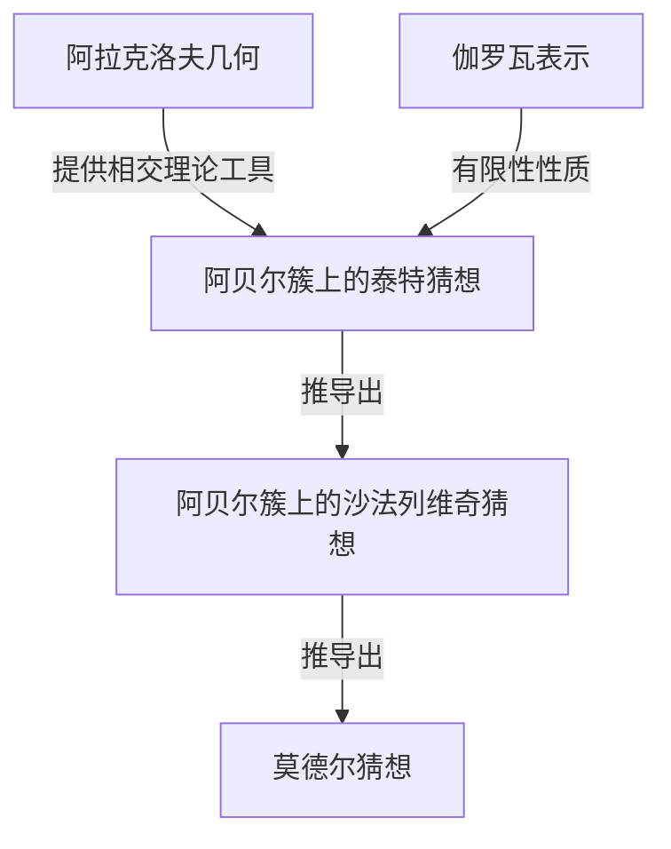
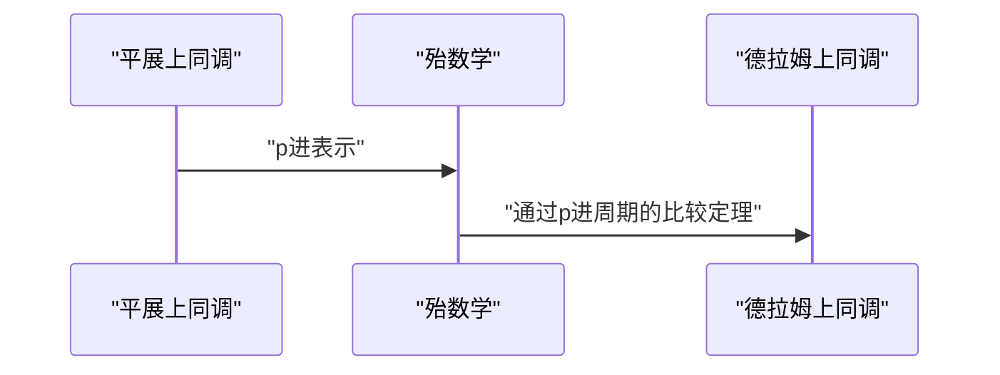

## 1. 引言：现代数论的巨匠

[格尔德·法尔廷斯](https://kenji.blog/zh-cn/p/faltings/) ([Gerd Faltings](https://kenji.blog/zh-cn/p/faltings/)) 广受公认为是20世纪末至21世纪数学界最深刻、最具影响力的算术几何学家之一。特别是他在1983年完成的 **莫德尔猜想** (Mordell Conjecture) 的证明，成为了数论和代数几何历史上的一座辉煌的丰碑。在本文中，我们将详细探讨他的生平、他独特的数学视角，以及他为数学界带来的革命性成就。

## 2. 早年生活与职业生涯

法尔廷斯于1954年7月28日出生于当时西德的北莱茵-威斯特法伦州盖尔森基兴。从很小的时候起，他就在数学和自然科学方面表现出了非凡的天赋。进入明斯特大学后，他完全沉浸在数学研究中，以其令人难以置信的理解力和直觉震惊了周围的人。

1978年，他在汉斯-约阿希姆·纳斯托尔德 (Hans-Joachim Nastold) 的指导下获得了博士学位。他早期的研究涉及交换代数和代数几何，包含了对局部环的性质和上同调的深刻见解。此后，他在国际研究环境中磨练了自己的才华，在明斯特大学担任助理，后来前往哈佛大学担任博士后研究员。1982年，他成为伍珀塔尔大学的教授，成为德国数学界一颗冉冉升起的新星。

## 3. 历史性成就：解决莫德尔猜想

使法尔廷斯的名字永远铭刻在数学史上的，无疑是他对 **莫德尔猜想** 的解决。这个由[路易斯·莫德尔](https://kenji.blog/zh-cn/p/mordell/)在1922年提出的猜想，是一个关于[丢番图](https://kenji.blog/zh-cn/p/diophantus/)方程有理数解的数量的极其深奥的问题。

该猜想的陈述如下：

> 定义在代数数域 $K$ 上且亏格 $g \ge 2$ 的代数曲线，在 $K$ 上只有有限多个有理点。

这个猜想与毕达哥拉斯定理和[费马大定理](https://kenji.blog/zh-cn/p/fermats-last-theorem/)有着深刻的联系，是一个多年来令许多天才数学家挑战并折戟的艰巨问题。

法尔廷斯巧妙地操纵了[亚历山大·格罗滕迪克](https://kenji.blog/zh-cn/p/grothendieck/)构建的庞大代数几何机器（如概形理论和平展上同调），并进一步引入了称为阿拉克洛夫几何的新框架，从而攻克了这个问题。

尽管他的证明的逻辑结构极其复杂，但核心思想可以分为以下三个阶段（猜想的证明）。

他首先证明了阿贝尔簇上的 **泰特猜想**，并利用它解决了 **沙法列维奇猜想**。然后，通过运用帕尔申 (Parshin) 技巧（该技巧指出，如果沙法列维奇猜想成立，那么莫德尔猜想也成立），他得出了最终结论。

用数学语言表达，对于亏格 $g(C) \ge 2$ 的曲线 $C$，其有理点集合 $C(K)$ 的基数是有限的。
$$ |C(K)| < \infty \quad \text{对于 } g(C) \ge 2 $$

凭借这一惊人的成就，法尔廷斯在1986年于伯克利举行的国际数学家大会 (ICM) 上，荣获了数学界的最高荣誉—— **菲尔兹奖** (Fields Medal)。

## 4. 阿拉克洛夫几何与法尔廷斯高度

阿拉克洛夫几何的发展在莫德尔猜想的证明中发挥了决定性作用。由苏伦·阿拉克洛夫 (Suren Arakelov) 创立的这一理论是具有开创性的，因为它将无限素点（阿基米德赋值）处的解析信息，结合到了数域的整数环上的概形中。

法尔廷斯将这种阿拉克洛夫几何应用于阿贝尔簇上的相交理论，并引入了现在被称为 **法尔廷斯高度** 的概念。这是衡量阿贝尔簇的算术“复杂性”的尺度，并成为证明有限性定理的关键。

## 5. 对p进霍奇理论的巨大贡献

即使在解决了莫德尔猜想之后，法尔廷斯的创造力也没有极限。随后，他在 **p进霍奇理论** (p-adic Hodge theory) 领域取得了划时代的成果。

由让-马克·方丹 (Jean-Marc Fontaine) 等人猜测的“p进比较定理”，是一个非常困难的问题，旨在将代数簇的两种不同的上同调理论（平展上同调和德拉姆上同调）在p进的意义上联系起来。

法尔廷斯开发了一种被称为“殆数学” (Almost Mathematics) 的全新代数方法，并完全证明了这个比较定理。

正因为如此，算术几何中对p进现象的理解取得了戏剧性的进展，直接铺平了通往现代数学最前沿的道路，例如后来由彼得·朔尔策 (Peter Scholze) 发展的完美状空间 (Perfectoid Spaces) 理论。

## 6. 研究风格与对后继者的影响

法尔廷斯以其毫不妥协的严谨数学风格和深刻的洞察力而闻名。他的论文密度极高，逻辑紧密地压缩在每一个细节中，需要具有高级专业知识和巨大努力才能破译。

在普林斯顿大学担任教授以及担任马克斯·普朗克数学研究所所长期间，他指导了许多才华横溢的年轻数学家。他的研讨会和讲座以“极其严苛”而著称，任何不准确的陈述或模棱两可的理解都会立即遭到尖锐的批评。然而，这种严厉也反映了他对数学真理的纯粹尊重，以及他希望将下一代培养成真正研究人员的关爱。

## 7. 结语

[格尔德·法尔廷斯](https://kenji.blog/zh-cn/p/faltings/)的名字将永远作为 **莫德尔猜想** 的解决者而流传下去。然而，他真正的伟大不仅仅在于解决了一个难题，更在于创造了诸如阿拉克洛夫几何和p进霍奇理论等新的数学范式。

即使在今天，他所创造的理论和哲学，仍在继续为世界各地的数学家提供着巨大的灵感。每当我们试图触及数论的深渊时，法尔廷斯开辟的道路总是呈现在我们面前。
