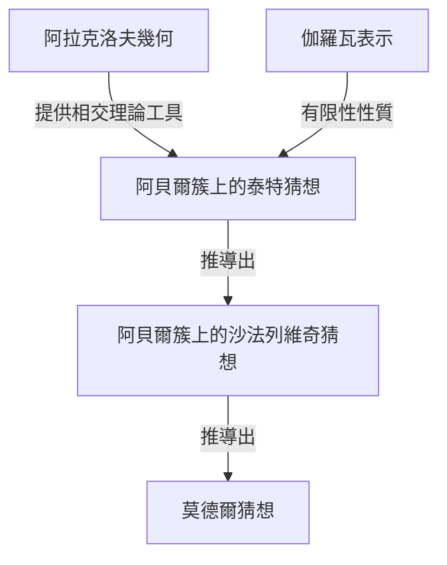
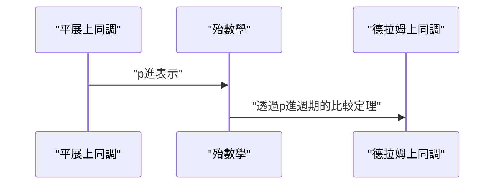

## 1. 引言：現代數論的巨匠

[格爾德·法爾廷斯](https://kenji.blog/zh-tw/p/faltings/) ([Gerd Faltings](https://kenji.blog/zh-tw/p/faltings/)) 廣受公認為是20世紀末至21世紀數學界最深刻、最具影響力的算術幾何學家之一。特別是他在1983年完成的 **莫德爾猜想** (Mordell Conjecture) 的證明，成為了數論和代數幾何歷史上的一座輝煌的豐碑。在本文中，我們將詳細探討他的生平、他獨特的數學視角，以及他為數學界帶來的革命性成就。

## 2. 早年生活與職業生涯

法爾廷斯於1954年7月28日出生於當時西德的北萊茵-威斯特法倫州蓋爾森基興。從很小的時候起，他就在數學和自然科學方面表現出了非凡的天賦。進入明斯特大學後，他完全沉浸在數學研究中，以其令人難以置信的理解力和直覺震驚了周圍的人。

1978年，他在漢斯-約阿希姆·納斯托爾德 (Hans-Joachim Nastold) 的指導下獲得了博士學位。他早期的研究涉及交換代數和代數幾何，包含了對局部環的性質和上同調的深刻見解。此後，他在國際研究環境中磨練了自己的才華，在明斯特大學擔任助理，後來前往哈佛大學擔任博士後研究員。1982年，他成為伍珀塔爾大學的教授，成為德國數學界一顆冉冉升起的新星。

## 3. 歷史性成就：解決莫德爾猜想

使法爾廷斯的名字永遠銘刻在數學史上的，無疑是他對 **莫德爾猜想** 的解決。這個由[路易斯·莫德爾](https://kenji.blog/zh-tw/p/mordell/)在1922年提出的猜想，是一個關於[丟番圖](https://kenji.blog/zh-tw/p/diophantus/)方程有理數解的數量的極其深奧的問題。

該猜想的陳述如下：

> 定義在代數數域 $K$ 上且虧格 $g \ge 2$ 的代數曲線，在 $K$ 上只有有限多個有理點。

這個猜想與畢達哥拉斯定理和費馬大定理有著深刻的聯繫，是一個多年來令許多天才數學家挑戰並折戟的艱鉅問題。

法爾廷斯巧妙地操縱了[亞歷山大·格羅滕迪克](https://kenji.blog/zh-tw/p/grothendieck/)構建的龐大代數幾何機器（如概形理論和平展上同調），並進一步引入了稱為阿拉克洛夫幾何的新框架，從而攻克了這個問題。

儘管他的證明的邏輯結構極其複雜，但核心思想可以分為以下三個階段（猜想的證明）。

他首先證明了阿貝爾簇上的 **泰特猜想**，並利用它解決了 **沙法列維奇猜想**。然後，通過運用帕爾申 (Parshin) 技巧（該技巧指出，如果沙法列維奇猜想成立，那麼莫德爾猜想也成立），他得出了最終結論。

用數學語言表達，對於虧格 $g(C) \ge 2$ 的曲線 $C$，其有理點集合 $C(K)$ 的基數是有限的。
$$ |C(K)| < \infty \quad \text{對於 } g(C) \ge 2 $$

憑藉這一驚人的成就，法爾廷斯在1986年於伯克萊舉行的國際數學家大會 (ICM) 上，榮獲了數學界的最高榮譽—— **菲爾茲獎** (Fields Medal)。

## 4. 阿拉克洛夫幾何與法爾廷斯高度

阿拉克洛夫幾何的發展在莫德爾猜想的證明中發揮了決定性作用。由蘇倫·阿拉克洛夫 (Suren Arakelov) 創立的這一理論是具有開創性的，因為它將無限素點（阿基米德賦值）處的解析信息，結合到了數域的整數環上的概形中。

法爾廷斯將這種阿拉克洛夫幾何應用於阿貝爾簇上的相交理論，並引入了現在被稱為 **法爾廷斯高度** 的概念。這是衡量阿貝爾簇的算術“複雜性”的尺度，並成為證明有限性定理的關鍵。

## 5. 對p進霍奇理論的巨大貢獻

即使在解決了莫德爾猜想之後，法爾廷斯的創造力也沒有極限。隨後，他在 **p進霍奇理論** (p-adic Hodge theory) 領域取得了劃時代的成果。

由讓-馬克·方丹 (Jean-Marc Fontaine) 等人猜測的“p進比較定理”，是一個非常困難的問題，旨在將代數簇的兩種不同的上同調理論（平展上同調和德拉姆上同調）在p進的意義上聯繫起來。

法爾廷斯開發了一種被稱為“殆數學” (Almost Mathematics) 的全新代數方法，並完全證明了這個比較定理。

正因為如此，算術幾何中對p進現象的理解取得了戲劇性的進展，直接鋪平了通往現代數學最前沿的道路，例如後來由彼得·朔爾策 (Peter Scholze) 發展的完美狀空間 (Perfectoid Spaces) 理論。

## 6. 研究風格與對後繼者的影響

法爾廷斯以其毫不妥協的嚴謹數學風格和深刻的洞察力而聞名。他的論文密度極高，邏輯緊密地壓縮在每一個細節中，需要具有高級專業知識和巨大努力才能破譯。

在普林斯頓大學擔任教授以及擔任馬克斯·普朗克數學研究所所長期間，他指導了許多才華橫溢的年輕數學家。他的研討會和講座以“極其嚴苛”而著稱，任何不準確的陳述或模稜兩可的理解都會立即遭到尖銳的批評。然而，這種嚴厲也反映了他對數學真理的純粹尊重，以及他希望將下一代培養成真正研究人員的關愛。

## 7. 結語

[格爾德·法爾廷斯](https://kenji.blog/zh-tw/p/faltings/)的名字將永遠作為 **莫德爾猜想** 的解決者而流傳下去。然而，他真正的偉大不僅僅在於解決了一個難題，更在於創造了諸如阿拉克洛夫幾何和p進霍奇理論等新的數學範式。

即使在今天，他所創造的理論和哲學，仍在繼續為世界各地的數學家提供著巨大的靈感。每當我們試圖觸及數論的深淵時，法爾廷斯開闢的道路總是呈現在我們面前。
