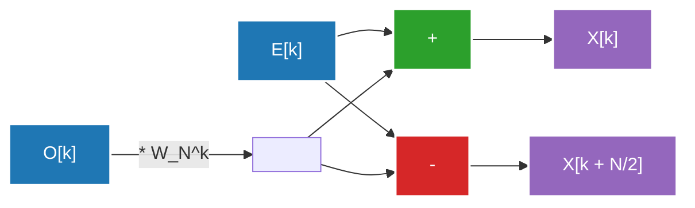

## 1. مقدمة: دعوة إلى عالم تحويل فورييه

حياتنا اليومية محاطة بالموجات (الإشارات). الصوت الذي يصل إلى آذاننا، والضوء الذي يدخل أعيننا، وموجات الراديو التي تتبادلها الهواتف الذكية، كلها "موجات" تتغير زمانياً أو مكانياً. ومع ذلك، من الصعب جداً تحليل أو معالجة هذه الموجات كما هي. هنا يأتي دور **تحويل فورييه (Fourier Transform)**.

يعتمد تحويل فورييه على نظرية مذهلة تنص على أن "أي موجة معقدة يمكن التعبير عنها كتراكب لموجات الجيب وجيب التمام البسيطة". من خلال تحويل إشارة ممثلة في المجال الزمني (Time Domain) إلى مجال التردد (Frequency Domain)، يمكننا معرفة درجة الصوت وقوته المتضمنة في تلك الإشارة.

ولكن، عند تنفيذ تحويل فورييه على جهاز كمبيوتر، يتطلب استخدام تحويل فورييه المتقطع (DFT: Discrete Fourier Transform) البسيط تعقيداً حسابياً قدره $O(N^2)$ لحجم البيانات $N$، مما يجعله غير عملي للمعالجة بسرعة فعلية. ما حطم هذا الجدار هو **تحويل فورييه السريع (FFT: Fast Fourier Transform)**. قلل تحويل فورييه السريع (FFT) التعقيد الحسابي بشكل كبير إلى $O(N \log N)$ وأصبح أساس معالجة الإشارات الرقمية الحديثة.

في هذا المقال، سنشرح الصورة الكاملة لتحويل فورييه السريع (FFT) بعمق، بدءاً من الانتقال من المستمر إلى المتقطع، والاشتقاق الرياضي لخوارزمية كولي-توكي (Cooley-Tukey)، والتوضيح التفصيلي لعملية الفراشة، وصولاً إلى تنفيذه بلغة بايثون وأمثلة تطبيقية عليه.

---

## 2. الانتقال من المستمر إلى تحويل فورييه المتقطع (DFT)

لفهم تحويل فورييه السريع (FFT)، يجب أولاً فهم تحويل فورييه المتقطع (DFT).

### تحويل فورييه المستمر (CFT)

الصيغة التعريفية الأصلية لتحويل فورييه المستمر هي كما يلي:

$$ X(f) = \int_{-\infty}^{\infty} x(t) e^{-j 2\pi f t} dt $$

حيث $x(t)$ هي الإشارة عند الزمن $t$، و $X(f)$ هو عدد مركب يمثل سعة وطور المكون عند التردد $f$، و $j$ هي الوحدة التخيلية. ومع ذلك، لا يمكن للكمبيوتر التعامل مع بيانات مستمرة لا نهائية. في معالجة الإشارات الواقعية، يتم أخذ عينات (Sampling) من الإشارة على فترات منتظمة والتعامل معها كعدد محدود من نقاط البيانات.

### اشتقاق تحويل فورييه المتقطع (DFT)

لنفترض أن الإشارة $x(t)$ تم أخذ عينات منها بفترة أخذ عينات $T_s$ لإنتاج تسلسل $x[n]$ مكون من $N$ عينة (حيث $n = 0, 1, ..., N-1$). في هذه الحالة، يتم تقطيع مجال التردد أيضاً، ويعرف تحويل فورييه المتقطع (DFT) على النحو التالي:

$$ X[k] = \sum_{n=0}^{N-1} x[n] e^{-j \frac{2\pi}{N} k n} \quad (k = 0, 1, ..., N-1) $$

هنا، إذا وضعنا $W_N = e^{-j \frac{2\pi}{N}}$ (ويسمى هذا عامل الدوران أو معامل الالتواء)، تصبح الصيغة أبسط:

$$ X[k] = \sum_{n=0}^{N-1} x[n] W_N^{kn} $$

إذا حاولنا حساب DFT بالطريقة البسيطة، سيتطلب ذلك $N$ عملية ضرب وجمع لكل $k$، وبما أن هناك $N$ من $k$، فسيتطلب الأمر إجمالاً $N \times N = N^2$ عملية ضرب للأعداد المركبة. إذا كان طول البيانات $N$ هو $1,000,000$، فسيتطلب ذلك $N^2 = 1,000,000,000,000$ (تريليون) عملية حسابية، وهو ما لا يمكن إنجازه في الوقت الفعلي على الإطلاق.

---

## 3. الاشتقاق الرياضي لخوارزمية FFT: نوع كولي-توكي

في عام 1965، أعاد جيمس كولي (James Cooley) وجون توكي (John Tukey) اكتشاف هذه الخوارزمية (في الواقع، يُقال إن كارل فريدريش غاوس اكتشف طريقة مماثلة بالفعل في عام 1805)، وهي خوارزمية FFT الأكثر استخداماً اليوم. هنا، سنشتق خوارزمية FFT بتجزئة الزمن (Decimation-in-Time, DIT) بالأساس 2 عندما يكون عدد البيانات $N$ من مضاعفات قوة 2 ($N = 2^m$).

### التقسيم إلى زوجي وفردي (طريقة فرق تسد)

نقسم صيغة DFT إلى حالة يكون فيها $n$ زوجياً وحالة يكون فيها فردياً.

$$ X[k] = \sum_{n=0}^{N-1} x[n] W_N^{kn} $$

نقسمها إلى $n = 2m$ (المؤشر الزوجي) و $n = 2m + 1$ (المؤشر الفردي). حيث $m = 0, 1, ..., N/2 - 1$.

$$ X[k] = \sum_{m=0}^{N/2-1} x[2m] W_N^{k(2m)} + \sum_{m=0}^{N/2-1} x[2m+1] W_N^{k(2m+1)} $$

هنا، نستخدم خاصية عامل الدوران $W_N^{2} = e^{-j \frac{4\pi}{N}} = e^{-j \frac{2\pi}{N/2}} = W_{N/2}$. كما نستخرج $W_N^k$ كعامل مشترك من الحد الثاني في الطرف الأيمن.

$$ X[k] = \sum_{m=0}^{N/2-1} x[2m] W_{N/2}^{km} + W_N^k \sum_{m=0}^{N/2-1} x[2m+1] W_{N/2}^{km} $$

بشكل مفاجئ، هذه الصيغة تحمل المعنى التالي:
- الحد الأول هو تحويل فورييه المتقطع (DFT) بمقدار $N/2$ نقطة لمجموعة البيانات ذات الأرقام الزوجية من البيانات الأصلية $x[0], x[2], x[4], ...$ (سنطلق عليه $E[k]$).
- جزء المجموع (سيغما) في الحد الثاني هو تحويل فورييه المتقطع (DFT) بمقدار $N/2$ نقطة لمجموعة البيانات ذات الأرقام الفردية $x[1], x[3], x[5], ...$ (سنطلق عليه $O[k]$).

بمعنى آخر، يمكن كتابتها على النحو التالي:

$$ X[k] = E[k] + W_N^k O[k] $$

### الاستفادة من الدورية

هنا، بما أن $E[k]$ و $O[k]$ هما DFT بمقدار $N/2$ نقطة، فإنهما يمتلكان دورة مقدارها $N/2$. أي أن $E[k + N/2] = E[k]$ و $O[k + N/2] = O[k]$.
بالإضافة إلى ذلك، فإن عامل الدوران يمتلك الخاصية $W_N^{k + N/2} = W_N^k \cdot e^{-j\pi} = -W_N^k$.

من خلال الجمع بين هذه الخصائص، يمكن حساب النصف الأخير حيث $k \ge N/2$ على النحو التالي:

$$ X[k + N/2] = E[k] - W_N^k O[k] $$

وهذا يقلل من جهد الحساب إلى النصف. لحساب DFT بحجم $N$، يكفي حساب اثنين من DFT بحجم $N/2$ وجمعهما معاً. تكرار هذا التقسيم بشكل عودي (حتى يصبح الحجم 1) هو خوارزمية FFT بتجزئة الزمن. وبهذا يتم تقليل التعقيد الحسابي إلى $O(N \log_2 N)$.

---

## 4. توضيح عملية الفراشة

تسمى الوحدة الأساسية التي تحسب كلاً من $X[k]$ و $X[k + N/2]$ أعلاه في نفس الوقت بـ **عملية الفراشة (Butterfly Operation)**. تمت تسميتها بهذا الاسم لأن تدفق الحساب يبدو مثل أجنحة الفراشة.

فيما يلي توضيح لتدفق البيانات في عملية الفراشة بالأساس 2.



يتم إعادة ترتيب بيانات الإدخال بترتيب خاص يسمى "ترتيب الانعكاس البتّي (Bit-Reversal Permutation)" من خلال التقسيم العودي. على سبيل المثال، في حالة $N=8$، يتغير الفهرس من $(0, 1, 2, 3, 4, 5, 6, 7)$ إلى $(0, 4, 2, 6, 1, 5, 3, 7)$. بعد إجراء إعادة الترتيب هذه، يتم تنفيذ عملية الفراشة المذكورة أعلاه في $\log_2 N$ مرحلة للحصول على مكونات التردد النهائية.

---

## 5. تنفيذ FFT بلغة بايثون ومقارنتها

دعونا نحول النظرية إلى كود. هنا، سنقوم بكتابة خوارزمية FFT من نوع كولي-توكي بأنفسنا باستخدام دالة عودية، وسنقارنها مع المكتبة القياسية في NumPy `numpy.fft.fft` للتحقق مما إذا كانت تعمل بشكل صحيح.

### تنفيذ FFT المخصص

```python
import numpy as np

def custom_fft(x):
    """
    خوارزمية DIT FFT العودية أحادية البعد بالأساس 2
    * يجب أن يكون طول الإدخال من مضاعفات قوة 2
    """
    x = np.asarray(x, dtype=float)
    N = x.shape[0]
    
    # شرط الانتهاء: إذا أصبحت البيانات نقطة واحدة، نعيدها كما هي
    if N <= 1:
        return x
    
    # التحقق مما إذا كان طول البيانات من مضاعفات قوة 2
    if N % 2 != 0:
        raise ValueError("يجب أن يكون الحجم من مضاعفات قوة 2")
    
    # التقسيم إلى مؤشر زوجي ومؤشر فردي
    even = custom_fft(x[0::2])
    odd = custom_fft(x[1::2])
    
    # حساب عامل الدوران (معامل الالتواء)
    T = [np.exp(-2j * np.pi * k / N) * odd[k] for k in range(N // 2)]
    
    # تجميع النتائج
    return np.array([even[k] + T[k] for k in range(N // 2)] +
                    [even[k] - T[k] for k in range(N // 2)])
```

### اختبار المقارنة مع numpy.fft

```python
# إعداد البيانات: معدل أخذ العينات والمحور الزمني
fs = 1024 # معدل أخذ العينات
t = np.linspace(0, 1, fs, endpoint=False)

# إنشاء موجة مركبة (تركيب موجات جيبية بتردد 50 هرتز و 120 هرتز)
signal = 3 * np.sin(2 * np.pi * 50 * t) + 1 * np.sin(2 * np.pi * 120 * t)

# تنفيذ FFT المخصص
fft_custom_result = custom_fft(signal)

# تنفيذ FFT من NumPy
fft_numpy_result = np.fft.fft(signal)

# مقارنة النتائج (التحقق من الخطأ)
difference = np.allclose(fft_custom_result, fft_numpy_result)
print(f"التطابق مع FFT من NumPy: {difference}")
```

عند تشغيل هذا الكود، سيتم طباعة `التطابق مع FFT من NumPy: True`، مما يؤكد أن الخوارزمية التي اشتققناها من الرياضيات تعمل بشكل صحيح. في الواقع، تنفيذ NumPy (والذي يستخدم داخلياً أدوات مثل FFTPACK أو PocketFFT) يتضمن تحسيناً لجعله غير عودي لتجنب عبء الاستدعاء العودي، بالإضافة إلى توجيه العمليات (Vectorization) وتحسين التخزين المؤقت (Cache Optimization)، مما يجعله يعمل بسرعة فائقة جداً.

---

## 6. تطبيقات FFT في العالم الحقيقي: الصوت والصورة

تحويل فورييه السريع (FFT) ليس مجرد لغز رياضي. المجتمع الرقمي الحديث لا يمكن أن يوجد بدون FFT. نورد هنا مثالين نموذجيين على تطبيقاته.

### ضغط الصوت (MP3, AAC)

تمتلك الأذن البشرية خاصية تسمى "تأثير الإخفاء (Masking Effect)"، حيث لا يمكنها إدراك الأصوات الخافتة التي تأتي مباشرة بعد صوت عالٍ، أو تلك القريبة من تردد معين.
في خوارزميات ضغط الصوت، يتم تقسيم الإشارة إلى إطارات قصيرة، ويتم تطبيق FFT (أو النسخة المعدلة من تحويل جيب التمام المتقطع = MDCT) على كل منها لإيجاد مكونات التردد. بعد ذلك، يتم تقليل المعلومات المتعلقة بالمكونات التي يصعب على الأذن البشرية سماعها، أو تقليل عدد البتات المستخدمة لتمثيلها، مما يحقق ضغطاً كبيراً للبيانات مع الحفاظ على جودة الصوت.

### ضغط الصور (JPEG)

يمكن اعتبار الصورة بمثابة "موجة مكانية". الأجزاء التي يتغير فيها سطوع البكسل بسلاسة هي "ترددات منخفضة"، بينما الأجزاء التي يتغير فيها اللون فجأة مثل الحواف والنسيج هي "ترددات عالية".
في ضغط صور JPEG، يتم تقسيم الصورة إلى كتل بحجم $8 \times 8$، ويتم إجراء تحويل جيب التمام المتقطع ثنائي الأبعاد (DCT: وهو يشبه قريباً لـ FFT). ونظراً لأن طاقة الصورة تتركز غالباً في مكونات التردد المنخفض، يتم التخلص من بيانات مكونات التردد العالي (الأنماط الدقيقة) بعملية (التكميم Quantization)، مما يقلل من حجم الملف مع تقليل التدهور البصري إلى الحد الأدنى.

بالإضافة إلى ذلك، فإن نطاق تطبيقات FFT واسع جداً، ويشمل ذلك تضمين تقسيم التردد المتعامد (OFDM) المستخدم في الاتصالات اللاسلكية مثل Wi-Fi و LTE، وإعادة بناء الصور في أجهزة التصوير بالرنين المغناطيسي (MRI) في المجال الطبي، وتحليل الموجات الزلزالية، ومعالجة البيانات في علم الفلك.

---

## 7. الخلاصة

يُقال إن تحويل فورييه السريع (FFT) هو أحد "أعظم الاكتشافات الخوارزمية في القرن العشرين" في علوم الكمبيوتر.
هذا النهج الذي يحول مفهوم الموجة المستمرة إلى صيغة حسابية متقطعة (DFT)، ويستفيد ببراعة من الدورية والتماثل الكامنين في هذه الصيغة الرياضية لتقليل التعقيد الحسابي بشكل كبير من $O(N^2)$ إلى $O(N \log N)$، هو من أجمل الأمثلة الناجحة لطريقة فرق تسد في تصميم الخوارزميات.

إن قدرتنا اليوم على الاستماع إلى الموسيقى عبر البث وإرسال صور عالية الجودة على الفور يعود إلى هذه الخوارزمية التي تعمل بصمت وبسرعة فائقة في أعماق الأجهزة والبرمجيات. من خلال فهم الأناقة الرياضية الكامنة وراء FFT، سيتعمق فهمك للعالم الرقمي بشكل أكبر.

سنقوم بشرح موضوعات تحليل فورييه ومعالجة الإشارات ذات الصلة بمزيد من التفصيل في مقالات أخرى على هذه المدونة، لذا يرجى الاطلاع عليها أيضاً.
