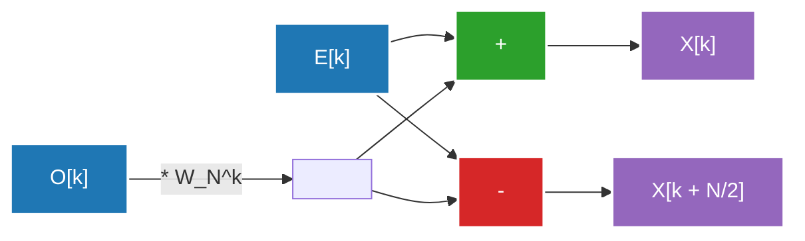

## 1. Einführung: Eine Einladung in die Welt der Fourier-Transformation

Unser Alltag ist von Wellen (Signalen) umgeben. Der Ton, der unsere Ohren erreicht, das Licht, das in unsere Augen fällt, die Funkwellen, die von unseren Smartphones gesendet und empfangen werden – all dies sind „Wellen“, die zeitlich oder räumlich schwanken. Es ist jedoch sehr schwierig, diese Wellen in ihrer Rohform zu analysieren oder zu verarbeiten. Hier kommt die **Fourier-Transformation** ins Spiel.

Die Fourier-Transformation basiert auf dem erstaunlichen Theorem, dass "jede komplexe Welle als Überlagerung von einfachen Sinus- und Kosinuswellen dargestellt werden kann". Indem man ein Signal, das im Zeitbereich (Time Domain) dargestellt wird, in den Frequenzbereich (Frequency Domain) transformiert, kann man herausfinden, welche Tonhöhen und mit welcher Intensität sie in diesem Signal enthalten sind.

Bei der Implementierung der Fourier-Transformation auf einem Computer erforderte die naive Diskrete Fourier-Transformation (DFT) jedoch einen Rechenaufwand von $O(N^2)$ für eine Datenmenge $N$, was eine Verarbeitung in praktischer Geschwindigkeit unmöglich machte. Diese Barriere wurde durch die **Schnelle Fourier-Transformation (FFT: Fast Fourier Transform)** durchbrochen. Die FFT reduzierte den Rechenaufwand drastisch auf $O(N \log N)$ und wurde zur Grundlage der modernen digitalen Signalverarbeitung.

In diesem Artikel werden wir tief in das Gesamtbild der FFT eintauchen und den Übergang vom Kontinuierlichen zum Diskreten, die mathematische Ableitung des Cooley-Tukey-Algorithmus, detaillierte Illustrationen der Butterfly-Operation sowie die Implementierung in Python und Anwendungsbeispiele erläutern.

---

## 2. Übergang von der kontinuierlichen zur diskreten Fourier-Transformation (DFT)

Um die FFT zu verstehen, müssen wir zunächst die diskrete Fourier-Transformation (DFT) verstehen.

### Kontinuierliche Fourier-Transformation (CFT)

Die Definition der ursprünglichen kontinuierlichen Fourier-Transformation lautet wie folgt:

$$ X(f) = \int_{-\infty}^{\infty} x(t) e^{-j 2\pi f t} dt $$

Hierbei ist $x(t)$ das Signal zum Zeitpunkt $t$, $X(f)$ eine komplexe Zahl, die Amplitude und Phase der Komponente bei der Frequenz $f$ darstellt, und $j$ die imaginäre Einheit. Computer können jedoch nicht mit unendlich kontinuierlichen Daten umgehen. In der realen Signalverarbeitung wird ein Signal in regelmäßigen Abständen abgetastet (gesampelt) und als eine endliche Anzahl von Datenpunkten behandelt.

### Ableitung der diskreten Fourier-Transformation (DFT)

Sei $x[n]$ eine Folge, die durch $N$-maliges Abtasten des Signals $x(t)$ mit einer Abtastperiode $T_s$ erhalten wird ($n = 0, 1, ..., N-1$). In diesem Fall wird auch der Frequenzbereich diskretisiert und die DFT ist wie folgt definiert:

$$ X[k] = \sum_{n=0}^{N-1} x[n] e^{-j \frac{2\pi}{N} k n} \quad (k = 0, 1, ..., N-1) $$

Wenn wir hier $W_N = e^{-j \frac{2\pi}{N}}$ setzen (dies wird als Drehfaktor oder Twiddle-Faktor bezeichnet), wird die Gleichung viel einfacher:

$$ X[k] = \sum_{n=0}^{N-1} x[n] W_N^{kn} $$

Wenn man versucht, diese DFT naiv zu berechnen, sind für jedes $k$ $N$ Multiplikationen und Additionen erforderlich. Da es $N$ Werte für $k$ gibt, sind insgesamt $N \times N = N^2$ komplexe Multiplikationen erforderlich. Bei einer Datenlänge $N$ von $1.000.000$ sind $N^2 = 1.000.000.000.000$ (eine Billion) Operationen erforderlich, was für eine Echtzeitverarbeitung absolut nicht machbar ist.

---

## 3. Mathematische Ableitung des FFT-Algorithmus: Cooley-Tukey-Typ

Der 1965 von James Cooley und John Tukey wiederentdeckte Algorithmus (es wird gesagt, dass Carl Friedrich Gauß bereits 1805 eine ähnliche Methode entdeckt hatte) ist der heutzutage am häufigsten verwendete FFT-Algorithmus. Hier leiten wir die Radix-2 Decimation-in-Time (DIT) FFT für den Fall ab, dass die Anzahl der Daten $N$ eine Zweierpotenz ist ($N = 2^m$).

### Aufteilung in Gerade und Ungerade (Teile und Herrsche)

Wir teilen die DFT-Gleichung in Fälle auf, in denen $n$ gerade und ungerade ist.

$$ X[k] = \sum_{n=0}^{N-1} x[n] W_N^{kn} $$

Wir teilen auf in $n = 2m$ (gerader Index) und $n = 2m + 1$ (ungerader Index). Dabei ist $m = 0, 1, ..., N/2 - 1$.

$$ X[k] = \sum_{m=0}^{N/2-1} x[2m] W_N^{k(2m)} + \sum_{m=0}^{N/2-1} x[2m+1] W_N^{k(2m+1)} $$

Hier nutzen wir die Eigenschaft des Drehfaktors $W_N^{2} = e^{-j \frac{4\pi}{N}} = e^{-j \frac{2\pi}{N/2}} = W_{N/2}$. Außerdem klammern wir $W_N^k$ aus dem zweiten Term auf der rechten Seite aus.

$$ X[k] = \sum_{m=0}^{N/2-1} x[2m] W_{N/2}^{km} + W_N^k \sum_{m=0}^{N/2-1} x[2m+1] W_{N/2}^{km} $$

Überraschenderweise hat diese Gleichung die folgende Bedeutung:
- Der erste Term ist eine $N/2$-Punkt-DFT der geradzahligen Daten $x[0], x[2], x[4], ...$ aus den Originaldaten (wir nennen dies $E[k]$).
- Der Sigma-Teil des zweiten Terms ist eine $N/2$-Punkt-DFT der ungeradzahligen Daten $x[1], x[3], x[5], ...$ (wir nennen dies $O[k]$).

Das heißt, wir können es wie folgt schreiben:

$$ X[k] = E[k] + W_N^k O[k] $$

### Nutzung der Periodizität

Hier sind $E[k]$ und $O[k]$ $N/2$-Punkt-DFTs und haben daher die Periode $N/2$. Das bedeutet $E[k + N/2] = E[k]$ und $O[k + N/2] = O[k]$.
Darüber hinaus hat der Drehfaktor die Eigenschaft $W_N^{k + N/2} = W_N^k \cdot e^{-j\pi} = -W_N^k$.

Durch Kombination dieser Eigenschaften kann die zweite Hälfte für $k \ge N/2$ wie folgt berechnet werden:

$$ X[k + N/2] = E[k] - W_N^k O[k] $$

Dies halbiert den Rechenaufwand. Um eine DFT der Größe $N$ zu berechnen, müssen wir lediglich zwei DFTs der Größe $N/2$ berechnen und sie kombinieren. Die rekursive Wiederholung dieser Aufteilung (bis die Größe 1 erreicht ist) ist der Algorithmus der Decimation-in-Time-FFT. Dadurch wird der Rechenaufwand auf $O(N \log_2 N)$ reduziert.

---

## 4. Illustration der Butterfly-Operation

Die oben genannte Grundeinheit, die $X[k]$ und $X[k + N/2]$ gleichzeitig berechnet, wird **Butterfly-Operation** genannt. Sie ist so benannt, weil der Ablauf der Berechnung wie Schmetterlingsflügel aussieht.

Nachfolgend wird der Datenfluss der Radix-2 Butterfly-Operation gezeigt.



Die Eingangsdaten werden durch rekursive Aufteilung in einer speziellen Reihenfolge neu angeordnet, die als "Bit-Reversal Permutation" (Bitumkehr-Permutation) bezeichnet wird. Zum Beispiel ändern sich für $N=8$ die Indizes von $(0, 1, 2, 3, 4, 5, 6, 7)$ zu $(0, 4, 2, 6, 1, 5, 3, 7)$. Nachdem diese Neuanordnung durchgeführt wurde, werden die obigen Butterfly-Operationen in $\log_2 N$ Stufen ausgeführt, um die endgültigen Frequenzkomponenten zu erhalten.

---

## 5. Implementierung der FFT in Python und Vergleich

Lassen Sie uns die Theorie in Code umsetzen. Hier werden wir eine eigene Cooley-Tukey-FFT unter Verwendung einer rekursiven Funktion schreiben und vergleichen, ob sie richtig funktioniert, mit der Standardbibliothek `numpy.fft.fft` von NumPy.

### Implementierung der eigenen FFT

```python
import numpy as np

def custom_fft(x):
    """
    Eindimensionaler rekursiver Radix-2 DIT FFT-Algorithmus
    * Die Eingabelänge muss eine Zweierpotenz sein
    """
    x = np.asarray(x, dtype=float)
    N = x.shape[0]
    
    # Abbruchbedingung: Wenn die Daten nur noch einen Punkt umfassen, diesen einfach zurückgeben
    if N <= 1:
        return x
    
    # Überprüfen, ob die Datenlänge eine Zweierpotenz ist
    if N % 2 != 0:
        raise ValueError("Die Größe muss eine Zweierpotenz sein")
    
    # Aufteilen in gerade und ungerade Indizes
    even = custom_fft(x[0::2])
    odd = custom_fft(x[1::2])
    
    # Berechnung der Drehfaktoren (Twiddle-Faktoren)
    T = [np.exp(-2j * np.pi * k / N) * odd[k] for k in range(N // 2)]
    
    # Zusammensetzung der Ergebnisse
    return np.array([even[k] + T[k] for k in range(N // 2)] +
                    [even[k] - T[k] for k in range(N // 2)])
```

### Vergleichstest mit numpy.fft

```python
# Datenvorbereitung: Abtastrate und Zeitachse
fs = 1024 # Abtastrate
t = np.linspace(0, 1, fs, endpoint=False)

# Erstellung einer komplexen Welle (Synthese von 50Hz- und 120Hz-Sinuswellen)
signal = 3 * np.sin(2 * np.pi * 50 * t) + 1 * np.sin(2 * np.pi * 120 * t)

# Ausführung der eigenen FFT
fft_custom_result = custom_fft(signal)

# Ausführung der NumPy-FFT
fft_numpy_result = np.fft.fft(signal)

# Vergleich der Ergebnisse (Überprüfung auf Fehler)
difference = np.allclose(fft_custom_result, fft_numpy_result)
print(f"Übereinstimmung mit NumPy-FFT: {difference}")
```

Wenn Sie diesen Code ausführen, wird `Übereinstimmung mit NumPy-FFT: True` ausgegeben, was bestätigt, dass der von uns mathematisch abgeleitete Algorithmus genau funktioniert. In der Praxis ist die Implementierung von NumPy (intern werden FFTPACK, PocketFFT usw. verwendet) nicht-rekursiv, um den Overhead rekursiver Aufrufe zu vermeiden, und sie ist zudem vektorisiert und für Caches optimiert, wodurch sie extrem schnell arbeitet.

---

## 6. Anwendungen der FFT in der realen Welt: Audio und Bild

Die FFT ist nicht nur ein mathematisches Rätsel. Die moderne digitale Gesellschaft kann ohne FFT nicht existieren. Hier nennen wir zwei typische Anwendungsbeispiele.

### Audiokompression (MP3, AAC)

Das menschliche Ohr hat die Eigenschaft des "Maskierungseffekts", bei dem es kleine Geräusche, die unmittelbar nach einem lauten Geräusch oder in der Nähe einer bestimmten Frequenz auftreten, nicht wahrnehmen kann.
In Audiokompressionsalgorithmen wird das Signal in kurze Frames aufgeteilt und auf jeden eine FFT (oder eine verbesserte Version der diskreten Kosinustransformation = MDCT) angewendet, um die Frequenzkomponenten zu ermitteln. Durch das Ausdünnen der Informationen von Komponenten, die für das menschliche Ohr schwer hörbar sind, oder durch die Reduzierung der Anzahl der zur Darstellung verwendeten Bits wird bei gleichbleibender Klangqualität eine drastische Datenkompression erreicht.

### Bildkompression (JPEG)

Bilder können als "räumliche Wellen" verstanden werden. Teile, in denen sich die Helligkeit der Pixel sanft ändert, sind "niedrige Frequenzen", während Teile, in denen sich die Farben abrupt ändern, wie bei Konturen und Texturen, "hohe Frequenzen" sind.
Bei der JPEG-Bildkompression wird das Bild in Blöcke von $8 \times 8$ aufgeteilt und eine zweidimensionale diskrete Kosinustransformation (DCT: so etwas wie ein Verwandter der FFT) durchgeführt. Da sich die Bildenergie meist auf tieffrequente Komponenten konzentriert, können die Daten hochfrequenter Komponenten (feine Muster) verworfen werden (Quantisierung), um die Dateigröße bei minimaler visueller Verschlechterung zu reduzieren.

Darüber hinaus sind die Anwendungsbereiche der FFT sehr vielfältig, wie z.B. OFDM (Orthogonal Frequency Division Multiplexing)-Modulation, die in drahtlosen Kommunikationen wie Wi-Fi und LTE verwendet wird, Bildrekonstruktion bei MRTs im medizinischen Bereich, Analyse seismischer Wellen und Datenverarbeitung in der Astronomie.

---

## 7. Zusammenfassung

Die Schnelle Fourier-Transformation (FFT) wird oft als eine der "größten algorithmischen Entdeckungen des 20. Jahrhunderts" in der Informatik bezeichnet.
Dieser Ansatz, der das Konzept kontinuierlicher Wellen in eine diskrete Formel (DFT) übersetzt und dann geschickt die der Formel innewohnende Periodizität und Symmetrie nutzt, um den Rechenaufwand drastisch von $O(N^2)$ auf $O(N \log N)$ zu reduzieren, ist das schönste Erfolgsbeispiel für die Teile-und-Herrsche-Methode im Algorithmus-Design.

Dass wir heute Musik streamen und hochauflösende Bilder sofort versenden können, liegt daran, dass dieser Algorithmus leise und extrem schnell tief in Hardware und Software arbeitet. Wenn man die mathematische Eleganz hinter der FFT versteht, wird man die digitale Welt noch tiefer verstehen.

Wir werden in anderen Artikeln in diesem Blog verwandte Themen der Fourier-Analyse und Signalverarbeitung noch detaillierter erklären, schauen Sie also auch dort gerne vorbei.
