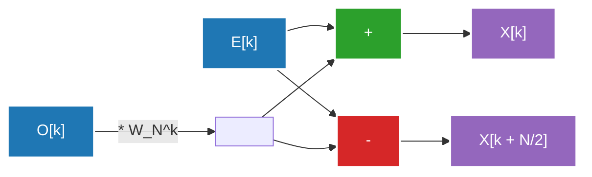

## 1. Introduction: An Invitation to the World of Fourier Transforms

Our daily lives are surrounded by waves (signals). The sounds reaching our ears, the light entering our eyes, the radio waves exchanged by smartphones—these are all "waves" that fluctuate temporally or spatially. However, analyzing and processing these waves in their raw form is extremely difficult. This is where the **Fourier Transform** comes in.

The Fourier Transform is based on the remarkable theorem that "any complex wave can be represented by a superposition of simple sine and cosine waves." By converting a signal represented in the Time Domain to the Frequency Domain, we can find out what pitches of sound are included in the signal and how strong they are.

However, when implementing the Fourier Transform on a computer, using the naive Discrete Fourier Transform (DFT) required an $O(N^2)$ time complexity for $N$ amount of data, making it impossible to process at a practical speed. The **Fast Fourier Transform (FFT)** broke through this barrier. FFT dramatically reduced the time complexity to $O(N \log N)$ and became the foundation of modern digital signal processing.

In this article, we will delve deep into the entire picture of the FFT, from the transition from continuous to discrete, the mathematical derivation of the Cooley-Tukey algorithm, a detailed diagram of the butterfly operation, to its Python implementation and application examples.

---

## 2. Transitioning from Continuous to Discrete Fourier Transform (DFT)

To understand the FFT, we first need to understand the Discrete Fourier Transform (DFT).

### Continuous Fourier Transform (CFT)

The defining equation of the original Continuous Fourier Transform is as follows:

$$ X(f) = \int_{-\infty}^{\infty} x(t) e^{-j 2\pi f t} dt $$

Here, $x(t)$ is the signal at time $t$, $X(f)$ is a complex number representing the amplitude and phase of the component at frequency $f$, and $j$ is the imaginary unit. However, computers cannot handle infinite continuous data. In real-world signal processing, the signal is sampled at regular intervals and treated as a finite number of data points.

### Derivation of the Discrete Fourier Transform (DFT)

Let $x[n]$ be a sequence of $N$ samples taken from the signal $x(t)$ at a sampling period $T_s$ ($n = 0, 1, ..., N-1$). In this case, the frequency domain is also discretized, and the DFT is defined as follows:

$$ X[k] = \sum_{n=0}^{N-1} x[n] e^{-j \frac{2\pi}{N} k n} \quad (k = 0, 1, ..., N-1) $$

Here, if we set $W_N = e^{-j \frac{2\pi}{N}}$ (this is called the twiddle factor or phase factor), the equation becomes much simpler.

$$ X[k] = \sum_{n=0}^{N-1} x[n] W_N^{kn} $$

If we naively try to calculate this DFT, $N$ multiplications and additions are required for each $k$, and since there are $N$ elements of $k$, a total of $N \times N = N^2$ complex multiplications are necessary. If the data length $N$ is $1,000,000$, it would require $N^2 = 1,000,000,000,000$ (one trillion) operations, which is completely insufficient for real-time processing.

---

## 3. Mathematical Derivation of the FFT Algorithm: Cooley-Tukey Type

The algorithm rediscovered by James Cooley and John Tukey in 1965 (it is said that Carl Friedrich Gauss had already discovered a similar method in 1805) is the most commonly used FFT algorithm today. Here, we will derive the radix-2 Decimation-in-Time (DIT) FFT when the number of data points $N$ is a power of 2 ($N = 2^m$).

### Splitting into Evens and Odds (Divide and Conquer)

We split the DFT equation into cases where $n$ is even and odd.

$$ X[k] = \sum_{n=0}^{N-1} x[n] W_N^{kn} $$

We divide it into $n = 2m$ (even indices) and $n = 2m + 1$ (odd indices). Where $m = 0, 1, ..., N/2 - 1$.

$$ X[k] = \sum_{m=0}^{N/2-1} x[2m] W_N^{k(2m)} + \sum_{m=0}^{N/2-1} x[2m+1] W_N^{k(2m+1)} $$

Here, we use the property of the twiddle factor $W_N^{2} = e^{-j \frac{4\pi}{N}} = e^{-j \frac{2\pi}{N/2}} = W_{N/2}$. Also, we factor out $W_N^k$ from the second term on the right side.

$$ X[k] = \sum_{m=0}^{N/2-1} x[2m] W_{N/2}^{km} + W_N^k \sum_{m=0}^{N/2-1} x[2m+1] W_{N/2}^{km} $$

Surprisingly, this equation means the following:
- The first term is the $N/2$-point DFT of the even-numbered data group $x[0], x[2], x[4], ...$ from the original data (let's call this $E[k]$).
- The sigma part of the second term is the $N/2$-point DFT of the odd-numbered data group $x[1], x[3], x[5], ...$ (let's call this $O[k]$).

In other words, it can be written as follows:

$$ X[k] = E[k] + W_N^k O[k] $$

### Utilizing Periodicity

Here, since $E[k]$ and $O[k]$ are $N/2$-point DFTs, they have a period of $N/2$. This means $E[k + N/2] = E[k]$ and $O[k + N/2] = O[k]$.
Furthermore, the twiddle factor has the property $W_N^{k + N/2} = W_N^k \cdot e^{-j\pi} = -W_N^k$.

Combining these, the latter half where $k \ge N/2$ can be calculated as follows:

$$ X[k + N/2] = E[k] - W_N^k O[k] $$

This halves the computational effort. To calculate a DFT of size $N$, we simply need to calculate two DFTs of size $N/2$ and combine them. Repeating this division recursively (until the size becomes 1) is the Decimation-in-Time FFT algorithm. This reduces the time complexity to $O(N \log_2 N)$.

---

## 4. Diagram of the Butterfly Operation

The basic unit that calculates the above $X[k]$ and $X[k + N/2]$ simultaneously is called a **Butterfly Operation**. It was named so because the flow of calculation looks like butterfly wings.

Below is the data flow of a radix-2 butterfly operation.



Input data is rearranged by recursive division into a special order called "Bit-Reversal Permutation." For example, if $N=8$, the index changes from $(0, 1, 2, 3, 4, 5, 6, 7)$ to $(0, 4, 2, 6, 1, 5, 3, 7)$. By performing this rearrangement and executing the butterfly operation above for $\log_2 N$ stages, the final frequency components are obtained.

---

## 5. Python FFT Implementation and Comparison

Let's translate the theory into code. Here, we will create our own Cooley-Tukey type FFT using a recursive function and compare it with the NumPy standard library `numpy.fft.fft` to see if it works correctly.

### Custom FFT Implementation

```python
import numpy as np

def custom_fft(x):
    """
    1D recursive radix-2 DIT FFT algorithm
    * Input length must be a power of 2
    """
    x = np.asarray(x, dtype=float)
    N = x.shape[0]
    
    # Termination condition: if the data is a single point, return it as is
    if N <= 1:
        return x
    
    # Check if the data length is a power of 2
    if N % 2 != 0:
        raise ValueError("Size must be a power of 2")
    
    # Split into even and odd indices
    even = custom_fft(x[0::2])
    odd = custom_fft(x[1::2])
    
    # Calculate twiddle factors
    T = [np.exp(-2j * np.pi * k / N) * odd[k] for k in range(N // 2)]
    
    # Synthesize results
    return np.array([even[k] + T[k] for k in range(N // 2)] +
                    [even[k] - T[k] for k in range(N // 2)])
```

### Comparison Test with numpy.fft

```python
# Data preparation: sampling rate and time axis
fs = 1024 # Sampling rate
t = np.linspace(0, 1, fs, endpoint=False)

# Create a composite wave (synthesis of 50Hz and 120Hz sine waves)
signal = 3 * np.sin(2 * np.pi * 50 * t) + 1 * np.sin(2 * np.pi * 120 * t)

# Run the custom FFT
fft_custom_result = custom_fft(signal)

# Run the NumPy FFT
fft_numpy_result = np.fft.fft(signal)

# Compare results (check for errors)
difference = np.allclose(fft_custom_result, fft_numpy_result)
print(f"Match with NumPy FFT: {difference}")
```

When this code is executed, it outputs `Match with NumPy FFT: True`, confirming that the algorithm we derived from mathematics functions accurately. In reality, NumPy's implementation (internally using FFTPACK, PocketFFT, etc.) is highly optimized with non-recursive transformation to avoid recursive call overhead, as well as vectorization and cache optimization, making it operate extremely fast.

---

## 6. Applications of FFT in the Real World: Audio and Images

FFT is not just a mathematical puzzle. Modern digital society could not exist without FFT. Here are two typical application examples.

### Audio Compression (MP3, AAC)

The human ear has a characteristic called the "masking effect," where it cannot perceive quiet sounds immediately after a loud sound or near a specific frequency.
In audio compression algorithms, a signal is divided into short frames, and an FFT (or its improved version, the Modified Discrete Cosine Transform = MDCT) is applied to each to determine the frequency components. By then thinning out the information of components that are hard for the human ear to hear or reducing the number of bits used to represent them, dramatic data compression is achieved while preserving sound quality.

### Image Compression (JPEG)

Images can be thought of as "spatial waves." The parts where pixel brightness changes smoothly are "low frequencies," and the parts where colors change abruptly, such as outlines and textures, are "high frequencies."
In JPEG image compression, an image is divided into $8 \times 8$ blocks, and a 2D Discrete Cosine Transform (DCT: a relative of the FFT) is performed. Since the energy of an image is often concentrated in the low-frequency components, discarding the data of high-frequency components (fine patterns) through a process called quantization keeps visual degradation to a minimum while reducing the file size.

Besides these, the applications of FFT are widespread, including OFDM (Orthogonal Frequency-Division Multiplexing) modulation used in wireless communications like Wi-Fi and LTE, MRI image reconstruction in the medical field, seismic wave analysis, and data processing in astronomy.

---

## 7. Conclusion

The Fast Fourier Transform (FFT) is said to be one of the "greatest algorithmic discoveries of the 20th century" in computer science.
This approach of translating the concept of continuous waves into discrete calculation formulas (DFT) and then skillfully using the periodicity and symmetry hidden within those formulas to dramatically reduce the time complexity from $O(N^2)$ to $O(N \log N)$ is the most beautiful success story of the divide and conquer method in algorithm design.

The reason we can listen to streaming music today and instantly transmit high-quality images is because this algorithm is running silently and super-fast deep within our hardware and software. By understanding the mathematical elegance behind the FFT, your understanding of the digital world will surely deepen.

We will also explain related topics on Fourier analysis and signal processing in more detail in other articles on this blog, so please check them out as well.
