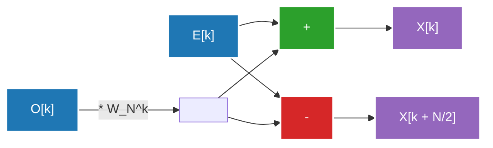

## 1. Introducción: Invitación al mundo de la Transformada de Fourier

Nuestra vida cotidiana está rodeada de ondas (señales). El sonido que llega a nuestros oídos, la luz que entra por nuestros ojos, las ondas de radio que envían y reciben los teléfonos inteligentes: todas estas son "ondas" que fluctúan temporal o espacialmente. Sin embargo, es muy difícil analizar o procesar estas ondas en su forma original. Aquí es donde entra en juego la **Transformada de Fourier (Fourier Transform)**.

La Transformada de Fourier se basa en el sorprendente teorema de que "cualquier onda compleja puede representarse como la superposición de ondas senos y cosenos simples". Al convertir una señal representada en el dominio del tiempo (Time Domain) al dominio de la frecuencia (Frequency Domain), podemos saber qué tonos de sonido están presentes en esa señal y con qué intensidad.

Sin embargo, al implementar la transformada de Fourier en una computadora, si se utiliza una Transformada de Fourier Discreta (DFT: Discrete Fourier Transform) ingenua, se requiere una complejidad computacional de $O(N^2)$ para una cantidad de datos $N$, lo que impedía el procesamiento a velocidades prácticas. Lo que rompió esta barrera fue la **Transformada Rápida de Fourier (FFT: Fast Fourier Transform)**. La FFT redujo drásticamente la complejidad computacional a $O(N \log N)$ y se convirtió en la base del procesamiento de señales digitales moderno.

En este artículo, profundizaremos en la totalidad de la FFT, desde la transición de lo continuo a lo discreto, la derivación matemática del algoritmo tipo Cooley-Tukey, una ilustración detallada de la operación de mariposa, hasta su implementación en Python y ejemplos de aplicaciones.

---

## 2. Transición de la transformada continua a la discreta (DFT)

Para comprender la FFT, primero debemos entender la Transformada de Fourier Discreta (DFT).

### Transformada de Fourier Continua (CFT)

La ecuación de definición original de la transformada de Fourier continua es la siguiente:

$$ X(f) = \int_{-\infty}^{\infty} x(t) e^{-j 2\pi f t} dt $$

Aquí, $x(t)$ es la señal en el tiempo $t$, $X(f)$ es un número complejo que representa la amplitud y la fase del componente en la frecuencia $f$, y $j$ es la unidad imaginaria. Sin embargo, las computadoras no pueden manejar datos continuos infinitos. En el procesamiento de señales en el mundo real, la señal se muestrea (se toman muestras) a intervalos regulares y se trata como un número finito de puntos de datos.

### Derivación de la Transformada de Fourier Discreta (DFT)

Sea $x[n]$ una secuencia obtenida al muestrear la señal $x(t)$ $N$ veces con un período de muestreo $T_s$ ($n = 0, 1, ..., N-1$). En este caso, el dominio de la frecuencia también se discretiza, y la DFT se define de la siguiente manera:

$$ X[k] = \sum_{n=0}^{N-1} x[n] e^{-j \frac{2\pi}{N} k n} \quad (k = 0, 1, ..., N-1) $$

Si establecemos $W_N = e^{-j \frac{2\pi}{N}}$ (a esto se le llama factor de rotación o factor de giro), la ecuación se vuelve más simple:

$$ X[k] = \sum_{n=0}^{N-1} x[n] W_N^{kn} $$

Si intentamos calcular esta DFT de forma ingenua, se necesitarán $N$ multiplicaciones y sumas para cada $k$, y como hay $N$ de $k$, se requerirá un total de $N \times N = N^2$ multiplicaciones complejas. Si la longitud de los datos $N$ es $1,000,000$, se necesitarán $N^2 = 1,000,000,000,000$ (1 billón) de operaciones, lo cual es totalmente inviable para el procesamiento en tiempo real.

---

## 3. Derivación matemática del algoritmo FFT: Tipo Cooley-Tukey

El algoritmo redescubierto en 1965 por James Cooley y John Tukey (se dice que [Carl Friedrich Gauss](/es/p/gauss/) ya había descubierto un método similar en 1805) es el algoritmo FFT más utilizado en la actualidad. Aquí derivaremos la FFT de decimación en el tiempo (Decimation-in-Time, DIT) de base 2 para el caso en que el número de datos $N$ sea una potencia de 2 ($N = 2^m$).

### División en pares e impares (Divide y vencerás)

Dividimos la ecuación de la DFT en los casos donde $n$ es par y donde $n$ es impar.

$$ X[k] = \sum_{n=0}^{N-1} x[n] W_N^{kn} $$

Dividimos en $n = 2m$ (índices pares) y $n = 2m + 1$ (índices impares). Donde $m = 0, 1, ..., N/2 - 1$.

$$ X[k] = \sum_{m=0}^{N/2-1} x[2m] W_N^{k(2m)} + \sum_{m=0}^{N/2-1} x[2m+1] W_N^{k(2m+1)} $$

Aquí, utilizamos la propiedad del factor de rotación $W_N^{2} = e^{-j \frac{4\pi}{N}} = e^{-j \frac{2\pi}{N/2}} = W_{N/2}$. Además, factorizamos $W_N^k$ del segundo término del lado derecho.

$$ X[k] = \sum_{m=0}^{N/2-1} x[2m] W_{N/2}^{km} + W_N^k \sum_{m=0}^{N/2-1} x[2m+1] W_{N/2}^{km} $$

Sorprendentemente, esta ecuación tiene el siguiente significado:
- El primer término es una DFT de $N/2$ puntos del grupo de datos pares de los datos originales $x[0], x[2], x[4], ...$ (Llamaremos a esto $E[k]$).
- La parte de sumatoria del segundo término es una DFT de $N/2$ puntos del grupo de datos impares $x[1], x[3], x[5], ...$ (Llamaremos a esto $O[k]$).

Es decir, se puede escribir de la siguiente manera:

$$ X[k] = E[k] + W_N^k O[k] $$

### Aprovechando la periodicidad

Aquí, dado que $E[k]$ y $O[k]$ son DFTs de $N/2$ puntos, tienen un período de $N/2$. Es decir, $E[k + N/2] = E[k]$ y $O[k + N/2] = O[k]$.
Además, el factor de rotación tiene la propiedad de que $W_N^{k + N/2} = W_N^k \cdot e^{-j\pi} = -W_N^k$.

Combinando esto, la segunda mitad de $k \ge N/2$ se puede calcular de la siguiente manera:

$$ X[k + N/2] = E[k] - W_N^k O[k] $$

Esto reduce el trabajo de cálculo a la mitad. Para calcular una DFT de tamaño $N$, basta con calcular dos DFTs de tamaño $N/2$ y combinarlas. Repetir esta división recursivamente (hasta que el tamaño sea 1) es el algoritmo FFT de decimación en el tiempo. Esto reduce la complejidad computacional a $O(N \log_2 N)$.

---

## 4. Ilustración de la operación de mariposa

La unidad básica que calcula simultáneamente $X[k]$ y $X[k + N/2]$ de arriba se llama **operación de mariposa (Butterfly Operation)**. Se nombró así porque el flujo de cálculo se asemeja a las alas de una mariposa.

A continuación, se muestra el flujo de datos de la operación de mariposa de base 2.



Los datos de entrada se reordenan mediante una división recursiva en un orden especial llamado "Inversión de bits (Bit-Reversal Permutation)". Por ejemplo, para $N=8$, el índice cambia de $(0, 1, 2, 3, 4, 5, 6, 7)$ a $(0, 4, 2, 6, 1, 5, 3, 7)$. Después de realizar esta reordenación, se obtienen los componentes de frecuencia finales ejecutando la operación de mariposa anterior durante $\log_2 N$ etapas.

---

## 5. Implementación en Python de la FFT y comparación

Vamos a traducir la teoría a código. Aquí, crearemos nuestra propia FFT tipo Cooley-Tukey utilizando funciones recursivas y la compararemos con la biblioteca estándar de NumPy `numpy.fft.fft` para ver si funciona correctamente.

### Implementación propia de FFT

```python
import numpy as np

def custom_fft(x):
    """
    Algoritmo FFT DIT de base 2 recursivo unidimensional
    * La longitud de la entrada debe ser una potencia de 2
    """
    x = np.asarray(x, dtype=float)
    N = x.shape[0]
    
    # Condición de finalización: si los datos son 1 punto, devolverlos tal cual
    if N <= 1:
        return x
    
    # Comprobar si la longitud de los datos es una potencia de 2
    if N % 2 != 0:
        raise ValueError("El tamaño debe ser una potencia de 2")
    
    # Dividir en índices pares e impares
    even = custom_fft(x[0::2])
    odd = custom_fft(x[1::2])
    
    # Cálculo del factor de rotación (factor de giro)
    T = [np.exp(-2j * np.pi * k / N) * odd[k] for k in range(N // 2)]
    
    # Síntesis de los resultados
    return np.array([even[k] + T[k] for k in range(N // 2)] +
                    [even[k] - T[k] for k in range(N // 2)])
```

### Prueba de comparación con numpy.fft

```python
# Preparación de datos: tasa de muestreo y eje de tiempo
fs = 1024 # Tasa de muestreo
t = np.linspace(0, 1, fs, endpoint=False)

# Creación de una onda compuesta (síntesis de ondas senoidales de 50Hz y 120Hz)
signal = 3 * np.sin(2 * np.pi * 50 * t) + 1 * np.sin(2 * np.pi * 120 * t)

# Ejecución de la FFT propia
fft_custom_result = custom_fft(signal)

# Ejecución de la FFT de NumPy
fft_numpy_result = np.fft.fft(signal)

# Comparación de resultados (verificación de errores)
difference = np.allclose(fft_custom_result, fft_numpy_result)
print(f"Coincidencia con la FFT de NumPy: {difference}")
```

Al ejecutar este código, se mostrará `Coincidencia con la FFT de NumPy: True`, lo que confirma que el algoritmo que derivamos de las matemáticas funciona con precisión. En la práctica, la implementación de NumPy (internamente utiliza FFTPACK o PocketFFT, etc.) está optimizada y sin recursión para evitar la sobrecarga de llamadas recursivas, además de vectorización y optimización de caché, por lo que funciona muy rápido.

---

## 6. Aplicaciones de la FFT en el mundo real: Audio e Imagen

La FFT no es un simple rompecabezas matemático. La sociedad digital moderna no podría existir sin la FFT. Aquí mencionamos dos de los ejemplos de aplicación más representativos.

### Compresión de audio (MP3, AAC)

El oído humano tiene una característica llamada "efecto de enmascaramiento", que hace que no pueda percibir sonidos bajos que se producen inmediatamente después de un sonido fuerte, o que están cerca de una frecuencia específica.
En los algoritmos de compresión de audio, la señal se divide en tramas cortas, a cada una de las cuales se le aplica la FFT (o una versión mejorada, la Transformada de Coseno Discreta = MDCT) para obtener sus componentes de frecuencia. Luego, se reduce la información de los componentes que son difíciles de escuchar para el oído humano, o se disminuye la cantidad de bits para representarlos, logrando así una drástica compresión de datos mientras se mantiene la calidad del sonido.

### Compresión de imágenes (JPEG)

Las imágenes pueden considerarse como "ondas espaciales". Las áreas donde el brillo de los píxeles cambia suavemente son "baja frecuencia", y las áreas donde el color cambia drásticamente, como los contornos o texturas, son "alta frecuencia".
En la compresión de imágenes JPEG, la imagen se divide en bloques de $8 \times 8$ y se realiza una transformada de coseno discreta bidimensional (DCT: algo así como un pariente de la FFT). Dado que la energía de la imagen se concentra principalmente en los componentes de baja frecuencia, al descartar (cuantificar) los datos de los componentes de alta frecuencia (patrones finos), el tamaño del archivo se reduce al mismo tiempo que se minimiza la degradación visual.

Además, la FFT tiene una amplia gama de aplicaciones, como la modulación OFDM (Multiplexación por División de Frecuencias Ortogonales) utilizada en comunicaciones inalámbricas como Wi-Fi y LTE, la reconstrucción de imágenes de resonancia magnética (RM) en el campo médico, el análisis de ondas sísmicas y el procesamiento de datos en astronomía.

---

## 7. Resumen

Se dice que la Transformada Rápida de Fourier (FFT) es uno de los "mayores descubrimientos algorítmicos del siglo XX" en las ciencias de la computación.
Traducir el concepto de onda continua en una fórmula discreta (DFT) y luego reducir drásticamente la complejidad de los cálculos de $O(N^2)$ a $O(N \log N)$ aprovechando hábilmente la periodicidad y la simetría inherentes a esa fórmula matemática, es el ejemplo de éxito más hermoso del enfoque de divide y vencerás en el diseño de algoritmos.

Si hoy en día podemos escuchar música en streaming y enviar imágenes de alta resolución al instante, es porque este algoritmo está operando silenciosamente y a muy alta velocidad en lo profundo de nuestro hardware y software. Comprender la elegancia matemática detrás de la FFT profundizará sin duda su comprensión del mundo digital.

En futuros artículos de este blog continuaremos explicando en detalle más temas relacionados con el análisis de Fourier y el procesamiento de señales, así que no se los pierdan.
