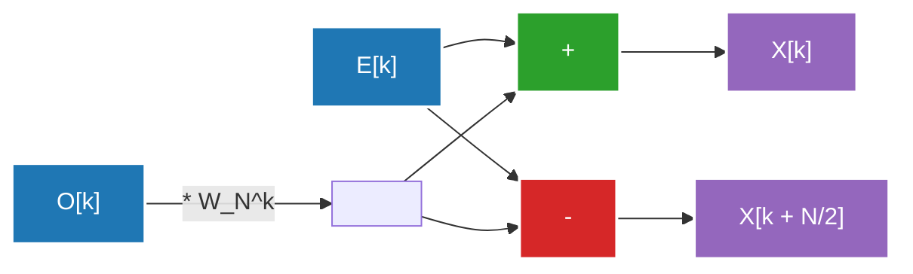

## 1. Introduction : Invitation dans le monde de la transformée de Fourier

Notre vie quotidienne est entourée d'ondes (signaux). Le son qui parvient à nos oreilles, la lumière qui entre dans nos yeux, les ondes radio échangées par les smartphones, tout cela correspond à des "ondes" qui varient dans le temps ou dans l'espace. Cependant, il est extrêmement difficile d'analyser ou de traiter ces ondes telles quelles. C'est là qu'intervient la **Transformée de Fourier (Fourier Transform)**.

La transformée de Fourier repose sur un théorème étonnant : "Toute onde, aussi complexe soit-elle, peut être représentée par une superposition d'ondes simples (sinus et cosinus)". En convertissant un signal représenté dans le domaine temporel (Time Domain) vers le domaine fréquentiel (Frequency Domain), on peut savoir quelles hauteurs de son sont contenues dans ce signal et avec quelle intensité.

Cependant, lors de l'implémentation de la transformée de Fourier sur un ordinateur, l'utilisation de la Transformée de Fourier Discrète (DFT : Discrete Fourier Transform) naïve nécessite une complexité de calcul de $O(N^2)$ pour une quantité de données $N$, ce qui ne permettait pas un traitement à une vitesse pratique. C'est la **Transformée de Fourier Rapide (FFT : Fast Fourier Transform)** qui a brisé ce mur. La FFT a drastiquement réduit la complexité de calcul à $O(N \log N)$ et est devenue la base du traitement numérique du signal moderne.

Dans cet article, nous explorerons en profondeur la FFT, en expliquant la transition du continu au discret, la dérivation mathématique de l'algorithme de type Cooley-Tukey, l'illustration détaillée de l'opération papillon (butterfly operation), ainsi que son implémentation en Python et des exemples d'applications.

---

## 2. Transition vers la Transformée de Fourier Discrète (DFT)

Pour comprendre la FFT, il faut d'abord comprendre la Transformée de Fourier Discrète (DFT).

### Transformée de Fourier Continue (CFT)

L'équation de définition originale de la transformée de Fourier continue est la suivante :

$$ X(f) = \int_{-\infty}^{\infty} x(t) e^{-j 2\pi f t} dt $$

Ici, $x(t)$ est le signal à l'instant $t$, $X(f)$ est un nombre complexe représentant l'amplitude et la phase de la composante à la fréquence $f$, et $j$ est l'unité imaginaire. Cependant, un ordinateur ne peut pas manipuler des données continues infinies. Dans le traitement réel du signal, le signal est échantillonné à des intervalles réguliers et traité comme un nombre fini de points de données.

### Dérivation de la Transformée de Fourier Discrète (DFT)

Supposons que le signal $x(t)$ soit échantillonné $N$ fois avec une période d'échantillonnage $T_s$, ce qui donne la suite $x[n]$ (pour $n = 0, 1, ..., N-1$). À ce moment, le domaine fréquentiel est également discrétisé, et la DFT est définie comme suit :

$$ X[k] = \sum_{n=0}^{N-1} x[n] e^{-j \frac{2\pi}{N} k n} \quad (k = 0, 1, ..., N-1) $$

Si l'on pose $W_N = e^{-j \frac{2\pi}{N}}$ (que l'on appelle le facteur de rotation ou facteur twiddle), l'équation devient plus simple :

$$ X[k] = \sum_{n=0}^{N-1} x[n] W_N^{kn} $$

Si l'on essaie de calculer cette DFT de manière naïve, il faut $N$ multiplications et additions pour chaque $k$, et comme il y a $N$ valeurs de $k$, cela nécessite un total de $N \times N = N^2$ multiplications complexes. Pour une longueur de données de $N = 1,000,000$, cela nécessiterait $N^2 = 1,000,000,000,000$ (mille milliards) d'opérations, ce qui est tout à fait insuffisant pour un traitement en temps réel.

---

## 3. Dérivation mathématique de l'algorithme FFT : Type Cooley-Tukey

L'algorithme redécouvert en 1965 par James Cooley et John Tukey (on dit qu'une méthode similaire avait déjà été découverte par [Carl Friedrich Gauss](/fr/p/gauss/) en 1805) est l'algorithme FFT le plus couramment utilisé aujourd'hui. Ici, nous allons dériver la FFT à décimation temporelle (DIT, Decimation-in-Time) de base 2, lorsque le nombre de données $N$ est une puissance de 2 ($N = 2^m$).

### Division en pairs et impairs (Approche "Diviser pour régner")

Nous divisons l'équation de la DFT selon que $n$ est pair ou impair.

$$ X[k] = \sum_{n=0}^{N-1} x[n] W_N^{kn} $$

On sépare $n = 2m$ (index pair) et $n = 2m + 1$ (index impair). Avec $m = 0, 1, ..., N/2 - 1$.

$$ X[k] = \sum_{m=0}^{N/2-1} x[2m] W_N^{k(2m)} + \sum_{m=0}^{N/2-1} x[2m+1] W_N^{k(2m+1)} $$

Ici, nous utilisons la propriété du facteur de rotation $W_N^{2} = e^{-j \frac{4\pi}{N}} = e^{-j \frac{2\pi}{N/2}} = W_{N/2}$. De plus, on extrait $W_N^k$ du second terme du membre de droite.

$$ X[k] = \sum_{m=0}^{N/2-1} x[2m] W_{N/2}^{km} + W_N^k \sum_{m=0}^{N/2-1} x[2m+1] W_{N/2}^{km} $$

Étonnamment, cette équation a la signification suivante :
- Le premier terme est la DFT à $N/2$ points du groupe de données de position paire parmi les données d'origine $x[0], x[2], x[4], ...$ (que l'on notera $E[k]$).
- La partie sigma du deuxième terme est la DFT à $N/2$ points du groupe de données de position impaire $x[1], x[3], x[5], ...$ (que l'on notera $O[k]$).

Autrement dit, on peut écrire :

$$ X[k] = E[k] + W_N^k O[k] $$

### Utilisation de la périodicité

Ici, comme $E[k]$ et $O[k]$ sont des DFT à $N/2$ points, ils ont une période de $N/2$. Cela signifie que $E[k + N/2] = E[k]$ et $O[k + N/2] = O[k]$.
De plus, le facteur de rotation possède la propriété suivante : $W_N^{k + N/2} = W_N^k \cdot e^{-j\pi} = -W_N^k$.

En combinant cela, la seconde moitié, pour $k \ge N/2$, peut être calculée comme suit :

$$ X[k + N/2] = E[k] - W_N^k O[k] $$

Ainsi, l'effort de calcul est réduit de moitié. Pour calculer une DFT de taille $N$, il suffit de calculer deux DFT de taille $N/2$ et de les combiner. L'algorithme FFT à décimation temporelle consiste à répéter cette division de manière récursive (jusqu'à ce que la taille devienne 1). De ce fait, la complexité de calcul est réduite à $O(N \log_2 N)$.

---

## 4. Illustration de l'opération papillon (Butterfly Operation)

L'unité de base qui calcule simultanément $X[k]$ et $X[k + N/2]$ ci-dessus est appelée **opération papillon (Butterfly Operation)**. Elle est nommée ainsi parce que le flux des calculs ressemble aux ailes d'un papillon.

Voici le flux de données de l'opération papillon de base 2.



Les données d'entrée sont réarrangées par des divisions récursives dans un ordre spécial appelé "permutation à inversion de bits" (Bit-Reversal Permutation). Par exemple, pour $N=8$, les indices passent de $(0, 1, 2, 3, 4, 5, 6, 7)$ à $(0, 4, 2, 6, 1, 5, 3, 7)$. Après ce réarrangement, l'exécution des opérations papillon ci-dessus sur $\log_2 N$ étapes permet d'obtenir les composantes de fréquence finales.

---

## 5. Implémentation et comparaison de la FFT en Python

Traduisons la théorie en code. Ici, nous allons créer notre propre FFT de type Cooley-Tukey en utilisant une fonction récursive, et vérifier son bon fonctionnement en la comparant avec la bibliothèque standard `numpy.fft.fft` de NumPy.

### Implémentation de notre propre FFT

```python
import numpy as np

def custom_fft(x):
    """
    Algorithme FFT DIT de base 2 récursif en 1D
    * La longueur de l'entrée doit être une puissance de 2
    """
    x = np.asarray(x, dtype=float)
    N = x.shape[0]
    
    # Condition d'arrêt : s'il n'y a plus qu'un point de données, on le retourne tel quel
    if N <= 1:
        return x
    
    # Vérification que la longueur des données est une puissance de 2
    if N % 2 != 0:
        raise ValueError("La taille doit être une puissance de 2")
    
    # Division en indices pairs et impairs
    even = custom_fft(x[0::2])
    odd = custom_fft(x[1::2])
    
    # Calcul des facteurs de rotation (facteurs twiddle)
    T = [np.exp(-2j * np.pi * k / N) * odd[k] for k in range(N // 2)]
    
    # Synthèse des résultats
    return np.array([even[k] + T[k] for k in range(N // 2)] +
                    [even[k] - T[k] for k in range(N // 2)])
```

### Test de comparaison avec numpy.fft

```python
# Préparation des données : taux d'échantillonnage et axe temporel
fs = 1024 # Taux d'échantillonnage
t = np.linspace(0, 1, fs, endpoint=False)

# Création d'une onde composite (synthèse d'ondes sinusoïdales à 50Hz et 120Hz)
signal = 3 * np.sin(2 * np.pi * 50 * t) + 1 * np.sin(2 * np.pi * 120 * t)

# Exécution de notre propre FFT
fft_custom_result = custom_fft(signal)

# Exécution de la FFT de NumPy
fft_numpy_result = np.fft.fft(signal)

# Comparaison des résultats (vérification des erreurs)
difference = np.allclose(fft_custom_result, fft_numpy_result)
print(f"Correspondance avec la FFT de NumPy : {difference}")
```

Lors de l'exécution de ce code, la sortie affichera `Correspondance avec la FFT de NumPy : True`, ce qui confirme que l'algorithme que nous avons dérivé mathématiquement fonctionne correctement. En réalité, l'implémentation de NumPy (qui utilise en interne FFTPACK, PocketFFT, etc.) évite la surcharge des appels récursifs en éliminant la récursivité, et bénéficie de la vectorisation et de l'optimisation du cache, ce qui la rend extrêmement rapide.

---

## 6. Applications de la FFT dans le monde réel : Audio et Image

La FFT n'est pas qu'un simple puzzle mathématique. La société numérique moderne ne pourrait exister sans la FFT. Voici deux exemples représentatifs d'applications.

### Compression audio (MP3, AAC)

L'oreille humaine possède une caractéristique appelée "effet de masquage", ce qui signifie qu'elle ne peut pas percevoir un son faible situé juste après un son fort ou à proximité d'une certaine fréquence.
Dans les algorithmes de compression audio, le signal est divisé en courtes trames, et la FFT (ou une version améliorée appelée Transformée en Cosinus Discrète Modifiée, MDCT) est appliquée à chacune pour obtenir les composantes fréquentielles. En supprimant les informations des composantes difficiles à entendre pour l'oreille humaine, ou en réduisant le nombre de bits pour les représenter, on parvient à une compression drastique des données tout en conservant la qualité sonore.

### Compression d'image (JPEG)

Une image peut être considérée comme une "onde spatiale". Les zones où la luminosité des pixels change doucement correspondent aux "basses fréquences", tandis que les zones où la couleur change brusquement, comme les contours ou les textures, correspondent aux "hautes fréquences".
Dans la compression d'image JPEG, l'image est divisée en blocs de $8 \times 8$, puis on applique une transformée en cosinus discrète 2D (DCT : une parente de la FFT). Comme l'énergie d'une image est souvent concentrée dans les composantes basses fréquences, le fait de tronquer (quantifier) les données des composantes hautes fréquences (les motifs fins) permet de réduire la taille du fichier tout en minimisant la dégradation visuelle.

Par ailleurs, les domaines d'application de la FFT sont vastes, incluant la modulation OFDM (Multiplexage par répartition orthogonale de la fréquence) utilisée dans les communications sans fil comme le Wi-Fi et la LTE, la reconstruction d'images IRM dans le domaine médical, l'analyse des ondes sismiques, et le traitement de données en astronomie.

---

## 7. Conclusion

La Transformée de Fourier Rapide (FFT) est considérée comme l'une des "plus grandes découvertes algorithmiques du 20e siècle" en informatique.
Cette approche, qui traduit le concept d'ondes continues en formules mathématiques discrètes (DFT), puis utilise intelligemment la périodicité et la symétrie cachées dans ces équations pour réduire drastiquement la complexité de calcul de $O(N^2)$ à $O(N \log N)$, est l'un des exemples de réussite les plus élégants de la méthode "diviser pour régner" dans la conception d'algorithmes.

Si aujourd'hui nous pouvons écouter de la musique en streaming et envoyer instantanément des images de haute qualité, c'est parce que cet algorithme fonctionne silencieusement et à une vitesse vertigineuse au cœur du matériel et des logiciels. En comprenant l'élégance mathématique qui se cache derrière la FFT, votre compréhension du monde numérique s'en trouvera grandement approfondie.

Nous aborderons plus en détail d'autres sujets liés à l'analyse de Fourier et au traitement du signal dans d'autres articles de ce blog, alors n'hésitez pas à les consulter également.
