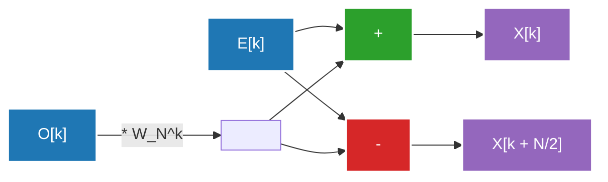

## 1. परिचय: फूरियर ट्रांसफॉर्म की दुनिया में निमंत्रण

हमारा दैनिक जीवन तरंगों (सिग्नलों) से घिरा हुआ है। हमारे कानों तक पहुँचने वाली आवाज़, आँखों में पड़ने वाली रोशनी, और स्मार्टफोन द्वारा आदान-प्रदान की जाने वाली रेडियो तरंगें—ये सभी समय या स्थान में बदलने वाली "तरंगें" हैं। हालाँकि, इन तरंगों का उनके मूल रूप में विश्लेषण या प्रसंस्करण करना बहुत मुश्किल है। यहीं पर **फूरियर ट्रांसफॉर्म (Fourier Transform)** काम आता है।

फूरियर ट्रांसफॉर्म इस आश्चर्यजनक प्रमेय पर आधारित है कि "किसी भी जटिल तरंग को साधारण साइन (sine) और कोसाइन (cosine) तरंगों के संयोजन के रूप में व्यक्त किया जा सकता है।" समय डोमेन (Time Domain) में व्यक्त सिग्नल को फ्रीक्वेंसी डोमेन (Frequency Domain) में बदलकर, हम यह जान सकते हैं कि उस सिग्नल में किस पिच की ध्वनियाँ हैं और वे कितनी तीव्र हैं।

हालाँकि, कंप्यूटर पर फूरियर ट्रांसफॉर्म को लागू करते समय, यदि हम एक साधारण डिस्क्रीट फूरियर ट्रांसफॉर्म (DFT: Discrete Fourier Transform) का उपयोग करते हैं, तो $N$ डेटा आकार के लिए $O(N^2)$ कम्प्यूटेशनल जटिलता की आवश्यकता होती है, जिससे व्यावहारिक गति पर प्रसंस्करण करना असंभव हो जाता है। इस बाधा को **फास्ट फूरियर ट्रांसफॉर्म (FFT: Fast Fourier Transform)** ने तोड़ा। FFT कम्प्यूटेशनल जटिलता को नाटकीय रूप से घटाकर $O(N \log N)$ कर देता है, और यह आधुनिक डिजिटल सिग्नल प्रोसेसिंग की नींव बन गया है।

इस लेख में, हम FFT की पूरी तस्वीर पर गहराई से विचार करेंगे, जिसमें निरंतर से डिस्क्रीट में परिवर्तन, कूली-टकी (Cooley-Tukey) एल्गोरिथम की गणितीय व्युत्पत्ति, बटरफ्लाई ऑपरेशन का विस्तृत चित्र, और पायथन कार्यान्वयन के साथ-साथ इसके अनुप्रयोग शामिल हैं।

---

## 2. निरंतर से डिस्क्रीट फूरियर ट्रांसफॉर्म (DFT) में परिवर्तन

FFT को समझने के लिए, पहले हमें डिस्क्रीट फूरियर ट्रांसफॉर्म (DFT) को समझना होगा।

### निरंतर फूरियर ट्रांसफॉर्म (CFT)

मूल निरंतर फूरियर ट्रांसफॉर्म का समीकरण इस प्रकार है:

$$ X(f) = \int_{-\infty}^{\infty} x(t) e^{-j 2\pi f t} dt $$

यहाँ, $x(t)$ समय $t$ पर सिग्नल है, $X(f)$ आवृत्ति $f$ पर घटक के आयाम और चरण का प्रतिनिधित्व करने वाली एक सम्मिश्र संख्या (complex number) है, और $j$ काल्पनिक इकाई है। हालाँकि, कंप्यूटर अनंत निरंतर डेटा को संभाल नहीं सकते। वास्तविक दुनिया के सिग्नल प्रोसेसिंग में, हम सिग्नल को नियमित अंतराल पर सैंपल करते हैं और इसे सीमित डेटा बिंदुओं के रूप में मानते हैं।

### डिस्क्रीट फूरियर ट्रांसफॉर्म (DFT) की व्युत्पत्ति

मान लीजिए कि सिग्नल $x(t)$ को सैंपलिंग अवधि $T_s$ के साथ $N$ बार सैंपल किया गया है, और अनुक्रम $x[n]$ ($n = 0, 1, ..., N-1$) है। इस समय, आवृत्ति डोमेन भी डिस्क्रीट हो जाता है, और DFT को निम्नानुसार परिभाषित किया जाता है:

$$ X[k] = \sum_{n=0}^{N-1} x[n] e^{-j \frac{2\pi}{N} k n} \quad (k = 0, 1, ..., N-1) $$

यहाँ, यदि हम $W_N = e^{-j \frac{2\pi}{N}}$ सेट करते हैं (इसे ट्विडल फैक्टर या रोटेशन फैक्टर कहा जाता है), तो समीकरण सरल हो जाता है:

$$ X[k] = \sum_{n=0}^{N-1} x[n] W_N^{kn} $$

यदि हम इस DFT की सीधे गणना करने का प्रयास करते हैं, तो प्रत्येक $k$ के लिए $N$ गुणा और जोड़ आवश्यक हैं। चूँकि $N$ की संख्या $k$ है, कुल मिलाकर $N \times N = N^2$ जटिल गुणा आवश्यक होंगे। यदि डेटा की लंबाई $N$ $1,000,000$ है, तो $N^2 = 1,000,000,000,000$ (1 ट्रिलियन) ऑपरेशनों की आवश्यकता होगी, जो रियल-टाइम प्रोसेसिंग के लिए बहुत धीमा है।

---

## 3. FFT एल्गोरिथम की गणितीय व्युत्पत्ति: कूली-टकी प्रकार

1965 में, जेम्स कूली (James Cooley) और जॉन टकी (John Tukey) द्वारा फिर से खोजा गया एल्गोरिथम (कहा जाता है कि [कार्ल फ्रेडरिक गॉस](/hi/p/gauss/) ने 1805 में इसी तरह की विधि की खोज की थी) आज सबसे अधिक उपयोग किया जाने वाला FFT एल्गोरिथम है। यहाँ हम बेस-2 डेसीमेशन-इन-टाइम (Decimation-in-Time, DIT) FFT प्राप्त करेंगे जब डेटा की संख्या $N$ 2 की घात ($N = 2^m$) है।

### सम (Even) और विषम (Odd) में विभाजन (फूट डालो और राज करो)

हम DFT समीकरण को $n$ के सम और विषम होने के मामलों में विभाजित करते हैं:

$$ X[k] = \sum_{n=0}^{N-1} x[n] W_N^{kn} $$

हम इसे $n = 2m$ (सम इंडेक्स) और $n = 2m + 1$ (विषम इंडेक्स) में विभाजित करते हैं, जहाँ $m = 0, 1, ..., N/2 - 1$ है:

$$ X[k] = \sum_{m=0}^{N/2-1} x[2m] W_N^{k(2m)} + \sum_{m=0}^{N/2-1} x[2m+1] W_N^{k(2m+1)} $$

यहाँ हम ट्विडल फैक्टर के गुण $W_N^{2} = e^{-j \frac{4\pi}{N}} = e^{-j \frac{2\pi}{N/2}} = W_{N/2}$ का उपयोग करते हैं, और दूसरे पद से $W_N^k$ निकालते हैं:

$$ X[k] = \sum_{m=0}^{N/2-1} x[2m] W_{N/2}^{km} + W_N^k \sum_{m=0}^{N/2-1} x[2m+1] W_{N/2}^{km} $$

आश्चर्यजनक रूप से, इस समीकरण का निम्नलिखित अर्थ है:
- पहला पद मूल डेटा के सम-संख्या वाले डेटा समूह $x[0], x[2], x[4], ...$ का $N/2$-पॉइंट DFT है (आइए इसे $E[k]$ कहें)।
- दूसरे पद का सिग्मा भाग विषम-संख्या वाले डेटा समूह $x[1], x[3], x[5], ...$ का $N/2$-पॉइंट DFT है (आइए इसे $O[k]$ कहें)।

यानी इसे ऐसे लिखा जा सकता है:

$$ X[k] = E[k] + W_N^k O[k] $$

### आवधिकता (Periodicity) का उपयोग

यहाँ, $E[k]$ और $O[k]$ $N/2$-पॉइंट DFT हैं, इसलिए उनकी अवधि $N/2$ है। अर्थात्, $E[k + N/2] = E[k]$ और $O[k + N/2] = O[k]$।
इसके अलावा, ट्विडल फैक्टर में $W_N^{k + N/2} = W_N^k \cdot e^{-j\pi} = -W_N^k$ की विशेषता है।

इनको मिलाकर, $k \ge N/2$ के दूसरे भाग की गणना निम्नानुसार की जा सकती है:

$$ X[k + N/2] = E[k] - W_N^k O[k] $$

इससे गणना का प्रयास आधा हो जाता है। $N$ आकार के DFT की गणना करने के लिए, हमें केवल $N/2$ आकार के दो DFT की गणना करने और उन्हें संयोजित करने की आवश्यकता है। इस विभाजन को पुनरावर्ती रूप से (जब तक कि आकार 1 न हो जाए) दोहराने को डेसीमेशन-इन-टाइम FFT एल्गोरिथम कहा जाता है। यह गणना की जटिलता को $O(N \log_2 N)$ तक कम कर देता है।

---

## 4. बटरफ्लाई ऑपरेशन का चित्रण

$X[k]$ और $X[k + N/2]$ की एक साथ गणना करने वाली बुनियादी इकाई को **बटरफ्लाई ऑपरेशन (Butterfly Operation)** कहा जाता है। इसका यह नाम इसलिए पड़ा क्योंकि गणना का प्रवाह तितली के पंखों जैसा दिखता है।

नीचे बेस-2 बटरफ्लाई ऑपरेशन का डेटा प्रवाह दिखाया गया है:



इनपुट डेटा को एक विशेष क्रम में पुनर्व्यवस्थित किया जाता है जिसे पुनरावर्ती विभाजन द्वारा "बिट-रिवर्सल परम्यूटेशन (Bit-Reversal Permutation)" कहा जाता है। उदाहरण के लिए, जब $N=8$, इंडेक्स $(0, 1, 2, 3, 4, 5, 6, 7)$ से $(0, 4, 2, 6, 1, 5, 3, 7)$ में बदल जाता है। इस पुनर्व्यवस्था के बाद, उपरोक्त बटरफ्लाई ऑपरेशन को $\log_2 N$ चरणों में निष्पादित करके, अंतिम आवृत्ति घटक प्राप्त किया जाता है।

---

## 5. पायथन के साथ FFT कार्यान्वयन और तुलना

आइए इस सिद्धांत को कोड में लागू करें। यहाँ, हम पुनरावर्ती फलन का उपयोग करके अपना स्वयं का कूली-टकी प्रकार का FFT बनाते हैं, और इसकी तुलना NumPy की मानक लाइब्रेरी `numpy.fft.fft` से यह देखने के लिए करते हैं कि यह सही ढंग से काम कर रहा है या नहीं।

### कस्टम FFT कार्यान्वयन

```python
import numpy as np

def custom_fft(x):
    """
    1D पुनरावर्ती बेस-2 DIT FFT एल्गोरिथम
    * इनपुट लंबाई 2 की घात होनी चाहिए
    """
    x = np.asarray(x, dtype=float)
    N = x.shape[0]
    
    # समाप्ति शर्त: यदि डेटा 1 बिंदु है, तो इसे वैसे ही लौटाएं
    if N <= 1:
        return x
    
    # जांचें कि क्या डेटा की लंबाई 2 की घात है
    if N % 2 != 0:
        raise ValueError("आकार 2 की घात होना चाहिए")
    
    # सम इंडेक्स और विषम इंडेक्स में विभाजित करें
    even = custom_fft(x[0::2])
    odd = custom_fft(x[1::2])
    
    # ट्विडल फैक्टर की गणना
    T = [np.exp(-2j * np.pi * k / N) * odd[k] for k in range(N // 2)]
    
    # परिणामों का संयोजन
    return np.array([even[k] + T[k] for k in range(N // 2)] +
                    [even[k] - T[k] for k in range(N // 2)])
```

### numpy.fft के साथ तुलना परीक्षण

```python
# डेटा तैयार करना: सैंपलिंग दर और समय अक्ष
fs = 1024 # सैंपलिंग दर
t = np.linspace(0, 1, fs, endpoint=False)

# सम्मिश्र तरंग का निर्माण (50Hz और 120Hz साइन तरंगों का संयोजन)
signal = 3 * np.sin(2 * np.pi * 50 * t) + 1 * np.sin(2 * np.pi * 120 * t)

# कस्टम FFT निष्पादित करें
fft_custom_result = custom_fft(signal)

# NumPy का FFT निष्पादित करें
fft_numpy_result = np.fft.fft(signal)

# परिणामों की तुलना (त्रुटि जांच)
difference = np.allclose(fft_custom_result, fft_numpy_result)
print(f"NumPy के FFT के साथ मेल खाता है: {difference}")
```

जब आप इस कोड को चलाते हैं, तो यह `NumPy के FFT के साथ मेल खाता है: True` आउटपुट करता है, यह पुष्टि करता है कि हमने गणित से जो एल्गोरिथम प्राप्त किया है वह ठीक से काम कर रहा है। व्यवहार में, NumPy का कार्यान्वयन (जो आंतरिक रूप से FFTPACK या PocketFFT का उपयोग करता है) पुनरावर्ती कॉल के ओवरहेड से बचने के लिए गैर-पुनरावर्ती है, और वेक्टरकरण और कैश अनुकूलन लागू करता है, जिससे यह बहुत तेज़ी से काम करता है।

---

## 6. वास्तविक दुनिया में FFT के अनुप्रयोग: ऑडियो और चित्र

FFT सिर्फ एक गणितीय पहेली नहीं है। आधुनिक डिजिटल समाज FFT के बिना मौजूद नहीं हो सकता। यहाँ दो विशिष्ट अनुप्रयोग उदाहरण दिए गए हैं।

### ऑडियो संपीड़न (MP3, AAC)

मानव कान में "मास्किंग प्रभाव" नामक एक विशेषता होती है, जिसका अर्थ है कि यह बहुत तेज आवाज के ठीक बाद या किसी विशेष आवृत्ति के करीब छोटी आवाज़ों को नहीं पहचान सकता है।
ऑडियो कम्प्रेशन एल्गोरिदम सिग्नल को छोटे फ्रेम में विभाजित करते हैं और आवृत्ति घटकों को खोजने के लिए प्रत्येक पर FFT (या एक संशोधित डिस्क्रीट कोसाइन ट्रांसफॉर्म = MDCT) लागू करते हैं। फिर, उन घटकों की जानकारी को हटाकर जो मानव कान के लिए सुनने में मुश्किल हैं, या उनका प्रतिनिधित्व करने वाले बिट्स की संख्या को कम करके, ध्वनि की गुणवत्ता को बनाए रखते हुए नाटकीय डेटा संपीड़न प्राप्त किया जाता है।

### चित्र संपीड़न (JPEG)

छवियों को "स्थानिक तरंगों" के रूप में सोचा जा सकता है। ऐसे क्षेत्र जहाँ पिक्सेल की चमक सुचारू रूप से बदलती है वे "कम आवृत्ति" (low frequency) वाले होते हैं, और जहाँ रंग तेज़ी से बदलते हैं जैसे कि किनारे या बनावट, वे "उच्च आवृत्ति" (high frequency) वाले होते हैं।
JPEG छवि संपीड़न में, छवि को $8 \times 8$ ब्लॉक में विभाजित किया जाता है और 2D डिस्क्रीट कोसाइन ट्रांसफॉर्म (DCT: जो FFT का ही रिश्तेदार है) लागू किया जाता है। चूँकि चित्र की ऊर्जा अक्सर कम-आवृत्ति वाले घटकों में केंद्रित होती है, उच्च-आवृत्ति वाले घटकों (विस्तृत पैटर्न) के डेटा को हटाकर (क्वांटाइज़ेशन), दृश्यमान गिरावट को कम रखते हुए फ़ाइल का आकार कम कर दिया जाता है।

इसके अलावा, FFT के अनुप्रयोग बहुत व्यापक हैं, जैसे कि वाई-फाई और LTE जैसे वायरलेस संचार में प्रयुक्त OFDM (ऑर्थोगोनल फ्रीक्वेंसी-डिवीजन मल्टीप्लेक्सिंग) मॉड्यूलेशन, चिकित्सा क्षेत्र में MRI छवि पुनर्निर्माण, भूकंपीय तरंग विश्लेषण और खगोल विज्ञान में डेटा प्रोसेसिंग।

---

## 7. निष्कर्ष

फास्ट फूरियर ट्रांसफॉर्म (FFT) को कंप्यूटर विज्ञान में "20वीं सदी की सबसे बड़ी एल्गोरिदमिक खोजों" में से एक माना जाता है।
निरंतर तरंगों की अवधारणा को डिस्क्रीट गणना सूत्र (DFT) में बदलने और फिर इसके पीछे छिपी आवधिकता और समरूपता (symmetry) का कुशलता से उपयोग करके कम्प्यूटेशनल जटिलता को $O(N^2)$ से $O(N \log N)$ तक कम करने का यह दृष्टिकोण, एल्गोरिथम डिजाइन में फूट डालो और राज करो (divide and conquer) विधि की सबसे सुंदर सफलता की कहानी है।

आज हम संगीत स्ट्रीम कर सकते हैं और उच्च-गुणवत्ता वाले चित्र तुरंत भेज सकते हैं क्योंकि यह एल्गोरिथम हार्डवेयर और सॉफ़्टवेयर के भीतर चुपचाप और अत्यधिक तेज़ी से काम कर रहा है। FFT के पीछे की गणितीय सुंदरता को जानने से निश्चित रूप से डिजिटल दुनिया के बारे में आपकी समझ गहरी होगी।

हम इस ब्लॉग के अन्य लेखों में संबंधित फूरियर विश्लेषण और सिग्नल प्रोसेसिंग विषयों को भी अधिक विस्तार से कवर करेंगे, इसलिए कृपया उन्हें भी देखें।
