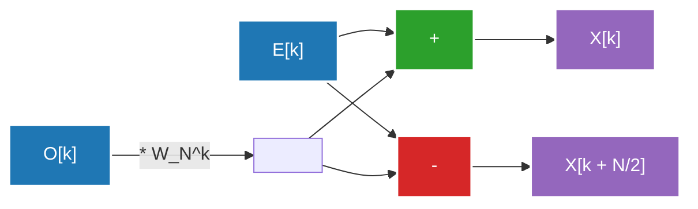

## 1. Pendahuluan: Ajakan ke Dunia Transformasi Fourier

Kehidupan kita sehari-hari dikelilingi oleh gelombang (sinyal). Suara yang sampai ke telinga kita, cahaya yang masuk ke mata kita, gelombang radio yang dipertukarkan oleh ponsel pintar, semuanya adalah "gelombang" yang berfluktuasi secara spasial atau temporal. Namun, sangat sulit untuk menganalisis atau memproses gelombang ini sebagaimana aslinya. Di sinilah **Transformasi Fourier (Fourier Transform)** berperan.

Transformasi Fourier didasarkan pada teorema yang mengejutkan bahwa "gelombang kompleks apa pun dapat diekspresikan dengan superposisi gelombang sinus dan kosinus sederhana". Dengan mengubah sinyal yang diekspresikan dalam domain waktu (Time Domain) ke domain frekuensi (Frequency Domain), kita dapat mengetahui seberapa tinggi suara dan seberapa kuat frekuensi yang terkandung dalam sinyal tersebut.

Namun, saat mengimplementasikan transformasi Fourier di komputer, menggunakan Transformasi Fourier Diskrit (DFT: Discrete Fourier Transform) naif memerlukan kompleksitas komputasi $O(N^2)$ untuk jumlah data $N$, sehingga pemrosesan tidak dapat dilakukan pada kecepatan praktis. Tembok ini didobrak oleh **Transformasi Fourier Cepat (FFT: Fast Fourier Transform)**. FFT secara dramatis mengurangi kompleksitas komputasi menjadi $O(N \log N)$ dan menjadi landasan pemrosesan sinyal digital modern.

Artikel ini akan menggali dan menjelaskan keseluruhan FFT secara mendalam, mulai dari transisi kontinu ke diskrit, derivasi matematis algoritma tipe Cooley-Tukey, ilustrasi rinci tentang operasi kupu-kupu, hingga implementasi dan contoh aplikasi dengan Python.

---

## 2. Transisi dari Transformasi Fourier Kontinu ke Diskrit (DFT)

Untuk memahami FFT, pertama-tama kita harus memahami Transformasi Fourier Diskrit (DFT).

### Transformasi Fourier Kontinu (CFT)

Persamaan definisi asli dari transformasi Fourier kontinu adalah sebagai berikut:

$$ X(f) = \int_{-\infty}^{\infty} x(t) e^{-j 2\pi f t} dt $$

Di sini, $x(t)$ adalah sinyal pada waktu $t$, $X(f)$ adalah bilangan kompleks yang mewakili amplitudo dan fase komponen pada frekuensi $f$, dan $j$ adalah unit imajiner. Namun, komputer tidak dapat menangani data kontinu yang tak terbatas. Dalam pemrosesan sinyal dunia nyata, sinyal disampel (diambil sampelnya) pada interval yang konstan dan diperlakukan sebagai jumlah titik data yang terbatas.

### Derivasi Transformasi Fourier Diskrit (DFT)

Misalkan barisan dari $N$ sampel dari sinyal $x(t)$ dengan periode sampling $T_s$ adalah $x[n]$ ($n = 0, 1, ..., N-1$). Pada saat ini, domain frekuensi juga didiskritisasi, dan DFT didefinisikan sebagai berikut:

$$ X[k] = \sum_{n=0}^{N-1} x[n] e^{-j \frac{2\pi}{N} k n} \quad (k = 0, 1, ..., N-1) $$

Di sini, jika kita memisalkan $W_N = e^{-j \frac{2\pi}{N}}$ (ini disebut faktor putaran, atau twiddle factor), persamaannya menjadi lebih sederhana:

$$ X[k] = \sum_{n=0}^{N-1} x[n] W_N^{kn} $$

Jika kita mencoba menghitung DFT ini secara naif, ia memerlukan $N$ operasi perkalian dan penjumlahan untuk setiap $k$, dan karena ada $N$ buah $k$, secara keseluruhan diperlukan $N \times N = N^2$ operasi perkalian bilangan kompleks. Jika panjang data $N$ adalah $1.000.000$, maka $N^2 = 1.000.000.000.000$ (1 triliun) operasi akan diperlukan, yang tidak mungkin dilakukan secara real-time.

---

## 3. Derivasi Matematis dari Algoritma FFT: Tipe Cooley-Tukey

Ditemukan kembali oleh James Cooley dan John Tukey pada tahun 1965 (sebenarnya [Carl Friedrich Gauss](/id/p/gauss/) dikatakan telah menemukan metode serupa pada tahun 1805), algoritma ini adalah algoritma FFT yang paling umum digunakan saat ini. Di sini, kita akan menurunkan FFT Decimation-in-Time (DIT) radix-2 ketika jumlah data $N$ adalah pangkat dari 2 ($N = 2^m$).

### Pemisahan menjadi Genap dan Ganjil (Metode Divide and Conquer)

Kita membagi persamaan DFT menjadi kasus di mana $n$ bernilai genap dan ganjil.

$$ X[k] = \sum_{n=0}^{N-1} x[n] W_N^{kn} $$

Dibagi menjadi $n = 2m$ (indeks genap) dan $n = 2m + 1$ (indeks ganjil). Di mana $m = 0, 1, ..., N/2 - 1$.

$$ X[k] = \sum_{m=0}^{N/2-1} x[2m] W_N^{k(2m)} + \sum_{m=0}^{N/2-1} x[2m+1] W_N^{k(2m+1)} $$

Di sini, kita menggunakan sifat faktor putaran $W_N^{2} = e^{-j \frac{4\pi}{N}} = e^{-j \frac{2\pi}{N/2}} = W_{N/2}$. Selain itu, kita mengeluarkan $W_N^k$ dari suku kedua di sisi kanan.

$$ X[k] = \sum_{m=0}^{N/2-1} x[2m] W_{N/2}^{km} + W_N^k \sum_{m=0}^{N/2-1} x[2m+1] W_{N/2}^{km} $$

Hebatnya, persamaan ini memiliki arti sebagai berikut:
- Suku pertama adalah DFT $N/2$-titik dari kelompok data pada urutan genap $x[0], x[2], x[4], ...$ dari data asli (kita sebut ini $E[k]$).
- Bagian sigma dari suku kedua adalah DFT $N/2$-titik dari kelompok data pada urutan ganjil $x[1], x[3], x[5], ...$ (kita sebut ini $O[k]$).

Dengan kata lain, dapat ditulis sebagai berikut:

$$ X[k] = E[k] + W_N^k O[k] $$

### Pemanfaatan Periodisitas

Di sini, karena $E[k]$ dan $O[k]$ adalah DFT $N/2$-titik, mereka memiliki periode $N/2$. Yaitu, $E[k + N/2] = E[k]$ dan $O[k + N/2] = O[k]$.
Selain itu, faktor putaran memiliki sifat $W_N^{k + N/2} = W_N^k \cdot e^{-j\pi} = -W_N^k$.

Dengan menggabungkan ini, bagian belakang dari $k \ge N/2$ dapat dihitung sebagai berikut:

$$ X[k + N/2] = E[k] - W_N^k O[k] $$

Hal ini membagi dua usaha komputasi. Untuk menghitung DFT berukuran $N$, kita hanya perlu menghitung dua DFT berukuran $N/2$ dan menggabungkannya. Mengulangi pembagian ini secara rekursif (sampai ukurannya menjadi 1) adalah algoritma FFT decimation-in-time. Ini mengurangi kompleksitas komputasi menjadi $O(N \log_2 N)$.

---

## 4. Ilustrasi Operasi Kupu-Kupu

Unit dasar yang secara bersamaan menghitung $X[k]$ dan $X[k + N/2]$ di atas disebut **Operasi Kupu-Kupu (Butterfly Operation)**. Dinamakan demikian karena alur perhitungannya terlihat seperti sayap kupu-kupu.

Di bawah ini ditunjukkan aliran data untuk operasi kupu-kupu radix-2.



Data input diatur ulang melalui pemisahan rekursif ke dalam urutan khusus yang disebut "Bit-Reversal Permutation" (Permutasi Pembalikan Bit). Misalnya, jika $N=8$, indeks berubah dari $(0, 1, 2, 3, 4, 5, 6, 7)$ menjadi $(0, 4, 2, 6, 1, 5, 3, 7)$. Setelah melakukan pengaturan ulang ini, dengan menjalankan operasi kupu-kupu di atas sebanyak $\log_2 N$ tahap, komponen frekuensi akhir dapat diperoleh.

---

## 5. Implementasi FFT dengan Python dan Perbandingan

Mari kita tuangkan teori tersebut ke dalam kode. Di sini, kita akan membuat sendiri FFT tipe Cooley-Tukey menggunakan fungsi rekursif, dan membandingkannya dengan pustaka standar NumPy `numpy.fft.fft` untuk memeriksa apakah ia bekerja dengan benar.

### Implementasi FFT Kustom

```python
import numpy as np

def custom_fft(x):
    """
    Algoritma FFT DIT radix-2 rekursif 1 dimensi
    * Panjang input harus merupakan pangkat dari 2
    """
    x = np.asarray(x, dtype=float)
    N = x.shape[0]
    
    # Kondisi terminasi: Jika data menjadi 1 titik, kembalikan apa adanya
    if N <= 1:
        return x
    
    # Periksa apakah panjang data adalah pangkat dari 2
    if N % 2 != 0:
        raise ValueError("Ukuran harus berupa pangkat dari 2")
    
    # Pisahkan menjadi indeks genap dan ganjil
    even = custom_fft(x[0::2])
    odd = custom_fft(x[1::2])
    
    # Perhitungan faktor putaran (twiddle factor)
    T = [np.exp(-2j * np.pi * k / N) * odd[k] for k in range(N // 2)]
    
    # Sintesis hasil
    return np.array([even[k] + T[k] for k in range(N // 2)] +
                    [even[k] - T[k] for k in range(N // 2)])
```

### Uji Perbandingan dengan numpy.fft

```python
# Persiapan data: Sampling rate dan sumbu waktu
fs = 1024 # Sampling rate
t = np.linspace(0, 1, fs, endpoint=False)

# Pembuatan gelombang gabungan (Sintesis gelombang sinus 50Hz dan 120Hz)
signal = 3 * np.sin(2 * np.pi * 50 * t) + 1 * np.sin(2 * np.pi * 120 * t)

# Eksekusi FFT kustom
fft_custom_result = custom_fft(signal)

# Eksekusi FFT NumPy
fft_numpy_result = np.fft.fft(signal)

# Bandingkan hasil (Periksa kesalahan)
difference = np.allclose(fft_custom_result, fft_numpy_result)
print(f"Kecocokan dengan FFT NumPy: {difference}")
```

Ketika kode ini dieksekusi, akan mencetak `Kecocokan dengan FFT NumPy: True`, memastikan bahwa algoritma yang kita turunkan dari matematika berfungsi secara akurat. Dalam praktiknya, implementasi NumPy (yang secara internal menggunakan FFTPACK atau PocketFFT) sangat dioptimalkan untuk menghindari overhead panggilan rekursif melalui non-rekursi, serta menerapkan vektorisasi dan optimasi cache, membuatnya beroperasi sangat cepat.

---

## 6. Aplikasi FFT di Dunia Nyata: Audio dan Gambar

FFT bukan sekadar teka-teki matematika. Masyarakat digital modern tidak dapat berdiri tanpa FFT. Berikut adalah dua contoh aplikasi yang representatif.

### Kompresi Audio (MP3, AAC)

Telinga manusia memiliki karakteristik yang disebut "efek masking", di mana ia tidak dapat mengenali suara kecil tepat setelah suara keras atau yang dekat dengan frekuensi tertentu.
Dalam algoritma kompresi audio, sinyal dibagi menjadi bingkai-bingkai pendek, dan FFT (atau versi modifikasi Discrete Cosine Transform = MDCT) diterapkan pada masing-masing bingkai untuk menemukan komponen frekuensinya. Kemudian, dengan mengurangi informasi komponen yang sulit didengar telinga manusia atau mengurangi jumlah bit untuk merepresentasikannya, kompresi data yang dramatis dicapai sambil tetap mempertahankan kualitas suara.

### Kompresi Gambar (JPEG)

Gambar dapat dianggap sebagai "gelombang spasial". Bagian di mana kecerahan piksel berubah dengan mulus adalah "frekuensi rendah", dan bagian di mana warna berubah tajam seperti garis bentuk atau tekstur adalah "frekuensi tinggi".
Dalam kompresi gambar JPEG, gambar dibagi menjadi blok berukuran $8 \times 8$ dan Transformasi Kosinus Diskrit 2D (DCT: kerabat FFT) dilakukan. Karena energi gambar sebagian besar terkonsentrasi pada komponen frekuensi rendah, membuang (mengkuantisasi) data komponen frekuensi tinggi (pola detail) mengurangi ukuran file sambil meminimalkan degradasi visual.

Ada banyak aplikasi FFT lainnya, termasuk modulasi OFDM (Orthogonal Frequency Division Multiplexing) yang digunakan dalam komunikasi nirkabel seperti Wi-Fi dan LTE, rekonstruksi gambar MRI di bidang medis, analisis gelombang seismik, dan pemrosesan data dalam astronomi.

---

## 7. Kesimpulan

Transformasi Fourier Cepat (FFT) dikatakan sebagai salah satu "penemuan algoritmik terbesar abad ke-20" dalam ilmu komputer.
Menerjemahkan konsep gelombang kontinu ke dalam rumus komputasi diskrit (DFT), dan secara cerdik menggunakan periodisitas dan simetri yang tersembunyi dalam rumus tersebut untuk mengurangi jumlah komputasi secara dramatis dari $O(N^2)$ menjadi $O(N \log N)$ adalah salah satu contoh kesuksesan terindah dari metode divide and conquer dalam desain algoritma.

Kita dapat mendengarkan musik secara streaming dan mengirim gambar berkualitas tinggi secara instan hari ini karena algoritma ini bekerja diam-diam dan dengan kecepatan sangat tinggi jauh di dalam perangkat keras dan perangkat lunak. Mengetahui keanggunan matematis di balik FFT tidak diragukan lagi akan memperdalam pemahaman Anda tentang dunia digital.

Topik terkait tentang analisis Fourier dan pemrosesan sinyal juga akan dibahas lebih rinci dalam artikel-artikel lain di blog ini, jadi pastikan untuk memeriksanya juga.
