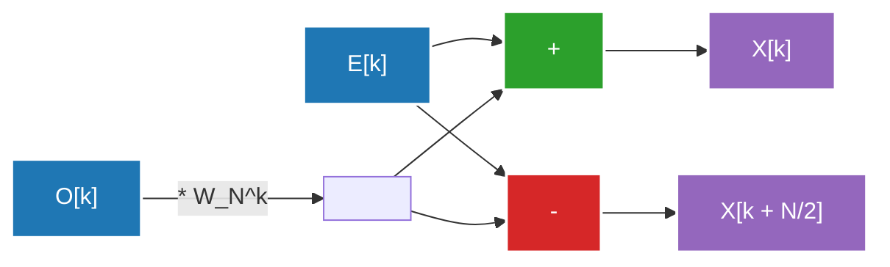

## 1. 시작하며: 푸리에 변환의 세계로의 초대

우리의 일상생활은 파동(신호)으로 둘러싸여 있습니다. 귀에 들리는 음성, 눈에 들어오는 빛, 스마트폰이 주고받는 전파, 이들은 모두 시간적 혹은 공간적으로 변동하는 "파동"입니다. 그러나 이러한 파동을 있는 그대로 분석하거나 처리하는 것은 매우 어렵습니다. 여기서 등장하는 것이 **푸리에 변환(Fourier Transform)**입니다.

푸리에 변환은 "아무리 복잡한 파동이라도 단순한 사인파와 코사인파의 중첩으로 표현할 수 있다"는 놀라운 정리에 기초하고 있습니다. 시간 영역(Time Domain)으로 표현된 신호를 주파수 영역(Frequency Domain)으로 변환함으로써, 그 신호에 어떤 높이의 소리가 어느 정도의 세기로 포함되어 있는지 알 수 있습니다.

하지만 컴퓨터 상에서 푸리에 변환을 구현할 때, 순진하게 이산 푸리에 변환(DFT: Discrete Fourier Transform)을 사용하면 데이터 양 $N$에 대해 $O(N^2)$의 계산량이 필요하게 되어, 실용적인 속도로 처리를 수행할 수 없었습니다. 이 장벽을 허문 것이 바로 **고속 푸리에 변환(FFT: Fast Fourier Transform)**입니다. FFT는 계산량을 $O(N \log N)$으로 획기적으로 줄여, 현대 디지털 신호 처리의 기반이 되었습니다.

본 기사에서는 연속에서 이산으로의 이행, 쿨리-튜키(Cooley-Tukey)형 알고리즘의 수학적 도출, 나비 연산에 대한 상세한 도해, 그리고 Python을 이용한 구현과 응용 사례까지, FFT의 전모를 깊이 파헤쳐 해설합니다.

---

## 2. 연속에서 이산 푸리에 변환(DFT)으로의 이행

FFT를 이해하기 위해서는 먼저 이산 푸리에 변환(DFT)을 이해할 필요가 있습니다.

### 연속 푸리에 변환(CFT)

원래의 연속 푸리에 변환의 정의식은 다음과 같습니다.

$$ X(f) = \int_{-\infty}^{\infty} x(t) e^{-j 2\pi f t} dt $$

여기서 $x(t)$는 시간 $t$에서의 신호, $X(f)$는 주파수 $f$에서의 성분의 진폭과 위상을 나타내는 복소수, $j$는 허수 단위입니다. 그러나 컴퓨터는 무한한 연속 데이터를 다룰 수 없습니다. 현실의 신호 처리에서는 신호를 일정한 간격으로 샘플링(표본화)하여 유한한 개수의 데이터 포인트로 다룹니다.

### 이산 푸리에 변환(DFT)의 도출

신호 $x(t)$를 샘플링 주기 $T_s$로 $N$개 샘플링한 수열을 $x[n]$이라고 합시다 ($n = 0, 1, ..., N-1$). 이때 주파수 영역도 이산화되어, DFT는 다음과 같이 정의됩니다.

$$ X[k] = \sum_{n=0}^{N-1} x[n] e^{-j \frac{2\pi}{N} k n} \quad (k = 0, 1, ..., N-1) $$

여기서 $W_N = e^{-j \frac{2\pi}{N}}$로 두면 (이를 회전 인자 또는 트위들 계수라고 부릅니다), 식은 더 간단해집니다.

$$ X[k] = \sum_{n=0}^{N-1} x[n] W_N^{kn} $$

이 DFT를 순진하게 계산하려고 하면, 각 $k$에 대해 $N$번의 곱셈과 덧셈이 필요하며, $k$가 $N$개 있으므로 전체적으로 $N \times N = N^2$번의 복소수 곱셈이 필요하게 됩니다. 데이터 길이 $N$이 $1,000,000$인 경우, $N^2 = 1,000,000,000,000$(1조)번의 연산이 필요하게 되어 실시간 처리에는 도저히 맞출 수 없습니다.

---

## 3. FFT 알고리즘의 수학적 도출: 쿨리-튜키형

1965년, 제임스 쿨리(James Cooley)와 존 튜키(John Tukey)에 의해 재발견된 알고리즘(사실 칼 프리드리히 가우스가 1805년에 이미 유사한 기법을 발견했다고 알려져 있습니다)이 현대에 가장 널리 사용되고 있는 FFT 알고리즘입니다. 여기서는 데이터 수 $N$이 2의 거듭제곱($N = 2^m$)인 경우의 기수-2 시간 차분(Decimation-in-Time, DIT) FFT를 도출합니다.

### 짝수와 홀수로 분할 (분할 정복법)

DFT 식을 $n$이 짝수인 경우와 홀수인 경우로 나눕니다.

$$ X[k] = \sum_{n=0}^{N-1} x[n] W_N^{kn} $$

$n = 2m$(짝수 인덱스)과 $n = 2m + 1$(홀수 인덱스)로 분할합니다. 단 $m = 0, 1, ..., N/2 - 1$입니다.

$$ X[k] = \sum_{m=0}^{N/2-1} x[2m] W_N^{k(2m)} + \sum_{m=0}^{N/2-1} x[2m+1] W_N^{k(2m+1)} $$

여기서 회전 인자의 성질 $W_N^{2} = e^{-j \frac{4\pi}{N}} = e^{-j \frac{2\pi}{N/2}} = W_{N/2}$를 이용합니다. 또한, 우변 제2항에서 $W_N^k$를 묶어냅니다.

$$ X[k] = \sum_{m=0}^{N/2-1} x[2m] W_{N/2}^{km} + W_N^k \sum_{m=0}^{N/2-1} x[2m+1] W_{N/2}^{km} $$

놀랍게도, 이 식은 다음과 같은 의미를 갖습니다.
- 첫 번째 항은 원래 데이터 중 짝수 번째 데이터 그룹 $x[0], x[2], x[4], ...$의 $N/2$ 포인트 DFT입니다(이를 $E[k]$라고 합시다).
- 두 번째 항의 시그마 부분은 홀수 번째 데이터 그룹 $x[1], x[3], x[5], ...$의 $N/2$ 포인트 DFT입니다(이를 $O[k]$라고 합시다).

즉, 다음과 같이 쓸 수 있습니다.

$$ X[k] = E[k] + W_N^k O[k] $$

### 주기성 활용

여기서 $E[k]$와 $O[k]$는 $N/2$ 포인트 DFT이므로, 주기 $N/2$를 가집니다. 즉 $E[k + N/2] = E[k]$이며, $O[k + N/2] = O[k]$입니다.
또한, 회전 인자에는 $W_N^{k + N/2} = W_N^k \cdot e^{-j\pi} = -W_N^k$라는 성질이 있습니다.

이들을 조합하면 $k \ge N/2$인 후반부는 다음과 같이 계산할 수 있습니다.

$$ X[k + N/2] = E[k] - W_N^k O[k] $$

이를 통해 계산 수고가 절반으로 줄어듭니다. 크기 $N$의 DFT를 계산하기 위해, 크기 $N/2$의 DFT를 2개 계산하고 이들을 결합하면 되는 것입니다. 이 분할을 재귀적으로(크기가 1이 될 때까지) 반복하는 것이 시간 차분 FFT의 알고리즘입니다. 이를 통해 계산량은 $O(N \log_2 N)$으로 감소합니다.

---

## 4. 나비 연산의 도해

위의 $X[k]$와 $X[k + N/2]$를 동시에 계산하는 기본 단위를 **나비 연산(Butterfly Operation)**이라고 부릅니다. 계산 흐름이 나비의 날개처럼 보인다고 해서 붙여진 이름입니다.

아래에 기수-2 나비 연산의 데이터 흐름을 나타냅니다.



입력 데이터는 재귀적 분할에 의해 "비트 반전 순서(Bit-Reversal Permutation)"라고 불리는 특수한 순서로 재배열됩니다. 예를 들어 $N=8$인 경우, 인덱스는 $(0, 1, 2, 3, 4, 5, 6, 7)$에서 $(0, 4, 2, 6, 1, 5, 3, 7)$로 변화합니다. 이 재배열을 수행한 후, 위의 나비 연산을 $\log_2 N$ 스테이지 실행함으로써 최종적인 주파수 성분을 얻게 됩니다.

---

## 5. Python을 이용한 FFT 구현과 비교

이론을 코드로 구현해 봅시다. 여기서는 재귀 함수를 사용하여 쿨리-튜키형 FFT를 직접 만들고, 이것이 올바르게 동작하는지 NumPy의 표준 라이브러리 `numpy.fft.fft`와 비교합니다.

### 자체 FFT 구현

```python
import numpy as np

def custom_fft(x):
    """
    1차원 재귀적 기수-2 DIT FFT 알고리즘
    ※ 입력 길이는 2의 거듭제곱이어야 합니다
    """
    x = np.asarray(x, dtype=float)
    N = x.shape[0]
    
    # 종료 조건: 데이터가 1개가 되면 그대로 반환
    if N <= 1:
        return x
    
    # 데이터 길이가 2의 거듭제곱인지 확인
    if N % 2 != 0:
        raise ValueError("크기는 2의 거듭제곱이어야 합니다")
    
    # 짝수 인덱스와 홀수 인덱스로 분할
    even = custom_fft(x[0::2])
    odd = custom_fft(x[1::2])
    
    # 회전 인자(트위들 계수) 계산
    T = [np.exp(-2j * np.pi * k / N) * odd[k] for k in range(N // 2)]
    
    # 결과 합성
    return np.array([even[k] + T[k] for k in range(N // 2)] +
                    [even[k] - T[k] for k in range(N // 2)])
```

### numpy.fft와의 비교 테스트

```python
# 데이터 준비: 샘플링 속도와 시간 축
fs = 1024 # 샘플링 속도
t = np.linspace(0, 1, fs, endpoint=False)

# 복합 파동 생성 (50Hz와 120Hz 사인파의 합성)
signal = 3 * np.sin(2 * np.pi * 50 * t) + 1 * np.sin(2 * np.pi * 120 * t)

# 자체 FFT 실행
fft_custom_result = custom_fft(signal)

# NumPy의 FFT 실행
fft_numpy_result = np.fft.fft(signal)

# 결과 비교 (오차 확인)
difference = np.allclose(fft_custom_result, fft_numpy_result)
print(f"NumPy의 FFT와의 일치: {difference}")
```

이 코드를 실행하면 `NumPy의 FFT와의 일치: True`라고 출력되어, 우리가 수학에서 도출한 알고리즘이 정확하게 기능하고 있음을 확인할 수 있습니다. 실제로는 NumPy의 구현(내부적으로는 FFTPACK이나 PocketFFT 등이 사용됩니다)은 재귀 호출의 오버헤드를 피하기 위한 비재귀화, 나아가 벡터화 및 캐시 최적화가 적용되어 있어 매우 빠르게 동작합니다.

---

## 6. 실제 사회에서의 FFT 응용: 음성과 이미지

FFT는 단순한 수학 퍼즐이 아닙니다. 현대 디지털 사회는 FFT 없이는 성립하지 않습니다. 여기서는 대표적인 2가지 응용 사례를 꼽아 봅니다.

### 음성 압축 (MP3, AAC)

인간의 귀는 큰 소리 직후나 어떤 특정 주파수 근처에 있는 작은 소리를 인식하지 못하는 "마스킹 효과"라는 특성을 가지고 있습니다.
음성 압축 알고리즘에서는 신호를 짧은 프레임으로 분할하고, 각각에 FFT(또는 개량판인 이산 코사인 변환 = MDCT)를 적용하여 주파수 성분을 구합니다. 그리고 인간의 귀에 잘 들리지 않는 성분의 정보를 솎아내거나 표현하는 비트 수를 줄임으로써, 음질을 유지하면서 극적인 데이터 압축을 실현하고 있습니다.

### 이미지 압축 (JPEG)

이미지는 "공간적인 파동"으로 파악할 수 있습니다. 픽셀의 밝기가 부드럽게 변화하는 부분은 "저주파", 윤곽이나 텍스처 등 급격하게 색이 변화하는 부분은 "고주파"입니다.
JPEG 이미지 압축에서는 이미지를 $8 \times 8$ 블록으로 분할하고, 2차원 이산 코사인 변환(DCT: FFT의 친척 같은 것)을 수행합니다. 이미지의 에너지는 대부분의 경우 저주파 성분에 집중되기 때문에, 고주파 성분(미세한 무늬) 데이터를 잘라내는(양자화) 것으로 시각적인 열화를 최소화하면서 파일 크기를 줄입니다.

이 외에도 Wi-Fi나 LTE 등의 무선 통신에서 사용되는 OFDM(직교 주파수 분할 다중) 변조나 의료 분야에서의 MRI 이미지 재구성, 지진파 분석, 천문학에서의 데이터 처리 등 FFT의 응용 범위는 다방면에 걸쳐 있습니다.

---

## 7. 정리

고속 푸리에 변환(FFT)은 컴퓨터 과학에서 "20세기 최대의 알고리즘적 발견" 중 하나로 불립니다.
연속되는 파동의 개념을 이산적인 계산식으로 구현하고(DFT), 나아가 그 수식에 숨어있는 주기성과 대칭성을 교묘하게 이용하여 계산량을 $O(N^2)$에서 $O(N \log N)$으로 극적으로 줄이는 이 접근법은 알고리즘 설계에서 분할 정복법의 가장 아름다운 성공 사례입니다.

오늘날 우리가 스트리밍으로 음악을 듣고 고화질 이미지를 순식간에 전송할 수 있는 것도 이 알고리즘이 하드웨어와 소프트웨어 깊숙한 곳에서 조용히, 그리고 초고속으로 작동하고 있기 때문입니다. FFT 이면에 있는 수학적 우아함을 앎으로써 디지털 세계에 대한 이해가 한층 더 깊어질 것입니다.

관련된 푸리에 해석이나 신호 처리 주제에 대해서도 본 블로그의 다른 기사에서 더욱 자세히 해설할 예정이므로, 그쪽도 꼭 읽어 보시기 바랍니다.
