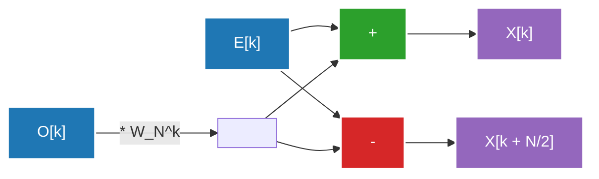

## 1. はじめに：フーリエ変換の世界への誘い

私たちの日常生活は、波（シグナル）に囲まれています。耳に届く音声、目に入る光、スマートフォンがやり取りする電波、これらはすべて時間的あるいは空間的に変動する「波」です。しかし、これらの波をそのままの形で解析したり処理したりするのは非常に困難です。そこで登場するのが<strong>フーリエ変換（Fourier Transform）</strong>です。

フーリエ変換は、「どんな複雑な波も、単純なサイン波とコサイン波の重ね合わせで表現できる」という驚くべき定理に基づいています。時間領域（Time Domain）で表現された信号を、周波数領域（Frequency Domain）に変換することで、その信号にどんな高さの音が、どのくらいの強さで含まれているかを知ることができます。

しかし、計算機上でフーリエ変換を実装する際、素朴な離散フーリエ変換（DFT: Discrete Fourier Transform）を用いると、データ量 $N$ に対して $O(N^2)$ の計算量が必要となり、実用的な速度で処理を行うことができませんでした。この壁を打ち破ったのが、<strong>高速フーリエ変換（FFT: Fast Fourier Transform）</strong>です。FFTは計算量を $O(N \log N)$ にまで劇的に削減し、現代のデジタル信号処理の基盤となりました。

本記事では、連続から離散への移行、クーリー・テューキー（Cooley-Tukey）型アルゴリズムの数学的導出、バタフライ演算の詳細な図解、そしてPythonによる実装と応用例まで、FFTの全貌を深く掘り下げて解説します。

---

## 2. 連続から離散フーリエ変換（DFT）への移行

FFTを理解するためには、まず離散フーリエ変換（DFT）を理解する必要があります。

### 連続フーリエ変換（CFT）

元の連続フーリエ変換の定義式は以下の通りです。

$$ X(f) = \int_{-\infty}^{\infty} x(t) e^{-j 2\pi f t} dt $$

ここで、$x(t)$ は時間 $t$ における信号、$X(f)$ は周波数 $f$ における成分の振幅と位相を表す複素数、$j$ は虚数単位です。しかし、コンピュータは無限の連続データを扱うことはできません。現実の信号処理では、信号を一定の間隔でサンプリング（標本化）し、有限個のデータポイントとして扱います。

### 離散フーリエ変換（DFT）の導出

信号 $x(t)$ をサンプリング周期 $T_s$ で $N$ 個サンプリングした数列を $x[n]$ とします（$n = 0, 1, ..., N-1$）。このとき、周波数領域も離散化され、DFTは次のように定義されます。

$$ X[k] = \sum_{n=0}^{N-1} x[n] e^{-j \frac{2\pi}{N} k n} \quad (k = 0, 1, ..., N-1) $$

ここで、$W_N = e^{-j \frac{2\pi}{N}}$ と置くと（これを回転因子、またはひねり係数と呼びます）、式はよりシンプルになります。

$$ X[k] = \sum_{n=0}^{N-1} x[n] W_N^{kn} $$

このDFTを素朴に計算しようとすると、各 $k$ に対して $N$ 回の掛け算と足し算が必要であり、$k$ は $N$ 個あるため、全体で $N \times N = N^2$ 回の複素数乗算が必要になります。データ長 $N$ が $1,000,000$ の場合、$N^2 = 1,000,000,000,000$（1兆）回の演算が必要となり、リアルタイム処理には到底間に合いません。

---

## 3. FFTアルゴリズムの数学的導出：クーリー・テューキー型

1965年、ジェイムズ・クーリー（James Cooley）とジョン・テューキー（John Tukey）によって再発見されたアルゴリズム（実は[カール・フリードリヒ・ガウス](/p/gauss/)が1805年にすでに類似の手法を発見していたと言われています）が、現代で最も一般的に使われているFFTアルゴリズムです。ここでは、データ数 $N$ が2のべき乗（$N = 2^m$）である場合の基数2の時間間引き（Decimation-in-Time, DIT）FFTを導出します。

### 偶数と奇数への分割（分割統治法）

DFTの式を、$n$ が偶数の場合と奇数の場合に分けます。

$$ X[k] = \sum_{n=0}^{N-1} x[n] W_N^{kn} $$

$n = 2m$（偶数インデックス）と $n = 2m + 1$（奇数インデックス）に分割します。ただし $m = 0, 1, ..., N/2 - 1$ です。

$$ X[k] = \sum_{m=0}^{N/2-1} x[2m] W_N^{k(2m)} + \sum_{m=0}^{N/2-1} x[2m+1] W_N^{k(2m+1)} $$

ここで、回転因子の性質 $W_N^{2} = e^{-j \frac{4\pi}{N}} = e^{-j \frac{2\pi}{N/2}} = W_{N/2}$ を利用します。また、右辺第2項から $W_N^k$ をくくり出します。

$$ X[k] = \sum_{m=0}^{N/2-1} x[2m] W_{N/2}^{km} + W_N^k \sum_{m=0}^{N/2-1} x[2m+1] W_{N/2}^{km} $$

なんと、この式は次のような意味を持っています。
- 第一項は、元のデータのうち偶数番目のデータ群 $x[0], x[2], x[4], ...$ の $N/2$ 点DFTです（これを $E[k]$ とします）。
- 第二項のシグマ部分は、奇数番目のデータ群 $x[1], x[3], x[5], ...$ の $N/2$ 点DFTです（これを $O[k]$ とします）。

つまり、次のように書けます。

$$ X[k] = E[k] + W_N^k O[k] $$

### 周期性の活用

ここで、$E[k]$ と $O[k]$ は $N/2$ 点のDFTであるため、周期 $N/2$ を持ちます。つまり、$E[k + N/2] = E[k]$ であり、$O[k + N/2] = O[k]$ です。
さらに、回転因子には $W_N^{k + N/2} = W_N^k \cdot e^{-j\pi} = -W_N^k$ という性質があります。

これらを組み合わせると、$k \ge N/2$ の後半部分は次のように計算できます。

$$ X[k + N/2] = E[k] - W_N^k O[k] $$

これにより、計算の手間が半分になります。サイズ $N$ のDFTを計算するために、サイズ $N/2$ のDFTを2つ計算し、それらを組み合わせればよいことになります。この分割を再帰的に（サイズが1になるまで）繰り返すのが、時間間引きFFTのアルゴリズムです。これにより計算量は $O(N \log_2 N)$ に削減されます。

---

## 4. バタフライ演算の図解

上記の $X[k]$ と $X[k + N/2]$ を同時に計算する基本単位を<strong>バタフライ演算（Butterfly Operation）</strong>と呼びます。計算の流れが蝶の羽のように見えることから名付けられました。

以下に、基数2のバタフライ演算のデータフローを示します。



入力データは、再帰的な分割によって「ビット反転順（Bit-Reversal Permutation）」と呼ばれる特殊な順序で並べ替えられます。例えば、$N=8$の場合、インデックスは $(0, 1, 2, 3, 4, 5, 6, 7)$ から $(0, 4, 2, 6, 1, 5, 3, 7)$ へと変化します。この並べ替えを行った上で、上記のバタフライ演算を $\log_2 N$ ステージ実行することで、最終的な周波数成分が得られます。

---

## 5. PythonによるFFTの実装と比較

理論をコードに落とし込んでみましょう。ここでは、再帰関数を用いてクーリー・テューキー型FFTを自作し、それが正しく動作しているかを NumPy の標準ライブラリ `numpy.fft.fft` と比較します。

### 自作FFTの実装

```python
import numpy as np

def custom_fft(x):
    """
    1次元の再帰的基数2 DIT FFTアルゴリズム
    ※入力長は2のべき乗である必要があります
    """
    x = np.asarray(x, dtype=float)
    N = x.shape[0]
    
    # 終了条件：データが1点になればそのまま返す
    if N <= 1:
        return x
    
    # データ長が2のべき乗かチェック
    if N % 2 != 0:
        raise ValueError("サイズは2のべき乗である必要があります")
    
    # 偶数インデックスと奇数インデックスに分割
    even = custom_fft(x[0::2])
    odd = custom_fft(x[1::2])
    
    # 回転因子（ひねり係数）の計算
    T = [np.exp(-2j * np.pi * k / N) * odd[k] for k in range(N // 2)]
    
    # 結果の合成
    return np.array([even[k] + T[k] for k in range(N // 2)] +
                    [even[k] - T[k] for k in range(N // 2)])
```

### numpy.fftとの比較テスト

```python
# データの準備：サンプリングレートと時間軸
fs = 1024 # サンプリングレート
t = np.linspace(0, 1, fs, endpoint=False)

# 複合波の作成（50Hzと120Hzのサイン波の合成）
signal = 3 * np.sin(2 * np.pi * 50 * t) + 1 * np.sin(2 * np.pi * 120 * t)

# 自作FFTの実行
fft_custom_result = custom_fft(signal)

# NumPyのFFTの実行
fft_numpy_result = np.fft.fft(signal)

# 結果の比較（誤差の確認）
difference = np.allclose(fft_custom_result, fft_numpy_result)
print(f"NumPyのFFTとの一致: {difference}")
```

このコードを実行すると、`NumPyのFFTとの一致: True` と出力され、我々が数学から導出したアルゴリズムが正確に機能していることが確認できます。実際には、NumPyの実装（内部的にはFFTPACKやPocketFFTなどが使われます）は再帰呼び出しのオーバーヘッドを避けるための非再帰化、さらにはベクトル化やキャッシュ最適化が施されており、非常に高速に動作します。

---

## 6. 実社会におけるFFTの応用：音声と画像

FFTは単なる数学のパズルではありません。現代のデジタル社会はFFTなしでは成立しません。ここでは代表的な2つの応用例を挙げます。

### 音声圧縮（MP3, AAC）

人間の耳は、大きな音の直後や、ある特定の周波数の近くにある小さな音を認識できないという「マスキング効果」という特性を持っています。
音声圧縮アルゴリズムでは、信号を短いフレームに分割し、それぞれにFFT（または改良版の離散コサイン変換 = MDCT）を適用して周波数成分を求めます。そして、人間の耳に聞こえにくい成分の情報を間引いたり、表現するビット数を減らしたりすることで、音質を保ちながら劇的なデータ圧縮を実現しています。

### 画像圧縮（JPEG）

画像は「空間的な波」として捉えることができます。ピクセルの明るさが滑らかに変化する部分は「低周波」、輪郭やテクスチャなど急激に色が変化する部分は「高周波」です。
JPEG画像圧縮では、画像を $8 \times 8$ のブロックに分割し、2次元の離散コサイン変換（DCT：FFTの親戚のようなもの）を行います。画像のエネルギーは多くの場合、低周波成分に集中するため、高周波成分（細かい模様）のデータを切り捨てる（量子化）ことで、視覚的な劣化を最小限に抑えつつファイルサイズを小さくします。

他にも、Wi-FiやLTEなどの無線通信で使われるOFDM（直交周波数分割多重）変調や、医療分野におけるMRIの画像再構成、地震波の解析、天文学でのデータ処理など、FFTの応用範囲は多岐にわたります。

---

## 7. まとめ

高速フーリエ変換（FFT）は、計算機科学における「20世紀最大のアルゴリズム的発見」の1つと言われています。
連続する波の概念を離散的な計算式に落とし込み（DFT）、さらにその数式に潜む周期性と対称性を巧みに利用して計算量を $O(N^2)$ から $O(N \log N)$ へと劇的に削減するこのアプローチは、アルゴリズム設計における分割統治法の最も美しい成功例です。

今日私たちがストリーミングで音楽を聴き、高画質の画像を瞬時に送信できるのも、このアルゴリズムがハードウェア・ソフトウェアの奥深くで静かに、そして超高速に動作しているからです。FFTの背後にある数学的エレガンスを知ることで、デジタル世界への理解が一段と深まることでしょう。

関連するフーリエ解析や信号処理のトピックについても、本ブログの別記事でさらに詳しく解説していきますので、ぜひそちらもご覧ください。

