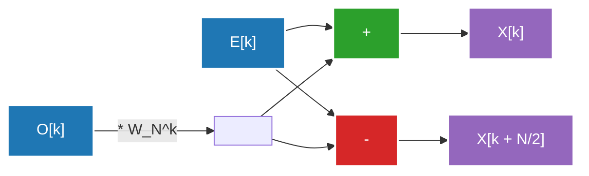

## 1. Introdução: Um convite ao mundo da Transformada de Fourier

O nosso quotidiano está rodeado de ondas (sinais). A voz que chega aos nossos ouvidos, a luz que entra nos nossos olhos, as ondas de rádio que os smartphones trocam, tudo isto são "ondas" que flutuam temporal ou espacialmente. No entanto, é muito difícil analisar ou processar estas ondas na sua forma original. É aí que entra a **Transformada de Fourier**.

A Transformada de Fourier baseia-se num teorema surpreendente de que "qualquer onda complexa pode ser expressa através de uma sobreposição de ondas sinusoidais (seno e cosseno) simples". Ao converter um sinal expresso no domínio do tempo (Time Domain) para o domínio da frequência (Frequency Domain), podemos saber quais são as frequências contidas nesse sinal e com que intensidade.

Porém, ao implementar a transformada de Fourier num computador, se usássemos a Transformada Discreta de Fourier ingénua (DFT: Discrete Fourier Transform), seria necessária uma complexidade computacional de $O(N^2)$ para uma quantidade de dados $N$, tornando o processamento inviável a velocidades práticas. O que quebrou esta barreira foi a **Transformada Rápida de Fourier (FFT: Fast Fourier Transform)**. A FFT reduziu drasticamente a complexidade computacional para $O(N \log N)$ e tornou-se a base do processamento de sinal digital moderno.

Neste artigo, vamos aprofundar e explicar todo o panorama da FFT, desde a transição do contínuo para o discreto, a derivação matemática do algoritmo de Cooley-Tukey, a ilustração detalhada da operação borboleta (butterfly), até à implementação em Python e exemplos de aplicação.

---

## 2. Transição para a Transformada Discreta de Fourier (DFT)

Para compreender a FFT, precisamos primeiro de compreender a Transformada Discreta de Fourier (DFT).

### Transformada Contínua de Fourier (CFT)

A fórmula de definição original da transformada contínua de Fourier é a seguinte:

$$ X(f) = \int_{-\infty}^{\infty} x(t) e^{-j 2\pi f t} dt $$

Aqui, $x(t)$ é o sinal no tempo $t$, $X(f)$ é um número complexo que representa a amplitude e fase do componente na frequência $f$, e $j$ é a unidade imaginária. Contudo, os computadores não conseguem lidar com dados contínuos infinitos. No processamento de sinal real, amostramos o sinal em intervalos regulares e tratamo-lo como um número finito de pontos de dados.

### Derivação da Transformada Discreta de Fourier (DFT)

Seja $x[n]$ a sequência de $N$ amostras do sinal $x(t)$ com um período de amostragem $T_s$ ($n = 0, 1, ..., N-1$). Neste caso, o domínio da frequência também é discretizado, e a DFT é definida da seguinte forma:

$$ X[k] = \sum_{n=0}^{N-1} x[n] e^{-j \frac{2\pi}{N} k n} \quad (k = 0, 1, ..., N-1) $$

Aqui, se definirmos $W_N = e^{-j \frac{2\pi}{N}}$ (este é chamado fator de rotação, ou twiddle factor), a equação torna-se mais simples:

$$ X[k] = \sum_{n=0}^{N-1} x[n] W_N^{kn} $$

Se tentarmos calcular esta DFT de forma ingénua, para cada $k$ são necessárias $N$ multiplicações e adições, e como há $N$ valores de $k$, são necessárias no total $N \times N = N^2$ multiplicações de números complexos. Quando o comprimento dos dados $N$ for $1.000.000$, seriam necessárias $N^2 = 1.000.000.000.000$ (1 trilião) de operações, o que é de todo impossível de realizar para processamento em tempo real.

---

## 3. Derivação Matemática do Algoritmo FFT: Tipo Cooley-Tukey

O algoritmo redescoberto por James Cooley e John Tukey em 1965 (diz-se que [Carl Friedrich Gauss](/pt/p/gauss/) já tinha descoberto um método semelhante em 1805) é o algoritmo FFT mais habitualmente usado na atualidade. Aqui, vamos derivar a FFT por dizimação no tempo (Decimation-in-Time, DIT) de raiz 2 (radix-2) quando a quantidade de dados $N$ é uma potência de 2 ($N = 2^m$).

### Divisão em Pares e Ímpares (Divisão e Conquista)

Dividimos a equação da DFT nos casos em que $n$ é par e ímpar.

$$ X[k] = \sum_{n=0}^{N-1} x[n] W_N^{kn} $$

Dividimos em $n = 2m$ (índices pares) e $n = 2m + 1$ (índices ímpares). Onde $m = 0, 1, ..., N/2 - 1$.

$$ X[k] = \sum_{m=0}^{N/2-1} x[2m] W_N^{k(2m)} + \sum_{m=0}^{N/2-1} x[2m+1] W_N^{k(2m+1)} $$

Aqui, usamos a propriedade do fator de rotação $W_N^{2} = e^{-j \frac{4\pi}{N}} = e^{-j \frac{2\pi}{N/2}} = W_{N/2}$. E colocamos $W_N^k$ em evidência no segundo termo do lado direito.

$$ X[k] = \sum_{m=0}^{N/2-1} x[2m] W_{N/2}^{km} + W_N^k \sum_{m=0}^{N/2-1} x[2m+1] W_{N/2}^{km} $$

Surpreendentemente, esta equação tem o seguinte significado:
- O primeiro termo é a DFT de $N/2$ pontos do grupo de dados de índice par originais $x[0], x[2], x[4], ...$ (vamos chamá-lo $E[k]$).
- A parte da soma do segundo termo é a DFT de $N/2$ pontos do grupo de dados de índice ímpar $x[1], x[3], x[5], ...$ (vamos chamá-lo $O[k]$).

Por outras palavras, pode ser reescrito da seguinte forma:

$$ X[k] = E[k] + W_N^k O[k] $$

### Aproveitamento da Periodicidade

Aqui, uma vez que $E[k]$ e $O[k]$ são DFTs de $N/2$ pontos, têm um período de $N/2$. Isto é, $E[k + N/2] = E[k]$ e $O[k + N/2] = O[k]$.
Além disso, o fator de rotação possui a propriedade $W_N^{k + N/2} = W_N^k \cdot e^{-j\pi} = -W_N^k$.

Combinando isto, a segunda metade $k \ge N/2$ pode ser calculada da seguinte forma:

$$ X[k + N/2] = E[k] - W_N^k O[k] $$

Desta forma, o trabalho de cálculo é reduzido a metade. Para calcular uma DFT de tamanho $N$, basta calcular duas DFTs de tamanho $N/2$ e combiná-las. A repetição desta divisão recursivamente (até o tamanho ser 1) é o algoritmo da FFT por dizimação no tempo. Isto reduz a complexidade computacional para $O(N \log_2 N)$.

---

## 4. Ilustração da Operação Borboleta

A unidade básica que calcula $X[k]$ e $X[k + N/2]$ simultaneamente, como demonstrado acima, chama-se **Operação Borboleta (Butterfly Operation)**. Recebeu este nome porque o fluxo dos cálculos se parece com as asas de uma borboleta.

Abaixo é mostrado o fluxo de dados de uma operação borboleta radix-2.



Devido à divisão recursiva, os dados de entrada são reorganizados numa ordem especial chamada "Reversão de Bits" (Bit-Reversal Permutation). Por exemplo, para $N=8$, os índices mudam de $(0, 1, 2, 3, 4, 5, 6, 7)$ para $(0, 4, 2, 6, 1, 5, 3, 7)$. Após efetuar esta ordenação e executar as operações borboleta referidas ao longo de $\log_2 N$ estágios, os componentes finais de frequência são obtidos.

---

## 5. Implementação da FFT em Python e Comparação

Vamos traduzir a teoria em código. Aqui, vamos criar a nossa própria FFT de Cooley-Tukey através de funções recursivas e comparar o seu funcionamento com a biblioteca padrão NumPy, `numpy.fft.fft`.

### Implementação da FFT Própria

```python
import numpy as np

def custom_fft(x):
    """
    Algoritmo recursivo FFT DIT de radix-2 unidimensional
    *O comprimento de entrada deve ser uma potência de 2
    """
    x = np.asarray(x, dtype=float)
    N = x.shape[0]
    
    # Condição de paragem: se os dados forem 1 ponto, devolver tal qual
    if N <= 1:
        return x
    
    # Verificar se o comprimento de dados é uma potência de 2
    if N % 2 != 0:
        raise ValueError("O tamanho deve ser uma potência de 2")
    
    # Dividir em índices pares e ímpares
    even = custom_fft(x[0::2])
    odd = custom_fft(x[1::2])
    
    # Cálculo do fator de rotação (twiddle factor)
    T = [np.exp(-2j * np.pi * k / N) * odd[k] for k in range(N // 2)]
    
    # Síntese do resultado
    return np.array([even[k] + T[k] for k in range(N // 2)] +
                    [even[k] - T[k] for k in range(N // 2)])
```

### Teste de Comparação com numpy.fft

```python
# Preparação dos dados: taxa de amostragem e eixo do tempo
fs = 1024 # Taxa de amostragem
t = np.linspace(0, 1, fs, endpoint=False)

# Criação de onda composta (síntese de ondas sinusoidais de 50Hz e 120Hz)
signal = 3 * np.sin(2 * np.pi * 50 * t) + 1 * np.sin(2 * np.pi * 120 * t)

# Execução da FFT própria
fft_custom_result = custom_fft(signal)

# Execução da FFT do NumPy
fft_numpy_result = np.fft.fft(signal)

# Comparação de resultados (verificação de erro)
difference = np.allclose(fft_custom_result, fft_numpy_result)
print(f"Coincide com a FFT do NumPy: {difference}")
```

Quando executar este código, a saída será `Coincide com a FFT do NumPy: True`, e confirmará que o algoritmo derivado a partir da matemática está a funcionar de forma correta. Na realidade, a implementação do NumPy (internamente utilizando FFTPACK, PocketFFT, etc.) é desrecursivada para evitar os custos adicionais de invocações recursivas, e aplica vetorização bem como otimização de cache, permitindo que seja executado de uma forma extremamente veloz.

---

## 6. Aplicações da FFT no Mundo Real: Áudio e Imagem

A FFT não é apenas um puzzle matemático. A sociedade digital moderna seria impossível sem ela. Aqui, apresentamos dois dos exemplos mais emblemáticos.

### Compressão de Áudio (MP3, AAC)

O ouvido humano possui uma caraterística designada por "efeito de mascaramento" através do qual é incapaz de detetar os sons suaves numa determinada frequência, quer estejam perto, quer ocorram de imediato após os sons altos.
Num algoritmo de compressão de áudio, o sinal é decomposto em quadros curtos (frames) em que o respetivo elemento frequencial será então extraído efetuando uma FFT (ou uma versão melhorada da Transformada Discreta de Cosseno = MDCT). Deste modo, removendo informações de frequências em que é praticamente impossível ao ouvido humano registar, ou atenuando a quantidade de bits necessária, concretizam uma incrível compressão de dados, e em simultâneo asseguram as qualidades de áudio.

### Compressão de Imagens (JPEG)

As imagens podem ser percecionadas enquanto "ondas espaciais". As partes onde ocorre a modulação suave do brilho no píxel constituem as "baixas frequências", as restantes que apresentem alterações drásticas nas cores - sejam bordas, sejam os padrões da textura - compreendem as "altas frequências".
O algoritmo de compressão visual de JPEG reparte a imagem num conjunto de blocos de dimensão $8 \times 8$ em que irá invocar a transformada discreta de cosseno a 2D (DCT: é uma congénere à FFT). Grande parcela da intensidade na imagem (isto é, a energia), no mais das vezes reside unificada na vizinhança das menores frequências; deste feito descarta-se essa densidade que forma as maiores frequências (tal padrão meticuloso e detalhado) numa ação conhecida como de quantização (quantization), e consegue-se assim minorar o tamanho geral e restringir as limitações visuais ao seu limiar mínimo.

Além disto, e nas diversas telecomunicações não cabeadas em vigor tipo LTE e as do sistema sem fio (Wi-Fi), encontram aplicabilidades vastíssimas nos processamentos astrofísicos, ao analisarem atividades e trepidações na litosfera e de eventos geotectónicos; a modulação em Multiplexação Ortogonal e de Distribuições em Frequência Ortogonais (OFDM), ou a extração do restauro imagético na imagiologia de ressonância (MRI) nos departamentos bio-médicos também a evidenciam.

---

## 7. Conclusão

Afirma-se que a Transformada Rápida de Fourier (FFT) figura como das "descobertas mais proeminentes algorítmicas ao longo do século 20".
Iniciando-se em conceitos abstratos na fluidez e transferindo-os na computação isolada quantificada através do mecanismo discreto (DFT). E adicionalmente com manobras hábeis das suas conotações cíclicas de uma harmonia exata, re-escrevem e transformam o encargo na computação outrora com um tamanho $O(N^2)$ a patamares ínfimos $O(N \log N)$. Sem sombra para qualquer constatação cética formata e define o triunfo esteticamente e embeleza perante as construções nas matrizes pela tática subdividir para reinar ("divisão e conquista").

A razão por trás da viabilidade de nos dias que correm conseguirmos aceder à rápida distribuição audiovisual no espaço através do streaming de música e a capacidade iminente onde partilhamos instantaneamente registos hiperdetalhados fotográficos manifesta-se através das operações, quase mudas em toda a sua amplitude super sónica em profundidades na maquinaria tecnológica. Despertar ao charme exato bem dissimulado na essência pela FFT elevar-lhe-á com segurança uma panorâmica substancial por detrás deste Universo Digital.

Nos subcapítulos suplementares iremos desdobrar em particular sobre outras conversas relativas de Processamento Sinal ou Transformadas Frourier. Iremos esperar os seus instantes à leitura dessa bibliografia suplementar no nosso blog!
