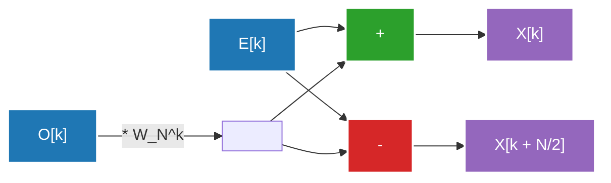

## 1. Введение: приглашение в мир преобразования Фурье

Наша повседневная жизнь окружена волнами (сигналами). Звук, который достигает наших ушей, свет, попадающий в глаза, радиоволны, которыми обмениваются смартфоны — все это «волны», изменяющиеся во времени или пространстве. Однако анализировать или обрабатывать эти волны в их исходном виде крайне сложно. Здесь на сцену выходит **преобразование Фурье (Fourier Transform)**.

Преобразование Фурье основано на удивительной теореме: «любую, даже самую сложную волну, можно представить как наложение простых синусоид и косинусоид». Преобразуя сигнал из временной области (Time Domain) в частотную (Frequency Domain), мы можем узнать, звуки какой высоты и какой интенсивности в нем содержатся.

Однако при реализации преобразования Фурье на компьютере с использованием простого дискретного преобразования Фурье (ДПФ, DFT: Discrete Fourier Transform), для объема данных $N$ требуется вычислительная сложность $O(N^2)$, что делает невозможной обработку с практической скоростью. Эту преграду разрушило **быстрое преобразование Фурье (БПФ, FFT: Fast Fourier Transform)**. БПФ радикально сократило объем вычислений до $O(N \log N)$ и стало основой современной цифровой обработки сигналов.

В этой статье мы подробно и глубоко рассмотрим всю картину БПФ: от перехода от непрерывного к дискретному, математического вывода алгоритма Кули-Тьюки (Cooley-Tukey), детальной схемы операции "бабочка" до реализации на Python и примеров применения.

---

## 2. Переход от непрерывного к дискретному преобразованию Фурье (ДПФ)

Чтобы понять БПФ, необходимо сначала разобраться в дискретном преобразовании Фурье (ДПФ).

### Непрерывное преобразование Фурье (НПФ, CFT)

Оригинальная формула непрерывного преобразования Фурье выглядит следующим образом:

$$ X(f) = \int_{-\infty}^{\infty} x(t) e^{-j 2\pi f t} dt $$

Здесь $x(t)$ — сигнал в момент времени $t$, $X(f)$ — комплексное число, представляющее амплитуду и фазу компоненты на частоте $f$, а $j$ — мнимая единица. Однако компьютер не может обрабатывать бесконечные непрерывные данные. В реальной обработке сигналов сигнал дискретизируется (сэмплируется) с определенным интервалом и рассматривается как конечное число точек данных.

### Вывод дискретного преобразования Фурье (ДПФ)

Пусть $x[n]$ — это последовательность из $N$ отсчетов сигнала $x(t)$, дискретизированного с периодом $T_s$ (где $n = 0, 1, ..., N-1$). В этом случае частотная область также становится дискретной, и ДПФ определяется следующим образом:

$$ X[k] = \sum_{n=0}^{N-1} x[n] e^{-j \frac{2\pi}{N} k n} \quad (k = 0, 1, ..., N-1) $$

Если ввести обозначение $W_N = e^{-j \frac{2\pi}{N}}$ (это называется поворачивающим множителем), формула становится намного проще:

$$ X[k] = \sum_{n=0}^{N-1} x[n] W_N^{kn} $$

Если попытаться вычислить это ДПФ в лоб, для каждого $k$ потребуется $N$ умножений и сложений, а так как всего $k$ равно $N$, то в сумме потребуется $N \times N = N^2$ комплексных умножений. Для длины данных $N$, равной $1,000,000$, потребуется $N^2 = 1,000,000,000,000$ (1 триллион) операций, что абсолютно неприемлемо для обработки в реальном времени.

---

## 3. Математический вывод алгоритма БПФ: тип Кули-Тьюки

Алгоритм, заново открытый в 1965 году Джеймсом Кули (James Cooley) и Джоном Тьюки (John Tukey) (хотя говорят, что [Карл Фридрих Гаусс](/ru/p/gauss/) уже обнаружил аналогичный метод в 1805 году), является наиболее широко используемым алгоритмом БПФ сегодня. Здесь мы выведем алгоритм БПФ с прореживанием по времени (Decimation-in-Time, DIT) по основанию 2, для случая, когда количество данных $N$ является степенью двойки ($N = 2^m$).

### Разделение на четные и нечетные (принцип "разделяй и властвуй")

Разделим формулу ДПФ на случаи с четными и нечетными $n$.

$$ X[k] = \sum_{n=0}^{N-1} x[n] W_N^{kn} $$

Разбиваем на $n = 2m$ (четные индексы) и $n = 2m + 1$ (нечетные индексы), где $m = 0, 1, ..., N/2 - 1$.

$$ X[k] = \sum_{m=0}^{N/2-1} x[2m] W_N^{k(2m)} + \sum_{m=0}^{N/2-1} x[2m+1] W_N^{k(2m+1)} $$

Здесь мы используем свойство поворачивающего множителя: $W_N^{2} = e^{-j \frac{4\pi}{N}} = e^{-j \frac{2\pi}{N/2}} = W_{N/2}$. Также вынесем $W_N^k$ за знак суммы во втором слагаемом правой части.

$$ X[k] = \sum_{m=0}^{N/2-1} x[2m] W_{N/2}^{km} + W_N^k \sum_{m=0}^{N/2-1} x[2m+1] W_{N/2}^{km} $$

Удивительно, но это уравнение означает следующее:
- Первое слагаемое — это $N/2$-точечное ДПФ четной половины исходных данных $x[0], x[2], x[4], ...$ (назовем это $E[k]$).
- Часть с суммой во втором слагаемом — это $N/2$-точечное ДПФ нечетной половины данных $x[1], x[3], x[5], ...$ (назовем это $O[k]$).

То есть можно записать:

$$ X[k] = E[k] + W_N^k O[k] $$

### Использование периодичности

Поскольку $E[k]$ и $O[k]$ являются $N/2$-точечными ДПФ, они имеют период $N/2$. Это означает, что $E[k + N/2] = E[k]$ и $O[k + N/2] = O[k]$.
Кроме того, поворачивающий множитель имеет свойство $W_N^{k + N/2} = W_N^k \cdot e^{-j\pi} = -W_N^k$.

Комбинируя это, вторую половину при $k \ge N/2$ можно вычислить следующим образом:

$$ X[k + N/2] = E[k] - W_N^k O[k] $$

Благодаря этому вычислительные затраты уменьшаются вдвое. Чтобы вычислить ДПФ размера $N$, достаточно вычислить два ДПФ размера $N/2$ и объединить их. Рекурсивное повторение этого разделения (пока размер не станет равным 1) и является алгоритмом БПФ с прореживанием по времени. В результате вычислительная сложность сокращается до $O(N \log_2 N)$.

---

## 4. Схема операции "бабочка"

Базовый блок для одновременного вычисления $X[k]$ и $X[k + N/2]$, описанный выше, называется **операцией "бабочка" (Butterfly Operation)**. Такое название она получила потому, что поток вычислений напоминает крылья бабочки.

Ниже показан поток данных операции "бабочка" по основанию 2.



Входные данные переставляются в результате рекурсивного разделения в особом порядке, называемом «бит-реверсивной перестановкой (Bit-Reversal Permutation)». Например, для $N=8$ индексы меняются с $(0, 1, 2, 3, 4, 5, 6, 7)$ на $(0, 4, 2, 6, 1, 5, 3, 7)$. После выполнения этой перестановки и применения описанной операции "бабочка" на протяжении $\log_2 N$ стадий, получаются итоговые частотные компоненты.

---

## 5. Реализация БПФ на Python и сравнение

Давайте перенесем теорию в код. Здесь мы создадим собственное БПФ типа Кули-Тьюки с использованием рекурсивной функции и проверим его работу, сравнив со стандартной библиотекой NumPy `numpy.fft.fft`.

### Наша реализация БПФ

```python
import numpy as np

def custom_fft(x):
    """
    Одномерный рекурсивный алгоритм БПФ DIT по основанию 2
    * Длина входных данных должна быть степенью двойки
    """
    x = np.asarray(x, dtype=float)
    N = x.shape[0]
    
    # Условие выхода: если осталась 1 точка данных, просто возвращаем её
    if N <= 1:
        return x
    
    # Проверка: является ли длина данных степенью двойки
    if N % 2 != 0:
        raise ValueError("Размер должен быть степенью двойки")
    
    # Разделение на четные и нечетные индексы
    even = custom_fft(x[0::2])
    odd = custom_fft(x[1::2])
    
    # Вычисление поворачивающих множителей
    T = [np.exp(-2j * np.pi * k / N) * odd[k] for k in range(N // 2)]
    
    # Синтез результата
    return np.array([even[k] + T[k] for k in range(N // 2)] +
                    [even[k] - T[k] for k in range(N // 2)])
```

### Тестирование сравнением с numpy.fft

```python
# Подготовка данных: частота дискретизации и временная ось
fs = 1024 # Частота дискретизации
t = np.linspace(0, 1, fs, endpoint=False)

# Создание сложной волны (комбинация синусоид 50 Гц и 120 Гц)
signal = 3 * np.sin(2 * np.pi * 50 * t) + 1 * np.sin(2 * np.pi * 120 * t)

# Выполнение нашего БПФ
fft_custom_result = custom_fft(signal)

# Выполнение БПФ из NumPy
fft_numpy_result = np.fft.fft(signal)

# Сравнение результатов (проверка погрешности)
difference = np.allclose(fft_custom_result, fft_numpy_result)
print(f"Совпадение с БПФ из NumPy: {difference}")
```

При выполнении этого кода будет выведено `Совпадение с БПФ из NumPy: True`, что подтверждает правильную работу алгоритма, выведенного нами математически. На практике реализация NumPy (где внутренне используются такие библиотеки, как FFTPACK или PocketFFT) избегает накладных расходов рекурсивных вызовов за счет нерекурсивного подхода, а также применяет векторизацию и оптимизацию кэша, что делает её невероятно быстрой.

---

## 6. Применение БПФ в реальном мире: звук и изображения

БПФ — это не просто математическая головоломка. Современное цифровое общество не могло бы существовать без БПФ. Вот два типичных примера его применения.

### Сжатие звука (MP3, AAC)

Человеческое ухо обладает свойством «эффекта маскировки», когда мы не способны воспринимать тихие звуки, звучащие сразу после громких, или звуки на частотах, близких к определенной сильной частоте.
В алгоритмах сжатия звука сигнал делится на короткие фреймы (кадры), к каждому из которых применяется БПФ (или его модификация — модифицированное дискретное косинусное преобразование, MDCT) для получения частотных компонентов. Затем информация о компонентах, которые трудно услышать человеческому уху, прореживается, а количество битов для их представления уменьшается, что позволяет добиться радикального сжатия данных при сохранении качества звука.

### Сжатие изображений (JPEG)

Изображения можно рассматривать как «пространственные волны». Области, где яркость пикселей меняется плавно — это «низкие частоты», а области с резкими изменениями цвета, такие как контуры и текстуры — это «высокие частоты».
При сжатии изображений JPEG картинка делится на блоки $8 \times 8$, после чего применяется двумерное дискретное косинусное преобразование (ДКП, родственник БПФ). Поскольку энергия изображения в большинстве случаев сконцентрирована в низкочастотных компонентах, отбрасывание (квантование) данных высокочастотных компонентов (мелких узоров) позволяет уменьшить размер файла при минимальном визуальном ухудшении.

Кроме того, область применения БПФ весьма обширна и включает в себя модуляцию OFDM (мультиплексирование с ортогональным частотным разделением каналов), используемую в беспроводной связи, такой как Wi-Fi и LTE, реконструкцию изображений МРТ в медицине, анализ сейсмических волн, обработку данных в астрономии и многое другое.

---

## 7. Заключение

Быстрое преобразование Фурье (БПФ) называют одним из «величайших алгоритмических открытий 20-го века» в компьютерных науках.
Перевод концепции непрерывных волн в формулы дискретных вычислений (ДПФ) и умелое использование скрытой в этих формулах периодичности и симметрии для радикального снижения вычислительной сложности с $O(N^2)$ до $O(N \log N)$ — это, пожалуй, самый красивый и успешный пример применения принципа "разделяй и властвуй" в проектировании алгоритмов.

То, что сегодня мы можем слушать музыку в потоковом режиме и мгновенно отправлять изображения высокого качества, возможно только потому, что этот алгоритм тихо и сверхбыстро работает глубоко внутри аппаратного и программного обеспечения. Понимание математической элегантности, стоящей за БПФ, несомненно, углубит ваше понимание цифрового мира.

Связанные темы по анализу Фурье и обработке сигналов будут более подробно рассмотрены в других статьях этого блога, поэтому обязательно ознакомьтесь с ними.
