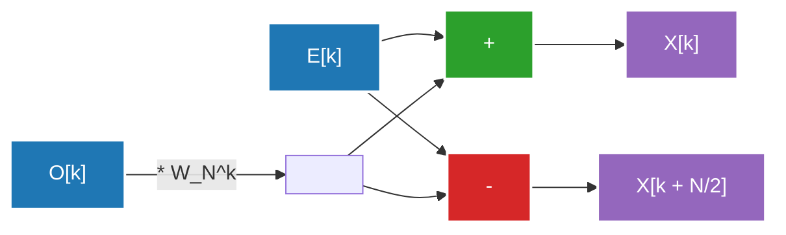

## 1. 引言：探索傅里叶变换的世界

我们的日常生活充满了波（信号）。入耳的声音、映入眼帘的光线、智能手机收发的电磁波，这些全都是在时间或空间上发生变化的“波”。然而，直接分析或处理这些原始形式的波是非常困难的。这时，**傅里叶变换（Fourier Transform）**便应运而生了。

傅里叶变换基于一个惊人的定理：“任何复杂的波，都可以表示为简单的正弦波和余弦波的叠加”。通过将时间域（Time Domain）表示的信号转换到频率域（Frequency Domain），我们就能知道该信号中包含哪些音高的声音，以及它们的强度。

但是，在计算机上实现傅里叶变换时，如果使用朴素的离散傅里叶变换（DFT: Discrete Fourier Transform），对于数据量 $N$，需要 $O(N^2)$ 的计算量，无法以实用的速度进行处理。打破这一壁垒的，正是**快速傅里叶变换（FFT: Fast Fourier Transform）**。FFT将计算量急剧减少到了 $O(N \log N)$，成为了现代数字信号处理的基础。

本文将深入解析FFT的全貌，涵盖从连续到离散的转换、库利-图基（Cooley-Tukey）型算法的数学推导、蝶形运算的详细图解，以及Python的实现与应用实例。

---

## 2. 从连续到离散傅里叶变换（DFT）的转换

为了理解FFT，首先必须理解离散傅里叶变换（DFT）。

### 连续傅里叶变换（CFT）

原始的连续傅里叶变换定义公式如下：

$$ X(f) = \int_{-\infty}^{\infty} x(t) e^{-j 2\pi f t} dt $$

这里，$x(t)$ 是时间 $t$ 时的信号，$X(f)$ 是表示频率 $f$ 处分量的振幅和相位的复数，$j$ 是虚数单位。然而，计算机无法处理无限的连续数据。在现实的信号处理中，我们以一定的时间间隔对信号进行采样（抽样），将其作为有限数量的数据点来处理。

### 离散傅里叶变换（DFT）的推导

假设以采样周期 $T_s$ 对信号 $x(t)$ 进行 $N$ 次采样，得到的数列为 $x[n]$（$n = 0, 1, ..., N-1$）。此时，频率域也被离散化，DFT定义如下：

$$ X[k] = \sum_{n=0}^{N-1} x[n] e^{-j \frac{2\pi}{N} k n} \quad (k = 0, 1, ..., N-1) $$

在此，令 $W_N = e^{-j \frac{2\pi}{N}}$（这被称为旋转因子，或扭转系数），公式会变得更加简洁：

$$ X[k] = \sum_{n=0}^{N-1} x[n] W_N^{kn} $$

如果试图朴素地计算这个DFT，对于每个 $k$，需要进行 $N$ 次乘法和加法，而 $k$ 共有 $N$ 个，因此总体需要进行 $N \times N = N^2$ 次复数乘法。如果数据长度 $N$ 为 $1,000,000$，$N^2 = 1,000,000,000,000$（1万亿）次运算，这绝对无法满足实时处理的要求。

---

## 3. FFT算法的数学推导：库利-图基型

1965年，由詹姆斯·库利（James Cooley）和约翰·图基（John Tukey）重新发现的算法（实际上据说[卡尔·弗里德里希·高斯](/zh-cn/p/gauss/)在1805年就已经发现了类似的方法），是现代最常用的FFT算法。这里我们将推导当数据量 $N$ 是2的幂（$N = 2^m$）时的基-2时间抽取（Decimation-in-Time, DIT）FFT。

### 拆分为偶数和奇数（分治法）

将DFT的公式按 $n$ 为偶数和奇数的情况进行拆分：

$$ X[k] = \sum_{n=0}^{N-1} x[n] W_N^{kn} $$

分为 $n = 2m$（偶数索引）和 $n = 2m + 1$（奇数索引）。其中 $m = 0, 1, ..., N/2 - 1$。

$$ X[k] = \sum_{m=0}^{N/2-1} x[2m] W_N^{k(2m)} + \sum_{m=0}^{N/2-1} x[2m+1] W_N^{k(2m+1)} $$

这里利用旋转因子的性质 $W_N^{2} = e^{-j \frac{4\pi}{N}} = e^{-j \frac{2\pi}{N/2}} = W_{N/2}$。此外，将等式右边第二项中的 $W_N^k$ 提取出来：

$$ X[k] = \sum_{m=0}^{N/2-1} x[2m] W_{N/2}^{km} + W_N^k \sum_{m=0}^{N/2-1} x[2m+1] W_{N/2}^{km} $$

令人惊讶的是，这个公式具有以下含义：
- 第一项是原始数据中偶数位置数据群 $x[0], x[2], x[4], ...$ 的 $N/2$ 点DFT（将其记为 $E[k]$）。
- 第二项的求和部分，是奇数位置数据群 $x[1], x[3], x[5], ...$ 的 $N/2$ 点DFT（将其记为 $O[k]$）。

也就是说，可以写成如下形式：

$$ X[k] = E[k] + W_N^k O[k] $$

### 利用周期性

由于 $E[k]$ 和 $O[k]$ 是 $N/2$ 点的DFT，因此它们具有 $N/2$ 的周期。也就是说，$E[k + N/2] = E[k]$，并且 $O[k + N/2] = O[k]$。
此外，旋转因子具有 $W_N^{k + N/2} = W_N^k \cdot e^{-j\pi} = -W_N^k$ 的性质。

将这些结合起来，$k \ge N/2$ 的后半部分可以如下计算：

$$ X[k + N/2] = E[k] - W_N^k O[k] $$

这样一来，计算的工作量减半了。为了计算大小为 $N$ 的DFT，只需要计算两个大小为 $N/2$ 的DFT并将它们组合起来即可。将这种拆分递归地重复（直到大小变为1），就是时间抽取FFT算法。这使得计算量降低到了 $O(N \log_2 N)$。

---

## 4. 蝶形运算的图解

上述同时计算 $X[k]$ 和 $X[k + N/2]$ 的基本单元被称为**蝶形运算（Butterfly Operation）**。因其计算流程看起来像蝴蝶的翅膀而得名。

下面展示基-2蝶形运算的数据流图：



输入数据会通过递归的拆分，被重新排列成一种被称为“位反转顺序（Bit-Reversal Permutation）”的特殊顺序。例如，在 $N=8$ 时，索引将从 $(0, 1, 2, 3, 4, 5, 6, 7)$ 变为 $(0, 4, 2, 6, 1, 5, 3, 7)$。在进行这种重新排列后，通过执行上述的蝶形运算 $\log_2 N$ 级，就能获得最终的频率成分。

---

## 5. Python实现与对比

让我们把理论落实在代码中。这里我们使用递归函数来自制一个库利-图基型FFT，并将其与NumPy的标准库 `numpy.fft.fft` 进行对比以验证其正确性。

### 自制FFT的实现

```python
import numpy as np

def custom_fft(x):
    """
    一维递归基-2 DIT FFT算法
    ※输入长度必须是2的幂
    """
    x = np.asarray(x, dtype=float)
    N = x.shape[0]
    
    # 终止条件：如果数据变为1点，则直接返回
    if N <= 1:
        return x
    
    # 检查数据长度是否为2的幂
    if N % 2 != 0:
        raise ValueError("大小必须是2的幂")
    
    # 拆分为偶数索引和奇数索引
    even = custom_fft(x[0::2])
    odd = custom_fft(x[1::2])
    
    # 计算旋转因子（扭转系数）
    T = [np.exp(-2j * np.pi * k / N) * odd[k] for k in range(N // 2)]
    
    # 结果的合成
    return np.array([even[k] + T[k] for k in range(N // 2)] +
                    [even[k] - T[k] for k in range(N // 2)])
```

### 与 numpy.fft 的对比测试

```python
# 准备数据：采样率和时间轴
fs = 1024 # 采样率
t = np.linspace(0, 1, fs, endpoint=False)

# 创建复合波（50Hz和120Hz正弦波的合成）
signal = 3 * np.sin(2 * np.pi * 50 * t) + 1 * np.sin(2 * np.pi * 120 * t)

# 执行自制FFT
fft_custom_result = custom_fft(signal)

# 执行NumPy的FFT
fft_numpy_result = np.fft.fft(signal)

# 比较结果（确认误差）
difference = np.allclose(fft_custom_result, fft_numpy_result)
print(f"与NumPy的FFT一致: {difference}")
```

执行这段代码时，会输出 `与NumPy的FFT一致: True`，由此可以确认我们从数学推导出的算法能够正确运行。实际上，NumPy的实现（内部使用FFTPACK或PocketFFT等）为了避免递归调用的开销进行了非递归化，甚至进行了向量化和缓存优化，因此运行速度极快。

---

## 6. FFT在现实社会中的应用：音频与图像

FFT不仅仅是数学难题。没有FFT就没有现代的数字社会。这里列举两个代表性的应用实例。

### 音频压缩（MP3, AAC）

人类的耳朵具有“掩蔽效应”的特性，即无法识别大声音之后的声音，或者与某个特定频率相近的微小声音。
在音频压缩算法中，信号被切分成短帧，对每一帧应用FFT（或其改进版离散余弦变换 = MDCT）来求得频率成分。然后，通过省略人耳难以听见的成分信息或减少表示位数，在保持音质的同时实现了惊人的数据压缩。

### 图像压缩（JPEG）

图像可以被看作“空间上的波”。像素亮度平滑变化的部分是“低频”，而轮廓、纹理等颜色急剧变化的部分是“高频”。
在JPEG图像压缩中，图像被分割成 $8 \times 8$ 的块，并进行二维离散余弦变换（DCT：类似于FFT）。由于图像的能量往往集中在低频成分上，通过舍弃高频成分（细节纹理）的数据（量化），可以在将视觉劣化降至最低的同时减小文件大小。

除此之外，在Wi-Fi或LTE等无线通信中使用的OFDM（正交频分复用）调制、医疗领域中MRI的图像重建、地震波分析以及天文学数据处理等众多领域，FFT都有着广泛的应用。

---

## 7. 总结

快速傅里叶变换（FFT）被誉为计算机科学中“20世纪最伟大的算法发现”之一。
将连续波的概念转化为离散的计算公式（DFT），并巧妙地利用隐藏在该公式中的周期性和对称性，将计算量从 $O(N^2)$ 急剧减少到 $O(N \log N)$ 的这种方法，是算法设计中分治法最美丽的成功范例。

今天我们之所以能够流畅地听流媒体音乐、瞬间发送高清图片，也全靠这个算法在硬件和软件的深处悄无声息且极其高速地运行着。了解FFT背后的数学优雅，必将进一步加深您对数字世界的理解。

关于相关的傅里叶分析和信号处理主题，我们将在本博客的其他文章中进行更详细的解说，敬请期待。
