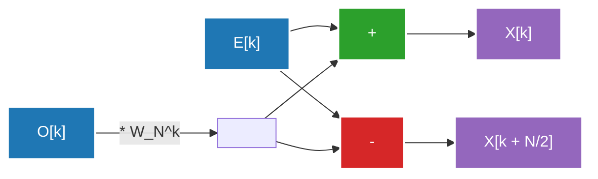

## 1. 簡介：踏入傅立葉變換的世界

我們的日常生活中充滿了各種波（訊號）。傳入耳中的語音、映入眼簾的光線、智慧型手機傳遞的電波，這些全都是在時間或空間上變動的「波」。然而，要直接以這些波原本的形態來進行分析或處理是十分困難的。因此，**傅立葉變換（Fourier Transform）** 應運而生。

傅立葉變換基於一項驚人的定理：「任何複雜的波，都可以透過簡單的正弦波與餘弦波的疊加來表示。」將時間域（Time Domain）中表示的訊號轉換到頻率域（Frequency Domain），我們就可以得知該訊號中包含了多高的音、以及多強的能量。

不過，在電腦上實作傅立葉變換時，若使用單純的離散傅立葉變換（DFT: Discrete Fourier Transform），對於資料量 $N$ 會需要 $O(N^2)$ 的計算量，無法以實用的速度來進行處理。打破這道高牆的，正是**快速傅立葉變換（FFT: Fast Fourier Transform）**。FFT 將計算量大幅縮減至 $O(N \log N)$，成為了現代數位訊號處理的基礎。

本文將深入探討 FFT 的全貌，從連續到離散的轉換、庫利-圖基（Cooley-Tukey）演算法的數學推導、蝴蝶運算的詳細圖解，到 Python 的實作與應用範例，為您進行徹底的解說。

---

## 2. 從連續轉換到離散傅立葉變換（DFT）

為了理解 FFT，首先必須要了解離散傅立葉變換（DFT）。

### 連續傅立葉變換（CFT）

原始的連續傅立葉變換定義公式如下：

$$ X(f) = \int_{-\infty}^{\infty} x(t) e^{-j 2\pi f t} dt $$

在此，$x(t)$ 代表時間 $t$ 的訊號，$X(f)$ 是代表頻率 $f$ 中成分振幅與相位的複數，$j$ 則是虛數單位。然而，電腦無法處理無限的連續資料。在現實的訊號處理中，我們會以一定的間隔對訊號進行取樣（Sampling），並將其視為有限個資料點。

### 離散傅立葉變換（DFT）的推導

假設將訊號 $x(t)$ 以取樣週期 $T_s$ 取樣 $N$ 個點所形成的一串數列為 $x[n]$（$n = 0, 1, ..., N-1$）。此時頻率域也被離散化，DFT 定義如下：

$$ X[k] = \sum_{n=0}^{N-1} x[n] e^{-j \frac{2\pi}{N} k n} \quad (k = 0, 1, ..., N-1) $$

在此，若將 $W_N = e^{-j \frac{2\pi}{N}}$ 替換進去（這稱為旋轉因子，或是 twiddle factor），公式就會變得更簡單：

$$ X[k] = \sum_{n=0}^{N-1} x[n] W_N^{kn} $$

如果試圖單純地計算這個 DFT，對於每個 $k$ 都需要進行 $N$ 次的乘法與加法，而 $k$ 共有 $N$ 個，所以總共需要 $N \times N = N^2$ 次複數乘法運算。當資料長度 $N$ 為 $1,000,000$ 時，就需要 $N^2 = 1,000,000,000,000$（1兆）次運算，這絕對來不及進行即時處理。

---

## 3. FFT 演算法的數學推導：庫利-圖基型

1965 年，由詹姆斯·庫利（James Cooley）與約翰·圖基（John Tukey）重新發現的演算法（事實上卡爾·弗里德里希·高斯早在 1805 年就發現了類似的手法），是現代最被廣泛使用的 FFT 演算法。在此，我們將推導當資料數 $N$ 為 2 的次方（$N = 2^m$）時，基數為 2 的時間抽取（Decimation-in-Time, DIT）FFT。

### 分割為偶數與奇數（分治法）

將 DFT 的公式分為 $n$ 為偶數與奇數的情況：

$$ X[k] = \sum_{n=0}^{N-1} x[n] W_N^{kn} $$

分割為 $n = 2m$（偶數索引）與 $n = 2m + 1$（奇數索引）。其中 $m = 0, 1, ..., N/2 - 1$。

$$ X[k] = \sum_{m=0}^{N/2-1} x[2m] W_N^{k(2m)} + \sum_{m=0}^{N/2-1} x[2m+1] W_N^{k(2m+1)} $$

在這裡利用旋轉因子的性質 $W_N^{2} = e^{-j \frac{4\pi}{N}} = e^{-j \frac{2\pi}{N/2}} = W_{N/2}$。接著，把右邊第二項的 $W_N^k$ 提出來：

$$ X[k] = \sum_{m=0}^{N/2-1} x[2m] W_{N/2}^{km} + W_N^k \sum_{m=0}^{N/2-1} x[2m+1] W_{N/2}^{km} $$

令人驚訝的是，這個公式具有以下的意義：
- 第一項是原本資料中，偶數順序資料群 $x[0], x[2], x[4], ...$ 的 $N/2$ 點 DFT（將其設為 $E[k]$）。
- 第二項的西格瑪（Sigma）部分是，奇數順序資料群 $x[1], x[3], x[5], ...$ 的 $N/2$ 點 DFT（將其設為 $O[k]$）。

也就是說，可以寫成這樣：

$$ X[k] = E[k] + W_N^k O[k] $$

### 活用週期性

在此，$E[k]$ 與 $O[k]$ 都是 $N/2$ 點的 DFT，因此具有 $N/2$ 的週期。亦即 $E[k + N/2] = E[k]$，以及 $O[k + N/2] = O[k]$。
此外，旋轉因子具有 $W_N^{k + N/2} = W_N^k \cdot e^{-j\pi} = -W_N^k$ 這樣的性質。

將這些組合起來後，$k \ge N/2$ 的後半部分便可以如下計算：

$$ X[k + N/2] = E[k] - W_N^k O[k] $$

這樣一來，計算的手續就少了一半。為了計算尺寸 $N$ 的 DFT，只需計算兩個尺寸 $N/2$ 的 DFT，再把它們組合起來就可以了。以遞迴方式（直到尺寸變為 1 為止）重複這個分割動作，就是時間抽取 FFT 演算法。這樣便能將計算量縮減至 $O(N \log_2 N)$。

---

## 4. 蝴蝶運算圖解

同時計算上述 $X[k]$ 與 $X[k + N/2]$ 的基本單位，我們稱之為**蝴蝶運算（Butterfly Operation）**。因為計算的流程看起來像蝴蝶的翅膀，所以被這樣命名。

以下展示基數為 2 的蝴蝶運算資料流：



輸入資料會透過遞迴分割，排列成稱為「位元反轉順序（Bit-Reversal Permutation）」的特殊順序。例如在 $N=8$ 的情況下，索引會從 $(0, 1, 2, 3, 4, 5, 6, 7)$ 變成 $(0, 4, 2, 6, 1, 5, 3, 7)$。在進行了這個重新排列之後，再執行上述的蝴蝶運算 $\log_2 N$ 個階段，就能得到最終的頻率成分。

---

## 5. Python 中的 FFT 實作與比較

讓我們把理論化為程式碼吧。這裡我們將自製一個使用遞迴函式的庫利-圖基型 FFT，並將它與 NumPy 的標準函式庫 `numpy.fft.fft` 進行比較，看看它是否正確運作。

### 自製 FFT 實作

```python
import numpy as np

def custom_fft(x):
    """
    1 維度的遞迴基數 2 DIT FFT 演算法
    ※輸入長度必須為 2 的次方
    """
    x = np.asarray(x, dtype=float)
    N = x.shape[0]
    
    # 結束條件：資料只剩一點時直接回傳
    if N <= 1:
        return x
    
    # 檢查資料長度是否為 2 的次方
    if N % 2 != 0:
        raise ValueError("尺寸必須為 2 的次方")
    
    # 分割為偶數索引與奇數索引
    even = custom_fft(x[0::2])
    odd = custom_fft(x[1::2])
    
    # 旋轉因子（twiddle factor）的計算
    T = [np.exp(-2j * np.pi * k / N) * odd[k] for k in range(N // 2)]
    
    # 結果的合成
    return np.array([even[k] + T[k] for k in range(N // 2)] +
                    [even[k] - T[k] for k in range(N // 2)])
```

### 與 numpy.fft 比較測試

```python
# 資料的準備：取樣率與時間軸
fs = 1024 # 取樣率
t = np.linspace(0, 1, fs, endpoint=False)

# 複合波的建立（50Hz 與 120Hz 正弦波的合成）
signal = 3 * np.sin(2 * np.pi * 50 * t) + 1 * np.sin(2 * np.pi * 120 * t)

# 執行自製 FFT
fft_custom_result = custom_fft(signal)

# 執行 NumPy 的 FFT
fft_numpy_result = np.fft.fft(signal)

# 結果比較（確認誤差）
difference = np.allclose(fft_custom_result, fft_numpy_result)
print(f"與 NumPy FFT 的一致性: {difference}")
```

執行這個程式碼後，會輸出 `與 NumPy FFT 的一致性: True`，這可以確認我們從數學推導出的演算法能正確地發揮作用。實際上，NumPy 的實作（內部使用了 FFTPACK 或 PocketFFT 等）為了避免遞迴呼叫的額外負擔，進行了非遞迴化，甚至加上了向量化與快取最佳化，因此能以極高的速度運作。

---

## 6. 真實世界中的 FFT 應用：語音與影像

FFT 並不僅僅是一個數學謎題。沒有 FFT，現代的數位社會就無法成立。這裡列舉兩個代表性的應用範例。

### 語音壓縮（MP3, AAC）

人類的耳朵有一種稱為「遮蔽效應（Masking Effect）」的特性，無法辨識出在巨大聲音之後、或是某個特定頻率附近的微小聲音。
在語音壓縮演算法中，會將訊號分割為較短的幀（Frame），並各自套用 FFT（或是改良版的離散餘弦變換 = MDCT）來求得頻率成分。接著，藉由省略人耳難以聽見的成分資訊，或是減少用來表示的位元數，實現在保持音質的同時大幅壓縮資料的目標。

### 影像壓縮（JPEG）

影像可以被視為一種「空間上的波」。像素亮度平滑變化的部分是「低頻」，而輪廓或紋理等顏色急遽變化的部分則是「高頻」。
在 JPEG 影像壓縮中，會將影像分割為 $8 \times 8$ 的區塊，進行二維的離散餘弦變換（DCT：類似 FFT 的親戚）。由於影像的能量大多集中在低頻成分，透過捨棄高頻成分（細微的圖樣）的資料（量化），便能在將視覺上的劣化降至最低的情況下，縮小檔案的大小。

除此之外，包括 Wi-Fi 與 LTE 等無線通訊所使用的 OFDM（正交頻分多工）調變、醫療領域中 MRI 的影像重建、地震波的分析、天文學的資料處理等等，FFT 的應用範圍十分廣泛。

---

## 7. 總結

快速傅立葉變換（FFT）被譽為計算機科學中「20 世紀最偉大的演算法發現」之一。
將連續波的概念轉換為離散的計算公式（DFT），更進一步巧妙地利用潛藏在公式中的週期性與對稱性，將計算量從 $O(N^2)$ 戲劇性地縮減至 $O(N \log N)$ 的這個方法，是演算法設計中分治法最完美的成功範例。

今天我們能夠流暢地聆聽串流音樂、瞬間傳送高畫質影像，都是因為這個演算法在硬體與軟體的最深處，安靜且以超高速地運作著。透過了解 FFT 背後的數學之美，相信您對數位世界的理解將會變得更加深刻。

關於相關的傅立葉分析與訊號處理主題，我們將在本部落格的其他文章中進行更詳細的解說，也請各位務必前往閱讀。
