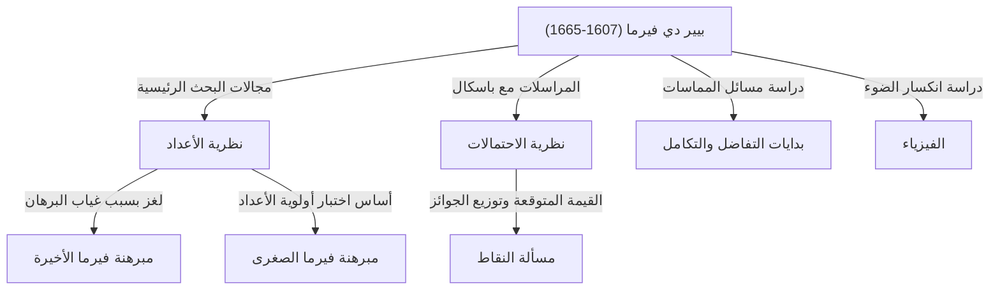

## مقدمة: الرجل الذي ترك أعظم لغز في الرياضيات

عند الحديث عن الشخصية التي ولّدت القصة الأكثر شهرة ودرامية في تاريخ الرياضيات، يجب ألا ننظر إلى أبعد من [بيير دي فيرما](https://kenji.blog/p/fermat/). لم يكن عالم رياضيات محترفًا. كان يعمل عادة كقاضٍ إقليمي ويستمتع بالرياضيات في وقت فراغه، مما جعله يُعرف باسم **"عالم الرياضيات الهاوي"**. ومع ذلك، فإن الإنجازات التي تركها وراءه أذهلت أعظم العقول في أوروبا في ذلك الوقت، واستمرت في تعذيب علماء الرياضيات العباقرة في جميع أنحاء العالم لأكثر من 350 عامًا بعد وفاته.

في هذا المقال، سوف نتعمق في حياة فيرما، واكتشافاته الرياضية الرئيسية، والملحمة الرومانسية المحيطة بـ **"[مبرهنة فيرما الأخيرة](https://kenji.blog/p/fermats-last-theorem/)"** العظيمة التي لا تزال محفورة في تاريخ الرياضيات. دعونا نستكشف كيف أرسى أسس الرياضيات الحديثة ونكشف عن مصادر بصيرته وخياله المذهلين.

## 1. وجهه العام كقاضٍ وشغفه بالرياضيات

وُلد [بيير دي فيرما](https://kenji.blog/p/fermat/) في أواخر عام 1607 (أو 1601، وفقًا لبعض النظريات) لعائلة غنية من تجار الجلود في بومونت دي لوماني، في جنوب غرب فرنسا. كان ذكيًا بشكل استثنائي منذ سن مبكرة، حيث درس القانون في جامعة أورليان، وفي عام 1631، تولى المنصب المرموق كمستشار (قاضٍ) في برلمان تولوز. ومنذ ذلك الحين، قضى حياته بأكملها كموظف حكومي.

في فرنسا في ذلك الوقت، كان يُشجع القضاة على تجنب توسيع دوائرهم الاجتماعية بشكل مفرط لمنع النزاعات السياسية والاجتماعية. ومن المفارقات أن هذه البيئة المعزولة وفرت لفيرما الوقت الهادئ الذي يحتاجه، ودفعه نحو أعماق الرياضيات السحيقة. بالنسبة له، كانت الرياضيات فرحة خالصة حررته من الضغوط الثقيلة لواجباته، ولم تكن شيئًا فُرض عليه من قبل أي شخص.

لم يكن فيرما يحب نشر أبحاثه كأوراق علمية رسمية؛ بل كان يكتفي بتدوين أفكاره وبراهينه في دفاتر الملاحظات أو على هوامش الكتب، أو بتبادل الرسائل مع علماء آخرين من خلال [مارين ميرسين](https://kenji.blog/p/mersenne/)، وهو راهب في باريس كان يعمل كمركز أكاديمي في ذلك الوقت. كان يستمتع بعرض اكتشافاته كـ **"مسائل"** على علماء الرياضيات الآخرين، مطالبًا إياهم بحلولها بشكل استفزازي. ويُعرف أيضًا بدخوله في نقاشات حادة مع علماء رياضيات كبار مثل [رينيه ديكارت](https://kenji.blog/p/descartes/) و[جون واليس](https://kenji.blog/p/wallis/).

## 2. مساهمات هائلة في نظرية الأعداد

كان اهتمام فيرما الأكبر، والمجال الذي ترك فيه أعمق بصماته، هو **نظرية الأعداد** (الفرع الذي يستكشف خصائص الأعداد). نظرًا لتكريسه وقته لقراءة كتاب *الحساب (Arithmetica)* لعالم الرياضيات اليوناني القديم [ديوفانتوس](https://kenji.blog/p/diophantus/)، فقد استمد الإلهام منه لاكتشاف العديد من المبرهنات الرائدة.

### 2.1. [مبرهنة فيرما الصغرى](https://kenji.blog/p/fermats-little-theorem/)

من المبرهنات ذات الأهمية الملحوظة والتي تشكل أساس التشفير الحديث (مثل تشفير RSA) هي **[مبرهنة فيرما الصغرى](https://kenji.blog/p/fermats-little-theorem/)**. وهي تكشف عن خاصية مدهشة تتعلق بالأعداد الأولية، وتدعم بصمت تكنولوجيا الأمن في مجتمع الإنترنت الحديث لدينا.

نص المبرهنة هو كما يلي:
لأي عدد أولي $p$ وأي عدد صحيح $a$ يكون أوليًا نسبيًا مع $p$ (مما يعني أنه ليس مضاعفًا لـ $p$)، فإن التطابق التالي يتحقق:

$$
a^{p-1} \equiv 1 \pmod{p} \quad \text{ (حيث } p \text{ هو عدد أولي)}
$$

بعبارة أخرى، تملي الخاصية أن "العدد الذي نحصل عليه برفع $a$ إلى القوة $p-1$ وطرح $1$ يقبل القسمة دائمًا على $p$". على سبيل المثال، إذا كان $p = 5$ و $a = 2$، فإن $2^{5-1} = 2^4 = 16$، و $16 - 1 = 15$، وهو من مضاعفات العدد $5$ بشكل جميل. تعمل هذه المبرهنة كأساس للخوارزميات (مثل اختبار فيرما للأولية) التي تحدد بسرعة ما إذا كانت الأعداد الكبيرة جدًا أولية أم لا.

### 2.2. مبرهنة مجموع مربعين

اكتشف فيرما مبرهنة جميلة أخرى فيما يتعلق بخصائص الأعداد الأولية: "العدد الأولي الذي يترك باقيًا مقداره $1$ عند قسمته على $4$ يمكن التعبير عنه دائمًا بطريقة واحدة فقط كمجموع مربعين (مربعي عددين صحيحين)".

$$
p = x^2 + y^2 \quad \text{ (حيث } p \equiv 1 \pmod{4} \text{ )}
$$

على سبيل المثال، إذا كان $p = 5$، فهو $5 = 1^2 + 2^2$؛ وإذا كان $p = 13$، فهو $13 = 2^2 + 3^2$؛ وإذا كان $p = 29$، فهو $29 = 2^2 + 5^2$. وعلى العكس من ذلك، فإن الأعداد الأولية التي تترك باقيًا مقداره $3$ عند قسمتها على $4$ (مثل $7, 11, 19$) لا يمكن أبدًا التعبير عنها كمجموع مربعين. استمر فيرما في الكشف عن مثل هذه القواعد العميقة في نظرية الأعداد.

### 2.3. أعداد فيرما الأولية ورسم المضلعات المنتظمة

نظر فيرما أيضًا في الصيغ الرياضية التي تولّد الأعداد الأولية. فقد حدس أن جميع الأعداد التي على الصيغة $F_n = 2^{2^n} + 1$ هي أعداد أولية. في الواقع، بالنسبة لـ $n=0, 1, 2, 3, 4$، تكون النتائج $3, 5, 17, 257, 65537$ على التوالي، وكل هذه أعداد أولية. وتسمى هذه بـ **أعداد فيرما الأولية**.

ومع ذلك، أثبت ليونارد أويلر لاحقًا أنه عندما يكون $n=5$، فإن $2^{32} + 1 = 4294967297 = 641 \times 6700417$، مما يدحض حدسية فيرما نفسها. ومع ذلك، أثبت كارل فريدريش غاوس لاحقًا أن أعداد فيرما الأولية هذه مرتبطة ارتباطًا وثيقًا بـ "الشروط اللازمة لإمكانية رسم مضلع منتظم له $n$ من الأضلاع باستخدام الفرجار والمسطرة"، ولعبت دورًا في غاية الأهمية في دمج الهندسة والجبر للأجيال اللاحقة.

## 3. طريقة الانحدار اللانهائي: سيف فيرما الحاد

على الرغم من أن فيرما نادرًا ما كان يكتب براهين مبرهناته، فقد كانت هناك طريقة فريدة تباهى بها كـ "أقوى طريقة إثبات اكتشفتها". هذه هي **طريقة الانحدار اللانهائي**.

إنها شكل من أشكال البرهان بالتناقض، وتُستخدم بشكل أساسي لإثبات أنه "لا توجد حلول صحيحة موجبة تلبي شرطًا معينًا". التدفق الأساسي للحجة هو كما يلي:

1. افترض وجود حل صحيح موجب يلبي الشرط.
2. أظهر رياضيًا أنه بدءًا من ذلك الحل، يمكن إنشاء حل صحيح موجب أصغر يلبي نفس الشرط.
3. تكرار هذا الإجراء يعني أن الحل الصحيح الموجب سيستمر في الصغر إلى ما لا نهاية.
4. ومع ذلك، نظرًا لأن الأعداد الصحيحة الموجبة لها قيمة دنيا هي $1$، فمن المستحيل أن تستمر في الصغر إلى أجل غير مسمى.
5. ولذلك، فإن الافتراض الأولي خاطئ، ولا يوجد حل صحيح موجب يلبي الشرط.

باستخدام هذه التقنية، أثبت فيرما بنفسه قضايا مثل "لا يمكن أن تكون مساحة المثلث القائم الزاوية عددًا مربعًا". كما درس علماء الرياضيات اللاحقون مثل أويلر بعمق واستخدموا بشكل كبير طريقة الانحدار اللانهائي هذه لإثبات المبرهنات التي تركها فيرما وراءه.

## 4. كأحد مؤسسي نظرية الاحتمالات

لم تقتصر موهبة فيرما الاستثنائية على نظرية الأعداد. في عام 1654، تبادل سلسلة من الرسائل مع المفكر وعالم الرياضيات العبقري [بليز باسكال](https://kenji.blog/p/pascal/). وتعتبر هذه المراسلات بالذات فجر **نظرية الاحتمالات** الحديثة.

كان الحافز لنقاشهما هو سؤال متعلق بالمقامرة يُعرف باسم **"مسألة النقاط"**، والذي جلبه رجل يُدعى شوفالييه دي ميريه إلى باسكال.
كان السؤال: "يلعب لاعبان متساويان في المهارة لعبة يفوز فيها من يفوز بعدد معين من الجولات بالجائزة بأكملها. ومع ذلك، إذا توقفت اللعبة في منتصف الطريق، فكيف يجب تقسيم الجائزة بإنصاف بناءً على الوضع الحالي للفوز والخسارة؟"

على الرغم من أن فيرما وباسكال استخدما مناهج رياضية مختلفة تمامًا، إلا أنهما توصلا في النهاية إلى نفس الاستنتاج تمامًا (نسبة التوزيع الصحيحة بناءً على المفاهيم الحالية للاحتمال والقيمة المتوقعة). استخدم باسكال التوافقيات مثل المعاملات ذات الحدين، بينما استخدم فيرما طريقة أنيقة لسرد وحساب جميع النتائج الممكنة. ومن خلال هذه المراسلات التي استمرت بضعة أشهر فقط، ولدت "نظرية الاحتمالات" كفرع مستقل من الرياضيات.

## 5. مساهمات رائدة في التفاضل والتكامل والفيزياء

قبل عقود من تأسيس [إسحاق نيوتن](https://kenji.blog/p/newton/) و[غوتفريد لايبنتس](https://kenji.blog/p/leibniz/) لحساب التفاضل والتكامل، كان فيرما قد ابتكر طرقه الخاصة لرسم مماسات للمنحنيات وإيجاد القيم القصوى والدنيا للدوال.

لقد أدخل مفهومًا يُسمى **"شبه المساواة"** (Adequality). إنها تقنية يُعامل فيها القيمة على أنها "شبه متساوية" عند تغيير كمية ضئيلة $E$، ويتم العثور على القيمة القصوى من خلال اعتبار $E$ كـ $0$ في المرحلة النهائية من الحساب. هذه هي في الأساس فكرة التفاضل الحديث نفسها، وقد أشار نيوتن نفسه لاحقًا: "لقد حصلت على تلميح لهذه الطريقة من طريقة فيرما في رسم المماسات". لولا فيرما، لربما تأخر اكتمال حساب التفاضل والتكامل أكثر.

علاوة على ذلك، في مجال الفيزياء (البصريات)، اقترح **مبدأ فيرما**، والذي ينص على أن "الضوء ينتقل بين نقطتين على طول المسار الذي يتطلب أقصر وقت". هذا اشتق رياضيًا قانون سنيل للانكسار، وشكل أساس البصريات الحديثة، وأصبح اكتشافًا مهمًا للغاية أدى إلى "مبدأ الفعل الأقل" الذي يجتاز مجمل الفيزياء اللاحقة.

## 6. دراما في الهوامش: [مبرهنة فيرما الأخيرة](https://kenji.blog/p/fermats-last-theorem/)

على الرغم من تركه وراءه العديد من الإنجازات العظيمة، إلا أن ما يجعل فيرما بوضوح عالم الرياضيات الأكثر شهرة في التاريخ هو وجود **"[مبرهنة فيرما الأخيرة](https://kenji.blog/p/fermats-last-theorem/)"**.

على هوامش فقرة تتعلق بمبرهنة فيثاغورس ( $x^2 + y^2 = z^2$ ) في المجلد الثاني من كتابه المفضل، *الحساب (Arithmetica)* ل[ديوفانتوس](https://kenji.blog/p/diophantus/)، كتب فيرما الملاحظة المذهلة التالية باللغة اللاتينية:

> "Cubum autem in duos cubos, aut quadratoquadratum in duos quadratoquadratos, et generaliter nullam in infinitum ultra quadratum potestatem in duas eiusdem nominis fas est dividere cuius rei demonstrationem mirabilem sane detexi. Hanc marginis exiguitas non caperet."
> 
> (من المستحيل تقسيم المكعب إلى مكعبين، أو القوة الرابعة إلى قوتين رابعتين، أو بشكل عام، أي قوة أعلى من الثانية إلى قوتين متماثلتين. لقد اكتشفت **برهانًا رائعًا حقًا** على هذا، ولكن هذا الهامش أضيق من أن يتسع له.)

إذا تم التعبير عنها كصيغة رياضية، فهي بسيطة بشكل لا يصدق:

"عندما يكون $n$ عددًا صحيحًا أكبر من أو يساوي $3$، فلا توجد حلول صحيحة موجبة $(x, y, z)$ تلبي المعادلة التالية."

$$
x^n + y^n = z^n \quad \text{ (حيث } n \ge 3 \text{ )}
$$

بعد وفاة فيرما في عام 1665، نشر ابنه الأكبر كليمان-صموئيل طبعة جديدة من كتاب *الحساب* تضمنت ملاحظات والده. ومن هناك، بدأ تحدٍ مرهق لعلماء الرياضيات في جميع أنحاء العالم.

لقد عالج العباقرة المتعاقبون مثل أويلر ولوجاندر ودركليه وغاوس وصوفي جيرمان هذه المسألة. وفي حين تم إثبات الحالات الفردية لـ $n=3, 4, 5, 7$، لم يستطع أحد إثبات ذلك بشكل عام لجميع قيم $n$.

### الخاتمة الدرامية بعد 350 عامًا

لأكثر من 350 عامًا بعد اقتراحها، هيمنت هذه المسألة كـ "أعظم مسألة غير محلولة في الرياضيات"، ولم يحلها أحد. وفي النصف الثاني من القرن العشرين، حيث بدأ الكثيرون يشكون في أن "فيرما لم يثبت ذلك في الواقع (أو ارتكب خطأ)"، وضع أحد علماء الرياضيات أخيرًا حدًا لهذا اللغز الهائل.

لقد كان عالم الرياضيات البريطاني [أندرو وايلز](https://kenji.blog/p/wiles/). بعد أن واجه المسألة في مكتبته المحلية في سن العاشرة، تعهد بتكريس حياته لحلها. لقد اتخذ نهجًا كبيرًا لا يمكن تصوره في زمن فيرما، حيث جمع بين **حدسية تانياما-شيمورا** - والتي اقترحت أن "جميع المنحنيات الإهليلجية هي نمطية"، والتي طرحها عالما الرياضيات اليابانيان [يوتاكا تانياما](https://kenji.blog/p/taniyama-yutaka/) و[غورو شيمورا](https://kenji.blog/p/shimura-goro/) - مع بحث كين ريبيت حول منحنيات فراي (حدسية إبسيلون).

عزل وايلز نفسه في عليته، وبعد سبع سنوات من البحث الانفرادي، نشر البرهان الكامل في عام 1995. كان برهانه تتويجًا للرياضيات الحديثة التي امتدت لمئات الصفحات، وكان مختلفًا تمامًا عن الأساليب الرياضية في القرن السابع عشر ("برهان رائع حقًا") التي ربما تصورها فيرما.

ما إذا كان فيرما يمتلك حقًا برهانًا صحيحًا يظل لغزًا أبديًا حتى اليوم. ومع ذلك، فهي حقيقة لا يمكن إنكارها أن "ملاحظته الهامشية" وفرت قوة دافعة لا حصر لها لتطور الرياضيات في الأجيال اللاحقة.

## الخاتمة: إرث أمير الهواة

لم يكن [بيير دي فيرما](https://kenji.blog/p/fermat/) سوى قاضٍ لم يرغب في الصعود إلى المسرح الرئيسي الساحر للأوساط الأكاديمية. ومع ذلك، فإن الأفكار التي دوّنها على قصاصات الورق وعلى هوامش الكتب فتحت الأبواب على مصراعيها لمجالات متنوعة تتراوح من نظرية الأعداد والاحتمالات إلى التفاضل والتكامل والبصريات.

إن اللغز الأكبر الذي تركه وراءه سحر وعذب عددًا لا يحصى من علماء الرياضيات على مدى عدة قرون، ورعى نظريات رياضية جديدة في هذه العملية. لا يزال وجود فيرما نفسه يتحدث إلينا اليوم عن الرومانسية والعمق اللانهائيين اللذين ينطوي عليهما تخصص الرياضيات. إنه بلا شك أعظم وأكثر **"أمير للهواة"** إثارة للمشاعر في التاريخ.
