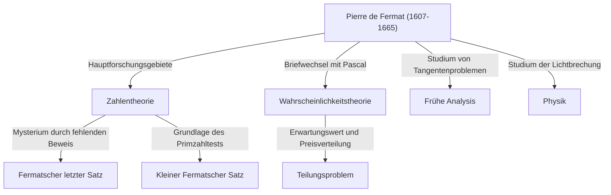

## Einleitung: Der Mann, der das größte Geheimnis der Mathematik hinterließ

Wenn man von der Figur spricht, die die berühmteste und dramatischste Geschichte in der Geschichte der Mathematik hervorbrachte, muss man nicht weiter als bis zu [Pierre de Fermat](https://kenji.blog/de/p/fermat/) schauen. Er war kein professioneller Mathematiker. Normalerweise arbeitete er als regionaler Richter und genoss die Mathematik in seiner Freizeit, was ihn zu einem sogenannten **„Amateurmathematiker“** machte. Die Errungenschaften, die er jedoch hinterließ, verblüfften die größten Köpfe Europas seiner Zeit und sollten geniale Mathematiker auf der ganzen Welt für mehr als 350 Jahre nach seinem Tod quälen.

In diesem Artikel werden wir tief in das Leben von Fermat eintauchen, in seine wichtigsten mathematischen Entdeckungen und in die romantische Saga um den monumentalen **„Fermatschen letzten Satz“**, der in der Geschichte der Mathematik verankert bleibt. Lassen Sie uns erforschen, wie er den Grundstein für die moderne Mathematik legte, und die Quellen seiner erstaunlichen Einsichtskraft und Vorstellungskraft aufdecken.

## 1. Sein öffentliches Gesicht als Richter und seine Leidenschaft für die Mathematik

[Pierre de Fermat](https://kenji.blog/de/p/fermat/) wurde Ende 1607 (oder nach einigen Theorien 1601) in die Familie eines wohlhabenden Lederhändlers in Beaumont-de-Lomagne im Südwesten Frankreichs geboren. Von klein auf außergewöhnlich klug, studierte er Jura an der Universität von Orléans und nahm 1631 die ehrenvolle Position eines Rates (Richters) am Parlement von Toulouse an. Von da an verbrachte er sein ganzes Leben als Beamter.

Im damaligen Frankreich wurden Richter ermutigt, ihre sozialen Kreise nicht zu sehr zu erweitern, um politische und soziale Konflikte zu vermeiden. Ironischerweise bot dieses isolierte Umfeld Fermat die ruhige Zeit, die er brauchte, und trieb ihn in die tiefen Abgründe der Mathematik. Für ihn war Mathematik eine reine Freude, die ihn vom schweren Druck seiner Pflichten befreite, und nicht etwas, das ihm von jemandem aufgezwungen wurde.

Fermat veröffentlichte seine Forschungen nicht gerne als formelle Arbeiten; er war zufrieden damit, seine Ideen und Beweise in Notizbüchern oder am Rand von Büchern zu notieren oder über [Marin Mersenne](https://kenji.blog/de/p/mersenne/), einen Mönch in Paris, der damals als akademisches Zentrum fungierte, Briefe mit anderen Gelehrten auszutauschen. Es genoss er, seine Entdeckungen als **„Probleme“** anderen Mathematikern zu präsentieren und provokativ deren Lösungen einzufordern. Es ist auch bekannt, dass er sich auf heftige Debatten mit großen Mathematikern wie [René Descartes](https://kenji.blog/de/p/descartes/) und [John Wallis](https://kenji.blog/de/p/wallis/) einließ.

## 2. Immense Beiträge zur Zahlentheorie

Fermats größtes Interesse und das Gebiet, auf dem er seine tiefsten Spuren hinterließ, war die **Zahlentheorie** (der Zweig, der die Eigenschaften von Zahlen erforscht). Gewidmet der Lektüre von *Arithmetica* des antiken griechischen Mathematikers Diophantos, ließ er sich davon inspirieren, um zahlreiche bahnbrechende Sätze zu entdecken.

### 2.1. Kleiner Fermatscher Satz

Ein bemerkenswert wichtiger Satz, der die Grundlage der modernen Kryptographie (wie der RSA-Verschlüsselung) bildet, ist der **kleine Fermatsche Satz**. Er offenbart eine überraschende Eigenschaft in Bezug auf Primzahlen und unterstützt lautlos die Sicherheitstechnologie in unserer modernen Internetgesellschaft.

Die Aussage des Satzes lautet wie folgt:
Für jede Primzahl $p$ und jede ganze Zahl $a$, die teilerfremd zu $p$ ist (was bedeutet, dass sie kein Vielfaches von $p$ ist), gilt die folgende Kongruenz:

$$
a^{p-1} \equiv 1 \pmod{p} \quad \text{ (wobei } p \text{ eine Primzahl ist)}
$$

Mit anderen Worten diktiert die Eigenschaft, dass "die Zahl, die man erhält, wenn man $a$ mit $p-1$ potenziert und $1$ subtrahiert, immer durch $p$ teilbar ist". Wenn zum Beispiel $p = 5$ und $a = 2$, dann ist $2^{5-1} = 2^4 = 16$, und $16 - 1 = 15$, was wunderbarerweise ein Vielfaches von $5$ ist. Dieser Satz dient als Grundlage für Algorithmen (wie den Fermat-Primzahltest), die schnell bestimmen, ob extrem große Zahlen prim sind.

### 2.2. Zwei-Quadrate-Satz

Fermat entdeckte einen weiteren schönen Satz über die Eigenschaften von Primzahlen: „Eine Primzahl, die bei der Division durch $4$ einen Rest von $1$ lässt, kann immer auf genau eine Weise als Summe von zwei Quadraten (den Quadraten zweier ganzer Zahlen) ausgedrückt werden.“

$$
p = x^2 + y^2 \quad \text{ (wobei } p \equiv 1 \pmod{4} \text{ )}
$$

Wenn zum Beispiel $p = 5$, ist es $5 = 1^2 + 2^2$; wenn $p = 13$, ist es $13 = 2^2 + 3^2$; wenn $p = 29$, ist es $29 = 2^2 + 5^2$. Umgekehrt können Primzahlen, die bei der Division durch $4$ einen Rest von $3$ lassen (wie $7, 11, 19$), niemals als Summe zweier Quadrate ausgedrückt werden. Fermat deckte in der Zahlentheorie sukzessive solch tiefgreifende Regelmäßigkeiten auf.

### 2.3. Fermat-Primzahlen und die Konstruktion regelmäßiger Polygone

Fermat betrachtete auch mathematische Formeln, die Primzahlen erzeugen. Er vermutete, dass alle Zahlen der Form $F_n = 2^{2^n} + 1$ prim sind. Tatsächlich sind für $n=0, 1, 2, 3, 4$ die Ergebnisse $3, 5, 17, 257, 65537$ und alle diese sind prim. Diese werden **Fermat-Primzahlen** genannt.

Später zeigte [Leonhard Euler](https://kenji.blog/de/p/euler/) jedoch, dass für $n=5$, $2^{32} + 1 = 4294967297 = 641 \times 6700417$ ist, und widerlegte damit Fermats Vermutung selbst. Dennoch wurde später von [Carl Friedrich Gauss](https://kenji.blog/de/p/gauss/) bewiesen, dass diese Fermat-Primzahlen tief mit den „Bedingungen, unter denen ein regelmäßiges $n$-Eck mit Zirkel und Lineal konstruierbar ist“ verbunden sind, was eine extrem wichtige Rolle bei der Verschmelzung von Geometrie und Algebra für spätere Generationen spielte.

## 3. Die Methode des unendlichen Abstiegs: Fermats scharfes Schwert

Obwohl Fermat selten die Beweise für seine Sätze aufschrieb, gab es eine einzigartige Methode, die er als „die mächtigste Beweismethode, die ich entdeckt habe“ rühmte. Dies ist die **Methode des unendlichen Abstiegs**.

Es ist eine Form des Beweises durch Widerspruch, die hauptsächlich verwendet wird, um zu beweisen, dass „keine positiven ganzzahligen Lösungen existieren, die eine bestimmte Bedingung erfüllen.“ Der grundlegende Ablauf des Arguments ist wie folgt:

1. Nehmen wir an, dass eine positive ganzzahlige Lösung existiert, die die Bedingung erfüllt.
2. Zeige mathematisch, dass es möglich ist, von dieser Lösung ausgehend eine noch kleinere positive ganzzahlige Lösung zu erstellen, die dieselbe Bedingung erfüllt.
3. Die Wiederholung dieses Verfahrens impliziert, dass die positive ganzzahlige Lösung unendlich kleiner werden würde.
4. Da positive ganze Zahlen jedoch einen Mindestwert von $1$ haben, ist es für sie unmöglich, unbegrenzt kleiner zu werden.
5. Daher ist die anfängliche Annahme falsch, und es existiert keine positive ganzzahlige Lösung, die die Bedingung erfüllt.

Mit dieser Technik bewies Fermat selbst Behauptungen wie „die Fläche eines rechtwinkligen Dreiecks kann keine Quadratzahl sein“. Spätere Mathematiker wie Euler untersuchten diese Methode des unendlichen Abstiegs ebenfalls tiefgehend und nutzten sie ausgiebig, um von Fermat hinterlassene Sätze zu beweisen.

## 4. Als Begründer der Wahrscheinlichkeitstheorie

Fermats außergewöhnliches Talent beschränkte sich nicht auf die Zahlentheorie. 1654 tauschte er eine Reihe von Briefen mit dem genialen Denker und Mathematiker [Blaise Pascal](https://kenji.blog/de/p/pascal/) aus. Genau diese Korrespondenz gilt als der Beginn der modernen **Wahrscheinlichkeitstheorie**.

Der Auslöser für ihre Diskussion war eine spielbezogene Frage, bekannt als das **„Teilungsproblem“**, die Pascal von einem Mann namens Chevalier de Méré überbracht wurde.
Die Frage war: „Zwei Spieler von gleicher Spielstärke spielen ein Spiel, bei dem derjenige, der zuerst eine bestimmte Anzahl von Runden gewinnt, den gesamten Preis erhält. Wenn das Spiel jedoch mittendrin abgebrochen wird, wie soll der Preis basierend auf dem aktuellen Stand von Siegen und Niederlagen fair aufgeteilt werden?“

Obwohl Fermat und Pascal jeweils völlig unterschiedliche mathematische Ansätze verfolgten, kamen sie letztendlich zu genau demselben Schluss (das korrekte Verteilungsverhältnis basierend auf den aktuellen Konzepten von Wahrscheinlichkeit und Erwartungswert). Pascal verwendete Kombinatorik wie Binomialkoeffizienten, während Fermat eine elegante Methode der Aufzählung und Zählung aller möglichen Ergebnisse anwandte. Durch diese Korrespondenz, die nur wenige Monate dauerte, wurde die „Wahrscheinlichkeitstheorie“ als eigenständiger Zweig der Mathematik geboren.

## 5. Pionierbeiträge zur Analysis und Physik

Jahrzehnte bevor [Isaac Newton](https://kenji.blog/de/p/newton/) und [Gottfried Leibniz](https://kenji.blog/de/p/leibniz/) die Analysis etablierten, hatte Fermat seine eigenen Methoden erdacht, um Tangenten an Kurven zu ziehen und die Maximal- und Minimalwerte von Funktionen zu finden.

Er führte ein Konzept namens **„Adäqualität“** ein. Dies ist eine Technik, bei der ein Wert als „fast gleich“ behandelt wird, wenn eine winzige Größe $E$ variiert wird, und der Extremwert gefunden wird, indem $E$ in der Endphase der Berechnung als $0$ behandelt wird. Dies ist im Grunde die Idee der modernen Differentialrechnung, und Newton selbst bemerkte später: „Ich hatte den Hinweis auf diese Methode aus Fermats Art, Tangenten zu ziehen.“ Ohne Fermat hätte sich die Vollendung der Analysis möglicherweise noch weiter verzögert.

Darüber hinaus schlug er auf dem Gebiet der Physik (Optik) das **Fermatsche Prinzip** vor, das besagt: „Licht breitet sich zwischen zwei Punkten auf dem Weg aus, der die kürzeste Zeit erfordert.“ Dies leitete mathematisch das Snelliussche Brechungsgesetz ab, bildete die Grundlage der modernen Optik und wurde zu einer extrem wichtigen Entdeckung, die zum „Prinzip der kleinsten Wirkung“ führte, das die gesamte spätere Physik durchzieht.

## 6. Drama am Rande: Fermatscher letzter Satz

Trotz so zahlreicher großer Errungenschaften, die er hinterließ, ist das, was Fermat unbestreitbar zum berühmtesten Mathematiker der Geschichte macht, die Existenz des **„Fermatschen letzten Satzes“**.

Am Rande einer Passage bezüglich des Satzes des Pythagoras ( $x^2 + y^2 = z^2$ ) in Band 2 seines Lieblingsbuches, der *Arithmetica* des Diophantos, verfasste Fermat die folgende erstaunliche Notiz auf Latein:

> "Cubum autem in duos cubos, aut quadratoquadratum in duos quadratoquadratos, et generaliter nullam in infinitum ultra quadratum potestatem in duas eiusdem nominis fas est dividere cuius rei demonstrationem mirabilem sane detexi. Hanc marginis exiguitas non caperet."
> 
> (Es ist nicht möglich, einen Kubus in zwei Kuben oder ein Biquadrat in zwei Biquadrate und allgemein eine Potenz höher als die zweite in zwei Potenzen mit demselben Exponenten zu zerlegen. Ich habe hierfür einen **wahrhaft wunderbaren Beweis** entdeckt, doch ist dieser Rand zu schmal, um ihn zu fassen.)

Ausgedrückt als mathematische Formel, ist es unglaublich einfach:

„Wenn $n$ eine ganze Zahl größer oder gleich $3$ ist, gibt es keine positiven ganzzahligen Lösungen $(x, y, z)$, die die folgende Gleichung erfüllen.“

$$
x^n + y^n = z^n \quad \text{ (wobei } n \ge 3 \text{ )}
$$

Nachdem Fermat 1665 gestorben war, veröffentlichte sein ältester Sohn Clément-Samuel eine neue Ausgabe der *Arithmetica*, die die Anmerkungen seines Vaters enthielt. Von da an begann eine zermürbende Herausforderung durch Mathematiker auf der ganzen Welt.

Aufeinanderfolgende Genies wie Euler, Legendre, Dirichlet, Gauß und Sophie Germain nahmen dieses Problem in Angriff. Während Einzelfälle für $n=3, 4, 5, 7$ bewiesen wurden, konnte es niemand allgemein für alle $n$ beweisen.

### Der dramatische Abschluss 350 Jahre später

Mehr als 350 Jahre nach seiner Aufstellung herrschte dieses Problem als das „größte ungelöste Problem der Mathematik“, das von niemandem gelöst wurde. In der zweiten Hälfte des 20. Jahrhunderts, als viele zu vermuten begannen, dass „Fermat es eigentlich nicht bewiesen hatte (oder einen Fehler gemacht hatte)“, setzte schließlich ein Mathematiker diesem gewaltigen Rätsel ein Ende.

Das war der britische Mathematiker [Andrew Wiles](https://kenji.blog/de/p/wiles/). Nachdem er im Alter von 10 Jahren in seiner örtlichen Bibliothek auf das Problem gestoßen war, gelobte er, sein Leben der Lösung zu widmen. Er wählte einen großartigen Ansatz, der zu Fermats Zeiten unvorstellbar war, und kombinierte die **Taniyama-Shimura-Vermutung** – die vorschlug, dass „alle elliptischen Kurven modular sind“, aufgestellt von den japanischen Mathematikern [Yutaka Taniyama](https://kenji.blog/de/p/taniyama-yutaka/) und [Goro Shimura](https://kenji.blog/de/p/shimura-goro/) – mit Ken Ribets Forschungen zu Frey-Kurven (der Epsilon-Vermutung).

Wiles schloss sich auf seinem Dachboden ein und veröffentlichte nach sieben Jahren einsamer Forschung im Jahr 1995 den vollständigen Beweis. Sein Beweis war ein Höhepunkt der modernen Mathematik, der Hunderte von Seiten umfasste und völlig anders war als die mathematischen Methoden des 17. Jahrhunderts („wahrhaft wunderbarer Beweis“), die Fermat sich wahrscheinlich vorgestellt hatte.

Ob Fermat wirklich einen korrekten Beweis besaß, bleibt heute ein ewiges Rätsel. Es ist jedoch eine unbestreitbare Tatsache, dass seine „Randnotiz“ eine unermessliche Antriebskraft für die Entwicklung der Mathematik in späteren Generationen lieferte.

## Fazit: Das Vermächtnis des Königs der Amateurmathematiker

[Pierre de Fermat](https://kenji.blog/de/p/fermat/) war nur ein Richter, der nicht auf die glamouröse Hauptbühne der Wissenschaft treten wollte. Doch die Ideen, die er auf Papierfetzen und an den Rändern von Büchern notierte, öffneten die Türen zu so unterschiedlichen Bereichen wie Zahlentheorie, Wahrscheinlichkeitsrechnung, Analysis und Optik weit.

Das größte Rätsel, das er hinterließ, fesselte und quälte unzählige Mathematiker über mehrere Jahrhunderte hinweg und förderte dabei neue mathematische Theorien. Fermats bloße Existenz spricht uns noch heute von der unerschöpflichen Romantik und Tiefe, die die Disziplin der Mathematik birgt. Er ist ohne Zweifel der größte und seelenbewegendste **„König der Amateurmathematiker“** der Geschichte.
