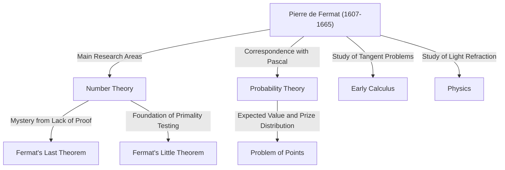

## Introduction: The Man Who Left Mathematics' Greatest Mystery

When speaking of the figure who generated the most famous and dramatic story in the history of mathematics, one must look no further than Pierre de Fermat. He was not a professional mathematician. He ordinarily worked as a regional judge and enjoyed mathematics in his spare time, making him a so-called **"amateur mathematician"**. However, the achievements he left behind astonished the greatest minds of Europe at the time and would go on to torment genius mathematicians around the world for more than 350 years after his death.

In this article, we will delve deeply into Fermat's life, his major mathematical discoveries, and the romantic saga surrounding the monumental **"[Fermat's Last Theorem](https://kenji.blog/p/fermats-last-theorem/)"** that remains etched in the history of mathematics. Let us explore how he laid the foundations of modern mathematics and uncover the sources of his astonishing insight and imagination.

## 1. His Public Face as a Judge and His Passion for Mathematics

Pierre de Fermat was born in late 1607 (or 1601, according to some theories) into a wealthy leather merchant's family in Beaumont-de-Lomagne, in southwestern France. Exceptionally bright from a young age, he studied law at the University of Orléans and, in 1631, took up the honorable position of counselor (judge) at the Parlement of Toulouse. From then on, he spent his entire life as a public servant.

In France at the time, judges were encouraged to avoid expanding their social circles too widely to prevent political and social conflicts. Ironically, this isolated environment afforded Fermat the quiet time he needed, driving him toward the profound depths of mathematics. For him, mathematics was a pure joy that freed him from the heavy pressures of his duties, not something forced upon him by anyone.

Fermat did not like to publish his research as formal papers; he was satisfied with jotting down his ideas and proofs in notebooks or the margins of books, or by exchanging letters with other scholars through Marin Mersenne, a friar in Paris who served as an academic hub at the time. He enjoyed presenting his discoveries as **"problems"** to other mathematicians, provocatively demanding their solutions. He is also known to have engaged in fierce debates with great mathematicians such as René Descartes and John Wallis.

## 2. Immense Contributions to Number Theory

Fermat's greatest interest and the field where he left his deepest mark was **Number Theory** (the branch exploring the properties of numbers). Devoted to reading *Arithmetica* by the ancient Greek mathematician Diophantus, he drew inspiration from it to discover numerous groundbreaking theorems.

### 2.1. Fermat's Little Theorem

A remarkably important theorem that forms the foundation of modern cryptography (such as RSA encryption) is **Fermat's Little Theorem**. It reveals a surprising property regarding prime numbers and silently supports security technology in our modern internet society.

The statement of the theorem is as follows:
For any prime number $p$ and any integer $a$ that is coprime to $p$ (meaning it is not a multiple of $p$), the following congruence holds:

$$
a^{p-1} \equiv 1 \pmod{p} \quad \text{ (where } p \text{ is a prime number)}
$$

In other words, the property dictates that "the number obtained by raising $a$ to the power of $p-1$ and subtracting $1$ is always divisible by $p$." For example, if $p = 5$ and $a = 2$, then $2^{5-1} = 2^4 = 16$, and $16 - 1 = 15$, which is beautifully a multiple of $5$. This theorem serves as the foundation for algorithms (like the Fermat primality test) that rapidly determine whether extremely large numbers are prime.

### 2.2. Theorem on Sums of Two Squares

Fermat discovered another beautiful theorem regarding the properties of prime numbers: "A prime number that leaves a remainder of $1$ when divided by $4$ can always be expressed in exactly one way as the sum of two squares (the squares of two integers)."

$$
p = x^2 + y^2 \quad \text{ (where } p \equiv 1 \pmod{4} \text{ )}
$$

For instance, if $p = 5$, it is $5 = 1^2 + 2^2$; if $p = 13$, it is $13 = 2^2 + 3^2$; if $p = 29$, it is $29 = 2^2 + 5^2$. Conversely, prime numbers that leave a remainder of $3$ when divided by $4$ (such as $7, 11, 19$) can never be expressed as the sum of two squares. Fermat successively uncovered such profound regularities in number theory.

### 2.3. Fermat Primes and the Construction of Regular Polygons

Fermat also considered mathematical formulas that generate prime numbers. He conjectured that all numbers in the form $F_n = 2^{2^n} + 1$ are prime. Indeed, for $n=0, 1, 2, 3, 4$, the results are $3, 5, 17, 257, 65537$, respectively, and all of these are prime. These are called **Fermat primes**.

However, Leonhard Euler later showed that when $n=5$, $2^{32} + 1 = 4294967297 = 641 \times 6700417$, thus disproving Fermat's conjecture itself. Still, these Fermat primes were later proven by Carl Friedrich Gauss to be deeply connected to the "conditions for a regular $n$-gon to be constructible with compass and straightedge," playing an extremely important role in the fusion of geometry and algebra for later generations.

## 3. The Method of Infinite Descent: Fermat's Sharp Sword

Although Fermat rarely wrote down the proofs for his theorems, there was a unique method he boasted about as "the most powerful method of proof I have discovered." This is the **Method of Infinite Descent**.

It is a form of proof by contradiction, primarily used to prove that "there exist no positive integer solutions that satisfy a certain condition." The basic flow of the argument is as follows:

1. Assume that a positive integer solution satisfying the condition exists.
2. Show mathematically that starting from that solution, it is possible to create an even smaller positive integer solution that satisfies the same condition.
3. Repeating this procedure implies that the positive integer solution would continue to become infinitely smaller.
4. However, since positive integers have a minimum value of $1$, it is impossible for them to continue becoming smaller indefinitely.
5. Therefore, the initial assumption is false, and no positive integer solution satisfying the condition exists.

Using this technique, Fermat himself proved propositions such as "the area of a right-angled triangle cannot be a square number." Later mathematicians like Euler also deeply studied and heavily utilized this method of infinite descent to prove theorems Fermat left behind.

## 4. As a Founder of Probability Theory

Fermat's extraordinary talent was not limited to number theory. In 1654, he exchanged a series of letters with the genius thinker and mathematician Blaise Pascal. This very correspondence is considered the dawn of modern **Probability Theory**.

The catalyst for their discussion was a gambling-related question known as the **"Problem of points,"** brought to Pascal by a man named Chevalier de Méré.
The question was: "Two players of equal skill are playing a game where the first to win a certain number of rounds takes the entire prize. However, if the game is interrupted midway, how should the prize be divided fairly based on the current state of wins and losses?"

Though Fermat and Pascal each employed entirely different mathematical approaches, they ultimately arrived at exactly the same conclusion (the correct distribution ratio based on current concepts of probability and expected value). Pascal utilized combinatorics such as binomial coefficients, while Fermat used an elegant method of enumerating and counting all possible outcomes. Through this correspondence lasting merely a few months, "probability theory" was born as an independent branch of mathematics.

## 5. Pioneering Contributions to Calculus and Physics

Decades before Isaac Newton and Gottfried Leibniz established calculus, Fermat had devised his own methods for drawing tangents to curves and finding the maximum and minimum values of functions.

He introduced a concept called **"Adequality"**. This is a technique where a value is treated as "almost equal" when a minute quantity $E$ is varied, and the extreme value is found by treating $E$ as $0$ in the final stage of calculation. This is essentially the very idea of modern differentiation, and Newton himself later remarked, "I had the hint of this method from Fermat's way of drawing tangents." Without Fermat, the completion of calculus might have been delayed even further.

Furthermore, in the field of physics (optics), he proposed **Fermat's Principle**, which states that "light travels between two points along the path that requires the shortest time." This mathematically derived Snell's law of refraction, formed the basis of modern optics, and became an extremely important discovery that led to the "principle of least action" traversing the entirety of later physics.

## 6. Drama in the Margins: [Fermat's Last Theorem](https://kenji.blog/p/fermats-last-theorem/)

Despite leaving behind such numerous great achievements, what unequivocally makes Fermat the most famous mathematician in history is the existence of **"[Fermat's Last Theorem](https://kenji.blog/p/fermats-last-theorem/)"**.

In the margins of a passage regarding the Pythagorean theorem ( $x^2 + y^2 = z^2$ ) in Volume 2 of his favorite book, Diophantus's *Arithmetica*, Fermat penned the following astonishing note in Latin:

> "Cubum autem in duos cubos, aut quadratoquadratum in duos quadratoquadratos, et generaliter nullam in infinitum ultra quadratum potestatem in duas eiusdem nominis fas est dividere cuius rei demonstrationem mirabilem sane detexi. Hanc marginis exiguitas non caperet."
> 
> (It is impossible to separate a cube into two cubes, or a fourth power into two fourth powers, or in general, any power higher than the second, into two like powers. I have discovered a **truly marvelous proof** of this, which this margin is too narrow to contain.)

Expressed as a mathematical formula, it is incredibly simple:

"When $n$ is an integer greater than or equal to $3$, there exist no positive integer solutions $(x, y, z)$ that satisfy the following equation."

$$
x^n + y^n = z^n \quad \text{ (where } n \ge 3 \text{ )}
$$

After Fermat passed away in 1665, his eldest son Clément-Samuel published a new edition of *Arithmetica* that included his father's annotations. From there, a grueling challenge by mathematicians across the globe began.

Successive geniuses such as Euler, Legendre, Dirichlet, Gauss, and Sophie Germain tackled this problem. While individual cases for $n=3, 4, 5, 7$ were proven, no one could prove it generally for all $n$.

### The Dramatic Conclusion 350 Years Later

For over 350 years after its proposal, this problem reigned as the "greatest unsolved problem in mathematics," solved by no one. In the latter half of the 20th century, as many began to suspect that "Fermat hadn't actually proven it (or had made a mistake)," one mathematician finally put an end to this formidable puzzle.

That was the British mathematician Andrew Wiles. Having encountered the problem in his local library at the age of 10, he vowed to dedicate his life to solving it. He took a grand approach unimaginable in Fermat's time, combining the **Taniyama-Shimura conjecture**—which proposed that "all elliptic curves are modular," put forward by Japanese mathematicians Yutaka Taniyama and Goro Shimura—with Ken Ribet's research on Frey curves (the epsilon conjecture).

Wiles secluded himself in his attic and, after seven years of solitary research, published the complete proof in 1995. His proof was a culmination of modern mathematics spanning hundreds of pages, entirely different from the 17th-century mathematical methods ("truly marvelous proof") that Fermat likely envisioned.

Whether Fermat truly possessed a correct proof remains an eternal mystery today. However, it is an undeniable fact that his "margin note" provided an immeasurable driving force for the development of mathematics in later generations.

## Conclusion: The Legacy of the Prince of Amateurs

Pierre de Fermat was merely a judge who did not fancy stepping onto the glamorous main stage of academia. Yet, the ideas he jotted down on scraps of paper and in the margins of books threw the doors wide open to diverse fields ranging from number theory and probability to calculus and optics.

The greatest mystery he left behind captivated and tormented countless mathematicians over several centuries, nurturing new mathematical theories in the process. Fermat's very existence continues to speak to us today of the inexhaustible romance and profundity that the discipline of mathematics holds. He is, without a doubt, the greatest and most soul-stirring **"Prince of Amateurs"** in history.
