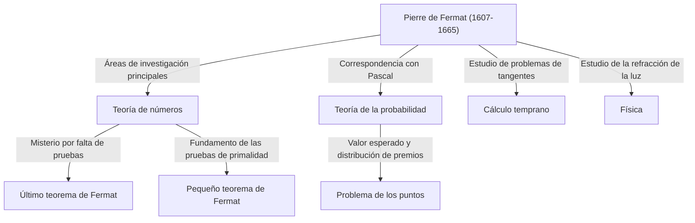

## Introducción: El hombre que dejó el mayor misterio de las matemáticas

Al hablar de la figura que generó la historia más famosa y dramática de la historia de las matemáticas, no hay que buscar más allá de [Pierre de Fermat](https://kenji.blog/es/p/fermat/). No era un matemático profesional. Trabajaba habitualmente como juez regional y disfrutaba de las matemáticas en su tiempo libre, lo que le convirtió en un **"matemático aficionado"**. Sin embargo, los logros que dejó asombraron a las mentes más brillantes de Europa de la época y atormentarían a matemáticos geniales de todo el mundo durante más de 350 años después de su muerte.

En este artículo, profundizaremos en la vida de [Fermat](https://kenji.blog/es/p/fermat/), sus principales descubrimientos matemáticos y la saga romántica que rodea al monumental **"Último teorema de [Fermat](https://kenji.blog/es/p/fermat/)"** que permanece grabado en la historia de las matemáticas. Exploremos cómo sentó las bases de las matemáticas modernas y descubramos las fuentes de su asombrosa perspicacia e imaginación.

## 1. Su faceta pública como juez y su pasión por las matemáticas

[Pierre de Fermat](https://kenji.blog/es/p/fermat/) nació a finales de 1607 (o 1601, según algunas teorías) en el seno de una adinerada familia de comerciantes de cuero en Beaumont-de-Lomagne, en el suroeste de Francia. Excepcionalmente brillante desde muy joven, estudió derecho en la Universidad de Orleans y, en 1631, asumió el honorable cargo de consejero (juez) en el Parlamento de Toulouse. A partir de entonces, pasó toda su vida como funcionario público.

En la Francia de la época, se animaba a los jueces a evitar expandir demasiado sus círculos sociales para evitar conflictos políticos y sociales. Irónicamente, este entorno aislado le proporcionó a [Fermat](https://kenji.blog/es/p/fermat/) el tiempo de tranquilidad que necesitaba, impulsándolo hacia las profundidades de las matemáticas. Para él, las matemáticas eran una alegría pura que le liberaba de las pesadas presiones de sus deberes, no algo que le impusiera nadie.

A [Fermat](https://kenji.blog/es/p/fermat/) no le gustaba publicar sus investigaciones como artículos formales; se conformaba con anotar sus ideas y demostraciones en cuadernos o en los márgenes de los libros, o intercambiando cartas con otros eruditos a través de [Marin Mersenne](https://kenji.blog/es/p/mersenne/), un fraile de París que actuaba como centro académico de la época. Disfrutaba presentando sus descubrimientos como **"problemas"** a otros matemáticos, exigiendo provocativamente sus soluciones. También se sabe que participó en feroces debates con grandes matemáticos como [René Descartes](https://kenji.blog/es/p/descartes/) y [John Wallis](https://kenji.blog/es/p/wallis/).

## 2. Inmensas contribuciones a la teoría de números

El mayor interés de [Fermat](https://kenji.blog/es/p/fermat/) y el campo en el que dejó su huella más profunda fue la **Teoría de números** (la rama que explora las propiedades de los números). Dedicado a la lectura de la *Arithmetica* del antiguo matemático griego [Diofanto](https://kenji.blog/es/p/diophantus/), se inspiró en ella para descubrir numerosos teoremas revolucionarios.

### 2.1. Pequeño teorema de [Fermat](https://kenji.blog/es/p/fermat/)

Un teorema de gran importancia que sienta las bases de la criptografía moderna (como el cifrado [RSA](https://kenji.blog/es/p/modern-cryptography-public-key-hash-signature/)) es el **Pequeño teorema de [Fermat](https://kenji.blog/es/p/fermat/)**. Revela una propiedad sorprendente con respecto a los números primos y apoya silenciosamente la tecnología de seguridad en nuestra sociedad moderna de Internet.

El enunciado del teorema es el siguiente:
Para cualquier número primo $p$ y cualquier número entero $a$ que sea coprimo de $p$ (lo que significa que no es un múltiplo de $p$), se cumple la siguiente congruencia:

$$
a^{p-1} \equiv 1 \pmod{p} \quad \text{ (donde } p \text{ es un número primo)}
$$

En otras palabras, la propiedad dicta que "el número que se obtiene al elevar $a$ a la potencia de $p-1$ y restarle $1$ siempre es divisible por $p$". Por ejemplo, si $p = 5$ y $a = 2$, entonces $2^{5-1} = 2^4 = 16$, y $16 - 1 = 15$, que es bellamente un múltiplo de $5$. Este teorema sirve como base para algoritmos (como el test de primalidad de [Fermat](https://kenji.blog/es/p/fermat/)) que determinan rápidamente si números extremadamente grandes son primos.

### 2.2. Teorema sobre sumas de dos cuadrados

[Fermat](https://kenji.blog/es/p/fermat/) descubrió otro hermoso teorema con respecto a las propiedades de los números primos: "Un número primo que deja un resto de $1$ al dividirse por $4$ siempre se puede expresar exactamente de una manera como la suma de dos cuadrados (los cuadrados de dos números enteros)".

$$
p = x^2 + y^2 \quad \text{ (donde } p \equiv 1 \pmod{4} \text{ )}
$$

Por ejemplo, si $p = 5$, es $5 = 1^2 + 2^2$; si $p = 13$, es $13 = 2^2 + 3^2$; si $p = 29$, es $29 = 2^2 + 5^2$. Por el contrario, los números primos que dejan un resto de $3$ al dividirse por $4$ (como $7, 11, 19$) nunca se pueden expresar como la suma de dos cuadrados. [Fermat](https://kenji.blog/es/p/fermat/) fue descubriendo sucesivamente estas profundas regularidades en la teoría de números.

### 2.3. Primos de [Fermat](https://kenji.blog/es/p/fermat/) y la construcción de polígonos regulares

[Fermat](https://kenji.blog/es/p/fermat/) también consideró fórmulas matemáticas que generan números primos. Conjeturó que todos los números de la forma $F_n = 2^{2^n} + 1$ son primos. De hecho, para $n=0, 1, 2, 3, 4$, los resultados son $3, 5, 17, 257, 65537$, respectivamente, y todos ellos son primos. Estos se denominan **Primos de [Fermat](https://kenji.blog/es/p/fermat/)**.

Sin embargo, [Leonhard Euler](https://kenji.blog/es/p/euler/) demostró más tarde que cuando $n=5$, $2^{32} + 1 = 4294967297 = 641 \times 6700417$, refutando así la propia conjetura de [Fermat](https://kenji.blog/es/p/fermat/). Aún así, [Carl Friedrich Gauss](https://kenji.blog/es/p/gauss/) demostró más tarde que estos primos de [Fermat](https://kenji.blog/es/p/fermat/) estaban profundamente conectados con las "condiciones para que un polígono regular de $n$ lados sea construible con compás y regla no graduada", desempeñando un papel extremadamente importante en la fusión de la geometría y el álgebra para las generaciones posteriores.

## 3. El método del descenso infinito: La afilada espada de [Fermat](https://kenji.blog/es/p/fermat/)

Aunque [Fermat](https://kenji.blog/es/p/fermat/) rara vez escribía las demostraciones de sus teoremas, había un método único del que se jactaba como "el método de demostración más poderoso que he descubierto". Este es el **Método del descenso infinito**.

Es una forma de demostración por contradicción, que se utiliza principalmente para demostrar que "no existen soluciones enteras positivas que satisfagan una determinada condición". El flujo básico del argumento es el siguiente:

1. Supongamos que existe una solución entera positiva que satisface la condición.
2. Demostrar matemáticamente que a partir de esa solución, es posible crear una solución entera positiva aún menor que satisfaga la misma condición.
3. Repetir este procedimiento implica que la solución entera positiva continuaría haciéndose infinitamente más pequeña.
4. Sin embargo, dado que los números enteros positivos tienen un valor mínimo de $1$, es imposible que sigan haciéndose más pequeños indefinidamente.
5. Por lo tanto, la suposición inicial es falsa y no existe ninguna solución entera positiva que satisfaga la condición.

Utilizando esta técnica, el propio [Fermat](https://kenji.blog/es/p/fermat/) demostró proposiciones como "el área de un triángulo rectángulo no puede ser un número cuadrado". Matemáticos posteriores como Euler también estudiaron profundamente y utilizaron en gran medida este método de descenso infinito para demostrar los teoremas que dejó [Fermat](https://kenji.blog/es/p/fermat/).

## 4. Como fundador de la teoría de la probabilidad

El extraordinario talento de [Fermat](https://kenji.blog/es/p/fermat/) no se limitó a la teoría de números. En 1654, intercambió una serie de cartas con el genial pensador y matemático [Blaise Pascal](https://kenji.blog/es/p/pascal/). Precisamente esta correspondencia se considera el amanecer de la **Teoría de la probabilidad** moderna.

El catalizador de su discusión fue una pregunta relacionada con el juego conocida como el **"Problema de los puntos"**, que le planteó a [Pascal](https://kenji.blog/es/p/pascal/) un hombre llamado Chevalier de Méré.
La pregunta era: "Dos jugadores de igual habilidad juegan un juego en el que el primero en ganar un cierto número de rondas se lleva el premio entero. Sin embargo, si el juego se interrumpe a la mitad, ¿cómo se debe dividir el premio de manera justa basándose en el estado actual de victorias y derrotas?"

Aunque [Fermat](https://kenji.blog/es/p/fermat/) y [Pascal](https://kenji.blog/es/p/pascal/) emplearon enfoques matemáticos completamente diferentes, al final llegaron exactamente a la misma conclusión (la proporción de distribución correcta basada en los conceptos actuales de probabilidad y valor esperado). [Pascal](https://kenji.blog/es/p/pascal/) utilizó combinatoria, como los coeficientes binomiales, mientras que [Fermat](https://kenji.blog/es/p/fermat/) utilizó un elegante método de enumerar y contar todos los resultados posibles. A través de esta correspondencia que duró apenas unos meses, nació la "teoría de la probabilidad" como una rama independiente de las matemáticas.

## 5. Contribuciones pioneras al cálculo y la física

Décadas antes de que [Isaac Newton](https://kenji.blog/es/p/newton/) y [Gottfried Leibniz](https://kenji.blog/es/p/leibniz/) establecieran el cálculo, [Fermat](https://kenji.blog/es/p/fermat/) había ideado sus propios métodos para trazar tangentes a curvas y encontrar los valores máximos y mínimos de funciones.

Introdujo un concepto llamado **"Adeigualdad"** (Adequality). Se trata de una técnica en la que un valor se trata como "casi igual" cuando se varía una cantidad minúscula $E$, y el valor extremo se encuentra tratando a $E$ como $0$ en la etapa final del cálculo. Ésta es esencialmente la idea misma de la diferenciación moderna, y el propio Newton comentó más tarde: "Tuve el indicio de este método por la forma en que [Fermat](https://kenji.blog/es/p/fermat/) trazaba las tangentes". Sin [Fermat](https://kenji.blog/es/p/fermat/), la culminación del cálculo podría haberse retrasado aún más.

Además, en el campo de la física (óptica), propuso el **Principio de [Fermat](https://kenji.blog/es/p/fermat/)**, que establece que "la luz viaja entre dos puntos a lo largo de la trayectoria que requiere el menor tiempo". Esto derivó matemáticamente la ley de refracción de Snell, formó la base de la óptica moderna y se convirtió en un descubrimiento extremadamente importante que condujo al "principio de mínima acción" que atraviesa la totalidad de la física posterior.

## 6. Drama en los márgenes: [El último teorema de Fermat](https://kenji.blog/es/p/fermats-last-theorem/)

A pesar de dejar tras de sí tantos grandes logros, lo que inequívocamente convierte a [Fermat](https://kenji.blog/es/p/fermat/) en el matemático más famoso de la historia es la existencia del **"Último teorema de [Fermat](https://kenji.blog/es/p/fermat/)"**.

En los márgenes de un pasaje referente al teorema de Pitágoras ( $x^2 + y^2 = z^2$ ) en el Volumen 2 de su libro favorito, la *Arithmetica* de [Diofanto](https://kenji.blog/es/p/diophantus/), [Fermat](https://kenji.blog/es/p/fermat/) escribió la siguiente nota asombrosa en latín:

> "Cubum autem in duos cubos, aut quadratoquadratum in duos quadratoquadratos, et generaliter nullam in infinitum ultra quadratum potestatem in duas eiusdem nominis fas est dividere cuius rei demonstrationem mirabilem sane detexi. Hanc marginis exiguitas non caperet."
> 
> (Es imposible separar un cubo en dos cubos, o una cuarta potencia en dos cuartas potencias, o en general, cualquier potencia superior a la segunda, en dos potencias iguales. He descubierto una **demostración verdaderamente maravillosa** de esto, que este margen es demasiado estrecho para contener.)

Expresado como fórmula matemática, es increíblemente simple:

"Cuando $n$ es un número entero mayor o igual a $3$, no existen soluciones enteras positivas $(x, y, z)$ que satisfagan la siguiente ecuación".

$$
x^n + y^n = z^n \quad \text{ (donde } n \ge 3 \text{ )}
$$

Después de que [Fermat](https://kenji.blog/es/p/fermat/) falleciera en 1665, su hijo mayor, Clément-Samuel, publicó una nueva edición de *Arithmetica* que incluía las anotaciones de su padre. A partir de ahí, comenzó un desafío agotador para los matemáticos de todo el mundo.

Genios sucesivos como Euler, [Legendre](https://kenji.blog/es/p/legendre/), Dirichlet, Gauss y Sophie Germain abordaron este problema. Si bien se demostraron casos individuales para $n=3, 4, 5, 7$, nadie pudo demostrarlo de manera general para todo $n$.

### La conclusión dramática 350 años después

Durante más de 350 años después de su propuesta, este problema reinó como el "mayor problema no resuelto de las matemáticas", sin que nadie lo resolviera. En la segunda mitad del siglo XX, cuando muchos comenzaron a sospechar que "[Fermat](https://kenji.blog/es/p/fermat/) en realidad no lo había demostrado (o había cometido un error)", un matemático finalmente puso fin a este formidable rompecabezas.

Se trataba del matemático británico [Andrew Wiles](https://kenji.blog/es/p/wiles/). Habiéndose encontrado con el problema en su biblioteca local a la edad de 10 años, juró dedicar su vida a resolverlo. Adoptó un gran enfoque inimaginable en la época de [Fermat](https://kenji.blog/es/p/fermat/), combinando la **Conjetura de Taniyama-Shimura** —que proponía que "todas las curvas elípticas son modulares", planteada por los matemáticos japoneses [Yutaka Taniyama](https://kenji.blog/es/p/taniyama-yutaka/) y [Goro Shimura](https://kenji.blog/es/p/shimura-goro/)— con la investigación de Ken Ribet sobre las curvas de Frey (la conjetura épsilon).

Wiles se recluyó en su ático y, después de siete años de investigación solitaria, publicó la demostración completa en 1995. Su demostración fue la culminación de las matemáticas modernas que abarcaban cientos de páginas, completamente diferente a los métodos matemáticos del siglo XVII ("demostración verdaderamente maravillosa") que [Fermat](https://kenji.blog/es/p/fermat/) probablemente imaginó.

Si [Fermat](https://kenji.blog/es/p/fermat/) realmente poseía una demostración correcta sigue siendo un misterio eterno a día de hoy. Sin embargo, es un hecho innegable que su "nota al margen" proporcionó una fuerza impulsora inconmensurable para el desarrollo de las matemáticas en generaciones posteriores.

## Conclusión: El legado del príncipe de los aficionados

[Pierre de Fermat](https://kenji.blog/es/p/fermat/) fue simplemente un juez al que no le apetecía subir al glamuroso escenario principal de la academia. Sin embargo, las ideas que anotó en trozos de papel y en los márgenes de los libros abrieron de par en par las puertas a campos tan diversos como la teoría de números, la probabilidad, el cálculo y la óptica.

El mayor misterio que dejó cautivó y atormentó a innumerables matemáticos durante varios siglos, alimentando nuevas teorías matemáticas en el proceso. La propia existencia de [Fermat](https://kenji.blog/es/p/fermat/) nos sigue hablando hoy del inagotable romance y profundidad que encierra la disciplina de las matemáticas. Es, sin duda, el **"Príncipe de los aficionados"** más grande y conmovedor de la historia.
