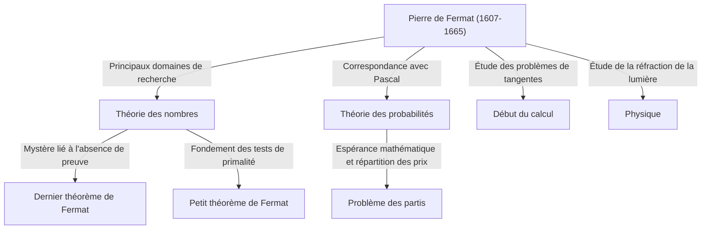

## Introduction : L'homme qui a laissé le plus grand mystère des mathématiques

Si l'on parle de la figure qui a généré l'histoire la plus célèbre et la plus dramatique de l'histoire des mathématiques, il ne faut pas chercher plus loin que [Pierre de Fermat](https://kenji.blog/fr/p/fermat/). Il n'était pas un mathématicien professionnel. Il travaillait habituellement comme juge régional et profitait des mathématiques pendant son temps libre, faisant de lui ce que l'on appelle un **« mathématicien amateur »**. Cependant, les réalisations qu'il a laissées derrière lui ont étonné les plus grands esprits d'Europe à l'époque et allaient tourmenter les mathématiciens de génie du monde entier pendant plus de 350 ans après sa mort.

Dans cet article, nous plongerons profondément dans la vie de [Fermat](https://kenji.blog/fr/p/fermat/), ses principales découvertes mathématiques et la saga romantique entourant le monumental **« Dernier théorème de [Fermat](https://kenji.blog/fr/p/fermat/) »** qui reste gravé dans l'histoire des mathématiques. Explorons comment il a posé les bases des mathématiques modernes et découvrons les sources de son étonnante perspicacité et de son imagination.

## 1. Son visage public en tant que juge et sa passion pour les mathématiques

[Pierre de Fermat](https://kenji.blog/fr/p/fermat/) est né fin 1607 (ou 1601, selon certaines théories) dans une riche famille de marchands de cuir à Beaumont-de-Lomagne, dans le sud-ouest de la France. Exceptionnellement brillant dès son plus jeune âge, il étudie le droit à l'Université d'Orléans et, en 1631, occupe le poste honorable de conseiller (juge) au Parlement de Toulouse. Dès lors, il a passé toute sa vie en tant que fonctionnaire.

Dans la France de l'époque, les juges étaient encouragés à éviter d'élargir trop leurs cercles sociaux pour prévenir les conflits politiques et sociaux. Ironiquement, cet environnement isolé a offert à [Fermat](https://kenji.blog/fr/p/fermat/) le temps calme dont il avait besoin, le poussant vers les profondeurs des mathématiques. Pour lui, les mathématiques étaient une pure joie qui le libérait des lourdes pressions de ses devoirs, et non quelque chose qui lui était imposé par quiconque.

[Fermat](https://kenji.blog/fr/p/fermat/) n'aimait pas publier ses recherches sous forme d'articles formels ; il se contentait de noter ses idées et ses preuves dans des cahiers ou dans les marges de livres, ou en échangeant des lettres avec d'autres érudits par l'intermédiaire de Marin Mersenne, un moine de Paris qui servait de plaque tournante académique à l'époque. Il aimait présenter ses découvertes comme des **« problèmes »** à d'autres mathématiciens, exigeant leurs solutions de manière provocatrice. Il est également connu pour s'être engagé dans des débats féroces avec de grands mathématiciens tels que René Descartes et [John Wallis](https://kenji.blog/fr/p/wallis/).

## 2. D'immenses contributions à la théorie des nombres

Le plus grand intérêt de [Fermat](https://kenji.blog/fr/p/fermat/) et le domaine où il a laissé sa marque la plus profonde a été la **Théorie des nombres** (la branche explorant les propriétés des nombres). Dévoué à la lecture de l'*Arithmetica* de l'ancien mathématicien grec [Diophante](https://kenji.blog/fr/p/diophantus/), il s'en est inspiré pour découvrir de nombreux théorèmes révolutionnaires.

### 2.1. Petit théorème de [Fermat](https://kenji.blog/fr/p/fermat/)

Un théorème remarquablement important qui forme la base de la cryptographie moderne (comme le chiffrement [RSA](https://kenji.blog/fr/p/modern-cryptography-public-key-hash-signature/)) est le **Petit théorème de [Fermat](https://kenji.blog/fr/p/fermat/)**. Il révèle une propriété surprenante concernant les nombres premiers et soutient silencieusement la technologie de sécurité dans notre société Internet moderne.

L'énoncé du théorème est le suivant :
Pour tout nombre premier $p$ et tout entier $a$ qui est premier avec $p$ (ce qui signifie qu'il n'est pas un multiple de $p$), la congruence suivante est vraie :

$$
a^{p-1} \equiv 1 \pmod{p} \quad \text{ (où } p \text{ est un nombre premier)}
$$

En d'autres termes, la propriété stipule que « le nombre obtenu en élevant $a$ à la puissance $p-1$ et en soustrayant $1$ est toujours divisible par $p$ ». Par exemple, si $p = 5$ et $a = 2$, alors $2^{5-1} = 2^4 = 16$, et $16 - 1 = 15$, qui est magnifiquement un multiple de $5$. Ce théorème sert de base aux algorithmes (comme le test de primalité de [Fermat](https://kenji.blog/fr/p/fermat/)) qui déterminent rapidement si des nombres extrêmement grands sont premiers.

### 2.2. Théorème des deux carrés

[Fermat](https://kenji.blog/fr/p/fermat/) a découvert un autre beau théorème concernant les propriétés des nombres premiers : « Un nombre premier qui laisse un reste de $1$ lorsqu'il est divisé par $4$ peut toujours être exprimé d'une seule manière comme la somme de deux carrés (les carrés de deux entiers). »

$$
p = x^2 + y^2 \quad \text{ (où } p \equiv 1 \pmod{4} \text{ )}
$$

Par exemple, si $p = 5$, c'est $5 = 1^2 + 2^2$ ; si $p = 13$, c'est $13 = 2^2 + 3^2$ ; si $p = 29$, c'est $29 = 2^2 + 5^2$. Inversement, les nombres premiers qui laissent un reste de $3$ lorsqu'ils sont divisés par $4$ (tels que $7, 11, 19$) ne peuvent jamais être exprimés comme la somme de deux carrés. [Fermat](https://kenji.blog/fr/p/fermat/) a successivement découvert de telles régularités profondes dans la théorie des nombres.

### 2.3. Nombres premiers de [Fermat](https://kenji.blog/fr/p/fermat/) et construction de polygones réguliers

[Fermat](https://kenji.blog/fr/p/fermat/) a également considéré des formules mathématiques qui génèrent des nombres premiers. Il a conjecturé que tous les nombres de la forme $F_n = 2^{2^n} + 1$ sont premiers. En effet, pour $n=0, 1, 2, 3, 4$, les résultats sont respectivement $3, 5, 17, 257, 65537$, et tous ceux-ci sont premiers. Ceux-ci sont appelés **Nombres premiers de [Fermat](https://kenji.blog/fr/p/fermat/)**.

Cependant, [Leonhard Euler](https://kenji.blog/fr/p/euler/) a montré plus tard que lorsque $n=5$, $2^{32} + 1 = 4294967297 = 641 \times 6700417$, réfutant ainsi la conjecture même de Fermat. Néanmoins, Carl Friedrich Gauss a prouvé plus tard que ces nombres premiers de [Fermat](https://kenji.blog/fr/p/fermat/) étaient profondément liés aux « conditions pour qu'un polygone régulier à $n$ côtés soit constructible à la règle et au compas », jouant un rôle extrêmement important dans la fusion de la géométrie et de l'algèbre pour les générations futures.

## 3. La méthode de la descente infinie : l'épée tranchante de [Fermat](https://kenji.blog/fr/p/fermat/)

Bien que [Fermat](https://kenji.blog/fr/p/fermat/) ait rarement écrit les preuves de ses théorèmes, il y avait une méthode unique dont il se vantait d'être « la méthode de preuve la plus puissante que j'aie découverte ». Il s'agit de la **Méthode de la descente infinie**.

C'est une forme de raisonnement par l'absurde, principalement utilisée pour prouver qu'« il n'existe aucune solution entière positive satisfaisant à une certaine condition ». Le flux de base de l'argument est le suivant :

1. Supposons qu'il existe une solution entière positive satisfaisant à la condition.
2. Montrer mathématiquement qu'à partir de cette solution, il est possible de créer une solution entière positive encore plus petite qui satisfait à la même condition.
3. Répéter cette procédure implique que la solution entière positive continuerait à devenir infiniment plus petite.
4. Cependant, puisque les entiers positifs ont une valeur minimale de $1$, il leur est impossible de continuer à devenir indéfiniment plus petits.
5. Par conséquent, l'hypothèse initiale est fausse et aucune solution entière positive satisfaisant à la condition n'existe.

En utilisant cette technique, [Fermat](https://kenji.blog/fr/p/fermat/) lui-même a prouvé des propositions telles que « l'aire d'un triangle rectangle ne peut pas être un carré parfait ». Des mathématiciens ultérieurs comme Euler ont également étudié en profondeur et beaucoup utilisé cette méthode de la descente infinie pour prouver les théorèmes que [Fermat](https://kenji.blog/fr/p/fermat/) a laissés derrière lui.

## 4. En tant que fondateur de la théorie des probabilités

Le talent extraordinaire de [Fermat](https://kenji.blog/fr/p/fermat/) ne se limitait pas à la théorie des nombres. En 1654, il a échangé une série de lettres avec le penseur de génie et mathématicien [Blaise Pascal](https://kenji.blog/fr/p/pascal/). Cette correspondance même est considérée comme l'aube de la **Théorie des probabilités** moderne.

Le catalyseur de leur discussion était une question liée au jeu de hasard connue sous le nom de **« Problème des partis »**, apportée à [Pascal](https://kenji.blog/fr/p/pascal/) par un homme nommé le Chevalier de Méré.
La question était : « Deux joueurs de même force jouent à un jeu où le premier à gagner un certain nombre de manches remporte l'intégralité du prix. Cependant, si le jeu est interrompu en cours de route, comment le prix doit-il être partagé équitablement en fonction de l'état actuel des victoires et des défaites ? »

Bien que [Fermat](https://kenji.blog/fr/p/fermat/) et Pascal aient chacun employé des approches mathématiques entièrement différentes, ils sont finalement arrivés exactement à la même conclusion (le ratio de distribution correct basé sur les concepts actuels de probabilité et d'espérance). Pascal a utilisé la combinatoire comme les coefficients binomiaux, tandis que [Fermat](https://kenji.blog/fr/p/fermat/) a utilisé une méthode élégante d'énumération et de comptage de tous les résultats possibles. Grâce à cette correspondance qui n'a duré que quelques mois, la « théorie des probabilités » est née en tant que branche indépendante des mathématiques.

## 5. Contributions pionnières au calcul infinitésimal et à la physique

Des décennies avant qu'[Isaac Newton](https://kenji.blog/fr/p/newton/) et Gottfried Leibniz n'établissent le calcul infinitésimal, [Fermat](https://kenji.blog/fr/p/fermat/) avait conçu ses propres méthodes pour tracer des tangentes aux courbes et trouver les valeurs maximales et minimales des fonctions.

Il a introduit un concept appelé **« Adéquation »** (Adequality). Il s'agit d'une technique où une valeur est traitée comme « presque égale » lorsqu'une quantité infime $E$ varie, et la valeur extrême est trouvée en traitant $E$ comme $0$ à l'étape finale du calcul. Il s'agit essentiellement de l'idée même de la dérivation moderne, et Newton lui-même a remarqué plus tard : « J'ai eu l'indice de cette méthode à partir de la façon dont [Fermat](https://kenji.blog/fr/p/fermat/) traçait les tangentes. » Sans [Fermat](https://kenji.blog/fr/p/fermat/), l'achèvement du calcul infinitésimal aurait pu être encore plus retardé.

De plus, dans le domaine de la physique (optique), il a proposé le **Principe de [Fermat](https://kenji.blog/fr/p/fermat/)**, qui stipule que « la lumière se propage d'un point à un autre sur la trajectoire qui demande le moins de temps ». Cela a permis de dériver mathématiquement la loi de réfraction de Snell, a formé la base de l'optique moderne et est devenu une découverte extrêmement importante qui a conduit au « principe de moindre action » traversant l'intégralité de la physique ultérieure.

## 6. Drame dans les marges : le dernier théorème de [Fermat](https://kenji.blog/fr/p/fermat/)

Malgré avoir laissé derrière lui de si nombreuses et grandes réalisations, ce qui fait incontestablement de [Fermat](https://kenji.blog/fr/p/fermat/) le mathématicien le plus célèbre de l'histoire est l'existence du **« Dernier théorème de [Fermat](https://kenji.blog/fr/p/fermat/) »**.

Dans les marges d'un passage concernant le théorème de Pythagore ( $x^2 + y^2 = z^2$ ) dans le volume 2 de son livre préféré, l'*Arithmetica* de [Diophante](https://kenji.blog/fr/p/diophantus/), [Fermat](https://kenji.blog/fr/p/fermat/) a rédigé la note étonnante suivante en latin :

> "Cubum autem in duos cubos, aut quadratoquadratum in duos quadratoquadratos, et generaliter nullam in infinitum ultra quadratum potestatem in duas eiusdem nominis fas est dividere cuius rei demonstrationem mirabilem sane detexi. Hanc marginis exiguitas non caperet."
> 
> (Au contraire, il est impossible de diviser un cube en deux cubes, ou un bicarré en deux bicarrés, et en général aucune puissance supérieure au carré en deux puissances de même nom ; j'en ai découvert une **démonstration véritablement merveilleuse** que cette marge est trop étroite pour contenir.)

Exprimé sous forme de formule mathématique, c'est incroyablement simple :

« Lorsque $n$ est un entier supérieur ou égal à $3$, il n'existe aucune solution entière positive $(x, y, z)$ satisfaisant à l'équation suivante. »

$$
x^n + y^n = z^n \quad \text{ (où } n \ge 3 \text{ )}
$$

Après la mort de [Fermat](https://kenji.blog/fr/p/fermat/) en 1665, son fils aîné Clément-Samuel publia une nouvelle édition de l'*Arithmetica* qui incluait les annotations de son père. De là a commencé un défi éreintant pour les mathématiciens du monde entier.

Des génies successifs tels que Euler, [Legendre](https://kenji.blog/fr/p/legendre/), Dirichlet, Gauss et Sophie Germain se sont attaqués à ce problème. Bien que des cas individuels pour $n=3, 4, 5, 7$ aient été prouvés, personne n'a pu le prouver de manière générale pour tout $n$.

### La conclusion dramatique 350 ans plus tard

Pendant plus de 350 ans après sa proposition, ce problème a régné comme le « plus grand problème non résolu des mathématiques », non résolu par personne. Dans la seconde moitié du 20e siècle, alors que beaucoup commençaient à soupçonner que « [Fermat](https://kenji.blog/fr/p/fermat/) ne l'avait pas réellement prouvé (ou avait fait une erreur) », un mathématicien a finalement mis fin à cette redoutable énigme.

Il s'agissait du mathématicien britannique [Andrew Wiles](https://kenji.blog/fr/p/wiles/). Ayant rencontré le problème dans sa bibliothèque locale à l'âge de 10 ans, il a juré de consacrer sa vie à le résoudre. Il a adopté une approche grandiose, inimaginable à l'époque de Fermat, combinant la **Conjecture de Taniyama-Shimura** — qui proposait que « toutes les courbes elliptiques sont modulaires », avancée par les mathématiciens japonais Yutaka Taniyama et [Goro Shimura](https://kenji.blog/fr/p/shimura-goro/) — avec les recherches de Ken Ribet sur les courbes de Frey (la conjecture epsilon).

Wiles s'est isolé dans son grenier et, après sept ans de recherches solitaires, a publié la preuve complète en 1995. Sa preuve était l'aboutissement des mathématiques modernes s'étendant sur des centaines de pages, entièrement différente des méthodes mathématiques du 17e siècle (« démonstration véritablement merveilleuse ») que [Fermat](https://kenji.blog/fr/p/fermat/) envisageait probablement.

Que [Fermat](https://kenji.blog/fr/p/fermat/) ait vraiment possédé une preuve correcte reste un mystère éternel aujourd'hui. Cependant, c'est un fait indéniable que sa « note dans la marge » a fourni une force motrice incommensurable au développement des mathématiques pour les générations futures.

## Conclusion : L'héritage du Prince des amateurs

[Pierre de Fermat](https://kenji.blog/fr/p/fermat/) n'était qu'un juge qui n'aimait pas monter sur la scène principale glamour du monde universitaire. Pourtant, les idées qu'il a griffonnées sur des bouts de papier et dans les marges de livres ont grand ouvert les portes à divers domaines allant de la théorie des nombres et des probabilités au calcul et à l'optique.

Le plus grand mystère qu'il a laissé derrière lui a captivé et tourmenté d'innombrables mathématiciens pendant plusieurs siècles, nourrissant de nouvelles théories mathématiques au passage. L'existence même de [Fermat](https://kenji.blog/fr/p/fermat/) nous parle encore aujourd'hui de la romance inépuisable et de la profondeur que recèle la discipline des mathématiques. Il est, sans aucun doute, le **« Prince des amateurs »** le plus grand et le plus émouvant de l'histoire.
